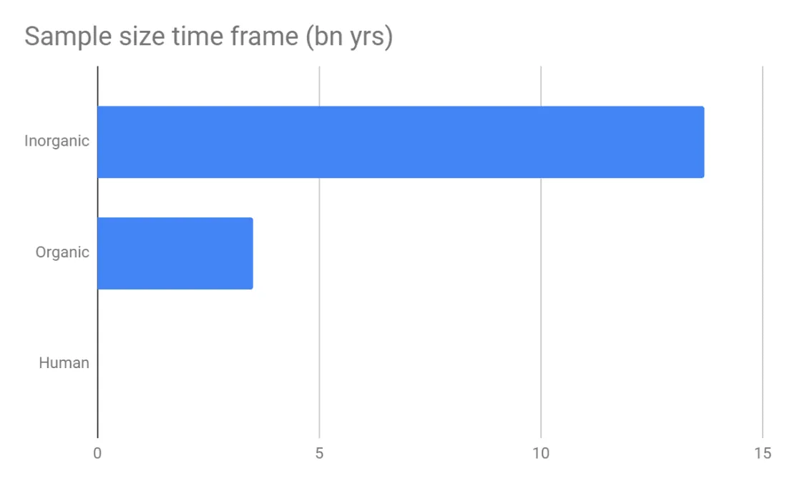

I once read about a person so focused on efficiency, she would press the same number on the microwave to save time on heating up her meal e.g. 1:11, 2:22, 3:33. My first thought was 'wow here's someone really intense no wonder they get ahead and I'm falling behind in life'. My next thought was 'wait this habit doesn't make any sense' [^1]. And yet it was now cited as a positive character trait by the writer of the article. It's almost as if the author wanted it to be true, wanted to believe the action was calculated.

After the Notre Dame fire, a story spread that firefighters prioritised saving relics over the wooden structures, [since oak trees from Versailles were intended as replacements](https://medium.com/the-long-now-foundation/long-now-lessons-from-notre-dame-925d27441bdc "long now").

As the link shows, there was little substantive basis behind this. But people wanted it to be true, wanted to believe the action was deliberate.

We have a strong instinct to believe in narratives [^2], false or otherwise. We all like the story of how every action has meaning and how that one thing changed history, but that's rarely the case. Our actions have consequences, but rarely the exact consequences we want. I'm not saying to avoid anecdotes, but to be careful when reading a story. [The success story of another might not be applicable to you.](https://ofdollarsanddata.com/the-problem-with-most-financial-advice/ "financial advice")

Economics is a field in which narratives play a huge role too, making it [complicated to assess policy impact](https://www.bloomberg.com/opinion/articles/2019-04-23/modern-monetary-theory-austrian-economics-deserve-skepticism "skepticism"). Take minimum wage or unpaid internships for example. [Cochrane cites a few studies with some concerning findings when raising the minimum wage:](https://johnhcochrane.blogspot.com/2019/04/meer-on-minimum-wage.html "cochrane")

> when the minimum wage is raised, employers offset increased labor costs by reducing benefits like the generosity of health insurance. 

> When debate focuses on the total number of jobs lost or gained, it hides this potentially nasty distribution of the benefits: a recent college graduate with a barista job may get a few more dollars an hour, but the high school dropout finds it harder to get and keep a job

> Low-wage jobs aren’t easy, don’t pay well, and are rarely fun. But not being able to find work at all is far worse.

And in the same comments section, a reader cites opposing studies that support raising the min wage. Most people are going to pick their story and stick with it, since it's simpler to be consistent and confirm your biases. I think that this works for some subjects, but for many others we should strive to understand both sides of the argument, which can both be true in different scenarios. But no one wants to hear 'well it depends; raising min wage could help in this state but not in the other' [^3]. You're paid to take a side. 

People are already taking sides in the income sharing agreement trend, viewing it as either rediscovered slavery or transformational incentive alignment. They've settled into two narratives despite how recently they've probably heard about the concept. [This post](https://medium.com/@eriktorenberg_/life-capital-9e5028c0ea12 "life capital") discusses this new trend in education, popularised by Lambda school: 

> An Income Share Agreement is a financial arrangement where an individual or organization provides something of value to a recipient, who, in exchange, agrees to pay back a percentage of their income for a certain period of time

> Lambda only gets paid if and only if the student earns a certain amount after graduation. In other words, incentives are aligned.

> ISAs and other related instances of securitizing human capital have been tried.

> Purdue markets its ISA offering as an alternative to private student loans and Parent PLUS Loans. Students of any major can get $10,000 per year in ISA funding at rates that vary between 1.73% and 5.00% of their monthly income. 

> There are three major themes in particular that get us excited for the future of ISAs: aggregation, novel incentive structures, and crypto.

Seems like our narrative of higher education could change. I don't have a strong view here yet [^4] but it seems to be a positive trend. I don't think anyone is forcing themselves to attend Lambda, and the job placement rate seems encouraging. Though I'd think college shouldn't just be for getting a job... 

What can we believe in then? What is more likely to stand the test of time? Peter Kaufman wrote about three buckets he uses to find principles that last. Jana Vembunarayanan analyses it [here](https://janav.files.wordpress.com/2016/07/threebucketframework.pdf "jana on kaufman") [^5] . There's quite a few examples in Jana's piece that I'd push back on, but below are some interesting ideas:

> Every statistician knows that a large, relevant sample size is their best friend. What are the three largest, most relevant sample sizes for identifying universal principles? Bucket number one is inorganic systems, which are 13.7 billion years in size. It's all the laws of math and physics, the entire physical universe. Bucket number two is organic systems, 3.5 billion years of biology on Earth. And bucket number three is human history, you can pick your own number, I picked 20,000 years of recorded human behavior. Those are the three largest sample sizes we can access and the most relevant. 

> One of the very best things we can do for students is to help them develop mathematical mindsets, whereby they believe that mathematics is about thinking, sense making, big ideas, and connections— not about the memorization of methods.

> Buffett focused on both knowledge (what you know) and skills (what you do). The bidirectionality of knowledge \<-\> skills made his mental representations richer. This is why he is one of the best investors in the world.

> You don’t build mental representations by thinking about something; you build them by trying to do something, failing, revising, and trying again, over and over. When you’re done, not only have you developed an effective mental representation for the skill you were developing, but you have also absorbed a great deal of information connected with that skill.

Gravity will be around for a while [^6], as will our need to eat, and our need for social interaction. The physical and biological principles are probably easier to identify, but I think the social sample size is the difficult piece. Humans act rationally...until they don't. If you have examples of social principles that have surprised you let me know.

I agree with Jana's point about trying rather than just thinking, though of course we can't try everything. Talking through ideas, discussing them with people, and writing about them is one alternative. You could also look into the idea of being a ['generalised specialist', as Farnam Street puts it](https://fs.blog/2017/11/generalized-specialist/ "FS"), a topic I've expanded on in prior emails as well. I want to try everything but have to realise I usually won't be rewarded by being a generalist. 

## Miscellaneous
1. ["He took great pains not to mislead or confuse children, and his team of writers joked that his on-air manner of speaking amounted to a distinct language they called “Freddish.” Fundamentally, Freddish anticipated the ways its listeners might misinterpret what was being said."](https://www.theatlantic.com/family/archive/2018/06/mr-rogers-neighborhood-talking-to-kids/562352/ "Mr Rogers")
2. [Anyone have $2.95mm to ~~lend~~ give me for this baby t-rex auction?](https://www.ebay.com/itm/YOUNG-BABY-T-REX-TYRANNOSAURUS-DINOSAUR-FOSSIL-HELLS-CREEK-MAYBE-ONLY-1-TREX/292983172236?hash=item4437286c8c:g:WagAAOSwdX5cdXgI "ebay t rex"). Followup news article on the sale controversy [here](https://www.thedailybeast.com/baby-tyrannosaurus-rex-goes-on-sale-on-ebay-sparking-paleontologist-rage "paleontologist rage") [^7]
3. [Social media engagement rates](https://www.webstrategiesinc.com/blog/which-social-media-sites-get-the-most-engagement "engagement") for the aspiring influencer in you. [^8]
4. If you're shunning facebook because of negative news, [reminder of the FB/Insta GOOG/youtube relationship](https://spreadprivacy.com/facebook-instagram/ "FB") [^9]
5. How powerful is Thanos now [^10]? How powerful should he be? [Different levels of omnipotency](https://tvtropes.org/pmwiki/pmwiki.php/Main/TheOmnipotent "omnipotency"), just like different levels of infinity
6. [7 ton boulders you can move by hand](https://gizmodo.com/researchers-made-25-ton-boulders-they-can-move-by-hand-1834106230 "25 ton") [^11]. I think the intersection of art and utility here is interesting.
7. [This article on AI in China](https://chinai.substack.com/p/chinai-48-year-1-of-chinai "AI china") merits its own section, but I think you're bored of me writing about AI 3 months in a row so I'll just pick highlights:
    > ‘China has a fairly deep awareness of what’s happening in the English-speaking world, but the opposite is not true,’ says Ng.”
    
    > Western observers consistently overinflate Chinese AI capabilities.
    
    > In addition to AI’s significance for economic growth and military security, the Chinese government sees AI as a tool to improve social governance, which makes public security applications a large driver of China’s AI development
    
    > It is perfectly reasonable to highlight differences in Chinese notions of AI ethics or the degree to which privacy is important to Chinese consumers, but it is absolutely dehumanizing to say Chinese people don’t care about privacy
8. [Hong Kong share pledges](https://leonlins.com/writing/2019_04_14_stock/ "pledges")

[^1]: I can't recall the source of this anecdote and hope it wasn't something one of you told me... either way I'm assuming you've spotted the problem with this time saving 'hack'?
[^2]: Nine word summary of Sapiens?
[^3]: I'm increasingly of the belief that people prefer stronger opinions over balanced ones since it's an easier sell
[^4]: I realise I'm not following my own advice here
[^5]: The original piece by Kaufman is [here](http://www.eastcoastasset.com/wp-content/uploads/ecam_2014_3q_letter.pdf "original letter")
[^6]: Someone's going to raise the point about [edge cases](https://www.jpl.nasa.gov/edu/news/2019/4/19/how-scientists-captured-the-first-image-of-a-black-hole/ "black holes") but that's missing the point...
[^7]: It seems within his rights to sell it, but also misleading on the ebay page to say the intent is 'opening this up to the world' rather than just trying to make money off it. I'd probably do the same in his position? 
[^8]: With most engagement rates for those channels falling <5%, it's no wonder everyone's reluctant to respond to this newsletter... Sidenote, are any of you actually instagram famous?
[^9]: I'm not an advocator of the delete facebook trend but assume some of you might be. I think there's value in using it, but as with most things you need to be aware of how you use it. It would be significantly more difficult for me to host events without it. Either way, it's helpful to know who owns what if you're trying to avoid a company...
[^10]: Character from the Avengers movie, if you weren't aware.
[^11]: The article says 25 tons, but I checked with [the artists themselves](http://www.matterdesignstudio.com/#/walking-assembly/ "matter design studio") and the combined weight is actually ~6.5 tons. Still interesting concept though. Also serves to demonstrate how much writers want to believe their own story. 
