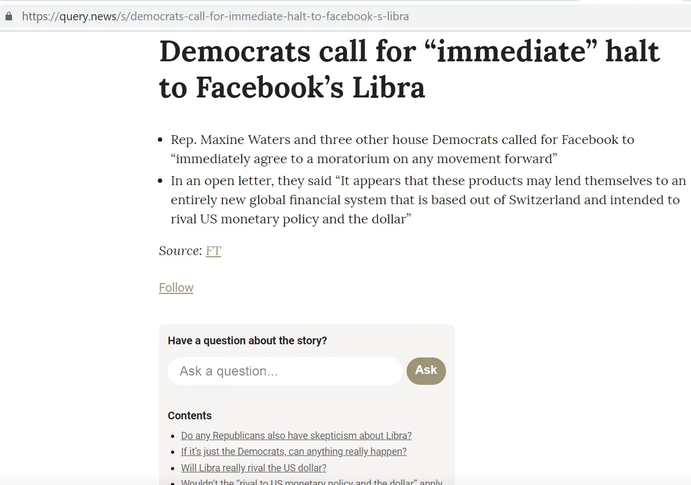
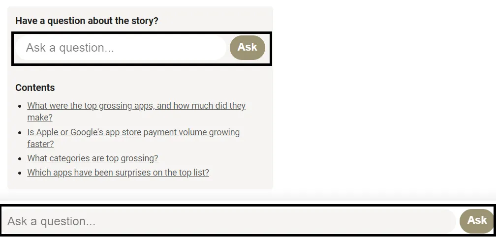
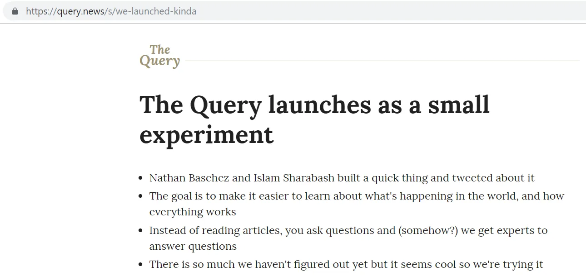

A friend launched a new project recently, [Query News](https://query.news/ 'Query'). This is a walkthrough of what the project is and some suggestions I have.

## Walkthrough

What is Query trying to be? [Based on their own words:](https://query.news/s/we-launched-kinda)

> Would it be accurate to describe this as Quora for timely news?

> Pretty much! Except I'm not sure really what it is trying to become. But definitely Quora is a good jumping-off point. The main thing we're hesitant about with Quora is the model around competing answers vs. collaborating on answers. I think it could make more sense to encourage more collaboration here. We'll see though!

So the intent for now is to have a Q&A format for news events as they happen. People will pitch in questions they have on a topic, and someone (who?) will answer them.

The landing page is simple, ordering questions in chronological order, with the most recent day first. I'm unsure how questions are sorted within the day itself. I'd assume the order is fixed once the questions are posted, since the timing listed for the updates doesn't seem to affect the order. The site works well on mobile as well.

Clicking on the individual topics leads you to a more detailed Q&A page on the topic. Each Q&A page has its own url. The page has a short summary of the news topic, source citation, followed by a table of contents for the questions, and the questions themselves.

There are multiple prompts to pose a question, which is as straightforward as typing it in to the question field. As far as I can tell, there isn't immediate moderation on the question, and your question is posted onto the page right away. The site makes it simple to ask a question.

For example, when I posted the below question, it popped up on the bottom of the question list once the page refreshed, which the page did automatically after posting.

It doesn't seem like you can answer questions directly yourself at the moment, but you can 'suggest an update' which sends your comment off to an editor:

You can browse the current list of topics and questions yourself [here](https://query.news/ 'Query'), and see if there's any you'd like to comment on. This seems like an interesting idea! Most news is one-sided, seeking to broadcast a message to the masses. The comments section online is usually a disaster. By making discussion the focus of the site rather than a tacked-on product, hopefully it leads to more productive use cases. If you've ever read something and wondered 'but what about X', Query would be helpful for you.

What might this look like at scale? It could have separate sections by topic area, with verified accounts posting new articles, receiving questions from interested readers, and then answering those questions. It would make Query _the site_ for real-time information on a variety of topics, where you can actually dig further and investigate the story as it develops.

On to questions and suggestions!

## Questions

1. How is this different from Quora, [Hacker News](https://news.ycombinator.com/ 'HN'), or [Reddit](https://www.reddit.com/)?
   - Seems like there's an intent to be more collaborative than Quora (see above), so I assume they'll create a feature allowing multiple editors to answer a question
   - If so, I'm guessing they won't allow threaded conversations, instead consolidating everything into one answer per question. This would be different from Hacker News and Reddit
   - Perhaps we can think of this as Quora X Wiki for news as it happens?
2. How will they scale this?
   - Moderating questions (and answers, once they implement that functionality) will require manual editors, and not every website has a [Steven Pruitt](https://www.cbsnews.com/news/meet-the-man-behind-a-third-of-whats-on-wikipedia/ 'Steven'). Some spam can probably be automatically removed, but there will likely be some element of manual moderation
   - How will they decide who gets to answer questions and who has enough expertise in an area to comment?
3. What are the incentives for all stakeholders?
   - For the founders, [I think they want to create an experiment and see if there's demand from people to read news in a different format](https://query.news/s/we-launched-kinda/q/what-are-your-short-term-goals-for-the-query#q-52 'ST goals')
   - For questioners, to get more information (ideally less biased than normal news) on a topic answered by an expert
   - For eventual answerers, to build a reputation? Goodwill? Status building?
4. If they do allow others to answer questions, does that mean people will have to create accounts over time?
   - Perhaps questions can still be free flow and anonymous, but maybe approved accounts can edit answers?
   - Is the intent to present one unified "Query News" voice for the answers or show multiple point of views on a question?

5. Will there be image functionality?

6. Will there be a need to moderate the quality of the answers as well?
   - I'm unsure if having an upvote/downvote systems like Quora or Reddit defeats the purpose of the site

## Suggestions

1. Pinning the [Query self-referential Q&A page](https://query.news/s/we-launched-kinda/ 'Query Q&A') on the front page. Someone landing on the home page for the first time won't have a good idea of what the site is supposed to be about. Having an "About" tab right up top will probably help people understand what the site is trying to do, and it could be a simple link to the Q&A page.

   

2. Clarifying what exactly the 'follow' option does. I'm unsure if entering my email subscribes me to all questions for that news topic, subscribes me to all questions on Query, or just one question on the topic

   

   Even after clicking on 'follow', I don't know what joining is supposed to do:

   

3. Tagging questions and having a search functionality seems like something that will be helpful or even required when this grows

4. There are individual sharing buttons for the individual questions, but none for the main news topic itself?

5. I'm assuming this is on the roadmap, but eventually allowing people to post news topics themselves as well seems like a logical next step.

6. Is there a way to get this through an RSS feed? Seems like they recently put it on a newsletter format.
