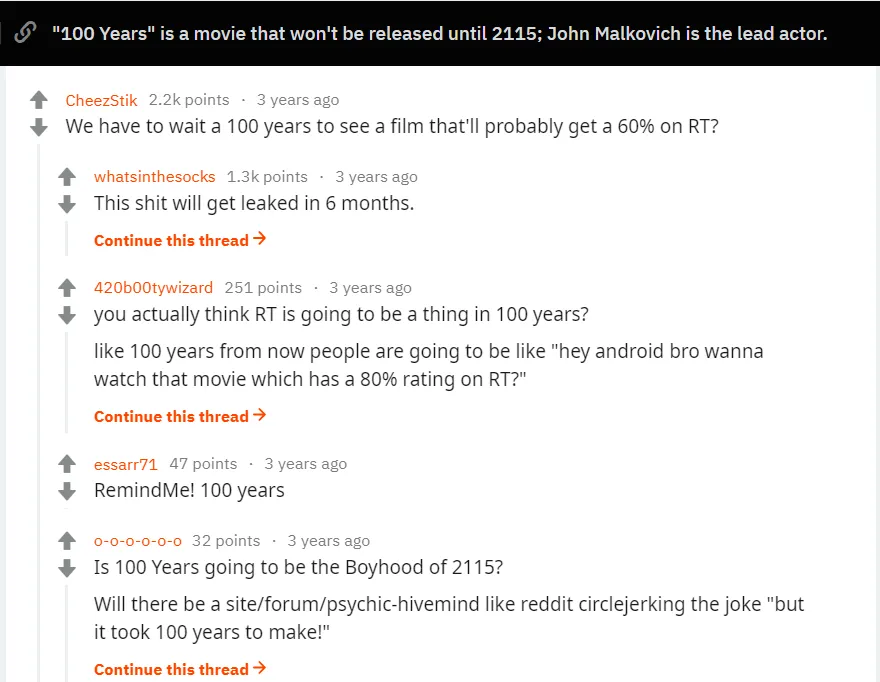

I'm fascinated by things that deal with time. From experiments that show how [memory and time are linked](https://leonlins.com/writing/2019_03_24_time/ 'time illusions'), to [organisations that aim to last 10,000 years](http://longnow.org/ 'long now'), seeing how people understand time's progression and how they interact with time is thought provoking. [Time travel with a machine](https://en.wikipedia.org/wiki/Time_travel_in_fiction 'wiki') was popularised by H. G. Wells in his "The Time Machine" story, and [some cultures have old stories about time dilation](http://www.openculture.com/2018/02/whats-the-origin-of-time-travel-fiction.html 'origin?'), showing that we've thought about the mysterious qualities of time for a while now.

Which is why I was interested by [this reddit post](https://www.reddit.com/r/movies/comments/4ke64j/100_years_is_a_movie_that_wont_be_released_until/ 'reddit') that introduced me to [100 years](<https://en.wikipedia.org/wiki/100_Years_(film)> 'wiki'), a film by John Malkovich and Robert Rodriguez meant for release in 2115. That would be a 100 years from when the team sealed it away in a vault in 2015, as part of a marketing campaign to promote [Louis XIII Cognac](<https://en.wikipedia.org/wiki/Louis_XIII_(cognac)> 'wiki'), which uses spirits that are up to 100 years of age. Despite this production being part of an advertisement, it's a brilliant idea. How many people can confidently say that a work of theirs will be relevant in 100 years? By artificially creating a system to do so, Malkovich and Rodriguez have made an interesting story, regardless of what the quality of the movie turns out to be. And I love interesting stories.

However, the general public commentary wasn't quite as positive:

With comments ranging from how the movie is probably going to be bad, how it's a masturbatory ad, or how it was egotistical to expect audiences in 100 years to appreciate it.

Some of these may indeed be true! I have no idea if the movie is going to be good or not. It's definitely an ad [^1]. It _is_ egotistical to expect people to care about it a 100 years from now [^2].

But ask yourself this: If you were invited to the premiere in 2115 (assuming you live that long), would you go?

I think the answer to that question separates the people who get the point of this extravaganza vs the people that just don't get it. It doesn't matter if the movie is good or not, it doesn't matter that it's an ad, and it surely doesn't matter this whole adventure is egotistical. _That is the point_. The fact that the team can insert themselves into relevancy 100 years from now, when they're likely long dead, is amazing.

Here are thoughts from the team and others:

> [Rodriguez told Indiewire last year that he had never done anything like this: “I was intrigued by the whole concept of working on a film that would be locked away for a hundred years. They even gave me silver tickets for my descendants to be at the premiere in Cognac in 2115. How cool is that? What John and I wanted it to be was a work of timeless art that can be enjoyed in 100 years. I’m very proud of it even if only my great grandkids and hopefully my clone will be around to watch.”](https://www.indiewire.com/2016/05/john-malkovich-robert-rodriguezs-film-100-years-will-be-displayed-at-cannes-before-2115-release-291273/ 'indiewire')

> [“When this idea was proposed to me, I just thought it was a very clever and fascinating concept to do something which essentially certainly I will never see,” he says. “But I like that. The truth is if you act in a play you never see it. I’ve certainly acted in a lot of movies I’ve never seen and a number of them I wouldn’t particularly be tempted to.”](https://people.com/celebrity/john-malkovich-explains-why-he-made-a-movie-no-one-will-see/ 'people.com')

> [In terms of time, "100 Years" looks to be the most ambitious film in history since last year's "Boyhood," which chronicled the life of a young man from age 6 to age 18. The film was shot over a 12-year period by director Richard Linklater, whose brilliant concept for such a simple story made waves among film fanatics.](https://www.theodysseyonline.com/100-years-the-movie-you-will-never-see 'theodyssey')

What if this experiment fails? What if the safe disappears, if the film degrades over time, if people forget about it entirely? Even so, this project would still be intriguing. I'd want to know what the cause of failure was and how could that have been prevented. Since we still have films from the 1900s today, will anything in the future have fundamentally changed, such that we'd lose touch of history from 100 years ago? Similar to [other long dated experiments,](https://en.wikipedia.org/wiki/As_Slow_as_Possible 'ASAP') the attempt to create a long lasting piece of work should be applauded.

I understand that the movie may not be for everyone. It might even be comically bad. But the point of view that thinks this is a gimmicky ad is missing the point. Malkovich, Rodriguez, and team have created something special. I hope to be alive when this releases, but in either case am excited for the people that are able to be at the premiere.

[^1] Whether masturbatory or not, I'll leave you to decide.
[^2] Isn't all film making egotistical though? Or for that matter, any form of creative output that seeks attention e.g. writing.
