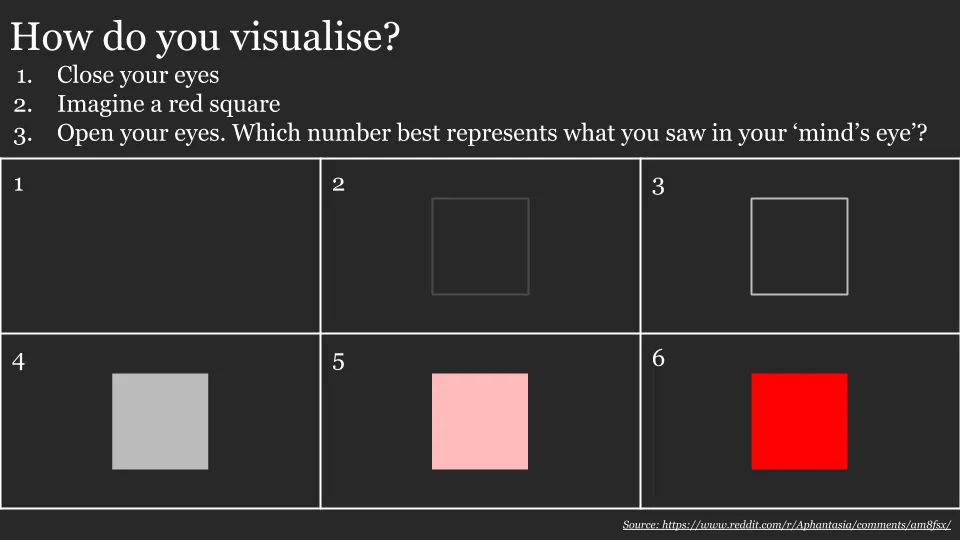

## How well can you visualise something?

I just learnt that people visualise differently. Take this 10 second test:

I'm at a 3 to 4, whereas my cousin swears she's at a 6 [^1]. This goes a long way towards explaining my confusion whenever people were telling me to visualise things... I never could get the detail and clarity that everyone else seemed to be experiencing.

**For those people that score a 1, you likely have [aphantasia](https://www.bbc.com/news/health-34039054 "BBC"), a condition in which you're unable to visualise mental images.** [There's skepticism over whether it's real,](https://www.reddit.com/r/slatestarcodex/comments/ab1fi4/is_aphantasia_real_exaggerated_or_a/ "reddit") but the research seems convincing. The [initial paper](https://www.researchgate.net/publication/26792259_Loss_of_imagery_phenomenology_with_intact_visuo-spatial_task_performance_A_case_of_'blind_imagination' "older") studied a person who initially had high visual memory and then lost it. Since he was able to talk about the distinct difference between his two states, I'm inclined to think this is a real phenomenon.

The research estimates 2% of the population having aphantasia, a small amount on the other extreme (hyperphantasia), and most people are in the middle with good visualisation ability.

[The newer paper](https://www.eugencpopa.ro/wp-content/uploads/Afantazia-.pdf "newer") has a questionnaire, more scientific than my simple test above, that you might want to check out for confirmation. I'm inferring that a score of ~30 or lower indicates aphantasia, and a higher score close to 80 indicates hyperphantasia [^2].

Was an interesting day when I realised the way I think is completely different from how most people think! The strange thing is I could have gone my entire life without knowing, since it's not something you'd discover on your own. Combined with the low occurrence rate, no wonder it's taken so long for the scientific community to realise the existence of aphantasia.

What's even stranger is that despite this literally life-changing knowledge, I don't see how anything changes for me. [It doesn't seem like you can learn to get better](https://www.scientificamerican.com/article/when-the-minds-eye-is-blind1/ "learning"), implying we're all stuck at whatever we grew up with (or were born into?).

It also doesn't seem like there have been many negative side effects thus far [^3]. Knowing about this _has_ made me less confused whenever I read or hear people talking about using my imagination though! Do let me know how you end up scoring!

[^1]: I haven't yet ruled out that this is a highly elaborate prank of hers... I also realise this is far less interesting for people who have normal visualisation ability, compared to people who have low visualisation ability and have wondered what's been wrong their entire lives
[^2]: The 2 graphs on pg 9 have an obvious break around the 32 VVIQ mark, and the highest possible score is 80
[^3]: Besides the rather upsetting realisation I could never reach the same capability of vivid imagery that most people were capable of, that is.
