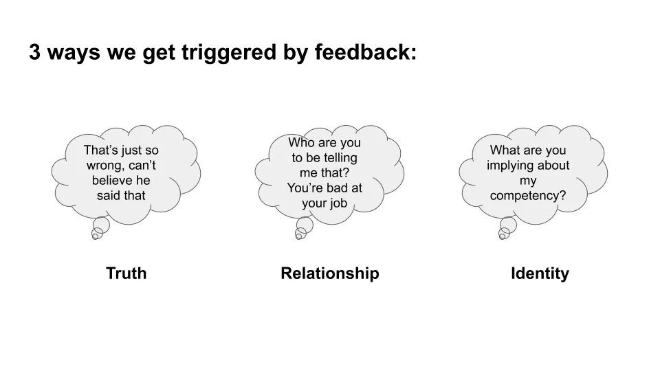
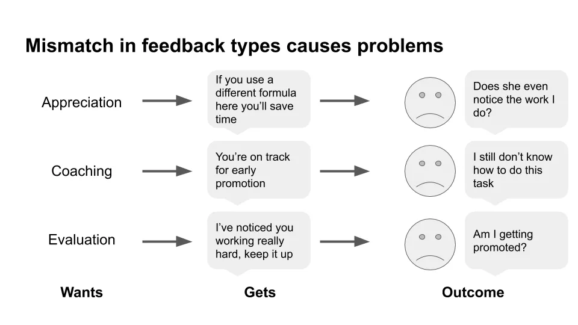
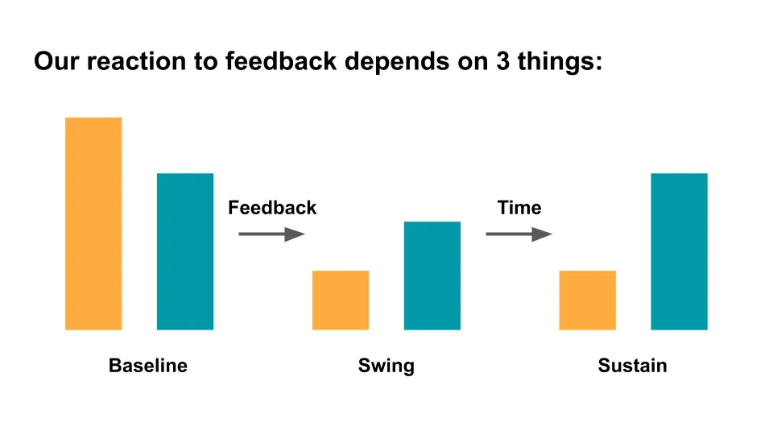
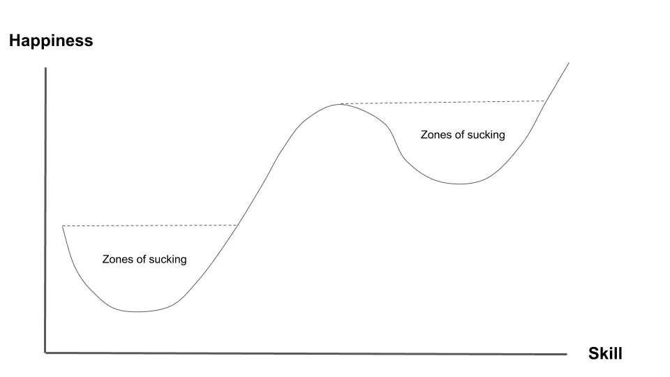

## Takeaways

- We can often get triggered by feedback, to our disadvantage
- Knowing the main kinds of feedback will make conversations more productive
- Misunderstandings always occur during conversations and we need to be aware of them occuring in the moment
- Being prepared for feedback requires you putting in effort to prepare
- We need to be kinder on ourselves
- Taking action after feedback is key

Over the holidays I read [Thanks for the Feedback](https://www.npr.org/books/titles/441536239/thanks-for-the-feedback-the-science-and-art-of-receiving-feedback-well-even-when "Thanks") by Douglas Stone and Sheila Heen, and thought it was one of the better books I've read in the past year. It talks about **how to make feedback conversations more productive, by explaining the types of feedback and common problems during feedback sessions.**

I've summarised the book below and added some of my own thoughts. Note: Many of the points will be outright quotes from the book. 

### We can often get triggered by feedback, to our disadvantage

- There are three different feedback triggers that provoke a response in us when hearing feedback
  - **Truth triggers** are set off by the substance of the feedback; it feels unhelpful or just wrong
  - **Relationship triggers** are set off by the person giving us feedback, based on how we perceive the person and how we're feeling treated
  - **Identity triggers** are set off by something causing us to feel threatened about our identity
  - This is all reasonable. Our triggered reactions are not obstacles because they are unreasonable, but because they prevent us from engaging in the conversation.
  - Getting better at receiving feedback doesn't mean you have to take the feedback as absolute truth
  

  
*LL: I have definitely not accepted feedback before, to my detriment, when I felt triggered. Just because I don't like the person, doesn't mean that the feedback is inaccurate. Becoming aware of why this is happening and learning to identify it is the first step in becoming better myself.*

### Knowing the main kinds of feedback will make conversations more productive

- Feedback comes in three different kinds
  - Appreciation and thanks
  - Coaching you on a better way to do the task
  - Evaluation of where you stand [^1]
  - We need all three, but often get a different type vs what we want
  

  
*LL: I vastly prefer getting coaching or evaluation at work, but that's obviously not the case for everyone. This explains a lot about why people feel underappreciated or misunderstood. It kind of reminds me of the [Five Love Languages framework](https://www.5lovelanguages.com/ "Five"). I'm starting to explicitly ask for coaching and evaluation as opposed to appreciation at work.*
  
- Feedback often arrives in the form of a label e.g. You should be more confident
  - This causes a difference between what was meant vs what was heard e.g. have the confidence to say you don't know vs give the impression you know things even when you don't
  - In order to reduce this difference, figure out where your feedback is 
  - 1) coming from, based on the data and their interpretation
    - Ask what's different about 1) the data and 2) the interpretations of it
  - 2) where your feedback is going, what they expect 
    - When receiving coaching, clarify the advice
    - When receiving evaluation, clarify the consequences
  - Ask what could be right about the feedback
  
*LL: I've always preferred asking for examples whenever feedback is given, and will now be double checking on the interpretation piece explicitly as well. Just like arranging an effective meeting, making sure that expectations are on the same page after the feedback convo is key.*

### Misunderstandings always occur during conversations and we need to be aware of them occuring in the moment

- There is a gap between our self-perception and how others perceive us [^2]. This is affected by how
  - We discount our emotions in the moment, but that's what others see and think of us e.g. if we get angry at a suggestion one time, we think of it as a one time thing but others think it's representative
  - We attribute things to the situation, but others attribute it to our character
  - We judge ourselves by our intentions, but others judge us on the outcome
  
*LL: This will be familiar to people who've read about behavioural finance and [Kahneman's work there](https://en.wikipedia.org/wiki/Thinking,_Fast_and_Slow "Thinking"). The simplistic takeaway is we're wrong about everything, all the time, especially about ourselves.* 
  
- Conversations can get 'switchtracked', when the person receiving the feedback is triggered and switches topics
  - The potential positive impact is that the other topic could be important as well
  - The negative impact is the tangling of two topics, made worse by us not realising there are two topics
  - When you realise there are two topics running at the same time, call it out explicitly and propose a way forward e.g. I see two related but separate topics, let's discuss each fully but separately
  
*LL: I hadn't realised this was a thing, but now that they mentioned it, it makes a lot of sense. I now see so many examples of it in past conversations I've had. Note again that calling it out explicitly is the solution. It will be uncomfortable but make for a more effective situation.*
  
- Look at the feedback from a bigger picture point of view
  - Are differences between you and me causing issues?
  - Are the different roles causing issues?
  - Are processes, policies, or something else causing issues?

*LL: You and your nemesis may both be competent, but have a bad working relationship because of how incentives were structured in your organisation.*

### Being prepared for feedback requires you putting in effort to prepare

- How you react to feedback depends on three things:
  - Your baseline state of happiness and satisfaction e.g. ppl with higher happiness baselines respond more positively to positive feedback than ppl with lower baselines
  - How far you swing from your baseline when you get feedback e.g. more swing means more sensitivity to negative feedback
  - How long it takes for you to return to baseline
  

  
- Some ways to be better prepared for feedback are:
  - Think in advance about what it might be, and check in on yourself plus slow things down when you're getting it
  - Separate your feelings in the moment vs the story you're telling about yourself vs the actual feedback
  - Contain the feedback to what it is about, and understand what it isn't about
  - Change your point of view to that of others, the future, or more humourous
  - Accept that you can't control how others view you [^3]
  
  
- We can't control feedback we get, but can improve how we receive it by:
  - Moving away from simple labels and towards accepting complexity
  - Moving away from a fixed mindset to a growth mindset
  
*LL: Assuming good intent of the feedback giver [^4], they actually want to help us get better. If not, they wouldn't be taking the time to tell us what to change. And we can change for the better.*

### We need to be kinder on ourselves

- We have to accept three things about ourselves:
  - We will make mistakes
  - We have complex intentions
  - We have contributed to the problem

- Take responsibility for your part, but don't go to an extreme in denying all responsibility or taking all the blame

*LL: I've been in either extreme before, either dodging blame or excessively self-flagellating. Neither are productive and also make you look even worse.*
  
- Give yourself a second score based on how well you handle the first score/feedback that you got

*LL: I like this second score concept; it's related to the old cliche about how it's not how many times you fall but how many times you get up. Just because it's a cliche doesn't mean it's bad though. I'll likely write more about failure in the future, but it's central to learning. That implies we will get bad feedback, and need to learn how to handle it.*

- Having boundaries and being able to turn down feedback is crucial to healthy relationships. These include:
  - Saying thanks and no e.g. happy to hear it, might not take it
  - Saying not now e.g. this is too sensitive at the moment
  - Saying no to any feedback at all
  
*LL: This is new to me but important. It can be overwhelming to get feedback from someone or during some time. If the person truly has your best interests at heart, they'll understand that you need space. It's usually telling when someone forces you to accept their point of view, that they have their own agenda in mind.*

### Taking action after feedback is key

- Feedback conversations are made of three parts:
  - Open: what is the purpose of the conversation, what kind of feedback it is, is it final?
  - Body: Listening, asserting, managing the conversation process, and problem solving
    - Listening: Asking clarifying questions, acknowledging their feelings
    - Asserting: Sticking up without being combative [^5]
    - Managing: Observe the discussion, diagnose where it's going wrong, and intervene explicitly to correct it
    - Problem solving: Now what should we do about this feedback?
  - Close: Clarify where things stand explicitly and what to do next

- Couple of ways to take action:
  - Ask 'what's one thing you see me doing that gets in my own way?'
  - Ask 'what's one thing I could do that makes a difference to you?'
  - Try small low-risk experiments
  - Letting people in and asking them for help is where intimacy grows
  
  
- Understand the J curve: any time you are changing your habits, you are likely to get worse before you can get better. More importantly, you will feel worse before you get better

*LL: [Waitbutwhy](https://waitbutwhy.com/2018/04/picking-career.html "wait") has also written before about how learning something new is difficult, precisely because that initial change is painful and unrewarding. It's going to suck for some time before you start surpassing your first peak. I think of learning as consecutive curves (J or S, whichever shape floats your boat), which means you have to constantly make it uncomfortable and sucky in order to get better. *

- If you can't change, work to reduce the impact on others
  - Ask about how it affects them
  - Coach them to deal with the unchanged you
  - Try to problem solve as a team
  
*LL: There are some things that we just can't change about ourselves. You can't stop me from slathering [ridiculous amounts of butter at every dinner](https://www.thecitycook.com/articles/2015-10-12-bordier-butter "butter"). Note that although the authors think that's ok, \*you still need to reduce the negative effect you're having on others\*. Don't be a dick.*  
 

- In the context of an organisation, here are some things that can help with giving feedback:
  - Explain tradeoffs, not just benefits
  - Separate appreciation, coaching, and evaluation
  - Promote learning within the organisation
  
LL: I haven't looked in depth yet, but I'm hoping the authors wrote more about how to give feedback more effectively as well. I've seen scarce examples of companies that promote a learning culture, Stripe is one exception that comes to mind, which might be why it's so well regarded. 

**Overall, I thought the book was great and well worth the time spent.** It's written clearly and even has summary sections for easier browsing. It's a quick read, and I'd encourage you to check it out, especially since we're heading into annual review timing.

[^1]: All coaching includes some evaluation as well, and can often be misunderstood. Evaluation can drown out the other types of feedback
[^2]: The authors talk about a gap map between **my thoughts and feelings** to **my intentions** to **my behaviour** to **my impact on others** to **others' stories about me**
[^3]: Don't accept everything that they say outright. Take their opinion as one input of a whole
[^4]: I'm sure we have received mean feedback before, or feedback givers that are just vindictive. It'll be hard, but seems the best way forward is to just ignore them. 
[^5]: It seems paradoxical to talk about assertiveness in the context of receiving feedback, but feedback is not a one way activity. Without your point of view the giver will be unaware if what they're saying is useful, right, or in line with what you think

