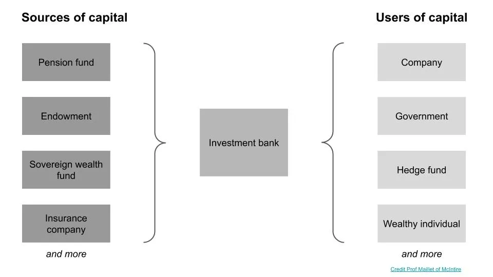
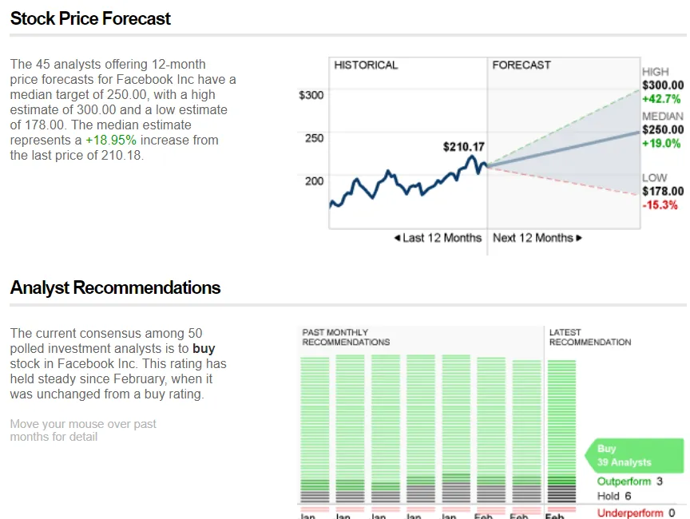

## Takeaway

Robots are coming for sellside equity research and it might not matter

--- 

If you think of **finance as an interaction between sources of capital and users of capital,** investment banks such as Goldman, Morgan Stanley, JP Morgan sit in the middle, facilitating transactions between those who have money and those who need it.

Banks have bankers that cover a specific financial product (equity, debt, M&A etc) or a specific industry (consumer, healthcare, tech etc) and arrange for corporate finance transactions within their coverage area.

Outside of these transactions, **banks usually have an equity research group, which issues views on stocks** based on researching the company and maintaining a relationship with company management. These are the "buy/hold/sell" recommendations or price targets you see reported in the news. Note that these are recommendations, and the research group doesn't take a position in the company, which distinguishes them from professional investors [^1].

Equity research is sold to professional investors, who then theoretically use that information to make investment decisions. These investors do their own research as well though, so it's uncertain how much they incorporate from bank research. Importantly, they do not pay equity research based on the accuracy of the recommendations, instead doing so indirectly via trading commissions through the bank.

**Hence, it's an open question as to what the investors are paying for: 1) the research, 2) the relationship with the company, or 3) the investment recommendation [^2].** My sellside (research) friends would argue it's all of them, my buyside (investor) friends would likely say it's (2), and my retail investor friends would likely say it's (3) since they aren't provided (1) and (2).

If you assume that the largest value add comes from (3), [this paper by Braiden Coleman, Kenneth Merkley, Joseph Pacelli on computer programmed equity research](https://papers.ssrn.com/sol3/papers.cfm?abstract_id=3514879 "Robots") would be interesting. **They study how "Robo-Analysts,” human-analyst-assisted computer programs conducting automated research analysis, perform against human research analysts** by analysing the differences in recommendations from both.

The team identified firms that used robos, collected stock recommendations from them [^3], and then test three hypotheses around bias, frequency, and outperformance. They find results consistent with all three, and we'll look at them in turn:

> First, Robo-Analysts collectively produce a more balanced distribution of buy, hold, and sell recommendations than do human analysts, consistent with them being less subject to behavioral biases and conflicts of interest

The first is saying that robos have less bias than human analysts, who also have conflicts of interests. As a result, robots recommend stocks with a more "natural" distribution in recommendations and are not all "buys" with no “sells”. These conflicts of interest are "related to economic incentives such as obtaining investment banking business or currying favor with management."

[Sarbanes-Oxley was intended to reduce such conflicts of interest,](https://www.sec.gov/news/speech/spch012803cag.htm "Sarbox") by limiting contact between the investment bankers (financial transactions) and the equity research group [^4]. Even if you assume that it’s successfully limited contact, there's still an incentive to publish positive reports of companies for the analyst. If you're a CEO and have a "buy" rating and a "sell" rating on your stock from different analysts, who are you more likely to be friendly with?

> Second, \[...\] Robo-Analysts revise their recommendations more frequently than human analysts and also adopt different production processes

The second is saying that robos update their inputs more often and with different data than humans, and hence update their recommendations more often. To understand this, we need to understand how companies release financial information. In the US, companies release one large annual report (10K) and three smaller quarterly reports (10Q). In addition to that, they do earnings announcements ahead of these reports (8K) which contain their quarterly results and could include additional information.

**Investors usually trade on 8Ks, since that information comes ahead of the 10Q.** Likewise, human analysts also update their reports in response to 8Ks. The robos though pay more attention to the 10Q and 10Ks, and are more likely to update after those filings.

Whether this second finding is interesting depends on what kind of investor you are. Many investors trade around earnings announcements (8K). Since half of investing is an expectations game, and most of the info these investors want to know is in 8Ks already, getting fewer recommendations after 8Ks and more after 10Qs is less helpful. You'd want to know as soon as possible rather than wait for the more detailed 10Qs to be out, since the price moves in response to 8Ks.

> Third, \[...\] portfolios formed based on the buy recommendations of Robo-Analysts appear to outperform those of human analysts, suggesting that their buy calls are more profitable

The third finding is the "so what" of the paper, stating that **the above two findings matter because you get better returns when following robos than human analysts.** This happens for "buy" recommendations but not for "sell", and they believe it's because humans are less likely to downgrade "buys" and the robos are overcorrecting and issuing too many "sells".

I have one quibble with their methodology, which I'll put in the footnote [^5]. Overall though, if you believe that stock recommendations are important, as many retail investors seem to, **this paper makes the case that you should be following robo analysts as well, since they're less biased, update more frequently, and could add outperformance.**

What that implies for the equity research industry depends on where you believe their value add for the buyers of their service is. If it's (1) or (3), this paper is bad news, but less so if it's (2). I’m 60% confident we’ll see an increase in robos, and that still won’t matter for most research analysts.

## Other

1. [Is the momentum factor in stocks explained by randomness?](https://breakingthemarket.com/randomness-in-momentum-everywhere/ "Random")
2. [The 4 major parts of shipping and maintaining a software application, and the products, methods, and services developers use](https://technically.dev/posts/what-your-developers-are-using.html "dev")
3. [Buying your way into nobility](https://www.bloomberg.com/news/articles/2020-02-02/even-if-you-weren-t-born-into-nobility-you-can-buy-your-way-in "Nobility")
4. ["Romeo and Juliet is not a love story. It is a six-day relationship between adolescents and an infatuation that leads to a tribal war."](https://aeon.co/essays/how-emotionally-focused-couple-therapy-can-help-love-last? "EFT")
5. [Interactive documentary of Jheronimus Bosch's artwork "the Garden of Earthly Delights"](https://archief.ntr.nl/tuinderlusten/en.html# "Art")

[^1]: Depending on the firm's compliance policy, the equity research analyst themselves could have a position, but that's extremely unlikely and I think might actually be banned. Confusingly, the bank as a whole could and likely does have a position through their asset management group, which is a separate line of business from equity research.
[^2]: With new regulation from MiFID, the incentive structure for equity research is also changing, resulting in changes in behaviour from banks. Also, I'm not making the case that equity research analysts are bad at their job; some people such as Mary Meeker got their claim to fame due to good work as a research analyst
[^3]: They focused on recommendations "because they are the most commonly reported output across Robo-Analyst firms, and also represent the output that retail investors focus most on"
[^4]: It also included rules such as requiring "research reports include price charts that track the price movements of the stock over a historical period relative to the analyst's recommendation". Having removed those pages when compiling materials for company management when I was in banking, and not paying attention to them on the buyside, I wonder how effective well-intentioned regulation actually was
[^5]: They construct the portfolio by "adding these stocks to the relevant portfolio at the close of the following day’s trading" after the recommendation was issued. In other words, the robo issues a recommendation, there's a trading day, and then they put the stock in at the close. Wouldn't the price already have been affected by the recommendation? If not, I wonder how much is a momentum
