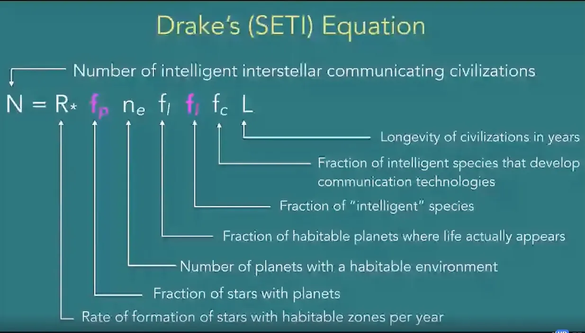
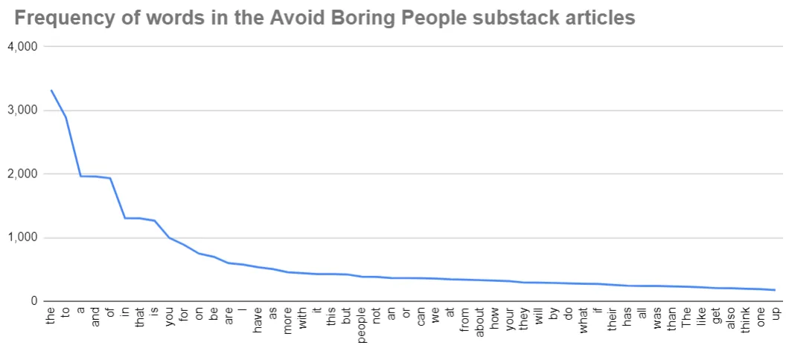
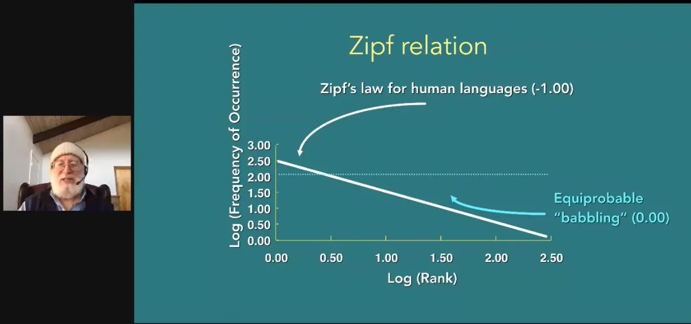

## Takeaway

Zipf's law and Shannon's information entropy can help us find alien life

---

## How can we find alien life?

We've talked about [how machine learning companies use data to recognise text](https://avoidboringpeople.substack.com/p/the-next-machine-learning-startup "ML") and how [investors use data to pick companies.](https://avoidboringpeople.substack.com/p/not-everything-is-insider-trading "invest")

This week, let's talk about how scientists are using data to look for aliens. Some of the content below will draw from [Laurance Doyle's talk with the Long Now group.](http://longnow.org/seminars/02020/apr/29/interspecies-communication-and-search-extraterrestrial-intelligence/ "Long")

### Framing the problem

The search for extraterrestrial intelligence institute (SETI) is the most famous of the research institutes that are looking for alien life. Its mission is to ["to explore, understand and explain the origin and nature of life in the universe and the evolution of intelligence."](https://www.seti.org/about-us/mission "mission")

How do we even go about scoping a problem like that? 

Well, if we're trying to find alien life, they have to exist on a planet somewhere else. So we know that trying to find planets is a potential starting point.

From elementary science we also know that planets form around stars. So we know that trying to find stars that can support planets is also a relevant point.

We know that most planets have harsh environments. So let's restrict that list just down to planets we think can support life [^1].

Of those planets, not all of them will actually have life appear, so let's take the proportion that actually do.

We might think that we're good here, and have enough features to start looking. There are still some features we can add though to narrow down our search precision. 

When we're looking at planets, we want to find some signal coming from the planet, as that will be much stronger proof that the planet has life. Imagine you were looking at a house vs a house where someone was playing music. It's much easier to conclude that there's a living thing in the second scenario. 

So, let's narrow down the planets where life actually appears, to the planets where "intelligent" species appear.

And of those "intelligent species", let's only take the ones that end up developing communications technology. 

Lastly, even if the species developed communications, if they're no longer alive to send those communications, we'd never receive them. So we need to account for how long those civilisations live for as well.

That was a lot. But now we have all the major factors we need to frame our problem, and look for the number of intelligent alien civilisations that can send signals.

Putting it all together, what we've done is come up with the [Drake equation](https://en.wikipedia.org/wiki/Drake_equation#:~:text=The%20Drake%20equation%20is%20a%20statement%20that%20stimulates%20intellectual%20curiosity,a%20part%20of%20that%20universe. "Drake"), a famous way of estimating intelligent life [^2]. Notice how all the points we just covered are multiplied together to get a guess of how many smart aliens are out there:

### Narrowing the scope 

That's a lot of variables though, so let's just focus on one part of that equation for today, that of the fraction of "intelligent" species. 

We need to find a way to distinguish "intelligent" signals from "non-intelligent" ones. For example, I'd want to differentiate between singing on a microphone vs [audio feedback](https://en.wikipedia.org/wiki/Audio_feedback "audio"). 

It'd be helpful if we had examples of alien communication, or knew what we were looking for. We obviously don't have the former [^3], but there are ways for us to further narrow down the latter. What we want to find are characteristics that an intelligent signal might have in contrast to random noise.

One way of doing so is by looking at non-human intelligent life all around us. [We use Antarctica as a proxy for Mars,](https://www.cnn.com/2015/12/09/health/white-mars-antarctica-concordia/index.html "Mars") and can similarly use animals as a proxy for alien language. 

If we had rules that we believe intelligent communications have to follow, we can test those rules against animal communications, and see how well they work. This will let us know if we need to broaden or narrow our search criteria.

It turns out there are 2 major rules in language theory - Zipf's Law, and Shannon's information theory entropy. Let's look at each in turn.

### Zipf's law about the frequency of words

What Zipf's law proposes is that for every language, the frequency of a word's occurence is inversely proportional to the word's ranking, if you ranked all the words by frequency of occurrence. For example, if "the" is the most common word, it has rank #1. If "I" is the second most common word, it has rank #2. The rank #1 word, "the", will occur twice as many times in the language as the rank #2 word, "I". It will occur thrice as many times in the language as the ran #3 word, and so on.

With such a law, we can test it on sample texts from that language. For example, someone plotted the frequency of words in Romeo and Juliet:

Not content to rely on some rando from the internet, I went ahead to analyse my own newsletter posts. With some simple python code [^4], I extracted the text from all my substack posts, pulled the top 50 words I used, and graphed them against their frequency. The relationship isn't perfect, but it's pretty close to what Zipf's law predicts. As you can imagine, “the”, “to”, “a”, “and”, “of” all occur frequently.

Great, so now we have one law. We can test that against animals such as dolphins and whales, and see if it still holds. [Researchers did that,](https://www.seti.org/animal-communications-information-theory-and-search-extraterrestrial-intelligence-seti#:~:text=We%20also%20found%20that%20bottlenose,Zipf's%20Law%20distribution%20of%20signals.&text=In%20other%20words%2C%20baby%20bottlenose,start%20to%20whistle%20like%20adults. "dolphin") and found that they do! [^5] In other words, it's likely that Zipf's law will apply to alien languages as well. By applying it to signals from outer space, we can filter out some of the noise.

### Shannon's information theory on predicting the next word

Shannon's information theory [^6] proposes that knowing the words before another word will give you some clue as to what that word is. Put another way, words in a sentence will depend on each. For example, you probably understand the previous sentence just fine, even though I omitted the last word "other."

Knowing that there's some relation between words, [we can also derive a way to score the language based on those relationships.](https://langev.com/pdf/plotkin00languageEvolution.pdf "shannon") I'm hand waving on the math here becauase I don't understand it myself, but the main takeaway that we can understand is that languages have a score. 

By plotting those scores, we can see what range most languages fall in. We can do the same process as before, scoring dolphins and whales, and seeing how their languages perform as well:

As you can see, there's a range in which most languages fall under. If we apply the same scoring system to signals, we can also filter out the ones that are unlikely to be languages.

### Finding aliens is not so different from machine learning

We started out with a broad goal - wanting to find aliens. 

We then framed the problem, and came up with the various components that might be helpful to look at.

We narrowed down to just one part of the problem, and looked for ways to increase the precision of our search. We came up with two main criteria from human languages, and then cross validated it against other non-human languages. Moving forward, we can use a similar approach to narrow down the signals that we want to study further.

In case you thought this was all hypothetical, the above approach is [exactly what one team at SETI is using to analyse signals.](https://www.seti.org/animal-communications-information-theory-and-search-extraterrestrial-intelligence-seti#:~:text=We%20also%20found%20that%20bottlenose,Zipf's%20Law%20distribution%20of%20signals.&text=In%20other%20words%2C%20baby%20bottlenose,start%20to%20whistle%20like%20adults. "SETI")

As you can see, the process itself can be similar to other data analysis problems. First, you start with a goal. Then, you frame what you might need. Next, you come up with an algorithm. Lastly, you test it to see if it holds up. Problem solving in one field isn't that different to problem solving in another. 

[^1]: Defining what is habitable vs not [is difficult of course,](https://en.wikipedia.org/wiki/Circumstellar_habitable_zone "zone") since what works for us may not work for alien life. Some people might believe in silicon-based life rather than carbon-based (what we are), though [there are difficulties with that assumption](https://astronomy.stackexchange.com/questions/20858/why-do-aliens-have-to-be-carbon-based-lifeforms "carbon")
[^2]: Note that "the usefulness of the Drake equation is not in the solving, but rather in the contemplation of all the various concepts which scientists must incorporate when considering the question of life elsewhere, and gives the question of life elsewhere a basis for scientific analysis"
[^3]: Unless you know something that I don't, in which case I'm interested to know more...
[^4]: By simple, I mean it took <30 min to write, and then 3 hours for me to troubleshoot. The code is [here](https://github.com/leonlinsx/ABP-code/blob/master/Python-projects/File%20extractor.py "git") if you're interested in adapting it for your own purposes. 
[^5]: They also tested it against baby babbling, both human and dolphin babies. They find that neither of these follow Zipf's law.
[^6]: Yes, this is *the* [Claude Shannon, the guy who essentially taught us how to create electronic communications](https://www.itsoc.org/about/shannon "Shannon")