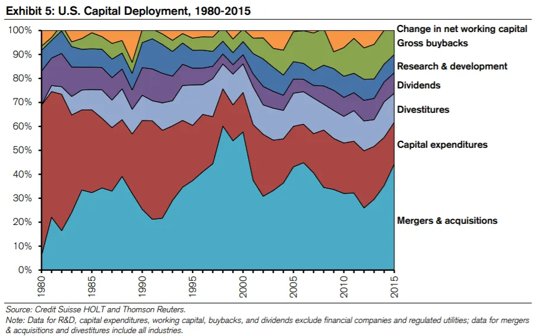
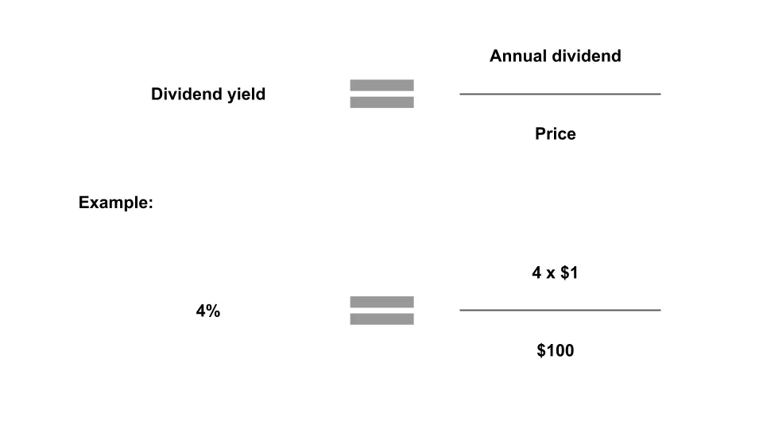
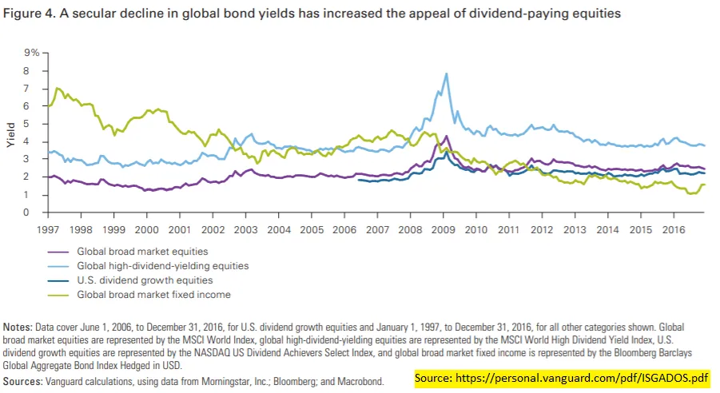
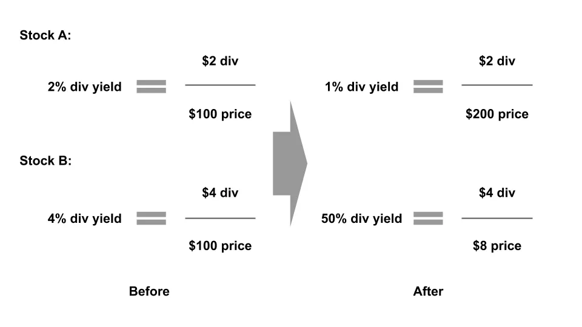
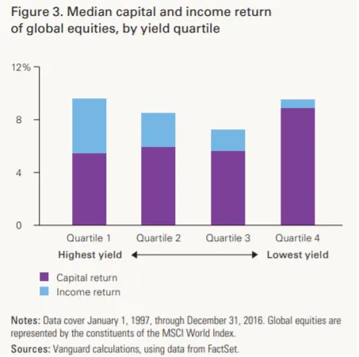
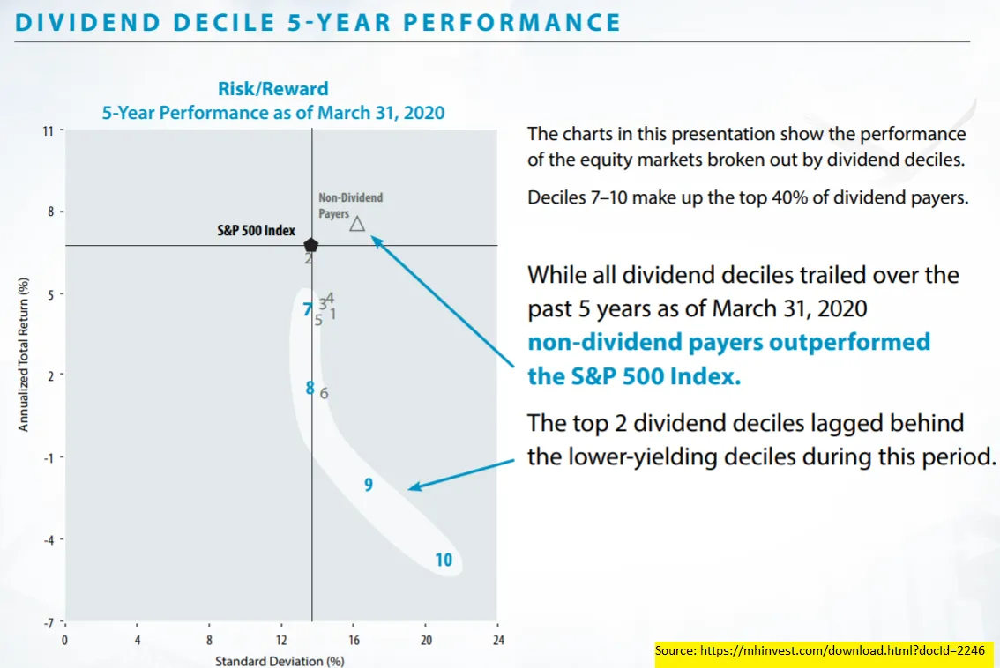
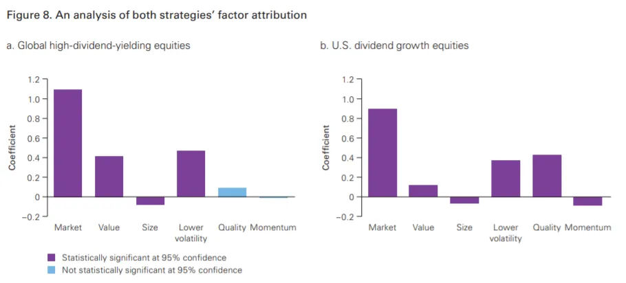

## Takeaway

Investing for dividends has more nuances than might first appear.

---

## Return on dividends

In [footnote 8 of last week's free post](https://avoidboringpeople.substack.com/p/a-story-is-a-lie-and-a-story-is-true "footnote") I made a throwaway remark on dividends mattering less than capital return because I didn't want to spend more time digging into the subject.

Today, let's actually dig into dividends. 

We'll do an overview of dividends, then discuss drawbacks, and end with links to other research that complicates the story.

As always, none of this is investment advice [^1].

### What to do with all that cash

Suppose you're a publicly listed company that makes a profit [^2]. You've paid your suppliers, you've paid your employees, and you've paid yourself. You still have more cash left over though, so what can you do with that?

One, you could do nothing. Just let it sit in a bank somewhere [^3]. 

Two, you could reinvest in the business. That machine you wanted for your manufacturing line? That software product for your HR team? [That Gulfstream G650 to get high?](https://www.wsj.com/articles/this-is-not-the-way-everybody-behaves-how-adam-neumanns-over-the-top-style-built-wework-11568823827 "WSJ") Perhaps now might be the time to buy them.

Three, you could buy other businesses. Perhaps there's a smaller competitor that you can acquire on the cheap and get all those "synergies" that your banking buddies tell you about in order to grow market share [^4].

Four, you could buy back some of your shares. This increases the ownership you have of your company, which implies that you get more upside if the company does well. Buybacks are out of scope for this article, you can read an initial (biased) take on them by Cliff Asness [here.](https://images.aqr.com/-/media/AQR/Documents/Journal-Articles/Buyback-Derangement-Syndrome.pdf "Cliff")

Five, you could pay a dividend to investors. For each share that investors have, you hand them some cash every quarter. 

I've simplified, as always, and the actions above are the main things companies do with their money. A graph from CS shows us how the mix of those actions has changed over time: 

Today we'll focus on action five, the dividend payment. I'll skip over discussing the theoretical irrelevance of capital structures [^5], but you can read a refresher on Modigliani Miller [here.](https://pubs.aeaweb.org/doi/pdfplus/10.1257/jep.2.4.99 "MM")

### Evaluating dividends

On first glance, a dividend sounds good to you as an investor. Getting some cash back on your stock seems nice. Let's look at how we might evaluate it.

If I told you that a company dividend was $5, would that be good or bad? It sounds like a lot of money, but we really don't know unless we compare it against the price. 

If you'd bought the stock for $5 and it was giving you back $5, that would be high. You've effectively gotten paid back on your investment right there.

If you'd bought the stock for $10k and it was giving you back $5, that's probably insignificant.

So we know that **the price matters, as with all things investment related.** To incorporate this, we can calculate a dividend yield, which is simply the dividend amount divided by the price. By comparing dividend yields against each other, we can figure out what stocks have "high" dividends and what stocks have "low" dividends. 

As a sidenote, by convention we'd take a 12 mth sum of dividend. Most companies pay dividends out quarterly, so if a company paid out $1 per quarter, their annual dividend is $4. We'll also ignore taxes [^6].

Beyond allowing us to evaluate dividend yields among dividend paying stocks, that yield also allows us to compare across other securities. Yield is like the expected return, after all. So we could compare a dividend yield of 4% vs a bond that pays 1%, and say that all else equal the dividend stock is giving us a higher income.

Which is what we see in this [Vanguard report](https://personal.vanguard.com/pdf/ISGADOS.pdf "Van"), with the graph below showing that **dividend yields have been higher than bond yields in the past 10+ years.** 

On second glance, this looks even better now. An extended period in which you get more cash back than bonds? Should we all just find the highest dividend yield stocks and buy them all? What's the catch?

### Total return, not just dividend return

The first is a simple one, and something we've already partially touched on, the issue of price. A high dividend yield could come from the company paying out a lot in cash, resulting in a relatively large dividend amount over a relatively small price. Or it could also come from the stock price going down a lot, resulting in that same relatively large dividend amount over a relatively small price.

In the example below, you'd have been much happier with the 1% div yield vs the 50%, because of the circumstances that led there. Due to the price drop in the second case, you've actually lost much more money than you've gained from the "increase" in dividend yield.

You can't even be sure that the high yield will last either, since that dividend amount isn't guaranteed for the future. It's true that companies don't like to cut their dividend, because they fear shareholders dumping their stock. [However, that also menas that a company can cut its dividend when things are so bad they have no choice.](https://www.cnbc.com/2018/12/07/ge-makes-it-official-lowers-dividend-to-a-penny.html "GE")

What this means is that we have to **consider an additional factor beyond dividend yield, that of the price change.** By combining this capital return (price change) with the dividend yield, we'll get a total return figure that is closer to the performance measure we want. This sounds obvious now that we've mentioned it, but you'll frequently see many investment brochures promoting high dividend stocks, without considering the capital return component.

What happens when we do consider capital return? Let's look at the components of total return, but first make a guess at how that might look. We might think that for the high dividend yield stocks, most of the return is made of the dividend. For the low (or no) yield stocks, most of the return is made of price change.

Surprisingly, this is not what we find. In that same [Vanguard report](https://personal.vanguard.com/pdf/ISGADOS.pdf "Van"), the authors sorted stocks into 4 buckets from high to low dividend yield. They then compared the return from dividends vs price. We see that **capital return has contributed more to total return,** even when including the high dividend stocks. 

Even more interestingly, a [Miller Howard report](https://mhinvest.com/download.html?docId=2246 "Miller") shows that when you split dividend stocks into 10 buckets, most of them actually **underperform** the S&P index over the past 10 years. What's worse, is that the top bucket with highest dividend yields are the ones that underperform the most. This implies a completely opposite investment strategy vs what we'd thought of before.

### Correlated factors

The second catch is less obvious, and it's that of other factors correlated with high dividend yields. 

Let's imagine that we had selected the top 100 stocks based on their high dividend yield. If we found that all those stocks had something else in common, say [Emma Watson being on the board of directors](https://www.mugglenet.com/2020/06/emma-watson-joins-kerings-board-of-directors-to-advocate-for-sustainable-fashion/ "Emma"), perhaps it's not the dividend yield that actually matters, but Emma's star power mysteriously affecting total returns.

There actually are indeed some common factors that people use to classify stocks. These include some measure of value for money, company size, and price momentum. For example, you might want to group all small companies together and find that small companies outperform large companies. If you found strong enough evidence for that, you might want to create a portfolio of just small companies. 

I'll skip over the explanation of how these factors were created; you can read more about this in [Fama and French's five factor model here.](https://www.sciencedirect.com/science/article/abs/pii/S0304405X14002323 "model") The important thing to note is that we have other features that describe a stock, beyond just dividend yield. 

The [Vanguard report](https://personal.vanguard.com/pdf/ISGADOS.pdf "Van") distinguished between two types of dividend stocks, 1) high dividend yield, and 2) high dividend growth. They then compared how correlated those groups were against some of those common factors we mentioned above [^7]. 

Turns out that many of the features are correlated, whether it's group 1 or group 2. Put another way, if you ignored the dividend factor, and just considered these other factors, you would go a long way towards capturing the return from dividend stocks. 

[Meb Faber went ahead to do just that,](https://www.cambriainvestments.com/wp-content/uploads/2017/10/DTAX-10.23.17.pdf "Meb") by creating composite portfolios that could replicate the profiles of dividend stocks, without actually being dividend stocks. What that means is that he found stocks that gave you the same return as dividend stocks, but did not actually pay a dividend. His findings show that **the returns for such portfolios beat the dividend portfolio.** Compare the black box column against the rest to the right:

And those results held up when he compared after tax returns as well:

## Conclusion and complications

In summary,

1. The price and total return on a stock clearly matter, more so than just dividend yield
2. We are able to duplicate the positive factors of dividend stocks by creating an alternative portfolio intentionally excluding dividend stocks. This performs even better than the dividend portfolio

As with all investing, there are some complications. Some researchers find that the time period of the studies matter. By running the study for a period much longer than 10 years, the importance of dividends to returns increases. Others argue that companies have little productive actions to take with their cash, and returning it to shareholders benefits shareholders who now can choose where to re-deploy their dividend. And some say that dividend growth is a proxy for a healthy company. 

However, the ones I've seen haven't refuted Meb's alternative portfolio research yet, which is why I'm still less enthusiastic about dividend investing overall. If you can create a portfolio with higher return and a after-tax advantage, seems like it should be the better deal.

I'll leave you to explore the links below and see if you find them persuasive:

1. [Is dividend investing dangerous?](https://blog.thinknewfound.com/2016/12/dividend-investing-dangerous/ "Divd")
2. [Surprise! Higher Dividends = Higher Earnings Growth](https://www.researchaffiliates.com/documents/FAJ_Jan_Feb_2003_Surprise_Higher_Dividends_Higher_Earnings_Growth.pdf "Divd")
3. [Dividends and the three dwarfs](https://www.researchaffiliates.com/content/dam/ra/documents/FAJ_Mar_Apr_2003_Dividends_and_the_Three_Dwarfs.pdf "Divd")

[^1]: I have never and will never give investment advice. Don't sue me, I have no money.
[^2]: A surprisingly less frequent occurrence than one might think these days...
[^3]: It's not quite as simple as this in reality, and companies have treasury departments that manage how much liquid cash they have on hand vs other money instruments that return some yield. Nobody really has billions in paper bills lying around, or even in checking accounts for that matter.
[^4]: Synergies are usually thought of as either revenue or cost synergies. Revenue synergies coming from being able to sell more stuff and cost synergies from firing people.
[^5]: Under certain assumptions, how a company is financed doesn't matter. If that's the case, then capital allocation policies are essentially the same.
[^6]: Tax treatment for dividends can be different depending on your circumstance. Usually though, your net return from a dividend is reduced because you have to pay a sizeable tax on that income.
[^7]: For a different split, look at [this other source doing a similar analysis](https://www.indexologyblog.com/2020/05/15/why-did-dividend-indices-underperform-during-the-coronavirus-sell-off/ "div")
