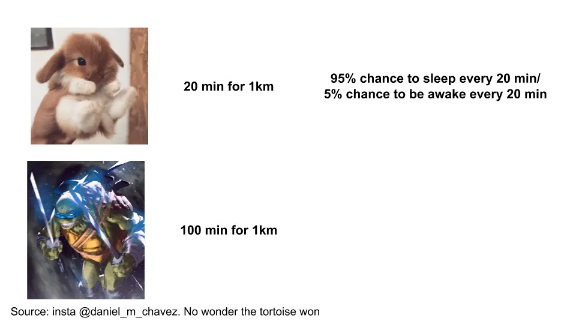
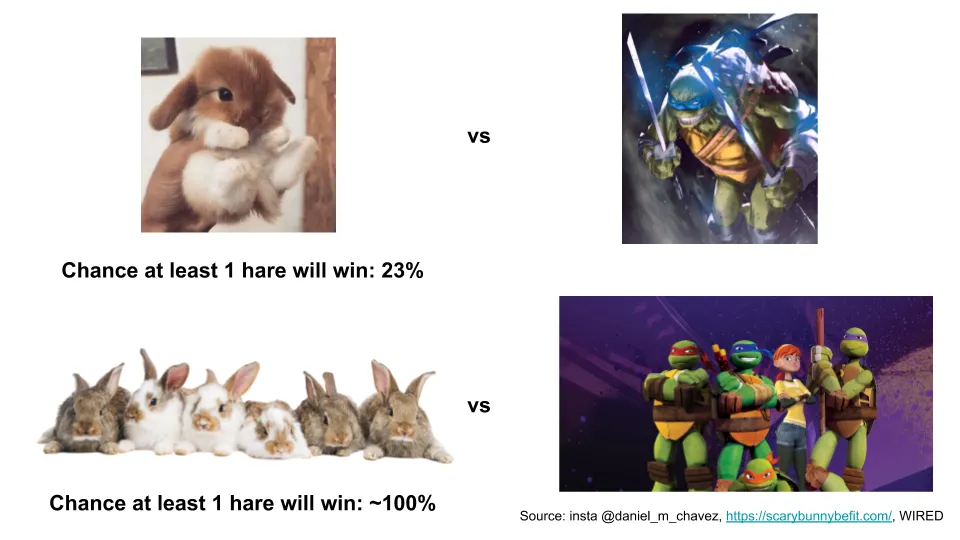
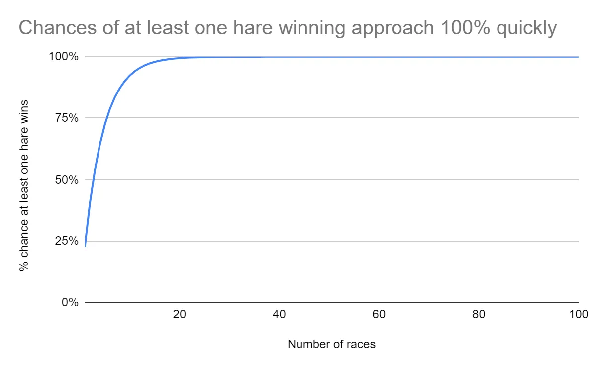

## Takeaway

Companies are not incentivised to take risk, hurting innovation within the company and increasing the likelihood a startup wins against them.

## Tortoise vs hare

I'll take it for granted that everyone's familiar with the [tortoise vs hare fable.](http://read.gov/aesop/025.html 'aesop') Hare races tortoise, falls asleep, loses, and spends the rest of his life living in shame before writing an explosive tell all on how it was [all a shell game](https://en.wikipedia.org/wiki/Shell_game 'shell') [^1].

[Drawing on this post by Farnam Street](https://fs.blog/2016/07/james-march-the-trouble-with-genius/ 'FS'), let's extend the analogy further with a bit of math. I know how that scares off half the readership immediately, but let's not freak out yet. Coming from someone who recently wasted 15 min on a math problem because I added 1 + 1 wrongly, I'll be keeping the math simple if only for my sake [^2].

Let's have a race track of 1 km. We'll assume the tortoise takes 100 min to run 1 km, and the hare takes 20 min to run 1km. However, the hare's sleep schedule has been messed up due to covid and there's a 95% chance it will sleep during every separate 20 min block. Put another way, there's a 5% chance it's awake during minutes 0-20, and then another 5% chance it's awake during minutes 20-40, and another 5% chance it's awake during minutes 40-60 etc.

What's the chance that the hare beats the tortoise?

For those of you that recall secondary school probability, we can calculate this with a [binomial distribution formula.](https://online.stat.psu.edu/stat414/lesson/10/10.3 'binom') The formula looks like this:

But that looks scary with summation signs and exclamation points, and I did promise to keep the math simple. One way to shortcut the calculation is to observe that there are 5 "20 min blocks" for the hare to fall asleep or be awake, since the hare is 5x faster than the tortoise. As long as the hare is awake once, it'll win. So, the only time the hare loses is when it sleeps all of those times. That's a much easier calculation, since that's just 95% times itself 5 times, or 0.95 to the power of 5 [^3].

That gives us 77%, implying that under our assumptions, the hare loses 77% of the time to the tortoise, and only wins 23% of the time.

Now, let's change our framing slightly. If we ran 100 races, what's the chance that we get at least one race where the hare wins?

There's only one case where no hares win, which is when all of the races are won by tortoises. Assuming the tortoise mafia didn't rig the game again, the chance of that happening is the 77% times itself 100 times, which rounds to 0%.

In other words, it's nearly guaranteed that at least once, a hare will win.

I've put the math into a google sheet [here](https://docs.google.com/spreadsheets/d/1-_LV1ewb0D4DsERENaM_xp0oy8pHH7xWmAvNX8H9bdE/edit?usp=sharing 'sheet') that you can play with [^4]. You can also see from the graph below that it doesn’t even take that many races before the chances of at least one hare winning approach 100%. Remember, this is one hare winning, not the majority of hares winning.

The math is less important than the takeaway though. **What we've inferred is that even when the odds of something happening on its own are low, a repeated game will likely ensure the event happens once.** Just like how it's unlikely for you to win the lottery, but it's likely there will be at least one lottery winner.

## Tortoise vs tech

Let's relate this to tech. The tech industry prides itself on innovation, but we have to note that it's the sum of cumulated failures that drives progress forward. If you think of startups as the hares in this scenario, and large incumbents as the tortoise, there's a low chance of any particular startup winning against an incumbent, but a high chance that at least one will.

There are multiple examples of large companies just dropping the ball on enormous revenue opportunities. For something recent, think about how both Microsoft and Google lost out on $70bn worth of value [(mkt cap of Zoom)](https://finance.yahoo.com/quote/ZM/ 'ZM') by having an ok but not great video conferencing product. For something older, think about how [Xerox invented the mouse, graphical user interface, and the PC, but failed to follow up on them](https://www.forbes.com/sites/tendayiviki/2017/07/01/as-xerox-parc-turns-forty-seven-the-lesson-learned-is-that-business-models-matter/#eaf579075482 'xerox').

There's a few reasons why most companies suck at this. Firstly, **people are risk averse,** in the sense that they're not willing to tolerate the massive amount of failures required for new ideas to work. Success of projects is determined on an individual basis, not at the company level. "Can you support this project where the most likely outcome is a complete waste of resources" is not the best sales tagline.

The issue with that is that genius is volatile. If you want crazy results, sometimes you'll need crazy people. Whether due to luck, skill, or a combination of both (more likely), the range of outcomes from crazier projects will be distributed across a wider band of possibilities. For every iphone, there's a hundred [cheetos lip balm](https://www.usatoday.com/story/money/2018/07/11/50-worst-product-flops-of-all-time/36734837/ 'cheetos') type projects that never take off.

Since most people also think in terms of [outcomes rather than process,](https://www.schroders.com/id/uk/the-value-perspective/blog/all-blogs/outcomes-and-timeframes--with-annie-duke-part-3/?t=true 'annie') the judgement for projects is binary. They're either a success, or a failure. And nobody wants to be associated with failures, even when the potential reward is high, since the expected value is low. We want the genius only after she's been identified, and are not willing to put up with the losses beforehand.

Secondly and relatedly, **there's a lack of incentive alignment** in larger companies for small projects to succeed. For the most part, people at large companies are aiming to not get fired rather than excel. For good reason too, since the value generated at a large company goes mostly to the company and not to you. In contrast, people at smaller companies are aiming to not make the company go bankrupt [^5]. There's a higher degree of incentive alignment for people at startups vs larger companies, resulting in a higher average amount of effort per person.

Could companies fix this? Possibly, but incentivising and managing people is a notoriously tricky field. You could probably aim to pay people above market, give them [15 percent time for special projects](https://www.fastcompany.com/1663137/how-3m-gave-everyone-days-off-and-created-an-innovation-dynamo '15'), or offer some reward and recognition program to nudge your employees. However, the average employee would probably still be more concerned about their post work netflix plans than their special likely-to-fail pet project. There's probably some amount of money that would work, but that additional cost is likely too much for most companies to justify [^6]

Lastly, **companies like to "focus".** Usually that's a buzzword for cost cutting and reorgs, such as when [Ruth Porat took over as Google CFO.](https://www.bizjournals.com/sanjose/news/2015/07/15/google-reins-in-hiring-and-spending.html 'Ruth') You can see similar situations play out now with the covid layoffs, with most companies saying they have to "ruthlessly prioritise" for whatever PR friendly reason. When things are bad, management will sort things into the nice-to-haves vs must-haves, and most innovative projects fall into the trash heap.

Even in a good economic situation, projects are frequently rejected because they are "too small to move the needle" or "won't scale." Can you imagine trying to pitch AirBNB at Marriott? You'd struggle not only with justifying how the market size could be large enough to make sense to spend time on, but also why cannibalising your own revenue is a good idea.

Innovation is not easy, and it's made even harder since most places judge outcomes and not process. If you're a startup aiming to revolutionise a sector, figure out what the [base rate](https://en.wikipedia.org/wiki/Base_rate 'base') of success is, and be prepared for failure. A lot of failure. If you're a company hoping to remain relevant, realise that nearly all of your incentive structures are set up for the average. And **over the long run, average means irrelevance.**

[^1]: Also known as the #Me [Tu](https://www.echineselearning.com/blog/chinese-character-tu-rabbit-beginner 'tu') movement.

[^2]: Ok so it was 1 - -1 and I got the sign wrong in my head, so wasn't quite that bad. No I'm not getting defensive about it.

[^3]: I've chosen the numbers here specifically to keep the example simple. I was looking for something where the hare would lose most of the time and only have a few intervals.

[^4]: I’ve done the probability calc a few ways, with the factorial formula shown and with google sheet’s binomdist function, just to show they’re equivalent

[^5]: It's probably not that terrible for employees at startups nowadays when the company fails, since there's a lot of roles out there, especially for software engineers. That said, it still sucks to get laid off, and there's a higher chance of that happening with a startup.

[^6]: For example, let's imagine some extreme scenario in which employees get 50% of the revenue or 50% of the cost savings they get for the business. We'll ignore measurement difficulties for now, but that's probably enough of a motivator at huge companies where small changes can save millions of dollars. The problem then comes from the fact that the employee has made money but the company hasn't.
