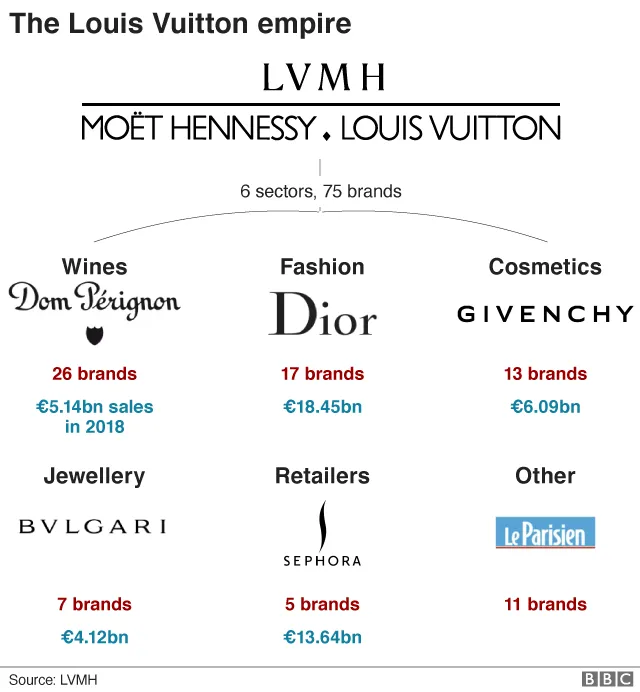
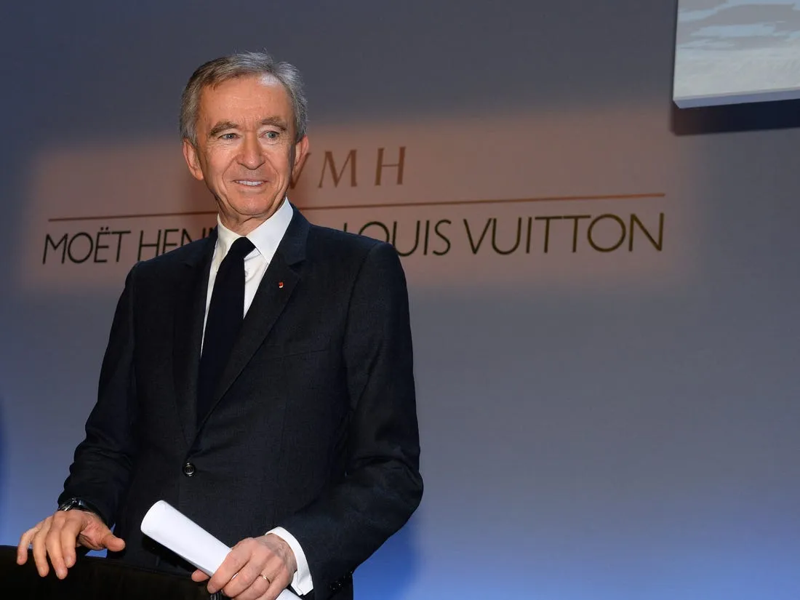
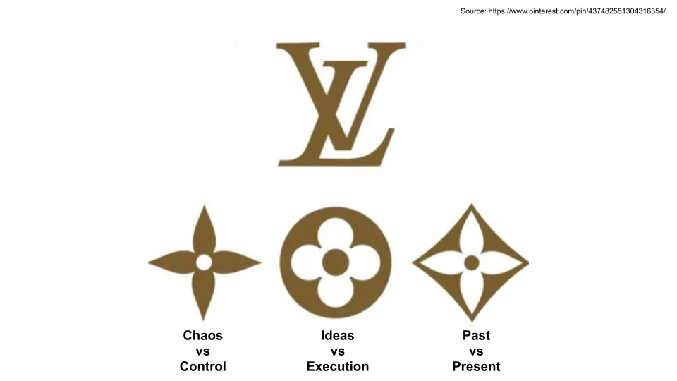
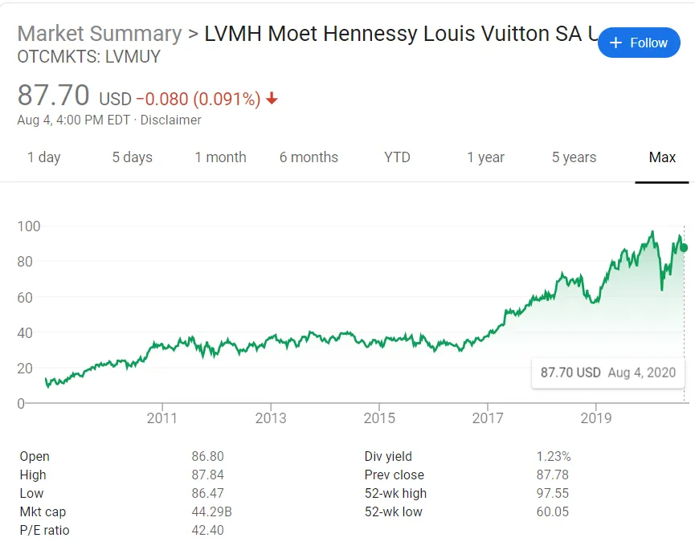

## Takeaway

As the CEO of LVMH, Bernard Arnault believes that star brands require creativity for ideas but control on execution, combined with a blend of past and present

## Top of the luxury chain

[LVMH](https://en.wikipedia.org/wiki/LVMH 'LVMH') is the parent company of many luxury brands we're familiar with. [Formed in 1987](https://www.thefashionlaw.com/lvmh-a-timeline-behind-the-building-of-a-conglomerate/ '1987') through the merger of "Louis Vuitton" and "Moët et Chandon and Hennessy", it now houses more than 70 brands across wine, fashion, jewellery, and more. Compared to its nearest competitor, Kering [^1], [LVMH makes more than 2x the amount of revenue.](https://www.themds.com/companies/kering-versus-lvmh-it-bags-and-influencers-vs-heritage-and-size.html 'rev')

And at the top of it all is [Bernard Arnault](https://en.wikipedia.org/wiki/Bernard_Arnault 'Bernard'), who has been head of the group ever since 1990. It's paid off well for him, making him one of the richest men in the world.

[Brett Bivens tweeted this HBR interview of Bernard a while back](https://twitter.com/brettbivens/status/1251505408960794624?s=20 'Brett'), and today I want to build on that article with a few more sources. We'll get a better understanding of **how Bernard views creativity - where he allows chaos and where he restricts control.**

Bernard often recounts the story of his first visit to the US. He'd asked a taxi driver what he knew of France. [The driver couldn't name France's president, but could name Dior.](https://www.ft.com/content/21f64410-9117-11e9-aea1-2b1d33ac3271 'FT') Since then, Bernard has always remembered **the power a brand can have.**

Bernard built his brand by buying. From his [first takeover of the textile company Boussac](https://www.forbes.com/sites/susanadams/2019/10/31/the-100-billion-man-how-bernard-arnault-stitched-together-the-worlds-third-biggest-fortune-with-louis-vuitton-dior-and-77-other-brandsand-why-hes-not-done-yet/#22a97e114efb 'Boussac') to [the many deals done since taking over LVMH,](https://www.thefashionlaw.com/lvmh-a-timeline-behind-the-building-of-a-conglomerate/ 'LVMH') Bernard has brought LVMH to its current status with a series of acquisitions, sometimes controversially [^2]. There's a reason he's known as the "wolf in cashmere."

However, the Frenchman is far from just a financier. Bernard also has strong opinions on creativity, mostly applied to the fashion industry. My reading turned up a few recurring themes, and I'll go over them in turn:

1. Chaos vs control
2. Ideas vs execution
3. Past vs present

### 1. Don't compromise on creativity in the design process

Bernard understands the importance of letting his designers do their work, giving them the freedom to be creative in the ideation phase:

> Our whole business is based on giving our artists and designers complete freedom to invent without limits.

> The important point is, you cannot compromise creativity at its birth.

This is in contrast to the [A/B testing](https://www.crazyegg.com/blog/ab-testing/ 'AB') that most tech companies do today, which Bernard claims is not appropriate for his business:

> Some companies are very marketing driven; they follow the consumer. And they succeed with that strategy. They go out, they test what people want, and then they make it. But that approach has nothing to do with innovation \[...\] You can’t charge a premium price for giving people what they expect, and you won’t ever have break-out products that way—the kinds of products that people line up around the block for. We have those, but only because we give our artists freedom.

> we won’t launch a product if the tests clearly show it is going to be a failure, but we won’t use tests to modify products, either.

This is reminiscent of the Steve Jobs quote, "that customers don't know what they want until you show it to them [^3]." If we recall that fashion sits on the top of [the pace layer diagram](https://leonlins.com/writing/2020_03_04_pace/ 'pace'), it makes sense that Bernard would think this way, given the quick pace of change in the industry. He's always looking for something new for the season, and needs to dictate consumer taste rather than be directed by it.

However, Bernard draws the line on the production and operations processes. Here, he looks to control as much of the action as possible. You can be creative in ideas but not in execution:

> \[LVMH\] only hires managers so respectful of the creative process that they will endure its necessary chaos. Yet when it comes to getting its creativity onto shelves, chaos is banished. The company imposes strict discipline on its manufacturing processes,

> Our products have unbelievably high quality; they have to. But their production is organized in such a way that we also have unbelievably high productivity.

And he walks the talk too, literally. [Bernard does weekly store visits, and will flag concerns to his brand CEOs:](https://www.forbes.com/sites/susanadams/2019/10/31/the-100-billion-man-how-bernard-arnault-stitched-together-the-worlds-third-biggest-fortune-with-louis-vuitton-dior-and-77-other-brandsand-why-hes-not-done-yet/#22a97e114efb 'Bernard')

> Every Saturday, he prowls his retail stores, rearranging bag displays and making suggestions to clerks.

This is the first duality: control vs creativity. Here, Bernard allows creativity in the early stages where innovation is needed, and controls the later stages where consistency is needed.

### 2. Favour functional creativity

Don't let the above section mislead you into thinking that LVMH is some haven for the tortured misunderstood artist who needs some outlet to express herself. Although Bernard gives artists freedom, he also believes that creativity isn't an end in itself for LVMH. Bernard's still a businessman, and he wants his stuff to sell.

He believes that the best creative people don't just want their creations as display pieces in museums, but to be worn:

> The most successful creative people \[...\] want to see their creations in the street. They don’t invent just to invent. Yes, they come up with many exciting ideas, and many of these ideas shock; they look crazy at first, completely crazy. But the true artists that make LVMH a success, they don’t want the process to end there. They want people to wear their dresses, or spray their perfume, or carry the luggage they have designed.

> growth is a function of high desire. Customers must want the product

Bernard treats it as his job to make creativity functional, turning crazy idea to crazy hot product:

> What I have fun with is trying to transform creativity into business reality all over the world. To do this, you have to be connected to innovators and designers, but also make their ideas livable and concrete

> Creativity - yes, But executed in a way that people like and can use

And this is driven by his belief that execution matters:

> You need ideas but the idea is just 20%. Execution is 80%

This is the second duality: ideas vs execution. Bernard clearly recognises the importance of ideas; all that talk above on creative freedom makes that clear. In addition, Bernard recognises that though they make art, LVMH is not in the art industry. Art that doesn't sell isn't welcome.

### 3. Blend tradition and modernity

Bernard also believes that creativity requires referencing the past but also looking to the future. In his view, the best products are ones that can appeal to both aspects simultaneously:

> The LVMH process has one goal: star brands. According to Arnault, star brands are born only when a company manages to make products that “speak to the ages” but feel intensely modern. Such products sell fast and furiously, all while raking in profits.

> When I see a product of some of our best brands, it has to be timeless but also it has to have in it something of the utmost modernity in it.

> So is heritage the main characteristic of a star brand? I would say that there are four characteristics required. A star brand is timeless, modern, fast growing, and highly profitable [^4]

As a result, the majority of revenue comes from classic products, as LVMH moderates how often new products are brought to market. This does seem somewhat contradictory, and is likely similar to most consumer companies e.g. a beverage company introducing new flavours all the time but still making most of its money from the original flavour. I have some trouble consolidating this idea with his view that creativity is important. Maybe it’s because they get so few chances to test new product?

> We do not put the entire company at risk by introducing all new products all the time. In any given year, in fact, only 15% of our business comes from the new; the rest comes from traditional, proven products—the classics.

His emphasis on tradition likely comes from both that statistic above, as well as his experience trying to launch a brand from scratch:

> at the beginning, we thought, “Okay, we have a genius here with Christian Lacroix,” but we learned that genius is not enough to succeed. It was something of a shock, to be honest, to discover that even great talent could not launch a brand from zero. A brand must have a heritage; there are no shortcuts.

Which explains why he tries to keep people during acquisitions. This is surprising, given that a major reason for cost savings post-acquisition is the firing of people from the company you just acquired.

> Quality also comes from hiring very dedicated people and then keeping them for a long time. We try to keep the people at the brands, especially the artisans \[...\] Most companies clean house when they acquire a new brand. We don’t do that because we have found it hurts quality terribly. When you clean house, you usher out the people who respect the brand the most and who contribute to its longevity—its timelessness, its authenticity.

This is the third duality: past vs present. Bernard believes that consumers look to the past, but want to live in the present.

## Building a brand for the long term

We've covered 3 dualities that Bernard deals with, arising from the experience he's had building the brand. By allowing creativity with control, execution of ideas, and blending tradition and modernity, Bernard believes he's building LVMH for the long term:

> [When we discuss a brand, I always tell them my real concern is what the brand will be in five or ten years, not the profitability in the next six months.](https://www.forbes.com/sites/luisakroll/2017/09/26/business-icon-bernard-arnault-reveals-his-most-important-mentor-biggest-mistake-in-qa/#4e8836af2ccc 'Forbes')

And that so far has worked for him, at least based on the stock price and the market share of LVMH:

How much of his framework is applicable to other businesses? I mostly agree on the emphasis of creativity but also operational excellence. As per the recent note on [why companies are bad at innovating](https://leonlins.com/writing/2020_07_15_turtle/ 'turtle') though, I’m unsure if most companies are willing to accept the volatility implied with accepting more creativity. I’m unsure if the past vs present duality is easily implemented, beyond some marketing campaign just for show.

With all Bernard's achieved, you'd think he'd be ready to retire. He's not done empire building though. Even now, Bernard still believes [it's day 1:](https://www.forbes.com/sites/quora/2017/04/21/what-is-jeff-bezos-day-1-philosophy/#1867a2be1052 'Day')

> We are still small. We’re just getting started. This is very fun. We are number one, but we can go further.

## Sources

1. [HBR interview](https://hbr.org/2001/10/the-perfect-paradox-of-star-brands-an-interview-with-bernard-arnault-of-lvmh 'HBR')
2. [FT interview](https://www.ft.com/content/21f64410-9117-11e9-aea1-2b1d33ac3271 'FT')
3. [Forbes interview](https://www.forbes.com/sites/luisakroll/2017/09/26/business-icon-bernard-arnault-reveals-his-most-important-mentor-biggest-mistake-in-qa/#4e8836af2ccc 'Forbes')
4. [NYT interview](https://www.nytimes.com/2019/11/25/fashion/bernard-arnault-tiffany-lvmh.html 'NYT')
5. [Reuters coverage of LVMH/Tiffany deal](https://www.reuters.com/article/us-tiffany-m-a-lvmh-deal/how-lvmhs-whirlwind-courtship-sealed-16-billion-tiffany-deal-idUSKBN1XZ2F7 'LVMH')

[^1]: [Kering owns Gucci, Saint Laurent, Bottega Veneta, Balenciaga, Alexander McQueen, Brioni, and more](https://www.kering.com/en/talent/who-we-are/our-houses/ 'Kering')

[^2]: His [firing of workers at Boussac](https://www.nytimes.com/1989/12/17/magazine/a-luxury-fight-to-the-finish.html 'Bossac'), [ouster of LVMH leadership](https://www.forbes.com/sites/susanadams/2019/10/31/the-100-billion-man-how-bernard-arnault-stitched-together-the-worlds-third-biggest-fortune-with-louis-vuitton-dior-and-77-other-brandsand-why-hes-not-done-yet/#22a97e114efb 'LVMH'), and hostile bid for Hermes have attracted much criticism, to name a few.

[^3]: Supposedly misunderstood, according to [this article](https://www.businessinsider.com/steve-jobs-quote-misunderstood-katie-dill-2019-4 'katie')

[^4]: Bernard also says that sometimes, there's just something inexplicable "Many brands have the potential to be stars, but they are poorly managed. That’s too bad for them. But there are more brands that are as well managed as can be, and they will never be stars. They will never be successful the world over. They don’t have that something—that magic that you really can’t explain."
