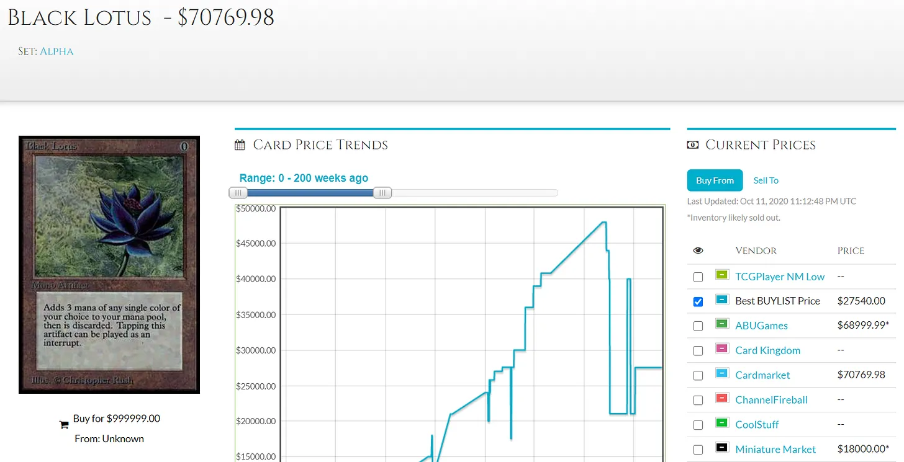
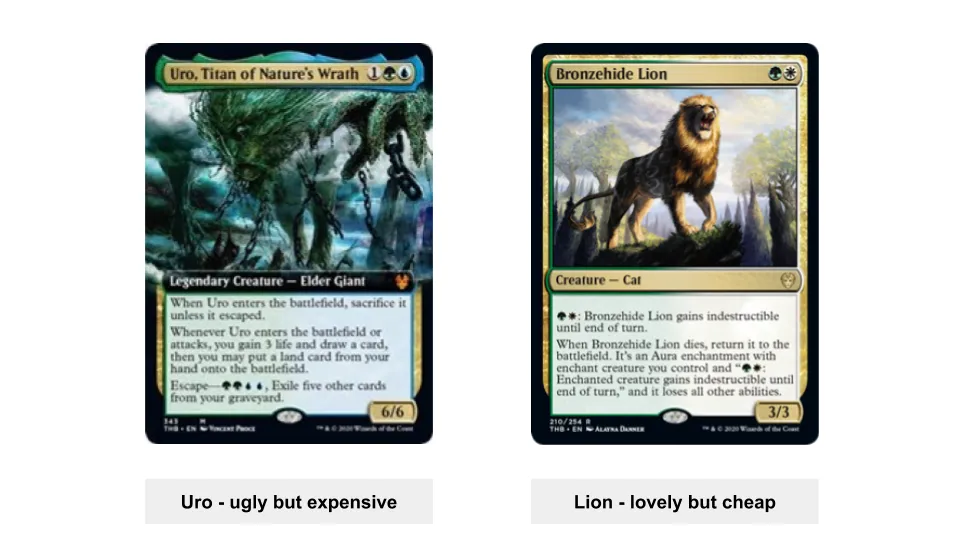
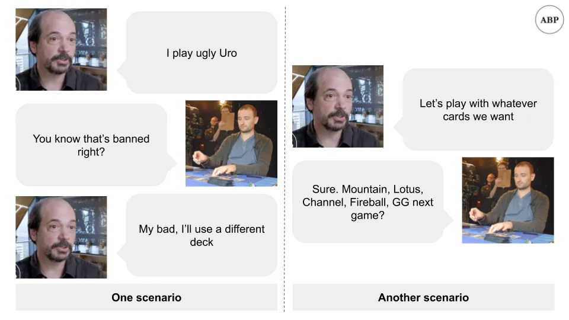
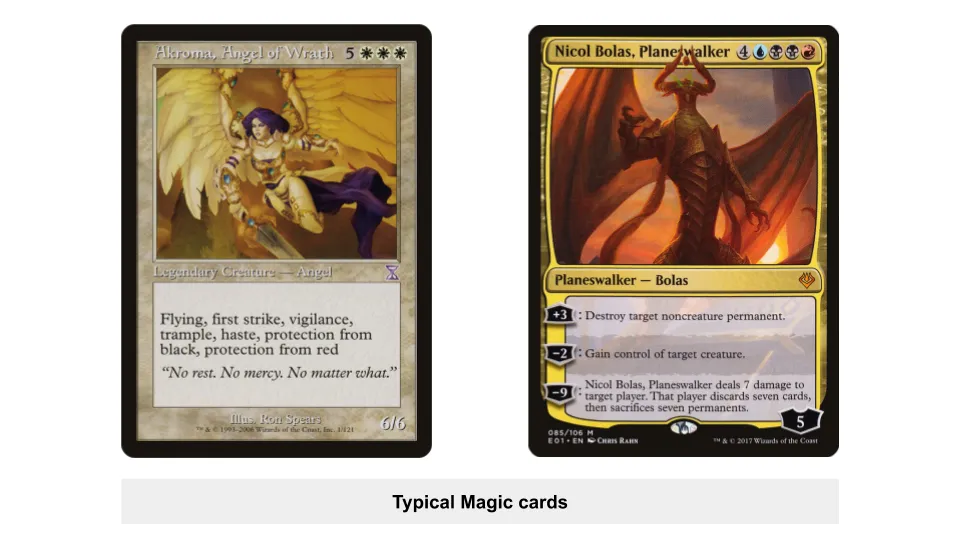
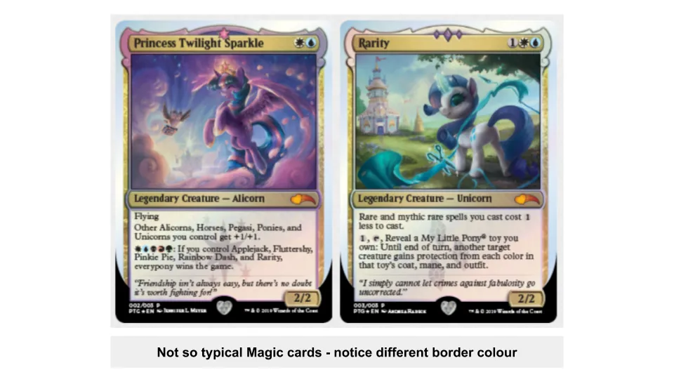
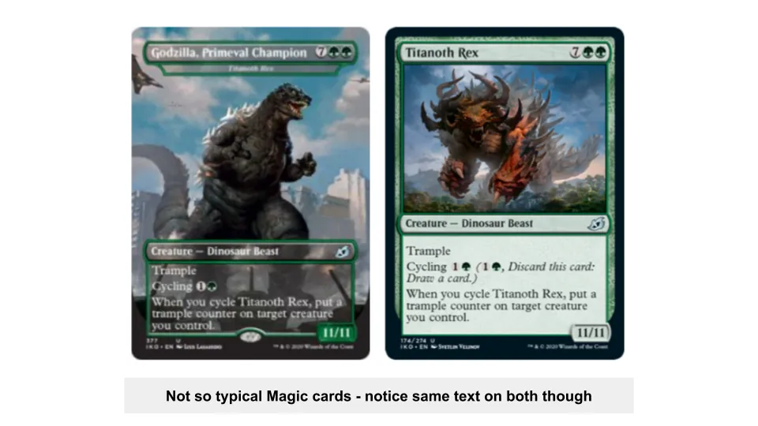
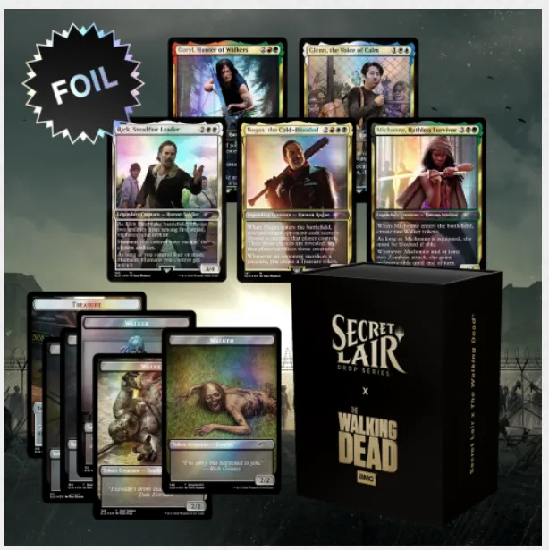
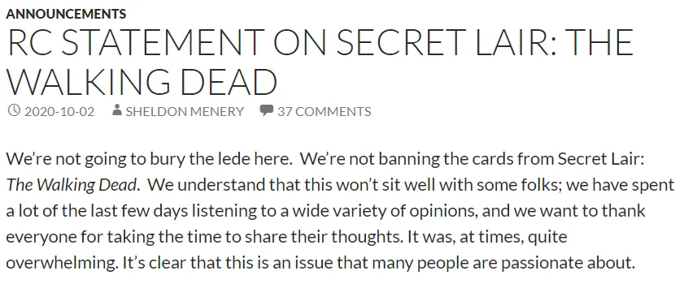
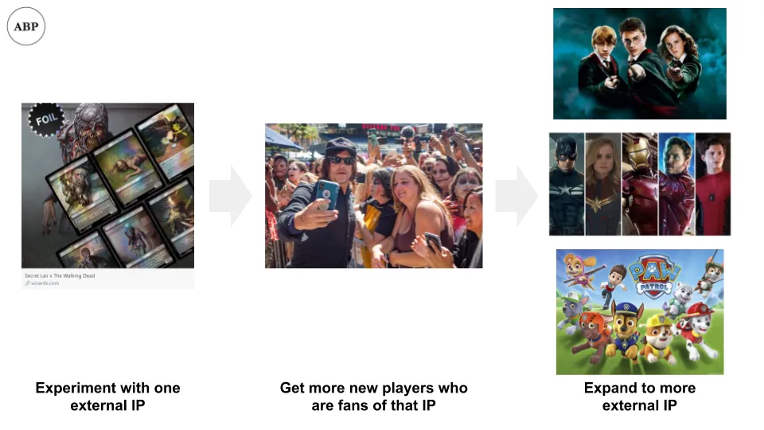

## Takeaway

Magic: The Gathering is a lucrative card game business that has run into self-inflicted controversy due to over-aggressive monetisation

## Cards, Commander, Cardboard crack

How much can cardboard cost?

If it's the card [Black Lotus](https://mtg.gamepedia.com/Black_Lotus "black") from trading card game [Magic: The Gathering,](https://en.wikipedia.org/wiki/Magic:_The_Gathering "MTG") you might be able to buy one for $27,000.

And that might even be a steal, considering a copy sold for [$166,000 at auction](https://www.ebay.com/itm/1993-Magic-The-Gathering-MTG-Alpha-Black-Lotus-R-A-BGS-9-5-GEM-MINT-PWCC-/143136537077?_trksid=p2047675.m43663.l10137&nordt=true&rt=nc&orig_cvip=true "ebay") [^1]. That's $166k for a piece of cardboard the size of a playing card.

Way back in another life I used to play a lot of Magic, the collectible card game sometimes unironically referred to as "Cardboard Crack" due to its addictive nature [^2]. I haven't followed the scene for a decade, but a current controversy caught my curiousity.

Coupled with Byrne Hobart's recent post about the importance of [games vs metagames](https://diff.substack.com/p/the-gamerarbitrageur-to-generalist? "Diff") [^3], perhaps I'm fated to write about it this month. Today we'll go over:

1. Introduction to Magic and context for the community complaints
2. What metagaming is and its relevance in Magic
3. The current controversy in "Commander," a popular Magic metagame

Let's take a look at cards, [Commander,](https://magic.wizards.com/en/content/commander-format "Commander") and [cardboard crack.](https://cardboard-crack.com/ "crack")

## 1. Intro to Magic

To understand the controversy, we need more context. Magic is a trading card game [^4], where players make a deck of cards and duel against each other. The cards have effects, and the aim is to bring down your opponent's points to zero [^5]. You take turns drawing cards, playing them, and activating their effects to achieve that goal [^6].

The cards are released on the **primary market** by [Wizards](https://magic.wizards.com/en "Wizards"), a subsidiary of publicly traded [Hasbro](https://investor.hasbro.com/investor-relations "Hasbro"). Wizards will regularly design, print, and sell new cards in a "set." Most of the cards are sold via local stores in the form of "booster packs." These packs contain random cards from the new set, meaning you don't know what you're getting before you open them [^7].

For example, you might buy a pack hoping to get rare card ["Uro, Titan of Nature's Wrath"](https://scryfall.com/card/thb/229/uro-titan-of-natures-wrath "Uro") and instead get ["Bronzehide Lion."](https://gatherer.wizards.com/Pages/Card/Details.aspx?multiverseid=476461 "Lion")

Because many people prefer purchasing a card without relying on luck, there's also a **secondary market.** Traders buy cards and re-sell them at a markup. Over time, that has even developed into essentially a [stock market for the cards](https://www.mtgstocks.com/news "MTG"), with its own club of speculators. As pointed out earlier, some of these cards can be extremely expensive.

Notably, Wizards usually doesn't sell single cards on their own, to avoid seeming [predatory.](https://mtg.gamepedia.com/Predator "predator") They could manipulate the market if they wanted, since all they have to do is print more paper. They don't normally do so, out of worry it could crater the community. For example, imagine the complaints if Wizards directly sold a good card for $500. Keep this in mind; we'll come back to this.

**Demand for the cards comes from players who want to use them** in their decks. There's both an official competitive scene with prize money, and a casual scene where people play just for fun. The popularity of cards in competitions is one driving factor for usage in casual play. For example, if Uro became popular in competitions and known as a powerful card, more people might want to use it in their decks [^8]. As with most markets, this causes the price of the card to rise.

**Another reason why a card might rise in price is due to supply** (what a [shock](https://gatherer.wizards.com/pages/card/details.aspx?name=Shock "shock")). I mentioned that Wizards will print cards in a set regularly. Sets are printed for a duration, before it's time for another set to take over. This creates scarcity for a card that might be in one set and then never appear again.

For example, a card might be in set Alpha, and then not in set Beta [^9]. The Black Lotus card from before is one such card that was [printed early on but never again,](https://mtg.gamepedia.com/Reserved_List "mtg") resulting in the high price on the secondary market.

Similar to how the sport of "running" has different "events" such as the 100m, 200m, or 400m, **the game of Magic also has [different formats](https://mtg.gamepedia.com/DCI#Tournament_formats "format")** decided by Wizards. We don't need to know the details, just that a major difference is the types of cards you can use. This usually depends on recently they were released, and whether they are "banned" or not.

For example, you might play with the most recent 8 sets and a deck of 60 cards in one format, and any possible cards in a deck of 100 in another. Because this affects how well-matched the games are, people will play decks of the same format against each other. It's considered poor form to play a different format's deck without letting your opponent know, and official tournaments state the format expected. This determines the **metagame** for that format, a concept we'll explore shortly.

The casual scene has also developed **"fan favourite" formats, the most popular being "Commander."** Again, the details of Commander don't matter, just think of it as a set of "meta" rules that people choose to follow when making their decks and playing against each other [^10]. Just like your dad might have set up house rules in Monopoly saying the oldest player gets to use the bank's money, the player community decided on rules to follow for a format.

Commander rules are governed by a community ["rules committee,"](https://mtgcommander.net/index.php/faq/ "RC") which is supposedly independent from Wizards. The committee takes into account player feedback when deciding what cards to allow in Commander, for every new set that is printed. It's usually the newer cards that cause problems, since the older cards have by definition been around longer for people to play with, and any game-breaking interactions should have been discovered.

The committee doesn't enforce the rules, since that'd be impossible for casual games, but it serves as a standard guideline that players follow. For example, it might say that "Uro" is banned. If you played a game of Commander against a random stranger and used Uro, she'd probably not want to continue. However, you could also just agree to play with any cards you want, Uro included.

We now know what Magic is - a trading card game where new cards are printed regularly, card prices are set by the market, and different format restrictions result in different metagames. Let's expand on that last concept.

## 2. Metagaming Magic

Imagine you're Wizards and creating a card. There's a [balance](https://gatherer.wizards.com/Pages/Card/Details.aspx?multiverseid=413544 "balance") that you have to strike if you want the card to be played and desirable. If you make the effects too weak, nobody will want it. If you make it too strong, everybody will use it.

For an extreme example, imagine if you made a card that said "If you draw this card, you win the game." Everyone would play it, but games would not be fun anymore.

Hence, you have to make new cards that are cool, but not so cool that they "break" the format they are played in. If you start noticing cards that appear in every deck, that's a sign you could have gone too far [^11].

The optimal decks and cards form the "metagame" of Magic formats. If you're playing competitively, you want the cards that give you the best odds of winning. Players discover these through theorycrafting and experimentation. You can't just know what cards are good, but what cards are good **for the format you're playing in [^12].**

In a balanced meta, there'll be a couple of decks that are "better" than the rest, but no single dominant one. For example, your squirrel deck might beat my goblins deck, but get beaten by a fairy deck on average.

In an unbalanced meta, there'll be just one deck that is "better" than everything else. For example, your elemental deck might have favourable odds against any other deck. When this happens, it's rational for [everyone to start playing that deck if they want to win.](https://magic.gg/news/2020-season-grand-finals-metagame-breakdown "mtg") As you can imagine, **this gets boring quickly.**

When this happens, one solution is to ban the cards that are "overly powerful." As mentioned earlier, for the official formats, Wizards will say which cards can no longer be used. For the unofficial format "Commander," the community rules committee will choose the cards. **Bans are a way to balance.**

This is where the current controversy begins.

## 3. Friendship is magic

Most of the time, the new cards printed are part of a larger Magic multiverse, being Magic IP and originally created for Magic. Magic is mostly fantasy based, leading to cards such as angels and dragons:

More recently [^13], Wizards has been doing more external partnerships. This usually involves creating a custom card based on other IP. For example, [a My Little Pony series](https://magic.wizards.com/en/articles/archive/news/magic-extra-life-2019-10-03 "pony") to raise money for charity:

Or a [Godzilla themed series as alternate art for some cards:](https://articles.starcitygames.com/news/all-19-godzilla-series-monster-cards-revealed/ "zilla")

Now, put yourself in the place of the Commander Rules Committee. When these cards are released, should you allow them in the format?

Besides aesthetic arguments [^14], the reason you can't easily say yes is that these special cards often have **special effects that can unbalance the game.** For example, that [Princess Twilight Sparkle](https://shop.tcgplayer.com/magic/ponies-the-galloping/princess-twilight-sparkle "pony") ability would make it [one powerful pony.](https://www.reddit.com/r/CompetitiveEDH/comments/dczkyh/twilight_sparkles_metarending_magic/ "pony")

Historically, Wizards avoided ambiguity by doing a few things:

1. Making special "fun" cards silver bordered. By issuing a blanket rule that silver border cards were banned for "normal" play, Wizards could print whatever they wanted without affecting the metagame
2. Making the special cards have the same effect as cards that were black bordered and "legal," just with alternate art. Since these cards are printed as part of normal sets and balanced for the game, it shouldn't have a significant effect on the metagame

**Here's the controversy.** Wizards just released a [limited edition set of new cards in partnership with TV show The Walking Dead.](https://secretlair.wizards.com/us/product/612738/secret-lair-x-the-walking-dead "dead") These unique cards are only available for some time before Wizards stops printing them. Importantly, these are black bordered ("legal"), but not available anywhere else beyond buying this box set. As you might expect, the box set is priced at a premium.

**Should these cards be legal?** Wizards' official site says:

> NOTE: These are brand-new cards, not reprints or part of a main set. Therefore, they’re not legal in Standard, but they’re perfect for Commander!

To clarify the above, Wizards is explicitly calling out the casual "Commander" format, designing cards specifically for it, and selling the cards directly at a premium price in a limited run.

You can see why this has [made many players upset, ](https://twitter.com/wizards_magic/status/1312987380115148805?s=20 "twitter") [calling for the cards to be banned immediately.](https://www.reddit.com/r/magicTCG/comments/j1glk8/petition_for_the_commander_rules_committee_to_ban/ "ban")

Hang on, you say, I thought the _Rules Committee_ decided what cards were allowed or not? Indeed, some players held out hope that the Committee would act independently, and declare the cards criminal in Commander.

[Unfortunately not.](https://mtgcommander.net/index.php/2020/10/02/rc-statement-on-secret-lair-the-walking-dead/ "dead")

You probably have some hint of the conflicting incentives here. Let's take a closer look at the [main complaints first](https://twitter.com/ghirapurigears/status/1313145100319494145?s=20 "twitter") [^15]:

**1. Card availability.** The cards will never be reprinted because of licensing issues, unlike other cards which could be reprinted in future sets. This artificially limits supply and the people that can get the cards.

**2. Blatantly predatory sales.** The cards are not "legal" in the official formats, but only the casual Commander format. If you want to use the cards, you'll have to buy them at a premium, due to the limited supply.

**3. Worry of this being the start of a trend.** People are alright with booster packs, since they realise Wizards needs to make money. However, what if Wizards started selling cards directly at high prices? If they sold a "powerful" card at $500 and never banned it, players would have to buy the card in order to stay competitive. The metagame will be ruined.

And now let's look at Wizard's rationale:

Oh wait, wrong image:

Yeah, I got nothing, it's a pretty blatant money grab. When you consider Hasbro's (parent company of Wizards) goal of [doubling Wizards revenue over the next five years,](https://investor.hasbro.com/static-files/88b2a83b-2368-463a-9489-6cf31dc209ac "wizards") no wonder the Wizards team is incentivised to explore ways of selling more cards at a higher price [^16]. Higher volume, higher prices, higher valuation multiple. If people are willing to pay $100 market price for a card, why not just print the cards and sell them directly instead of via booster packs?

Wizards could have 1) made the cards silver bordered and "illegal," or even 2) done alternate art versions of other "legal" cards. They didn't do 1) because silver border cards sell less than black border cards, and didn't do 2) for some magical reason I don't understand, but probably money

To make matters worse, the cards target the Commander format, because it's become one of, if not the [most popular format.](https://www.dicebreaker.com/categories/trading-card-game/how-to/magic-the-gathering-popular-formats "mtg") A big contributing factor to Commander's popularity? Wizards broke the metagame for "official" formats, by printing cards that were too unbalanced, making the games boring.

I don't envy the rules committee's position here. They could have banned the cards, but that would be a blatant [betrayal](https://gatherer.wizards.com/pages/card/Details.aspx?multiverseid=3633 "betrayal") of Wizards. In a worst case scenario, Wizards could have overruled them and taken back control of Commander, making it an "official" format rather than a fan one [^17].

Players haven't taken this lying down, [complaining vocally on public threads,](https://www.reddit.com/r/magicTCG/comments/j204ww/has_anyone_completely_lost_confidence_in_wotc_and/g73xmqe/?context=1 "complain") [listing demands to be met before they return to the game](https://www.reddit.com/r/magicTCG/comments/j67brt/for_those_who_are_choosing_to_no_longer_spend/ "game"), and even [creating a new format, "Captain."](https://twitter.com/PlayCaptainMTG/status/1313164508068810752?s=20 "captain") It remains to be seen if any of these will actually have an impact on the money printer that is Magic [^18].

Turns out that [selling paper is hard work.](https://www.youtube.com/watch?v=1QQBB3cwNM0 "prices") The controversy highlights a few things applicable more generally:

1. Users will understand if you monetise, but get upset if you're too aggressive. Think [a rake too far](http://abovethecrowd.com/2013/04/18/a-rake-too-far-optimal-platformpricing-strategy/ "rake")
2. The response to a mistake can be more important than trying to avoid the mistake. Think about actual apologies vs lip service
3. Community run groups that are linked to an official organisation will be forced to defer to the organisation. Think about responsibility vs authority and who actually has what

Maybe the true magic is all the friends we made along the way.

## Other resources to learn more

1. Kendra Smith wrote a great article with more MTG history on why this is controversial [here](https://www.coolstuffinc.com/a/kendrasmith-09302020-the-problem-with-the-walking-dead-secret-lair "kendra")
2. @ghirapurigears tweeted a thread with more details on the complaints [here](https://twitter.com/ghirapurigears/status/1313145100319494145?s=20 "twitter")
3. Youtuber Mitch gives a good rebuttal of other arguments Wizards made [here](https://www.youtube.com/watch?v=degV1Masii8 "commander")

[^1]: I'm simplifying for the sake of the main text, but the condition of the cards is one possible reason for that price disparity. Trading cards get graded on their state and how "used" they are by services such as [Beckett Grading Services](https://www.cardboardconnection.com/collectopedia/card-grading-companies/beckett-grading-services-bgs#:~:text=Fees%20for%20BGS%20and%20BVG,card%20for%20especially%20large%20batches. "beckett"). The $166k Lotus was in near perfect condition and from an early print run.
[^2]: There's even a webcomic named after the phrase [here](https://cardboard-crack.com/ "crack"). Also, just to be clear, I was never very good at Magic. I found Limited draft to be more fun after a few years, since even then Constructed decks were expensive for me.
[^3]: "The game is limited, and the metagame is not, but if you’re not great at the core game, knowledge about the meta is basically useless."
[^4]: It's actually the _first_ trading card game, creating the format. The original, you might say.
[^5]: This is obviously a simplified explanation, and you can read more about the rules [here](https://magic.wizards.com/en/game-info/gameplay/rules-and-formats/rules "rules"). There are different card types, some being temporary and some being permanent. Not all of them affect your opponent's points (life total) directly. As early as 2005 there were at least [28 ways to win a game of Magic](https://magic.wizards.com/en/articles/archive/arcana/let-me-count-ways-2005-08-15 "MTG")
[^6]: Unless you're playing against an eggs deck, in which case you just watch as your opponent does everything for hours and might as well [walk away while they're playing](https://www.reddit.com/r/spikes/comments/1ai0my/modern_lets_talk_about_eggs/ "eggs")
[^7]: Wizards also sells many pre-made decks, but I've left that out in the main text for simplicity. Also, I could be mistaken, and I don't think buying decks just to get one card has been a thing ever since the Jitte / Rats deck disaster, though Nexus of Fate's promo was also problematic. I haven't followed Magic for ages though.
[^8]: An actual example in this case. Uro has since [been banned](https://gamerant.com/magic-the-gathering-uro-ban/ "ban") for being too powerful. Banned from what exactly? It makes sense to ban a card from competitions, but how can you stop someone playing them in casual formats? That's a question that's related to the controversy, so read on.
[^9]: Alpha and Beta are actual sets in Magic, but it's a fake example this time. I think that any cards in Alpha were also printed in Beta, and [some new cards were actually added in Beta](https://mtg.gamepedia.com/Beta "beta")
[^10]: Some of the changes include potentially playing against more than one player, having more cards in your deck, having cards restricted to a certain type, and having a special card - your "Commander". Commander was also known as Elder Dragon Highlander, due to its origins of people playing with certain dragon cards as their commanders.
[^11]: Wizards has publicly claimed they follow a [FIRE philosophy](https://magic.wizards.com/en/articles/archive/card-preview/fire-it-2019-06-21 "mtg") - They want Magic to be fun, inviting, replayable, exciting.
[^12]: If you recall, this is similar to the [relative vs absolute skill](https://leonlins.com/writing/2020_05_07_relative_billionaire/ "relative") point I wrote about a while back. It doesn't matter if your deck is a good deck in absolute, but how it compares against the typical decks you're likely to face in competition, the "meta"
[^13]: This isn't actually the first time Wizards has done external IP, having created sets such as Arabian Nights or Three Kingdoms that are based on exactly what they're named for. I'm leaving that out in the main text for simplicity.
[^14]: Considering that [alters](https://magicalter.com/ "alter") are a thing and [harmless offering](http://www.mtgmintcard.com/articles/writers/freyalise/holistic-wisdom-10-cutest-cards-ever "harm") is a legal card, I don't find the complaint that different IPs will ruin the game as strong as the arguments that I'll detail later. It does matter to a vocal group of players though.
[^15]: There were many complaints, and I want to focus on the ones that seemed to be stronger arguments and that more people voiced their opinion on.
[^16]: h/t reddit thread [here](https://www.reddit.com/r/magicTCG/comments/j6rwjc/hasbro_goal_double_wotc_revenue_will_this_destroy/ "reddit")
[^17]: As mentioned before, there's nothing preventing players from just deciding to ignore the rules committee and ban the cards among friends. The uproar is partially due to players realising the rules committee is acting against player interests, and also ignoring the key issues by sidestepping them in their announcement.Everyone knows this is a targeted money grab
[^18]: To be clear, I'm not recommending people to short Hasbro, or anything of that nature. I don't have enough expertise to predict here, and would guess there's probably 80% chance Magic survives this and just keeps growing, expanding to multiple popular IPs. A lot of rich people willing to pay for paper.
