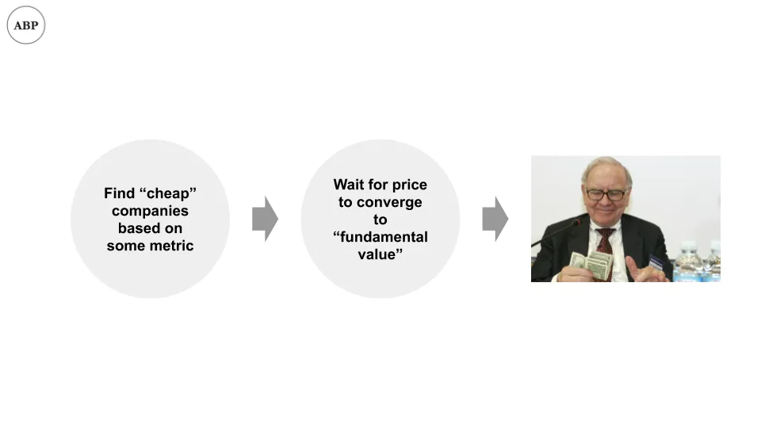
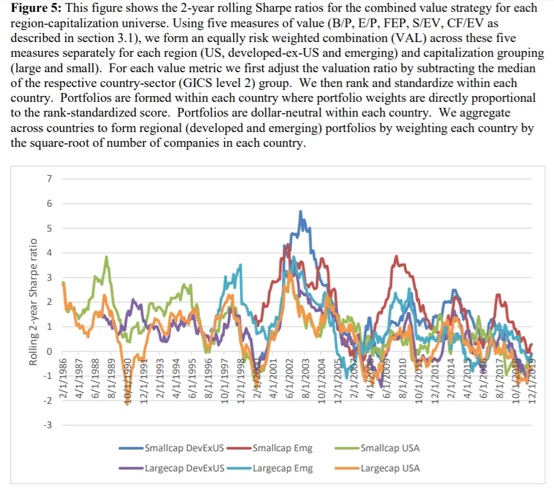
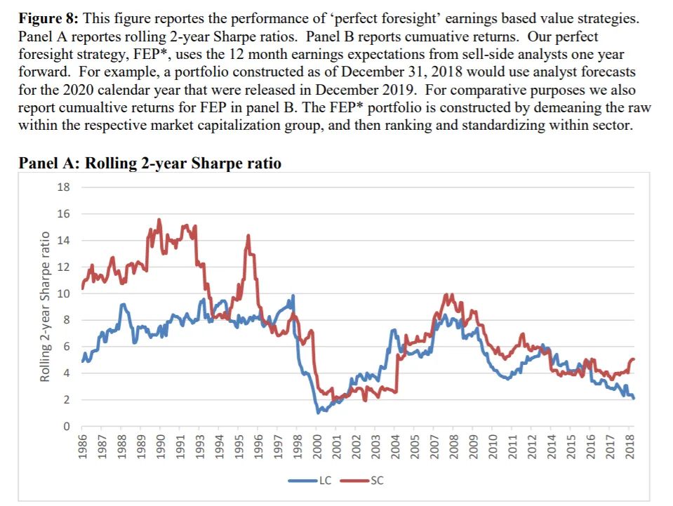

## Takeaway

AQR looks into the performance of value investing (bad), common criticisms of value investing (invalid), and comes up with their own explanation of why value investing hasn't worked (valid?)

---

## Valuations 

We've talked about [whether investment bankers add value](https://avoidboringpeople.substack.com/p/do-investment-bankers-add-value "bank") (probably?), [whether companies add value](https://avoidboringpeople.substack.com/p/do-companies-add-value "co") (less than we think), and this week we'll wrap up the value series [^1] by looking at whether value investing adds value.

The paper [Is (Systematic) Value Investing Dead?](https://papers.ssrn.com/sol3/papers.cfm?abstract_id=3554267 "paper") by Ronen Israel, Kristoffer Laursen, Scott Richardson at well-known investment firm AQR discusses whether value investing still works. This follows [an earlier paper this year](https://papers.ssrn.com/sol3/papers.cfm?abstract_id=3525096 "paper") from Fama and French, the professors who popularised value investing as an investment factor, which concluded that the return on value investing has declined in recent years [^2]. In other words, it's not good to be a value investor anymore.

The AQR paper concludes (surprisingly) that despite weak performance lately, **value investing (per their definition) isn't dead:**

> Both from a theoretical and empirical perspective, expectations of fundamental information have been and continue to be an important driver of security returns. We also address a series of critiques levelled at value investing and find them generally lacking in substance. 

The paper first defines what they mean by value investing, then addresses criticisms, and ends with how they add on criteria to value investing to make it work better. It's also 57 pages, so let's summarise it in much less than that. I'll add on thoughts along the way as usual.

## Definitions

What exactly is meant by value investing? If we mean "buy low sell high," then by definition everyone is a value investor. You don't make money by selling something for less than you bought it [^3].

If we mean "invest by some criteria that makes the company stock price look cheap," then we have a much more manageable problem to explore. 

That's why definitions are important. If your "later" in "I'm doing the dishes later" meant two weeks from now vs their "later tonight," you're going to have problems. 

To begin then, we need to define what is meant by "value", and then use that definition to sort stocks into "good value / cheap" and "bad value / expensive."

Fama and French first popularised the concept of "value" as an investment factor in their [1992 paper](https://rady.ucsd.edu/faculty/directory/valkanov/pub/classes/mfe/docs/fama_french_jfe_1993.pdf "paper"). By "value," they meant some calculable metric for a company that could be used to rank them. The original paper used the company's "book value" to "market value" as the metric, by calculating the ratio between the accounting number book equity value and the company's publicly traded stock equity value [^4]. If the ratio was low (low book vs stock price), the company was cheap.

Over time, the ratios used have expanded to include other commonly used metrics. The AQR paper uses five as their definition of value: 

1. Book to price, what we just mentioned
2. Earnings to price i.e. net income over market cap
3. Forward earnings to price, i.e. sellside research analyst predicted future earnings over market cap
4. Sales to enterprise value. It's beyond the scope of this article to discuss the difference between enterprise and equity value; just treat them as the same if you're unfamiliar [^5]
5. Cash flow to enterprise value

If all of that flew over your head, that's alright. Just think of it as AQR coming up with five ways of measuring whether a stock is cheap or not based on publicly available, relatively objective numbers. We need this in order to do value investing systematically based on those criteria. If not, there's no way of judging whether "value" works - what you say is cheap could be expensive to me [^6].

**The general idea then is to invest in "cheap" companies, and profit when they become less cheap because prices converge to what the company "should" be worth.**

Sounds like it should work right? Well, let's see. 

## Criticisms

What they find is:

> Over the full sample period systematic value strategies generated positive risk adjusted returns. However, the last decade has seen a marked reduction in the performance of systematic value strategies

You can see this in their graph where they present Sharpe ratios for all their different value strategies over time. For those unfamiliar with Sharpe ratios, just think of them as "excess return," the higher the better. Notice how in the graph below past 2011, **all the returns go down and stay low. That's bad.**

Why is this happening? The AQR team looks at five common criticisms of such a "systematic value investing" strategy that could explain this. They end up rejecting most of these criticisms, and proposing their own explanation.

Criticism #1 is regarding one of the "value metrics," Book to Price. People have said for a while that this particular measure is outdated, and AQR generally agrees. I'll skip over the regression math [^7]; the summary is that **Book to Price doesn't work well,** especially if you include Earnings to Price as a factor. However, AQR also adds on: 

> What does this mean for asset owners and asset managers interested in harvesting returns from value strategies? Focusing on just one fundamental anchor for intrinsic value is unlikely to be a successful strategy. Instead, ensure a multitude of fundamental measures are utilized to compare against price

> You need to expand your horizons when it comes to measuring value. Book value is not the only fundamental anchor for price

I suppose that's justifiable, though I do have a quibble with just brushing aside adding measures and "expanding horizons" as something uncontroversial. If we're ok adding any fundamental anchor, we'd end up back where we started, trying to define what value investing means. Someone could add a "user views to headcount" measure and claim that was a "value" measure.

Criticism #2 is regarding how companies are doing more share repurchases lately, which could cause the metrics to be faulty and value investing to stop working. AQR finds that **the amount of share repurchases hasn't had a significant effect on the performance of value:** 

> Turning to the performance of value portfolios across share repurchase intensity partitions we see only mixed evidence of value working less well for the ‘High’ share repurchase sub-sample. 

Note that they're not saying that value investing does well with low share repurchases, they're just saying that share repurchases don't seem to matter either way.

Criticism #3 is how companies have more intangible asset value such as brand power, and that's underreported in conventional balance sheets. For example, Disney has a strong brand, and that's not in accounting numbers but in the stock price. If this is the case, then using any financial metric could be faulty.

AQR borrows a process from Credit Suisse to adjust for all these effects. I'll skip the details [^8], but they conclude that **such intangibles don't seem to explain value's performance either:**

> the recent under-performance of value strategies extends to value measures that attempt to correct for deficiencies in the financial reporting system. It appears unlikely that the growing importance of intangibles or changes in business models is explaining the underperformance of value strategies.

Criticism #4 is how the low rate environment has made value investing less attractive. This time, AQR finds that **low interest rates do have an effect on value, though they claim it's a weak one:** 

> There is, however, some evidence that the performance of value strategies is positively related with changes in the slope of the yield curve for both US and international stocks (i.e., value stocks do poorly when the yield curve flattens) \[...\] this relation is weak and explains only a very modest portion of returns

For those unfamiliar with yield curves, think of them as the interest rates bonds pay. AQR makes the additional point that if you could predict the yield curve as implied in the above, you'd be better of just investing in bonds directly rather than stocks:

> And wouldn’t it make sense to trade bonds directly if you had the skill to forecast changes in the shape of the yield curve?

I'm less sure I agree with both of these. There's plenty of reasons why people stick in equities - it's a more fashionable sector and more "prestigious" and more common to get into. Also, as I've written about before, [low rates imply people should take more risk](https://avoidboringpeople.substack.com/p/cost-of-capital-in-the-21st-century "risk"), and value investing by its nature implies less risk.

Criticism #5 is that too many people know about value investing, and hence it's become "crowded," driving down returns. **AQR disagrees that value investing has become crowded** (more popular as an investing strategy) and says the evidence is the opposite: 

> if it was the case that everyone was aware, and substantial capital had been deployed, a natural outcome would be a significant compression in ‘value spreads’. That is, cheaper stocks would appear less cheap today relative to more expensive stocks \[...\] If anything, value spreads have widened in recent years making crowding an unlikely explanation for the recent drawdown.

This ties with anecdotal evidence - well known "value" investors have been in the news the last few years for performing poorly. If so, more and more of their limited partners would have started withdrawing capital from them, causing even less capital to be deployed to "value" in the short term. Usually you'd get people coming in to exploit this "cheapness," but sometimes you don't. 

## Additions

Which brings us to AQR's conclusion, of what they think is causing the poor performance of "value investing" lately:

> When value underperforms the most, it is due to a combination of deterioration in fundamentals of cheap stocks (but not too much greater than normal) and a widening in the gap between prices and fundamentals (but considerably more so than average).

Recall back to our simple model of how value investing could work. If 1) your metric is pricing everything fairly already, or 2) prices never converge to fundamental value, the investing strategy is going to fail. 

AQRs work above claims that (1) isn't true, and that it's (2) that's the cause. In other words, there's currently an extended period of time where prices move without relation to fundamental information: 

> Consistent with the earlier results, fundamentals do matter for stock returns, but there are periods where stock prices become less connected with fundamental information, and in such periods value strategies under-perform. This has happened before, is happening now, and will likely happen again. 

They prove this out by making investment portfolios based on "perfect information," by taking sellside research predictions "early in advance" and using that to create portfolios "backward looking" i.e. use an estimate made in 2019 (when 2018 is already known) to make a portfolio in 2018. 

Since they're using "perfect information," the portfolio performs well - If you knew company earnings reports ahead of time, you'd make money on average [^9]. Now the interesting question is, how much extra money would you make, and how would that change over time? AQR finds that this "excess return" has also decreased in recent years, implying that fundamental earnings information is less relevant recently. Note how the graph below trends down since 2007:

It's not a terribly satisfying explanation, since it's the equivalent of saying "less people believe in the importance of value, therefore it works less." However, there's a sizeable portion of truth in that. Recall the earlier article about [stories and stocks](https://avoidboringpeople.substack.com/p/a-story-is-a-lie-and-a-story-is-true "story"), in which I argue the importance of stories. If people as a whole have decided that "growth" is what matters more, that has a self-reinforcing feedback loop in the markets. This typically takes an economic cycle to correct, but we haven't quite seen one yet.

[^1] I would like to say this was planned from the start of this month, but it was a coincidence.
[^2] I'm simplifying in the main text here, they actually say that although the return has declined in the latter half of the July 1963-June 2019 period, [there's not enough data yet to conclude if value investing as an investment factor works or not.](https://www.institutionalinvestor.com/article/b1k3pd2z3ptx9g/Ken-French-There-Is-No-Way-to-Tell-If-Value-Premium-Is-Disappearing "ii") Note I'm using investment factor here as something specific, i.e. a filterable criteria to weight an investment portfolio by, as mentioned later in the main text.
[^3] Don't @ me with some contrived hedged insurance strategy when you know the point I'm making here.
[^4] People also use the reverse, of [price to book](https://en.wikipedia.org/wiki/P/B_ratio "pb"). See the link for details on the calculations.
[^5] "EV is computed as the sum of total equity market capitalization, preferred stock, minority interest and total debt. The latter three components are based on reported book values, not market values, as it is difficult to get reliable market data for these items for our global sample of firms (and the differences between book and market value is likely to be small for most firms)"
[^6] This doesn't totally resolve the problem of course, and is why so many people still argue about definitions and measurements today. It's one way of making the problem statement easier to explore though so we'll stick with it for lack of better alternatives.
[^7] The details are on pdf pg 16. "If you limit the sample to just the largest stocks, and focus on simple sort portfolios, then B/P is not significant in the presence of E/P."
[^8] Pdf pg 24. If you're familiar with Michael Mauboussin, the adjustments of CS HOLT are related to his work. "For this purpose, we use data from Credit Suisse HOLT. Specifically, HOLT constructs an inflation-adjusted gross cash flow which is computed as net income adjusted for special items, depreciation & amortization, interest expense, rental expense, minority interest, and various other proprietary economic adjustments (CF HOLT). 
[^9] Funnily though, you won't make money all the time. There was a case of people hacking the SEC for early earnings information, so they had 100% perfect info, but they only made money ~70% of the time I think.