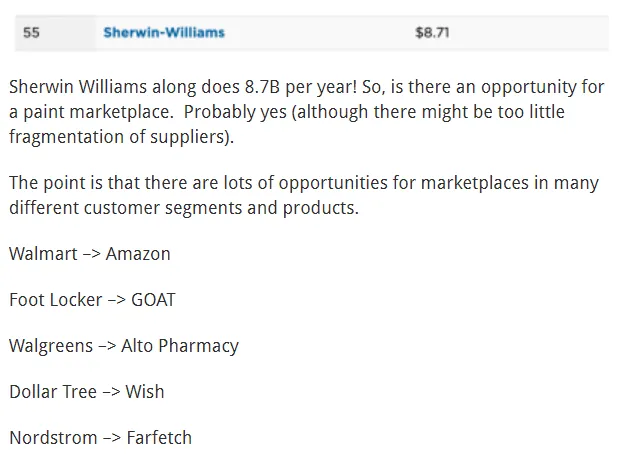
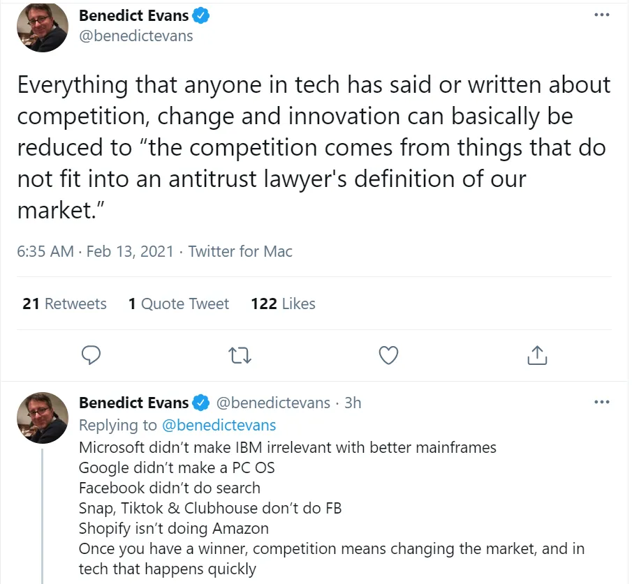
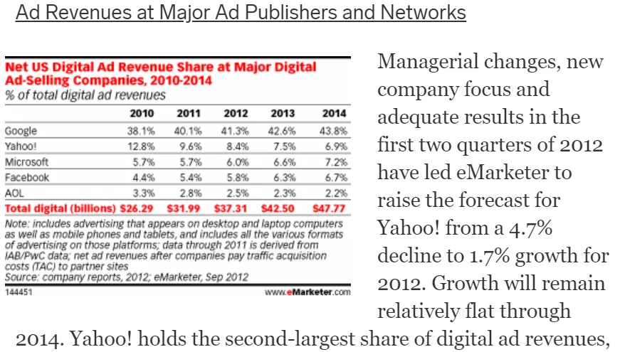

## Takeaway

Natural monopolies are rare, and regulation usually hurts more than helps in fixing that

## Winner takes all?

Josh Breinlinger, a VC at Turtle Ventures, has a short post on his site about [how most marketplaces are not "winner takes all":](https://acrowdedspace.com/post/642666403989684224/winner-take-all-or-not "win")

I'm inclined to agree. We hear about "winner takes all" all the time. Which begs the question, why aren't there more monopolies?

"But wait, aren't there tons of monopolies?"

As defined by having a single player with all the share - I'm not sure there are?

As defined by having a few players with a lot of the share - Sure, but aren't we significantly changing the definition then?

"That's just semantics, by monopoly everyone knows we actually mean more than one player, with less than all the market, but some larger number"

Alright, let's use that definition, or something like the US Federal Trade Commission's one of a firm ["with significant and durable market power"](https://www.ftc.gov/tips-advice/competition-guidance/guide-antitrust-laws/single-firm-conduct/monopolization-defined "monopoly") [^1]. Monopoly - [I know it when I see it](https://en.wikipedia.org/wiki/I_know_it_when_I_see_it "wiki").

The problem with having vague definitions is that it leads to different assumptions and hence different conclusions. What's obviously right to you is obviously wrong to someone else. If you can't even agree on what the problem is, how do you go about fixing it?

Here's Ben Evans on the subject:

The harder it is to get started, the easier it is for incumbent businesses to grow and keep market share.

Historically, physical barriers were the main constraint. Getting into railroads? Well you'll have to lay tracks. Getting into shipping? You'll need boats. In the medieval times and trying to establish a trade route? You'll need carriages and mercenaries and [maps](https://www.visualcapitalist.com/medieval-trade-route-map/ "map").

Much of that has been abstracted away these days, like our discussion of [abstraction in computing](https://leonlins.com/writing/2021_01_30_plaid/ "abstract"). Many companies can take the physical layer for granted, and scale more quickly at lower cost.

What has not changed is regulatory barriers. We've overcome nature, but have not overcome man. Nor do I believe that we will, since rules will always be a part of society.

I was looking up examples of monopoly, and came across the [Open Markets Institute,](https://www.openmarketsinstitute.org/learn/monopoly-by-the-numbers "omi") which works to "expose the dangers of monopolisation." Here's some of the monopolies on [their list:](https://www.openmarketsinstitute.org/learn/monopoly-by-the-numbers "monopoly")

1. Pharmaceutical companies
2. Alcohol
3. Eyeglasses
4. Internet advertising
5. Books

Pharma, Alcohol, and Eyeglasses are all highly regulated industries, which doesn't help competition getting started.

For advertising, we all say that the top companies have an insurmountable lead now, but if we'd said that of the top 5 companies a decade ago [we'd have been wrong on 3 out of 5 names.](https://www.emarketer.com/Article/US-Digital-Ad-Spending-Top-37-Billion-2012-Market-Consolidates/1009362 "ad") I think it's too difficult to say that the "monopolies" now will be the same ones in the future.

There's likely a stronger counterargument for online book sales. But then again, that's not the only way to buy books. On first thought this seems like the world of physics coming into play again - limited space for unlimited content.

My point today isn't that regulation is bad - we'd still have child labour if not. However, all of the issues faced are complex, and regulating without clear guidelines and knowledge more often harms rather than helps. Regulation is needed, but by people who understand the complexities, not [wonder how Facebook makes money](https://www.youtube.com/watch?v=n2H8wx1aBiQ "ads").

To give a more concrete example, consider GDPR, a data privacy regulation in Europe, and the cause of all those annoying cookie notifications when browsing the web now. Data privacy is a good concept and more can be done there.

The biggest beneficiaries of GDPR?

[Google and Facebook.](https://www.wsj.com/articles/gdpr-has-been-a-boon-for-google-and-facebook-11560789219 "goog")

The biggest losers?

Small businesses that can't afford the legal costs of complying with regulation. Plus you, me, and everyone else that now has to deal with popups.

We need to both understand the problem, and then come up with solutions on dealing with it. Right now, I think too many people have skipped to solutions, without first defining what they actually believe the problem to be. And if we don't agree on that, no wonder we have such bad outcomes.

[^1]: I believe that in practice, it's been hard to pursue monopoly cases with <50% market share, so people have been using that as a benchmark.
