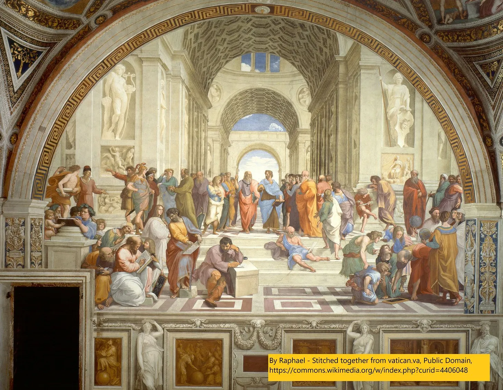
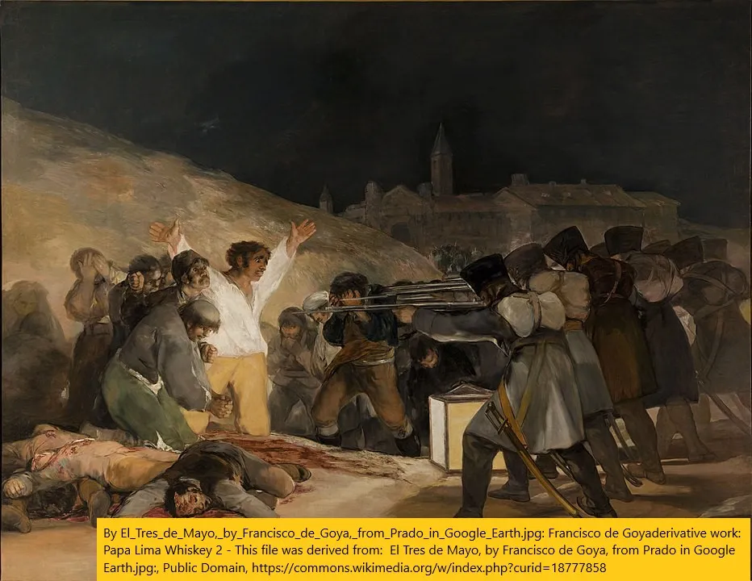
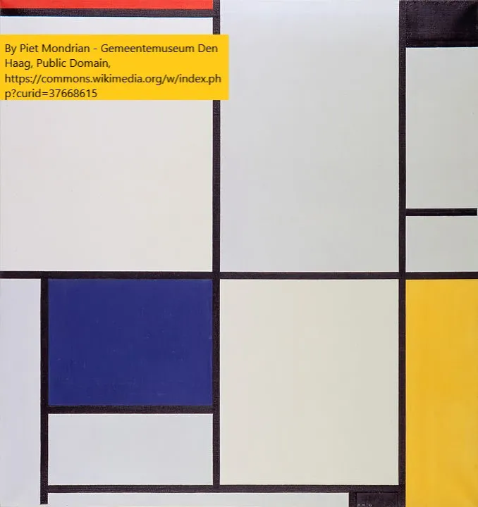
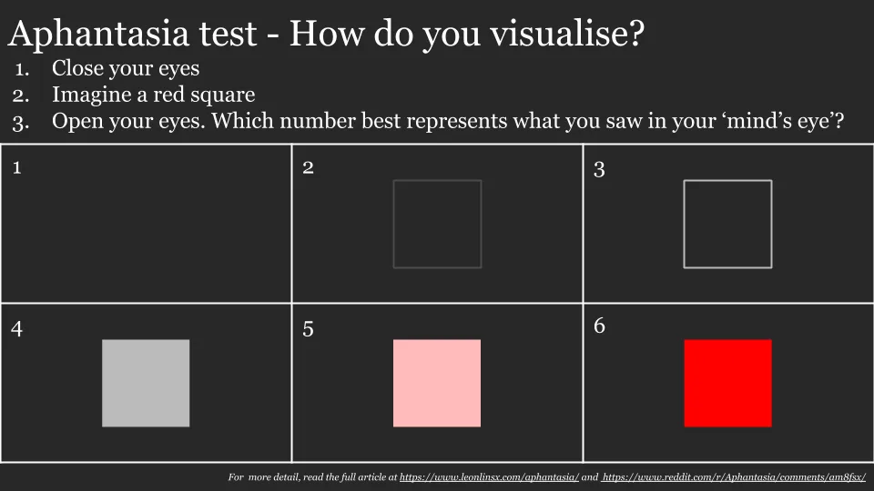
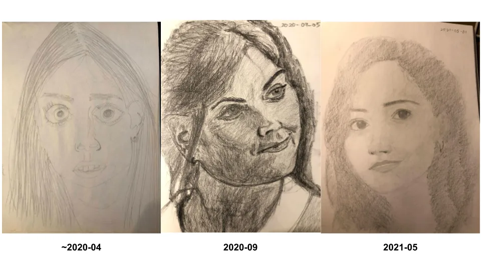

I started learning art history a while ago, to better understand what I was looking at in museums. That turned into learning how to draw, to better appreciate art history. With the recent non-fungible tokens (NFTs) trend, I wanted to share what I learnt about art today, and then discuss NFTs in a follow up post [^1].

## 1. What is pure art?

I've been primarily using [smarthistory](https://smarthistory.org/ 'smart') to learn art history, though the video that kick started my journey was [this MoMa one on how to paint like Picasso](https://www.youtube.com/watch?v=rGZYfSzvPvs&list=PLfYVzk0sNiGEZXlIltPP7Yy_s5gTM7hf8 'moma').

I've also touched on art history before with articles on [Picasso](https://leonlins.com/writing/2020_04_08_picasso/ 'picasso') and [Manet](https://leonlins.com/writing/2020_12_09_art/ 'manet') if you want to check those out.

**The most important thing I learnt about art history is to be open-minded.**

Here's what I mean:

Suppose someone were to come to you and say, "I'm sick of the fake art of today, I want to see real, pure art."

What would you show them?

Perhaps you would show them [The School of Athens,](https://en.wikipedia.org/wiki/The_School_of_Athens 'school') a painting by Raphael during the height of the Italian Renaissance in the 1500s. With its realistic portrayal of famous philosophers and use of [linear perspective](<https://en.wikipedia.org/wiki/Perspective_(graphical)> 'perspective') to make things look 3D, the famous fresco is seen as a masterpiece epitomising the Renaissance.

Or perhaps you'd reject historical subjects, thinking that art shouldn't need to have a moral lesson attached. Instead, you show a 1800s painting by Dominique Ingres that's pure pleasure and fantasy, claiming that real art doesn't have to be realistic. [La Grand Odalisque looks realistic on first glance, but taking a closer look shows that the spine is weirdly long, and the back leg is attached at a weird angle.](https://en.wikipedia.org/wiki/Grande_Odalisque 'wiki')

You might say that pleasure is superficial, and it's purer to commemorate modern suffering, such as in Goya's 1800s [The Third of May](https://en.wikipedia.org/wiki/The_Third_of_May_1808 'may'). It's less realistic than the works earlier, with the figures being flatter and less finished. It's also no longer make-believe, since it depicts an actual tragedy during Goya's time [^2]. It was such a departure from previous tradition it's been called "one of the first paintings of the modern era."

But why limit painting to showing just one snapshot in time? What if instead you saw an object from all sorts of angles, and tried to put that down onto the flat canvas? Think Matrix bullet time, but as a painting; wouldn't that be more true to the object? Showing a cubist piece like Picasso's 1900s [Girl with a Mandolin](https://www.pablopicasso.org/girl-with-mandolin.jsp 'girl') would be a good choice then, with its attempt at showing a 3D someone from multiple points of views on a 2D surface.

And you could say all of the above is pretentious, and that art is just colours and lines on canvas. Showing a 1900s Mondrian makes the point that we shouldn't deceive ourselves with realism. Pure art is platonic shapes [^3].

I could go on; there's as many art movements as there are cryptocurrencies. The main point I want to make though is that art is subjective, and keeping an open mind is essential. Discussing whether something is art or not is one of those unanswerable philosophical questions.

Many new movements were criticised during their time, only to become inspiration for generations of artists after [^4]. For many artists, pushing the boundary is the point.

It's ok to not like something - I still don't get most contemporary art. But to dismiss something just because you don't like it will limit your understanding of the world. And that's no fun.

## 2. Being flexible in art

I also started learning to draw last year for a couple of reasons:

- As part of my neverending quest to stop getting stereotyped [^5]
- To better appreciate how artists were creating their work, and distinguish between skill and bullshit
- I was thinking about skills that I could work on for a long time, and ones I could continue into old age
- Add to my toolbox of ways to communicate and express myself

I started with [draw a box](https://drawabox.com/ 'draw'), and then moved on to [New Masters Academy](https://www.nma.art/ 'nma'), which I'm still using [^6]. I mainly work with pencil and fountain pen [^7].

As a sidenote, if [aphantasia is real](https://leonlins.com/writing/2019_07_31_aphantasia/ 'abp'), I probably have it, seeing as I'm a 3-4 on the below test. It hasn't been a hurdle when drawing from reference, though it might be one when drawing from imagination.

Roughly a year of daily practice and 600 pieces of paper later [^8], here's a progress pic. And yes, they're meant to be the same person:

And here's what I've learnt along the way:

**Drawing is a skill,** and talent is overrated. I have no talent, as can be seen in that first pic. But regular practice will deliver results, and you can slowly get better over time. Talent helps, but it's not the only factor.

**You're drawing, not copying.** The drawing will stand alone after you're done, since people won't see the reference. You can and should make any changes you want for a more interesting piece. It's made me less interested in hyper realistic pieces; why not just take a photograph [^9].

**You learn tools, not rules.** The lessons teach you ways of doing things, but not the only way of doing things.

**Small things make a big difference.** Drawing in pencil is distinct from drawing in pen (try it!). Small markings on a portrait can change how the entire drawing feels.

**Rushing ruins the work.** Every time I tried to rush through a piece, it turned out bad. The better pieces I've done were all patiently built up in layers, though taking a long time doesn't guarantee quality. And it usually requires multiple sketches before producing a good piece.

As intimidating as it was, I'm glad I picked up drawing. I may not ever be an expert, but it's a lot of fun [^10]! And we could all use more fun things to learn.

## Other

1. ["San Francisco bans affordable housing"](https://johnhcochrane.blogspot.com/2021/04/san-francisco-bans-affordable-housing.html 'jc')
2. ["What I talk about when I talk about Chinese tech"](https://lillianli.substack.com/p/what-i-talk-about-when-i-talk-about 'll')
3. [Best practices for writing SQL queries](https://www.metabase.com/learn/building-analytics/sql-templates/sql-best-practices 'sql'). It's partially an ad for metabase but some good tips there
4. [Angel investing, beginner's reading list](https://alltheangels.substack.com/p/-angel-investing-beginners-reading 'angel')
5. [How the BBC makes Planet Earth look like a Hollywood movie](https://www.youtube.com/watch?v=qAOKOJhzYXk 'yt'), youtube

[^1]: Yes, I missed my deadline to get everything done in one post. In my defense, I've been busy snacking.

[^2]: The painting shows the French retaliation against a Spanish rebellion

[^3]: As in, Mondrian's thinking that we should just look and enjoy the lines, colour, and shapes as they are, because that's the essence of what drawing is. Pretending to make things lifelike is fakery

[^4]: Dominique Ingres, Monet, Picasso were all controversial. Maybe art is about controversy...

[^5]: To mixed success, tbh.

[^6]: I used [quickposes](https://quickposes.com/ 'qp') to practice gesture as well

[^7]: I use a range of Staedtler Mars Lumograph from 3H to 8B (though I don't use darks as often), a kneaded eraser, a stump, and a fine tip Pilot Metropolitan. I did the drawabox exercises in pencil, though you're supposed to use a felt pen; I just like pencil better.

[^8]: I mainly practiced in a 200 page sketchbook, and went through 3 of those plus a bit more. For those that are really interested for some reason [here's a link](https://drive.google.com/drive/folders/1JuCf-pNB8amh2xsFSYmXyuNWUd5oBv8j?usp=sharing 'link') to all the sketches I've done. The pages are out of order though as I had difficulties while scanning them in. When I say daily practice, there were days when I spent 10 seconds drawing something, and other days when I spent hours.

[^9]: You can appreciate the skill of something while not liking it as much as before.

[^10]: Slight correlation with how I can now doodle while on boring meetings.
