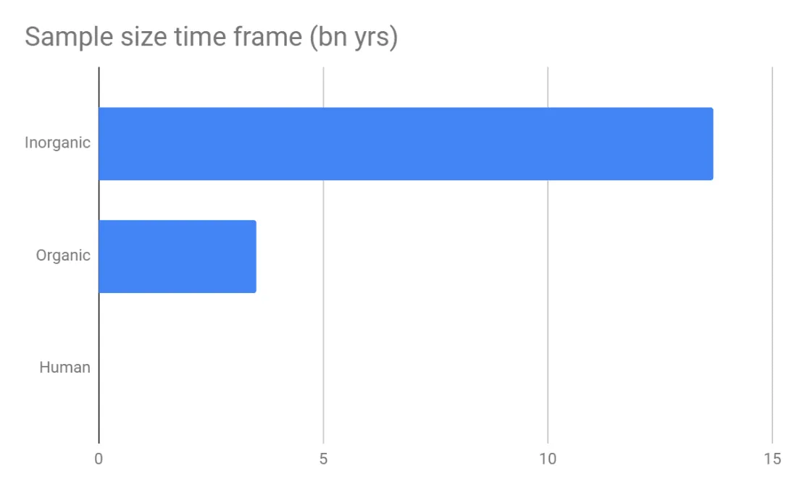

Una vez leí sobre una persona tan centrada en la eficiencia que pulsaba el mismo número en el microondas para ahorrar tiempo en calentar su comida\, por ejemplo 1\:11\, 2\:22\, 3\:33\. Mi primer pensamiento fue \'wow\, aquí hay alguien realmente intenso\, no me extraña que se adelanten y yo me esté quedando atrás en la vida\'\. Mi siguiente pensamiento fue \'espera\, este hábito no tiene sentido\' [^1]\. Y\, sin embargo\, ahora fue citado como un rasgo positivo por el autor del artículo\. Es casi como si el autor quisiera que fuera cierto\, queriendo creer que la acción estaba calculada\.

Tras el incendio de Notre Dame\, se difundió la noticia de que los bomberos priorizaban salvar los restos sobre las estructuras de madera\, [since oak trees from Versailles were intended as replacements](https://medium.com/the-long-now-foundation/long-now-lessons-from-notre-dame-925d27441bdc 'long now')\.

Como muestra el enlace\, había poca base sustantiva detrás de esto\. Pero la gente quería que fuera cierto\, quería creer que la acción fue deliberada\.

Tenemos un fuerte instinto de creer en las narrativas [^2]\, falsa o no\. A todos nos gusta la historia de cómo cada acción tiene significado y cómo esa única cosa cambió la historia\, pero rara vez es así\. Nuestras acciones tienen consecuencias\, pero rara vez las consecuencias exactas que queremos\. No digo que evitemos anécdotas\, sino que tengamos cuidado al leer una historia\. [The success story of another might not be applicable to you.](https://ofdollarsanddata.com/the-problem-with-most-financial-advice/ 'financial advice')

La economía es un campo en el que las narrativas también juegan un papel fundamental\, lo que lo convierte [complicated to assess policy impact](https://www.bloomberg.com/opinion/articles/2019-04-23/modern-monetary-theory-austrian-economics-deserve-skepticism 'skepticism')\. Por ejemplo\, el salario mínimo o las prácticas no remuneradas\. [Cochrane cites a few studies with some concerning findings when raising the minimum wage:](https://johnhcochrane.blogspot.com/2019/04/meer-on-minimum-wage.html 'cochrane')

> Cuando se sube el salario mínimo\, los empleadores compensan el aumento de los costes laborales reduciendo beneficios como la generosidad del seguro médico\.

> Cuando el debate se centra en el número total de empleos perdidos o ganados\, oculta esta posible desagradable distribución de los beneficios\: un recién graduado universitario con un trabajo de barista puede ganar unos cuantos dólares más la hora\, pero el que ha abandonado el instituto encuentra más difícil conseguir y mantener un empleo

> Los trabajos mal pagados no son fáciles\, no pagan bien y rara vez son divertidos\. Pero no poder encontrar trabajo en absoluto es mucho peor\.

Y en la misma sección de comentarios\, un lector cita estudios opuestos que apoyan subir el salario mínimo\. La mayoría de la gente elegirá su versión y se mantendrá firme\, ya que es más sencillo ser coherente y confirmar tus sesgos\. Creo que esto funciona para algunos temas\, pero para muchos otros deberíamos intentar entender ambos lados del argumento\, que pueden ser ciertos en diferentes escenarios\. Pero nadie quiere oír \'bueno\, depende\; subir el salario mínimo podría ayudar en este estado pero no en el otro\' [^3]\. Te pagan para tomar partido\.

La gente ya está tomando partido en la tendencia de los acuerdos de reparto de ingresos\, viéndola como una redescubierta de la esclavitud o una alineación transformadora de incentivos\. Se han asentado en dos narrativas a pesar de que probablemente han oído hablar del concepto hace poco\. [This post](https://medium.com/@eriktorenberg_/life-capital-9e5028c0ea12 'life capital') analiza esta nueva tendencia en la educación\, popularizada por la escuela Lambda\:

> Un Acuerdo de Participación en la Renta es un acuerdo financiero en el que una persona u organización proporciona algo de valor a un beneficiario que\, a cambio\, acepta devolver un porcentaje de sus ingresos durante un determinado periodo de tiempo

> Lambda solo cobra si y solo si el estudiante gana una cantidad determinada tras graduarse\. En otras palabras\, los incentivos están alineados\.

> Se han probado ISAs y otros casos relacionados de titulización del capital humano\.

> Purdue comercializa su oferta ISA como una alternativa a los préstamos estudiantiles privados y los préstamos Parent PLUS\. Los estudiantes de cualquier carrera pueden obtener 10\.000 dólares anuales en financiación ISA a tasas que varían entre el 1\,73\% y el 5\,00\% de sus ingresos mensuales\.

> Hay tres temas principales en particular que nos entusiasman para el futuro de los ISA\: la agregación\, las estructuras novedosas de incentivos y las criptomonedas\.

Parece que nuestra narrativa sobre la educación superior podría cambiar\. Aún no tengo una opinión firme [^4] Pero parece ser una tendencia positiva\. No creo que nadie se esté obligando a asistir a Lambda\, y la tasa de inserción laboral parece alentadora\. Aunque creo que la universidad no debería ser solo para conseguir un trabajo\.\.\.

¿En qué podemos creer entonces\? ¿Qué es más probable que resista el paso del tiempo\? Peter Kaufman escribió sobre tres cubos que utiliza para encontrar principios que perduran\. Jana Vembunarayanan lo analiza [here](https://janav.files.wordpress.com/2016/07/threebucketframework.pdf 'jana on kaufman') [^5] \. Hay bastantes ejemplos en el artículo de Jana que rechazaría\, pero a continuación hay algunas ideas interesantes\:

> Todo estadístico sabe que un tamaño de muestra grande y relevante es su mejor aliado\. ¿Cuáles son los tres tamaños de muestra más grandes y relevantes para identificar principios universales\? El cubo número uno son los sistemas inorgánicos\, que tienen 13\.700 millones de años\. Son todas las leyes de las matemáticas y la física\, todo el universo físico\. El cubo número dos son los sistemas orgánicos\, 3\.500 millones de años de biología en la Tierra\. Y el cubo número tres es la historia humana\, tú puedes elegir tu propio número\, yo elegí 20\.000 años de comportamiento humano registrado\. Esos son los tres tamaños de muestra más grandes a los que podemos acceder y los más relevantes\.

> Una de las mejores cosas que podemos hacer por los estudiantes es ayudarles a desarrollar mentalidades matemáticas\, en las que crean que las matemáticas se tratan de pensar\, de dar sentido\, de grandes ideas y de conectar\, no de memorizar métodos\.

> Buffett se centró tanto en el conocimiento \(lo que sabes\) como en las habilidades \(lo que haces\)\. La bidireccionalidad de las habilidades del conocimiento \\\<\-\\\> enriqueció sus representaciones mentales\. Por eso es uno de los mejores inversores del mundo\.

> No construyes representaciones mentales pensando en algo\; las construyes intentando hacer algo\, fallando\, revisando y volviendo a intentarlo\, una y otra vez\. Cuando terminas\, no solo has desarrollado una representación mental efectiva de la habilidad que estabas desarrollando\, sino que también has absorbido mucha información relacionada con esa habilidad\.

La gravedad estará presente durante un tiempo [^6]\, igual que nuestra necesidad de comer y nuestra necesidad de interacción social\. Los principios físicos y biológicos probablemente sean más fáciles de identificar\, pero creo que el tamaño de la muestra social es la parte difícil\. Los humanos actúan racionalmente\.\.\. hasta que no lo hacen\. Si tienes ejemplos de principios sociales que te han sorprendido\, házmelo saber\.

Estoy de acuerdo con el punto de Jana sobre intentar en vez de solo pensar\, aunque claro que no podemos intentarlo todo\. Hablar de ideas\, discutirlas con la gente y escribir sobre ellas es una alternativa\. También podrías explorar la idea de ser un ['generalised specialist', as Farnam Street puts it](https://fs.blog/2017/11/generalized-specialist/ 'FS')\, un tema que también he desarrollado en correos anteriores\. Quiero probar de todo\, pero tengo que darme cuenta de que normalmente no me recompensarán siendo generalista\.

## Miscelánea

1. ["He took great pains not to mislead or confuse children, and his team of writers joked that his on-air manner of speaking amounted to a distinct language they called “Freddish.” Fundamentally, Freddish anticipated the ways its listeners might misinterpret what was being said."](https://www.theatlantic.com/family/archive/2018/06/mr-rogers-neighborhood-talking-to-kids/562352/ 'Mr Rogers')
2. [Anyone have $2.95mm to ~~lend~~ give me for this baby t-rex auction?](https://www.ebay.com/itm/YOUNG-BABY-T-REX-TYRANNOSAURUS-DINOSAUR-FOSSIL-HELLS-CREEK-MAYBE-ONLY-1-TREX/292983172236?hash=item4437286c8c:g:WagAAOSwdX5cdXgI 'ebay t rex')\. Artículo de seguimiento sobre la controversia de la venta [here](https://www.thedailybeast.com/baby-tyrannosaurus-rex-goes-on-sale-on-ebay-sparking-paleontologist-rage 'paleontologist rage') [^7]
3. [Social media engagement rates](https://www.webstrategiesinc.com/blog/which-social-media-sites-get-the-most-engagement 'engagement') Para el aspirante a influencer que llevas dentro\. [^8]
4. Si rechazas Facebook por noticias negativas\, [reminder of the FB/Insta GOOG/youtube relationship](https://spreadprivacy.com/facebook-instagram/ 'FB') [^9]
5. ¿Qué tan poderoso es Thanos ahora\? [^10]\? ¿Qué tan poderoso debería ser\? [Different levels of omnipotency](https://tvtropes.org/pmwiki/pmwiki.php/Main/TheOmnipotent 'omnipotency')\, igual que los diferentes niveles de infinitud
6. [7 ton boulders you can move by hand](https://gizmodo.com/researchers-made-25-ton-boulders-they-can-move-by-hand-1834106230 '25 ton') [^11]\. Creo que la intersección entre arte y utilidad aquí es interesante\.
7. [This article on AI in China](https://chinai.substack.com/p/chinai-48-year-1-of-chinai 'AI china') merece su propia sección\, pero creo que te aburres de que escriba sobre IA durante 3 meses seguidos\, así que solo elegiré los puntos destacados\:

   > \'China tiene una conciencia bastante profunda de lo que ocurre en el mundo anglófono\, pero no es cierto lo contrario\'\, dice Ng\.

   > Los observadores occidentales exageran constantemente las capacidades de IA chinas\.

   > Además de la importancia de la IA para el crecimiento económico y la seguridad militar\, el gobierno chino considera la IA como una herramienta para mejorar la gobernanza social\, lo que convierte las aplicaciones de seguridad pública en un motor importante del desarrollo de la IA en China

   > Es perfectamente razonable destacar las diferencias en las nociones chinas sobre la ética de la IA o el grado en que la privacidad es importante para los consumidores chinos\, pero es absolutamente deshumanizador decir que a los chinos no les importa la privacidad

8. [Hong Kong share pledges](/writing/stock 'pledges')

[^1]: No recuerdo la fuente de esta anécdota y espero que no fuera algo que alguno de vosotros me haya contado\.\.\. de cualquier forma\, supongo que habéis detectado el problema con este \'hack\' para ahorrar tiempo\?

[^2]: ¿Resumen de nueve palabras de Sapiens\?

[^3]: Cada vez creo más que la gente prefiere opiniones más fuertes que equilibradas\, ya que es más fácil de vender

[^4]: Me doy cuenta de que no estoy siguiendo mis propios consejos aquí

[^5]: La pieza original de Kaufman es [here](http://www.eastcoastasset.com/wp-content/uploads/ecam_2014_3q_letter.pdf 'original letter')

[^6]: Alguien va a sacar el tema sobre [edge cases](https://www.jpl.nasa.gov/edu/news/2019/4/19/how-scientists-captured-the-first-image-of-a-black-hole/ 'black holes') Pero eso no entiende el punto\.\.\.

[^7]: Parece estar dentro de su derecho venderlo\, pero también es engañoso en la página de eBay decir que la intención es \'abrir esto al mundo\' en lugar de simplemente intentar ganar dinero con ello\. Probablemente haría lo mismo en su lugar\.

[^8]: Con la mayoría de las tasas de interacción de esos canales cayendo un \<5\%\, no es de extrañar que todo el mundo sea reacio a responder a este boletín\.\.\. Por cierto\, ¿alguno de vosotros es realmente famoso por Instagram\?

[^9]: No soy partidario de la tendencia de eliminar Facebook\, pero supongo que algunos de vosotros podríais serlo\. Creo que tiene valor usarlo\, pero como con casi todo\, hay que estar consciente de cómo lo utiliza\. Sería mucho más difícil para mí organizar eventos sin él\. De cualquier forma\, es útil saber quién es el dueño de qué si intentas evitar una empresa\.\.\.

[^10]: Personaje de la película de Los Vengadores\, por si no lo sabías\.

[^11]: El artículo dice 25 toneladas\, pero lo comprobé con [the artists themselves](http://www.matterdesignstudio.com/#/walking-assembly/ 'matter design studio') Y el peso combinado es en realidad \~6\,5 toneladas\. Aun así\, es un concepto interesante\. También sirve para demostrar cuánto quieren los escritores creer en su propia historia\.
