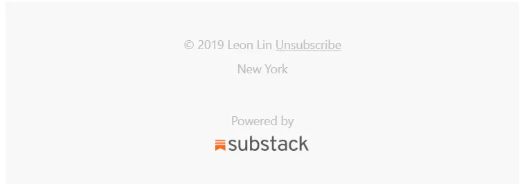
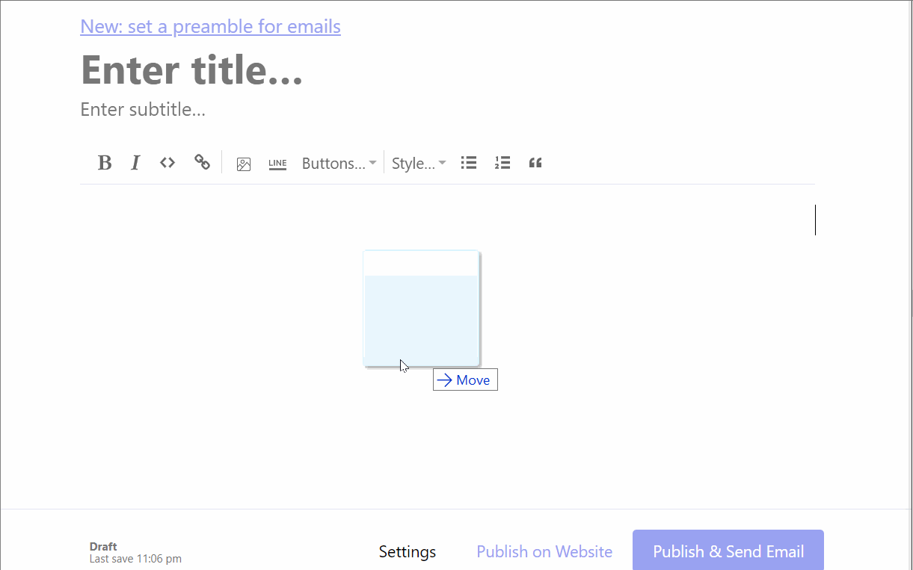
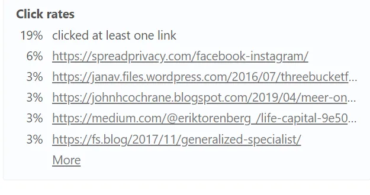
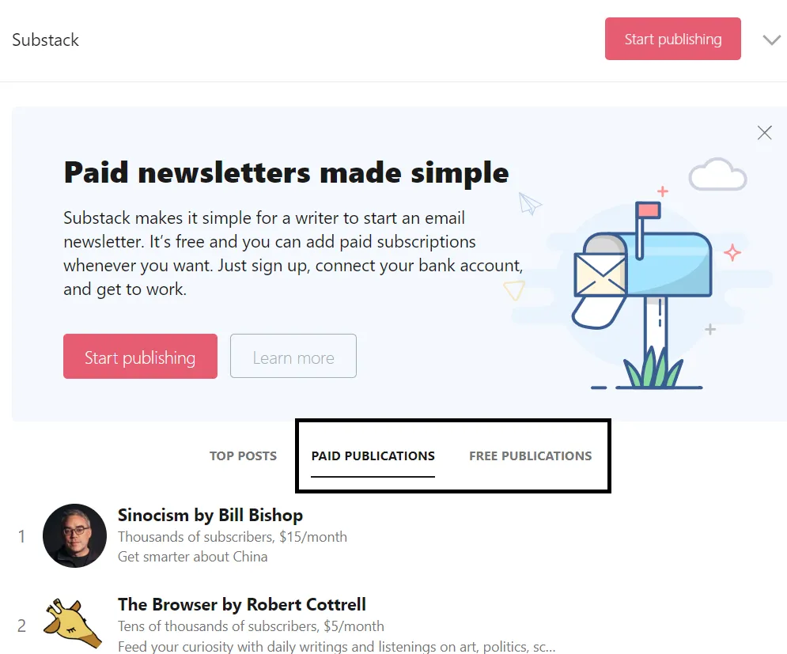
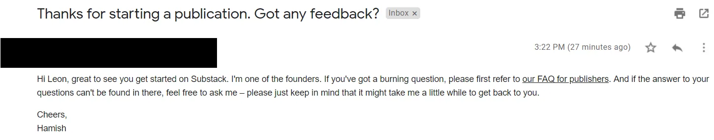
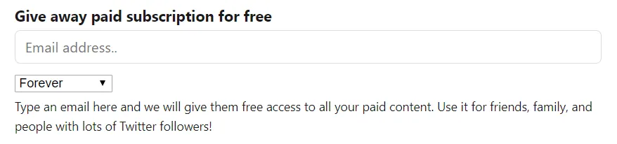
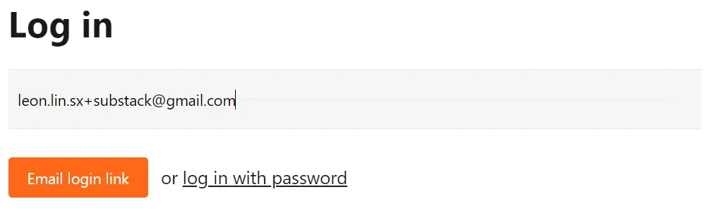
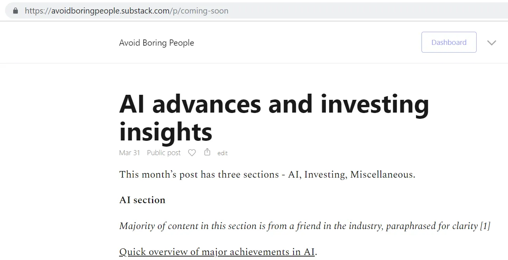

He [previously described](/writing/write 'why write') Mis razones para empezar un blog público\. Además de esta web\, también me suscribí recientemente a Substack para publicar mi [monthly newsletters](https://avoidboringpeople.substack.com/ 'substack')\. Antes de Substack\, enviaba directamente por correo electrónico a mi lista de distribución\.

En esta publicación repaso lo siguiente\:

1. Razones por las que hice el cambio a Substack desde correos privados
2. Otros beneficios de Substack
3. Posibles mejoras en el producto
4. Otras sugerencias más improbables

## Me pasé a Substack por los siguientes beneficios

1. Es una forma más sencilla de gestionar la lista de correos en lugar de copiar y pegar correos cada vez\, eliminando la posibilidad de olvidar incluir o eliminar suscriptores\.

   > Puedes crear una lista de correo a través de Substack y llevarla contigo en cualquier momento\. Si ya tienes una lista de correo\, puedes importarla desde la configuración con solo pulsar un botón\.

   

   Tras importar la lista\, puedes ver el estado de cada suscriptor individual y su actividad reciente

   

   Y puedes hacer clic en cada suscriptor para ver más detalles y editar su tipo de suscripción

   

2. Es una forma más fácil para los lectores desinteresados de darse de baja y menos incómodo comparado con enviarme un correo directo [^1]\.

   

   Preferiría que el texto fuera más evidente en lugar de un poco oculto\. Sí\, de hecho quiero facilitar que la gente se den de baja\. A la gente no le gusta el spam\, y preferiría no enviar algo a alguien que no lo quiera\. Si pudiera\, movería la opción de cancelar la suscripción directamente al inicio del boletín\. Entiendo que probablemente soy de la minoría que piensa así\.

3. Un boletín con un aspecto más profesional\, con una inclusión más sencilla de contenido multimedia enriquecido\.

   > Es fácil incrustar vídeos de YouTube y Vimeo\, pistas de Spotify y tuits en tus publicaciones\. Solo tienes que copiar y pegar las URLs relevantes y las incrustaciones aparecerán como arte de magia\. También puedes arrastrar y soltar imágenes y gifs\.

   

   Mucho más fácil que añadir contenido multimedia a Gmail o a esta web\. Gif creado a través de [LICEcap](https://www.cockos.com/licecap/ 'LICEcap') Por cierto\.

4. Análisis de mi base de lectores\, como las tasas de clics\. Supongo que esto mejorará con el tiempo a medida que se añadan más funcionalidades\.

   

5. Potencial de monetización eventual [^2]\. El modelo de negocio también es sencillo\, con Substack asumiendo una parte del 10\% una vez que empiezas a cobrar a los suscriptores\. Substack también te permite hacer precios mensuales y anuales\. Los pagos se procesan a través de Stripe\, así que tienes que abrir una cuenta allí si aún no tienes una\.

   > Una vez que has conectado una cuenta de Stripe a Substack\, gestionamos tus pagos de forma fiable y segura\.

   

## Otras cosas que me gustan incluyen

1. Atención al cliente para que no tengas que lidiar tú mismo con problemas administrativos\.

   > Si la gente tiene problemas con sus tarjetas de crédito\, accesos o cualquier otra situación que surja\, solucionamos los problemas en su nombre a través de support@substack.com\.

   Aún no lo he usado\, pero es bueno tenerlo por si algún día lo necesito\.

2. Las páginas \'Acerca de\' y \'Gracias por suscribirte\' en Substack vienen prepobladas con contenido que podría modificar para configurar rápidamente el servicio\, en lugar de formularios en blanco que requerirían crear aún más contenido desde cero\. Me pareció un detalle pequeño y agradable que hacía que la configuración fuera menos dolorosa\.

3. También existen tablas de clasificación que ayudan a promocionar el contenido más popular\, lo que podría crear un ciclo virtuoso si logras subir en el ranking\. Substack afirma que esto ayuda a descubrir\, aunque tengo una sugerencia al respecto más adelante en esta publicación\.

   > Las clasificaciones ayudan a los lectores a descubrir grandes publicaciones y ayudan a las editoriales a encontrar nuevos lectores\.

   

   También hay breves perfiles de las principales editoriales [^3]\.

   

4. La página de bienvenida de tu boletín anima al lector a suscribirse\, pero no fuerza el problema\, lo cual tiene sentido para mí\. No querría suscribirme a algo sin haber leído antes una muestra\.

   

5. Después de registrarte como editor\, el fundador también ofrece su información de contacto por si no puedes resolver tus dudas en las preguntas frecuentes\. Aún no he intentado enviar correos\, así que no sé si realmente responden\.

   

6. También hay una función de suscripción grupal si buscas un público más corporativo\.

   > Si crees que organizaciones\, empresas u otras instituciones podrían querer comprar varias suscripciones para sus miembros\, puedes vender suscripciones de grupo\.

## También pensé que lo siguiente podría mejorarse

1. No parecía haber una forma fácil de subir toda tu lista de correo como suscriptores gratuitos\, ya que el formulario solo permitía subir los correos uno a uno\. Tuve que activar manualmente la configuración de suscripción para toda mi base de lectores después de subir sus correos [^4]\. Esto era doblemente molesto porque no podía cambiar los ajustes de varios lectores a la vez y tenía que cambiar cada uno individualmente\. Una función que me permitiera editar varios suscriptores a la vez habría estado bien\.

   

2. Subir publicaciones antiguas también era un fastidio\. Como la fecha y hora estaba más en el diseño de edición\, llevaba tiempo subir las publicaciones y luego retrofechar individualmente hasta la fecha correcta que quería\. Solo tenía un par de publicaciones\, pero no me imagino cómo alguien con un historial de publicaciones más largo se molestaría en poner su contenido antiguo con las fechas correctas\.

   > Por último\, si importas publicaciones de los archivos de otro sitio\, puedes retrofecharlas para que se publiquen en el orden correcto y estén asociadas con las fechas de publicación correctas\. Para hacerlo\, después de publicar una entrada\, entra en la Configuración de esa publicación \(justo a la izquierda del botón Publicar\) y selecciona la fecha deseada

   

3. Al principio tuve problemas para crear una cuenta e iniciar sesión\. No entiendo por qué la opción predeterminada es \'enlace de inicio de sesión por email\'\, lo que me llevó a un bucle de solicitar un enlace por correo electrónico que me dirigía a la misma página de inicio de sesión y prompt\. Esto fue confuso\.

   

4. La página principal tiene un enlace al blog\, que da más información sobre el servicio\. Sin embargo\, una vez que haces clic para llegar al blog\, no hay una forma intuitiva de volver a la página principal de Substack sin pulsar el botón de volver al navegador\. El menú desplegable no te deja volver atrás y no hay botón de retorno en el texto principal\.

   

5. No parece haber una forma de editar las URLs de las publicaciones\. En el siguiente ejemplo\, estaba editando la publicación provisional de \'próximamente\'\, pero no pude arreglar la URL a pesar de cambiar el título de mi publicación\.

   

6. Un texto sencillo sobre el ratón con lo que definen como \'abrir\' y \'clics\' también sería útil\. Supongo que se parece lo suficiente a lo que pensaríamos si usáramos sentido común\, pero estaría bien tener claridad aquí\.

## Y tengo las siguientes sugerencias adicionales

1. Como se mencionó antes\, tener las clasificaciones está bien\, pero no permite descubrir contenido nuevo\. ¿Quizá podrían añadir una columna para el contenido \'tendencia\' que esté creciendo suscriptores rápidamente\? ¿O una columna con una rotación regular de editoras menos conocidas seleccionadas por el equipo de Substack\? Sí\, obviamente estoy sesgado aquí como editor pequeño\.

2. Me gustó [this page](https://on.substack.com/p/what-you-get-when-you-start-a-substack 'substack features') Lo que habla de todas las funciones que obtienes con Substack\, pero tiene que ser más fácil de encontrar\.

3. Hay un documento de Google que se comparte con los editores después de registrarse\, que contiene información útil\. Esto debería ser una página web propiamente dicha para que la gente pueda consultarla\. Por ejemplo\, ya he perdido el enlace\.

4. El enlace de restablecimiento de contraseña solo me requería introducir mi nueva contraseña una vez\; debería requerir que confirmara o volviera a escribir la nueva para reducir los restablecimientos incorrectos\.

5. ¿Hay alguna forma sencilla de hacer notas al pie enlazadas\?

6. ¿Reconsiderarán añadir dominios personalizados o es demasiado complicado con la tecnología\? También falta una personalización más avanzada\, que supongo que es intencionada\.

Substack ofrece un servicio gratuito de boletín que es relativamente fácil de configurar\, tiene un aspecto profesional y tiene análisis útiles de tu base de suscriptores\. A mí me ha gustado usarlo para mis [monthly newsletters](https://avoidboringpeople.substack.com/ 'substack') Hasta ahora es un gran salto respecto al simple correo electrónico\. Seguiré usando Github Pages para mi web principal debido al mayor grado de personalización que ofrecen\, como dominios personalizados\, diseños de página separados o formato\. Sin embargo\, hay mucho que gustar en Substack\.

[^1]: Dicho esto\, mi única baja hasta ahora ha sido porque un amigo me dijo que quería cancelar antes de hacerlo\, así que no estoy seguro de si esto está funcionando como debería\.\.\.

[^2]: Esta es una de esas citas que envejecen mal\, tenga éxito o fracase

[^3]: No sé cómo conseguir estos si no estás en esa lista

[^4]: A través de la página de perfil de suscriptores mencionada anteriormente
