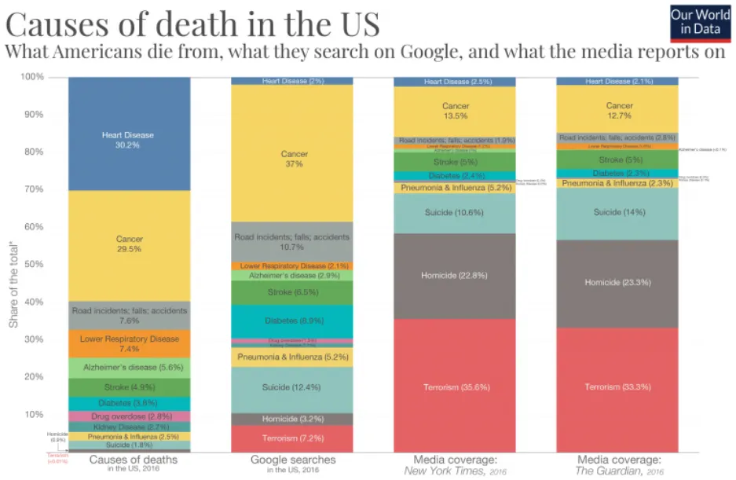
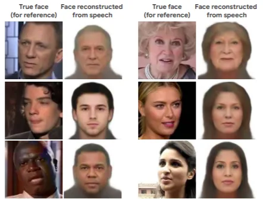

Intento evitar escribir sobre criptomonedas porque realmente no sé qué está pasando\, probablemente estoy malinterpretando algo y probablemente me equivoque [^1]\. Este mes hago una excepción porque [Facebook's Libra](https://libra.org/en-US/ 'Libra') El proyecto es tan confuso que necesito desahogarme largo y tendido en la primera sección\. La segunda sección trata sobre la SEC demandando a una empresa cripto\, y la tercera es sobre consejos de carrera\. ¡La novedad de este mes es una sección de homenajes a proyectos en los que están trabajando amigos\!

En fin\, vamos a Facebook\. Esta es una sección larga\; pasa a la siguiente si no te interesa\.

## ¿Cuál es el sentido de Facebook y Libra\?

Por si no lo has oído\, Facebook está colaborando con socios para emitir una criptomoneda\, Libra\. El documento técnico se puede encontrar [here,](https://libra.org/en-US/white-paper/#introduction 'white paper') Y muchos expertos ya han comentado lo que significa para el futuro de las finanzas\. Voy a predecir con un 60\% de certeza que Libra fracasará en sus objetivos [^2]\.

¿Qué _son_ ¿Esos objetivos\?

> La misión de Libra es habilitar una moneda global sencilla y una infraestructura financiera que empodere a miles de millones de personas\.

Adivina [special drawing rights](https://www.imf.org/en/About/Factsheets/Sheets/2016/08/01/14/51/Special-Drawing-Right-SDR 'SDR') no eran lo suficientemente buenos y\, sinceramente\, su uso es insignificante\. ¡Pero esta misión es interesante\! Imagina un mundo en el que no tengas que lidiar con divisas y puedas simplemente ganar\, usar y donar fondos en cualquier lugar\. Hablaré de mis preocupaciones más adelante\, pero es un problema emocionante en el que trabajar\.

> Las blockchains y criptomonedas tienen varias propiedades únicas \\\[\.\.\.\\\] Estas incluyen la gobernanza distribuida\, que garantiza que ninguna entidad controla la red\; el acceso abierto\, que permite la participación de cualquier persona con conexión a internet\; y la seguridad mediante criptografía\, que protege la integridad de los fondos\.

Esto coincide con mi entendimiento y esto _Resultado de búsqueda súper autorizado_ [blockgeeks](https://blockgeeks.com/guides/what-is-blockchain-technology/ 'blockgeeks') [^3]\, que dice que una red blockchain \"no tiene un sistema democratizado con autoridad central\. Dado que es un libro de contabilidad compartido e inmutable\, por su propia naturaleza es transparente y todos los implicados son responsables de sus acciones\.\" Fíjate en los aspectos de gobernanza distribuida \/ sistema democratizado que la diferencian de ser simplemente un libro mayor o un registro de transacciones llevado por una persona\. La innovación clave fue que todos pueden verificar el sistema y nadie tiene el control\.

> Creemos que el movimiento global\, abierto\, instantáneo y de bajo coste de dinero creará una enorme oportunidad económica y más comercio en todo el mundo\.

Habiendo malgastado miles de dólares enviando dinero hasta ahora\, esto también suena genial\. [There are reasons why international bank transfers suck](https://transferwise.com/us/blog/transferwise-vs-bank-transfers 'transferwise')\, pero reducir esta fricción es un objetivo valioso\. Entonces\, ¿cómo resuelve esto Libra\?

> Libra está compuesto por tres partes que trabajarán juntas para crear un sistema financiero más inclusivo\:

> Uno\. Está construido sobre una blockchain segura\, escalable y fiable\;

Vale\, así que tienen un libro de cuentas descentralizado para registrar la Libra que recibes y das\. Será sencillo\, rápido y barato transferir Libra\. Sigue teniendo sentido\.

> Dos\. Está respaldado por una reserva de activos diseñada para darle valor intrínseco\;

Esto no es una idea nueva\, [stablecoins](https://www.cbinsights.com/research/report/what-are-stablecoins/ 'stable?') han sido [attempted before](https://thenextweb.com/hardfork/2019/06/27/stablecoin-projects-gold-failed/ 'stable???')\. Empiezo a confundirme sobre cómo funcionaría una moneda global\, pero mejor dejémoslo de lado por ahora\.

> Tres\. Está gobernada por la Asociación Libra independiente encargada de evolucionar el ecosistema\.

Espera un momento\, ¿está gobernado por personas\? ¿Qué pasó con \"descentralizado\"\? Quizá lo entendí mal

> Esperamos tener aproximadamente 100 miembros de la Libra Association para el lanzamiento previsto en la primera mitad de 2020\.

_¿Qué\?_ Pasamos de \"sistema democratizado\" a \"100 empresas controlarán esto\"\. Similar a otros [centralised company efforts](https://www.coindesk.com/jpmorgan-to-start-customer-trials-of-its-jpm-coin-crypto 'JPM')\, esto\.\.\. parece un poco anular el propósito de usar una blockchain\?

Imaginemos una empresa cuyo único propósito es rastrear cuántos virtuales [neopets](http://www.neopets.com/ 'this is still alive?') Sí\, lo hemos hecho\. Quiero transferir un neopet\, voy a la empresa\, introduzco el importe de la transacción y el destinatario\, y enseguida veo que pierdo mi neopet y que mi destinatario ha ganado uno [^4]\. Ahora hagamos que solo 100 empresas puedan hacer este tipo de transacción\, pero por apariencias\, que publiquen siempre el registro de transacciones públicamente\. Sustituir a neopet por Libra\. Si esto cuenta como un proyecto blockchain\, deberíamos empezar con neopet coin como una nueva moneda global y recaudar mil millones de dólares\. Parece que Libra es una moneda global controlada por 100 empresas que ni siquiera necesita una blockchain [^5]\?

Contemplad el futuro de las finanzas\. No voy a mentir\, es bastante mono\.

> Estará respaldado por una colección de activos de baja volatilidad\, como depósitos bancarios y valores gubernamentales a corto plazo en monedas de bancos centrales estables y de buena reputación\. Es importante destacar que esto significa que un Libra no siempre podrá convertir a la misma cantidad de una moneda local determinada

En lugar de transferir USD a GBP\, transfiero USD a Libra a GBP\, y los costes de transacción son tan bajos que ahorro dinero\. Soy escéptico sobre cómo sería mejor incurrir en spreads de 2 bid\/demand\, [but this could work](https://marginalrevolution.com/marginalrevolution/2019/06/libra-and-remittances.html 'TC libra remit')\. Si la Asociación está dispuesta a subvencionar los costes de mantener el sistema\, Libra podría realizar la función de \'transferencia de valor\' del dinero y permitir transferencias globales sin fricciones\. Esto suena genial\, hasta que nos demos cuenta de que hay personas a quienes _No_ Quiero tener la posibilidad de realizar transferencias sin fricciones\, como criminales\, empresas bajo investigación y más\.

¿Significa eso que restringimos las transferencias\? ¿Quién tiene la autoridad para denegar una transacción\? ¿La Asociación Libra\? Esto parece menos un sistema democratizado y más una forma de denegar tu transacción con Libra hasta que veas un anuncio en Facebook\. Si restringimos las transferencias\, ¿cómo va a comprobar la identidad de cada cliente a bajo coste\? Recuerda que esto está pensado para traer banca barata a la profesora Suzie en el Congo\. Ahora parece ideal para el líder terrorista Tim\.

Mantener la clavija será difícil\, pero supongamos que funciona mágicamente [^6]\. Supongamos que esta estabilidad permite que Libra se convierta en verdaderamente global\, reemplazando por completo la moneda local\. Pago anuncios en FB en EE\. UU\. con Libra [^7]\, pide chocolate de Madagascar con Libra\, y compra mi arroz con pollo en Singapur con Libra\. En este caso\, Libra está realizando la función de \'medio de intercambio\' del dinero\. ¿Esto convierte a la Asociación Libra en el banco central mundial\? _¿Por qué permitiría un gobierno decidido a mantener el control de la política monetaria\?_ ¿En qué se diferencia esto de crear un banco y todas las regulaciones que se requieren\? De todas las empresas\, que Facebook sea quien lidere esto no es una buena imagen\.

Tyler Cowen tuvo algunas [questions about Libra](https://marginalrevolution.com/marginalrevolution/2019/06/the-libra-reserve-discussion-of-background-documents.html 'TC Libra')\, y [Libra responded here.](https://threadreaderapp.com/thread/1141089260486811649.html 'Libra response') Quiero señalar que la tercera y décima pregunta de Tyler son similares a mis preocupaciones anteriores y\, casualmente\, no se han abordado\.

Para resumir una sección ya demasiado larga\, [here are some other concerns by Michael Pettis](https://carnegieendowment.org/chinafinancialmarkets/79396 'Pettis')\, en un escenario en el que Libra tiene éxito\:

> Frente a los beneficios evidentes\, existen al menos tres costes y riesgos igualmente evidentes asociados a la estructura del sistema Libra\: un déficit de fidecomiso\, la necesidad de ciertas regulaciones de traspasos y la tentación de manipular el sistema

> Necesitamos considerar otros posibles problemas y dificultades con un sistema global de pagos digitales\: Complicar la política monetaria de los bancos centrales\, Una moneda digital procíclica\, Riesgos financieros menos compartimentados localmente

No tengo ni idea de cuál es el propósito de esto\. Quiero decir\, veo la misión\, y es buena\. No veo cómo ayuda usar una blockchain \(¿es siquiera una\?\)\, no veo por qué esto se mantendría bajo regulación\, y creo que Libra va a fracasar\.

## Guía anotada de SEC vs Kik

En otras noticias sobre criptomonedas\, la SEC presentó una denuncia contra Kik\, acusándoles de realizar una oferta ilegal de valores\. [Katherine Wu](https://www.katherinewu.me/writings/2019/6/4/annotated-guide-to-the-secs-complaint-against-kik 'Kat') publicó una anotación detallada de sus pensamientos sobre la queja [here](https://static1.squarespace.com/static/5ac136ed12b13f7c187bdf21/t/5cf6b874d6c27c00017d2f14/1559672949112/SEC+sues+Kik.pdf 'pdf')\, muy recomendable si te interesa el cripto\. Las citas a continuación son de la SEC\; comentarios de Katherine\:

> Sin embargo\, la oferta y venta de Kin por parte de Kik no estaba registrada en la SEC\, y los inversores no recibieron las divulgaciones requeridas por los valores federales

Problema\: KIN \= Seguridad no registrada

> Es ilegal que cualquier persona\, directa o indirectamente\, venda valores en el comercio interestatal\.

esto lo sitúa bajo jurisdicción federal

> La empresa esperaba quedarse sin liquidez para financiar sus operaciones a finales de 2017\, pero sus ingresos eran insignificantes y los directivos no tenían un plan realista para aumentar los ingresos a través de sus operaciones existentes\. A finales de 2016 y principios de 2017\, Kik contrató a un banco de inversión para intentar venderse a una empresa tecnológica más grande\, pero nadie mostró interés\.

> Ante una \"pista de despesadilla\" financiera cada vez más reducida\, Kik decidió \"pivotar\" hacia un negocio completamente diferente e intentar lo que un miembro del consejo llamó un \"pase desesperado\"\: ofrecería y vendería un billón de tokens digitales a cambio de dinero para financiar las operaciones de la empresa y una nueva aventura especulativa\.

> Y Kik describió a Kin como una oportunidad tanto para que Kik como los primeros inversores de Kin \"ganaran mucho dinero\"\.

¡Uf

> Sin embargo\, incluso antes del Informe DAO\, Kik había sido informado por uno de sus consultores de que la oferta de Kin era\, potencialmente\, una oferta de valores que debían registrarse ante la SEC y que \"las ofertas públicas de valores no registradas no lo son
\> legal en EE\. UU\.»

Esta es su forma de decir \"Kik sabía mejor\"

> La SEC solicita un fallo definitivo\: \(a\) prohibir permanentemente a Kik participar en actos\, prácticas y actividades comerciales aquí alegados\; \(b\) ordenar a Kik devolver sus ganancias mal habidas y pagar intereses previos a la sentencia sobre ellos\; y \(c\) imponer sanciones económicas civiles a Kik conforme a la Sección 20\(d\) de la Ley de Valores \\\[15 U\.S\.C § 77t\(d\)\\\]\.

Esto es lo que quiere la SEC\: la cantidad de la sanción será decidida por el jurado

> Las compras de Kin por parte de los inversores fueron una inversión de dinero\, en una empresa común\, con la expectativa de beneficios tanto para Kik como para los destinatarios\, derivados principalmente de los futuros esfuerzos de Kik y otros para construir el Ecosistema Kin y aumentar la demanda de Kin\. En consecuencia\, la oferta y venta de Kin por parte de Kik en 2017 fue una oferta y venta de valores

Para una visión completamente diferente del caso\, echa un vistazo [Fred Wilson's post](https://avc.com/2019/05/defendcrypto-org/ 'AVC')\, aunque ten en cuenta que su firma de capital riesgo está muy involucrada en el ecosistema cripto\. Para que quede claro\, no estoy en contra de las criptomonedas\, solo en contra de saber cuándo hacer algo es mala idea y hacerlo de todas formas\.

## Consejos profesionales

Me encontré [an old post by Elizabeth Yin](https://elizabethyin.com/2015/11/25/6-things-ive-learned-about-careers-in-the-last-decade/ 'elizabeth')\, pero los consejos de carrera y vida son atemporales\:

> Resumen\: DR\: Cree en ti mismo\, joder\. Eso es todo\. Eso es lo único que importa\. Todo lo demás surge de esto

> Uno\. El fracaso abre puertas al éxito\. Cuando una puerta se cierra\, te ves obligado a buscar otra para abrir\, y esa podría ser mejor\.

Hay verdad en el cliché de \'si no estás suspendiendo\, no te esfuerzas lo suficiente\'\. El fracaso es horrible\. No nos despertamos por la mañana y pensamos \'Estoy agradecido por mi pareja y mis hijos y por la oportunidad de fracasar horriblemente en todo lo que hago hoy\'\. Pero es inevitable si nos estamos exigiendo mucho\. Y deberíamos exigirnos\.

Después de un fracaso\, podemos seguir intentándolo\, rendirnos y probar algo diferente\, o rendirnos por completo\. Las dos primeras opciones son válidas\, la última no\. Si has tenido éxito en algo en lo que has fracasado antes\, genial\. Si te has dado cuenta de que la prestigiosa carrera en la que entraste \'porque todos los demás lo hacían\' no está funcionando\, es bueno saberlo cuanto antes [^8]\. Sin embargo\, si te rindes en intentar algo y te resignas a que \'pase lo que pase\, pasará\'\, estás tomando una decisión consciente de fracasar\. Ser vago temporalmente está bien\. Ser vago permanentemente no lo está\.

Aun así\, va a ser duro\. Creer en uno mismo incluso cuando todo parece desmoronarse será difícil\, y a veces imposible\. Y lo digo como alguien que ha vivido uno de los mayores fracasos de su vida en el último año\. Es difícil superarlo\, y quizá nunca lo hagamos\. Pero tenemos que seguir adelante\, aunque sea poco a poco\. Si dejamos de fumar por completo\, perdemos por defecto\. Dejarlo por completo es la salida cómoda y fácil\, pero también la menos gratificante\. ["Man is not made for defeat. A man can be destroyed but not defeated"](https://www.goodreads.com/quotes/111352-but-man-is-not-made-for-defeat-he-said-a 'Hemingway') Conoce el juego por el que juegas\, y _Mantente en el juego\._

> Dos\. No te preocupes por lo que piensen los demás\. Preocuparte por lo que piensen los demás te impide asumir riesgos y\, por definición\, limita tu recompensa\.

En general estoy de acuerdo con esto\. A la mayoría de la gente le importa demasiado cómo los perciben sus amigos\, los amigos de sus amigos\, o ese desconocido mono en la pared de escalada los sábados\. [Group consensus](https://www.psychologytoday.com/us/blog/after-service/201705/the-science-behind-why-people-follow-the-crowd 'social psych') es algo real\, al fin y al cabo\, y normalmente viene con una connotación negativa\. Podríamos necesitar más seguridad en nosotros mismos y menos preocuparnos por las opiniones subjetivas de los demás\.

Sin embargo\, esto también puede llegar al extremo\. Hay muchos ejemplos en los que un líder seguro de sí mismo lleva a un país o empresa a la ruina\. Creo que el equilibrio aquí es tener un pequeño número de asesores de confianza a los que puedas acudir para pedir ayuda imparcial\, y saber cuándo sus consejos son aplicables o carecen de contexto completo\. Esto lleva tiempo construirse\, y las personas también pueden cambiar con los años\.

> Tres\. La persistencia lo supera todo\. Cualquier cosa que merezca la pena es difícil\. Sigue adelante\.

Similar al primer punto anterior\. La mayoría de las cosas no son fáciles\, incluso si tienes pasión por ello [^9]\. Pero si no te esfuerzas para mejorar\, solo puedes culparte a ti mismo\.

> Cuatro\. Optimiza para una cosa\. Lo que optimizas puede cambiar con el tiempo\, pero solo puedes optimizar para una cosa a la vez\.

No sé cómo me siento al respecto\. Hay más de una cosa que me importa profundamente\, y creo que probablemente sea el caso de la mayoría de la gente\. Quizá no tengan que estar todos en conflicto\, aunque entiendo su punto\. Otra advertencia es que ir demasiado lejos en una sola actividad siendo joven también puede suponer retrocesos significativos cuando eres mayor\, por ejemplo\, posponer el ahorro en cuentas con impuestos diferidos para disfrutar de la vida cuando eres más joven probablemente sea una mala idea\.

> Cinco\. Encuentra comentarios enterrados en un pajar y mejora a ti mismo\.

Similar a lo que escribí en el segundo punto\, así que estamos alineados en esto\. Recibir feedback constructivo es un fastidio\. ¿Quién quiere que le digan sus debilidades\? [^10]\? Sin embargo\, aunque sentimos que el feedback que recibimos es inexacto\, debemos darnos cuenta de que así es como nos ve nuestro crítico\. Entonces depende de nosotros decidir si merece la pena corregir ese fallo percibido o no\.

> Seis\. Mantén la perspectiva\. El tiempo es en realidad tu mercancía más importante\, no el dinero\. No sabes cuánto tiempo más tienes\, y cada día que pasa\, se vuelve aún más valioso\.

Daría varios riñones para volver a tener 18 años\. Y seguro que me sentiría aún más fuerte al respecto cuanto más mayor me hiciera mayor\. Pero el tiempo dedicado a arrepentirme del pasado también es tiempo perdido\. Vive en el ahora o para el futuro\. No pierdas demasiado tiempo\. [^11]

## Miscelánea

1. [Causes of death vs media coverage](https://ourworldindata.org/does-the-news-reflect-what-we-die-from?linkId=68864855 'media')

2. ["But every trend has a shelf life, and as quickly as Instagram ushered in pink walls and pastel macaroons, it’s now turning on them."](https://www.theatlantic.com/technology/archive/2019/04/influencers-are-abandoning-instagram-look/587803/ 'insta') Pues ahí se fue mi esperanza de hacerme famoso instantáneamente
3. ["Another strategy, one we term “manclusion,” involves including men in meetings simply to induce better behavior from the men on the other side of the table."](http://clsbluesky.law.columbia.edu/2019/06/06/venture-bearding/ 'venture bearding') No puedo creer que esto exista\.
4. [And on the opposite end of (3), stories from Female to Male transgender people](https://www.washingtonpost.com/news/local/wp/2018/07/20/feature/crossing-the-divide-do-men-really-have-it-easier-these-transgender-guys-found-the-truth-was-more-complex/?utm_term=.95366da87114 'FTM')

   > \"Lo que sigue impactando es la significativa reducción de la amabilidad y la amabilidad que ahora se me extiende en los espacios públicos\. Ahora siento que estoy solo\"

5. [Reconstructing facial images based on voice data](https://arxiv.org/pdf/1905.09773.pdf 'face')\. Cabe destacar que la idea no era recuperar una imagen exacta\, sino características visuales comunes que se relacionaran con atributos de voz\.

6. [Celebrity cameos for sale.](https://www.cameo.com/faq 'cameo') Sería un gran regalo de Navidad si alguien me regalara uno de Jenna Coleman\.\.\. solo digo [^12]

[^1]: Y también\, porque la mayoría de las noticias del sector sobre el tema son tóxicas\, las personalidades populares parecen locas\, y me da medio miedo que algún adolescente rico de cripto contrate a un sicario para acabar conmigo\. Ten en cuenta que nada de esto es consejo de inversión\.

[^2]: Prefiero predecir las cosas con porcentaje de certeza desde que lo he leído en [Tetlock's work](https://hbr.org/2016/05/superforecasting-how-to-upgrade-your-companys-judgment 'Tetlock')\, y aumenta la responsabilidad del pronosticador en comparación con usar palabras de comadreja de las que es fácil distanciarse\.

[^3]: Incluso tiene los precios de las criptomonedas en la parte alta\, así que sabes que está enfocado en la educación y no en que te haga operar con criptomonedas\. De nuevo\, no es un consejo de inversión\. Intercambia todas las criptomonedas que te apetezca hacerlo\.

[^4]: Estoy simplificando mucho\, pero ya me entiendes

[^5]: [Stratechery compares Libra to a distributed ledger that is more similar to a centralised database.](https://stratechery.com/2019/facebook-libra-and-the-long-game/ 'Stratechery') Si es así\, realmente no veo la conexión blockchain para Libra

[^6]: Si hay una alta demanda de Libra y la gente convierte la moneda local en Libra\, ¿hace que Libra se aprecie frente a la canasta\, obligando a la Asociación a emitir más Libra\, afectando el tipo de cambio de la cesta de monedas\, excepto la moneda local\? Tengo la sensación de que intentar mantener una anclaje estable será imposible

[^7]: Me pregunto si Facebook considerará hacer que solo los compradores de anuncios sean _tener_ para comprar Libra y así comprar anuncios\. Parece una forma fácil de empezar ~~Dominación mundial~~ adopción de Libra\. O quizá todo esto sea una excusa para construir un [global digital id](https://www.coindesk.com/buried-in-facebooks-cryptocurrency-white-paper-a-digital-identity-bombshell 'coindesk') para dirigir mejor los anuncios\.\.\.

[^8]: No llegaría a esa conclusión demasiado rápido\, pero 6 meses \- 2 años parece un plazo suficiente para entender si quieres seguir en ese puesto

[^9]: De hecho\, escribir esto mensualmente es un gran gasto de tiempo y agotador\, aunque me gusta leer y sé que escribir me ayuda a aclarar mis pensamientos

[^10]: Por cierto\, creo que la pregunta de \'¿cuál es tu mayor debilidad\?\' en una entrevista es horrible\. Absolutamente horrible\. Inmediatamente pienso mal de cualquiera que haga esa pregunta\, independientemente de cómo la justifique\: \'Oh\, queremos ser totalmente honestos entre nosotros en el proceso\'\. _Sí\, claro_

[^11]: Ten en cuenta que te dije que no desperdicies _Demasiado_ Tiempo en vez de no perder tiempo\. Creo que perder un poco de tiempo es bueno\.

[^12]: Mientras redactaba esto\, [Cameo raised $50mm](https://techcrunch.com/2019/06/25/cameo/ 'cameo round')\, llevando mi historial de llamar correctamente las tendencias a 1 sobre 1\, un promedio de bateo del 100\%\.
