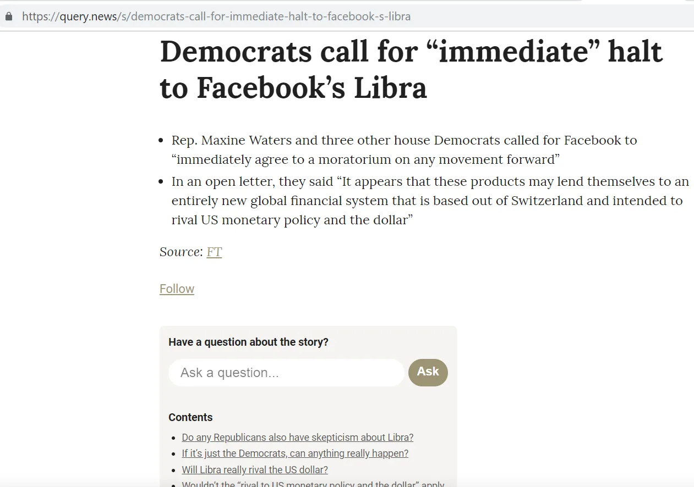
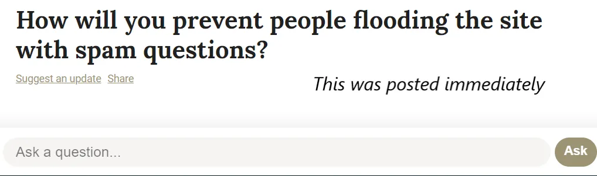
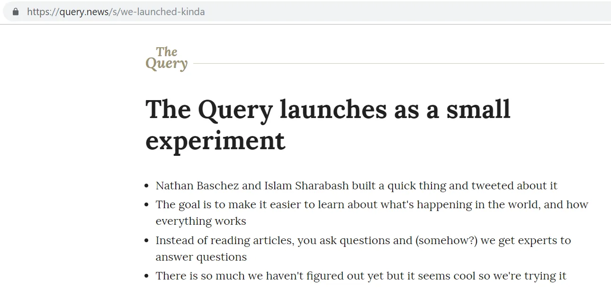
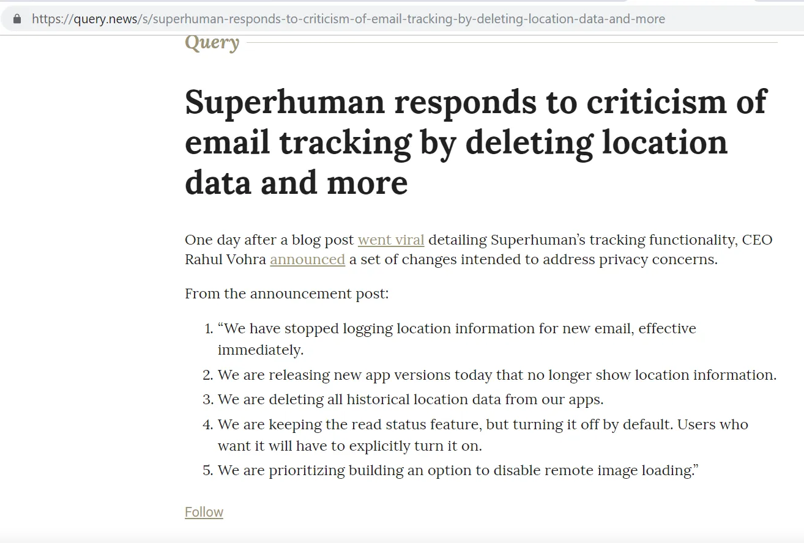

Un amigo lanzó un nuevo proyecto recientemente\, [Query News](https://query.news/ 'Query')\. Este es un recorrido de lo que es el proyecto y algunas sugerencias que tengo\.

## Guía

¿Qué pretende ser Query\? [Based on their own words:](https://query.news/s/we-launched-kinda)

> ¿Sería correcto describir esto como Quora para noticias actuales\?

> ¡Prácticamente sí\! Excepto que no estoy seguro de en qué intenta llegar a ser\. Pero definitivamente Quora es un buen punto de partida\. Lo principal que nos duda de Quora es el modelo de respuestas en competencia frente a colaborar en respuestas\. Creo que tendría más sentido fomentar más la colaboración aquí\. ¡Ya veremos\!

Así que la intención por ahora es tener un formato de preguntas y respuestas para los eventos informativos a medida que ocurran\. La gente aportará preguntas sobre un tema\, y alguien \(¿quién\?\) las responderá\.

La página de destino es sencilla\, ordena las preguntas en orden cronológico\, con el día más reciente primero\. No estoy seguro de cómo se ordenan las preguntas dentro del propio día\. Supongo que el orden se corrige una vez publicadas las preguntas\, ya que el horario indicado para las actualizaciones no parece afectar al pedido\. El sitio funciona bien también en móvil\.

Al hacer clic en los temas individuales\, accedes a una página de preguntas y respuestas más detallada sobre el tema\. Cada página de preguntas y respuestas tiene su propia URL\. La página contiene un breve resumen del tema de la noticia\, la cita de la fuente\, seguido de un índice de las preguntas y las propias preguntas\.

Hay varias preguntas para plantear una pregunta\, que es tan sencillo como escribirla en el campo de la pregunta\. Por lo que veo\, no hay moderación inmediata en la pregunta\, y tu pregunta se publica en la página inmediatamente\. La web facilita hacer una pregunta\.

Por ejemplo\, cuando publiqué la siguiente pregunta\, apareció al final de la lista de preguntas una vez que la página se actualizaba\, lo cual la página hacía automáticamente tras publicarla\.

Parece que no puedes responder directamente a las preguntas por tu cuenta en este momento\, pero sí puedes \'sugerir una actualización\' que envía tu comentario a un editor\:

Puedes consultar tú mismo la lista actual de temas y preguntas [here](https://query.news/ 'Query')\, y mira si hay alguna sobre la que te gustaría comentar\. ¡Parece una idea interesante\! La mayoría de las noticias son unilaterales\, buscando difundir un mensaje a las masas\. La sección de comentarios en línea suele ser un desastre\. Al hacer de la discusión el foco del sitio en lugar de un producto añadido\, esperemos que lleve a casos de uso más productivos\. Si alguna vez has leído algo y te has preguntado \'¿pero qué pasa con X\?\'\, Query te sería útil\.

¿Cómo podría ser esto a gran escala\? Podría tener secciones separadas por área temática\, con cuentas verificadas publicando nuevos artículos\, recibiendo preguntas de lectores interesados y luego respondiendo a esas preguntas\. Eso generaría Consulta _El sitio_ Para información en tiempo real sobre una variedad de temas\, donde puedes profundizar y analizar la historia a medida que se desarrolla\.

¡Pasando a preguntas y sugerencias\!

## Preguntas

1. ¿En qué se diferencia esto de Quora\? [Hacker News](https://news.ycombinator.com/ 'HN')\, o [Reddit](https://www.reddit.com/)\?
   - Parece que la intención es ser más colaborativo que en Quora \(ver arriba\)\, así que supongo que crearán una función que permita a varios editores responder una pregunta
   - Si es así\, supongo que no permitirán conversaciones en hilos\, sino que consolidarán todo en una sola respuesta por pregunta\. Esto sería diferente a Hacker News y Reddit
   - ¿Quizá podamos pensar en esto como la Wiki de Quora X para noticias a medida que ocurren\?
2. ¿Cómo van a escalar esto\?
   - Moderar preguntas \(y respuestas\, una vez implementadas esa funcionalidad\) requerirá editores manuales\, y no todas las páginas web tienen una [Steven Pruitt](https://www.cbsnews.com/news/meet-the-man-behind-a-third-of-whats-on-wikipedia/ 'Steven')\. Probablemente se pueda eliminar automáticamente algo de spam\, pero seguramente habrá algún elemento de moderación manual
   - ¿Cómo decidirán quién responderá a las preguntas y quién tiene suficiente experiencia en un área para comentar\?
3. ¿Cuáles son los incentivos para todos los interesados\?
   - Para los fundadores\, [I think they want to create an experiment and see if there's demand from people to read news in a different format](https://query.news/s/we-launched-kinda/q/what-are-your-short-term-goals-for-the-query#q-52 'ST goals')
   - Para los que preguntan\, obtener más información \(idealmente menos sesgada que las noticias normales\) sobre un tema respondido por un experto
   - ¿Para los que responden a la última vez\, para construir una reputación\? ¿Buena voluntad\? ¿Construcción de estatus\?
4. Si permiten que otros respondan preguntas\, ¿significa eso que la gente tendrá que crear cuentas con el tiempo\?
   - Quizá las preguntas puedan seguir siendo de flujo libre y anónimas\, pero quizá las cuentas aprobadas puedan editar las respuestas\.
   - ¿La intención es presentar una voz unificada de \"Consulta de Noticias\" para las respuestas o mostrar múltiples puntos de vista sobre una pregunta\?

5. ¿Habrá función de imagen\?

6. ¿Será necesario moderar también la calidad de las respuestas\?
   - No estoy seguro de si tener sistemas de votos positivos o negativos como Quora o Reddit anula el propósito del sitio

## Sugerencias

1. Clavar al [Query self-referential Q&A page](https://query.news/s/we-launched-kinda/ 'Query Q&A') en la página principal\. Alguien que aparezca en la página principal por primera vez no tendrá una idea clara de qué trata el sitio\. Tener una pestaña \"Acerca de\" justo arriba probablemente ayudará a la gente a entender lo que el sitio intenta hacer\, y podría ser un simple enlace a la página de preguntas y respuestas\.

   

2. Aclarando qué hace exactamente la opción de \'seguir\'\. No estoy seguro de si introducir mi correo electrónico me suscribe a todas las preguntas de ese tema de noticia\, a todas las preguntas de Query o solo a una pregunta sobre el tema

   

   Incluso después de hacer clic en \'seguir\'\, no sé qué se supone que debe hacer unirse\:

   

3. Etiquetar preguntas y tener una función de búsqueda parece algo que será útil o incluso necesario cuando esto crezca

4. Hay botones individuales para compartir las preguntas individuales\, pero ninguno para el tema principal de la noticia\.

5. Supongo que esto está en la hoja de ruta\, pero eventualmente permitir que la gente publique también temas de noticias por sí misma parece un siguiente paso lógico\.

6. ¿Hay alguna forma de conseguirlo a través de un feed RSS\? Parece que recientemente lo han puesto en formato de boletín\.
