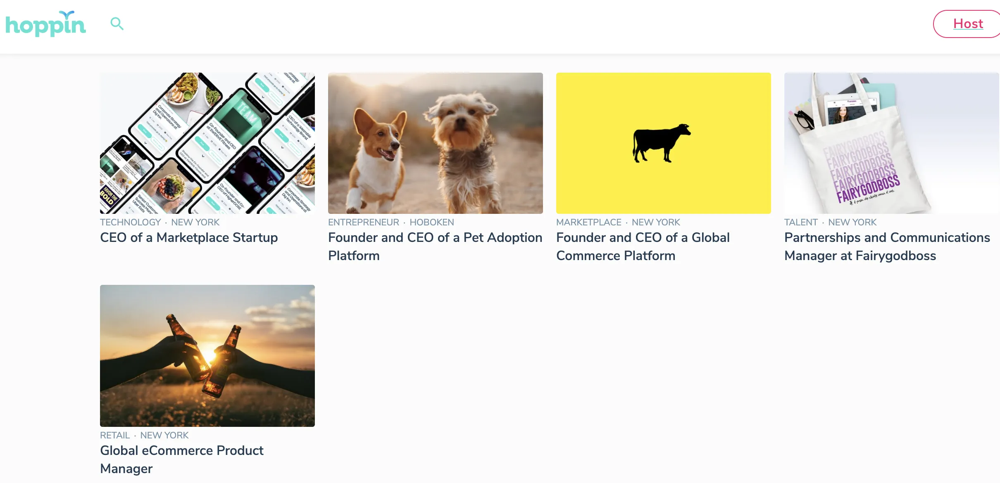
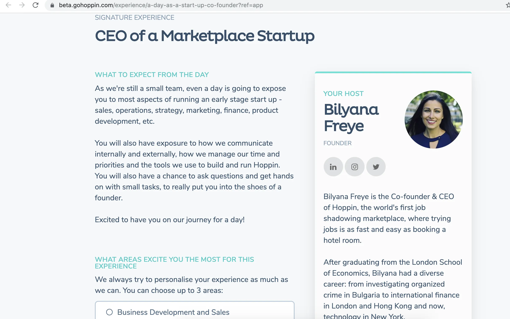
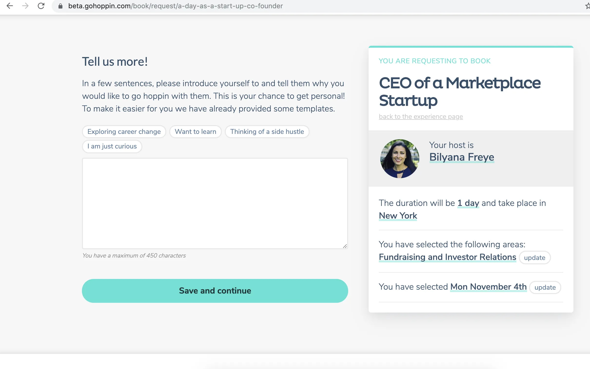
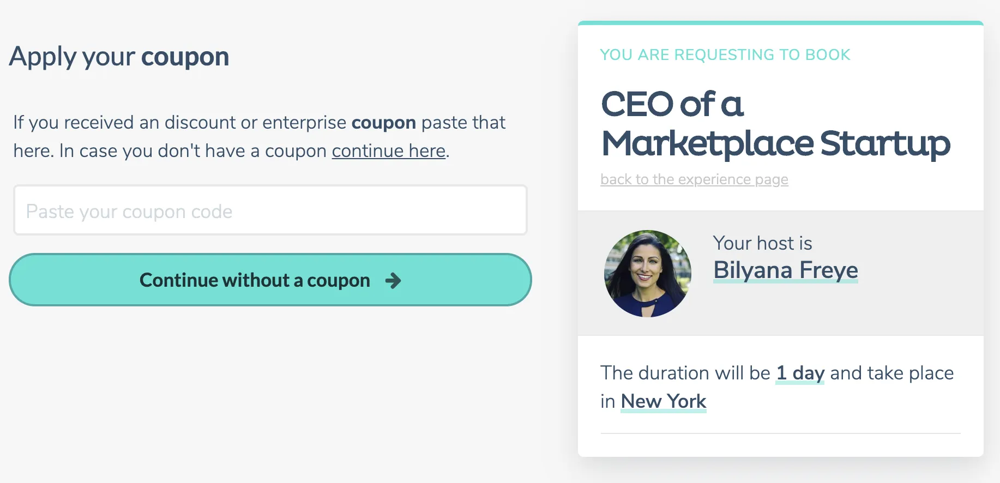
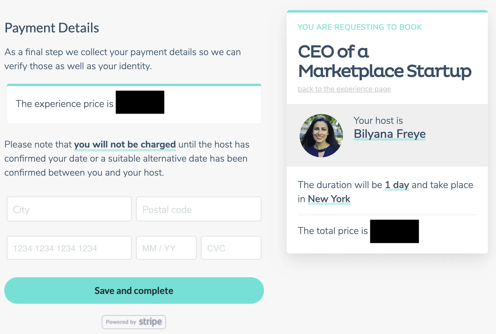
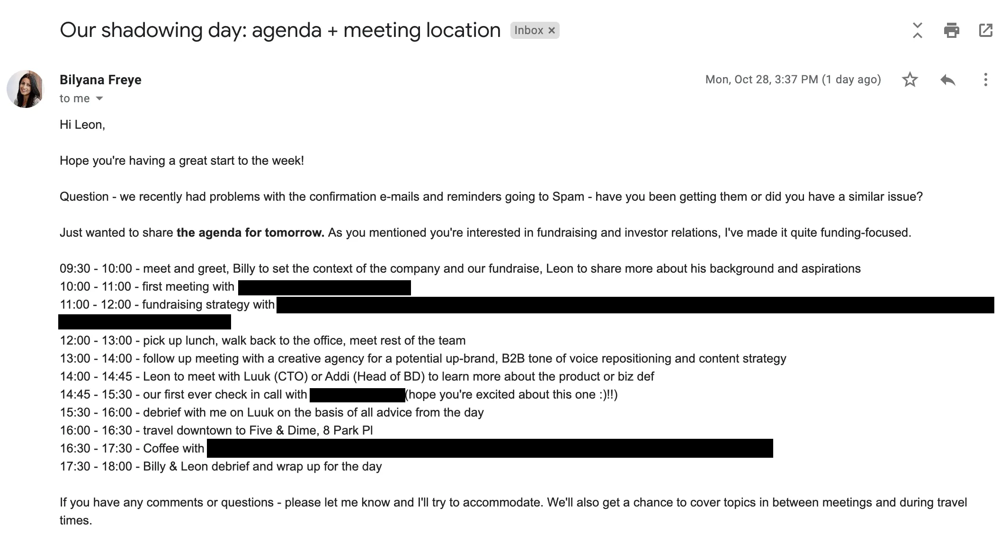

Recientemente hice prácticas de observación [Bilyana Freye](https://twitter.com/bilyanafreye?lang=en 'Billy') del mercado de sombras laborales [Hoppin](https://gohoppin.com/ 'Hoppin')\, a continuación se muestra una primera opinión sobre mi experiencia\.

Divulgación completa\: mi empresa financió esta actividad como parte de un presupuesto de aprendizaje para el crecimiento profesional [^1]

Siempre que la gente busca un nuevo trabajo\, un consejo común es primero investigar\. Algunas formas en que la gente lo hace actualmente es haciendo prácticas o preguntando a otros que están en ese puesto\. Las prácticas requieren un compromiso de tiempo más grande y no siempre son factibles\, mientras que hablar con empleados actuales no te da información tan rica como vivirla durante unas prácticas\. Este es el vacío que Hoppin intenta llenar\.

Hoppin es un mercado de shadowing laboral\, que intenta conectar a personas interesadas en acompañar a alguien durante un día con alguien dispuesto a recibir a otra persona por un día\. Idealmente\, ambas partes pueden beneficiarse de esto\. El shadower obtiene una experiencia auténtica de \'día en la vida\' que le da una idea mucho mejor del puesto\, y el anfitrión obtiene nuevas perspectivas sobre su rol y\, potencialmente\, un nuevo contratado\. Entiendo por qué la gente podría estar interesada\, y ahora encontrar cómo hacer un negocio a partir de esto es el problema clave para Hoppin\.

Empezaré describiendo el flujo de reservas\, luego mi experiencia personal\, y terminaré con opiniones y comentarios sobre la empresa\. La conclusión es que me pareció una experiencia increíble y que merecía la pena echarle un vistazo\, con las advertencias que mencionaré a continuación\.

## Flujo de reservas

El sitio tiene función de búsqueda para que puedas buscar experiencias en tu área de interés\. El ejemplo de abajo fue cuando estaba al final de los resultados de búsqueda de \"marketplace\"\. Solo mira ese corgi\.

Después de elegir una experiencia que te interesa\, te llevan a un perfil de la persona y de la experiencia\. En este ejemplo [^2]\, puedes ver información breve sobre el puesto\, duración\, ubicación\, etc\. arriba del pliegue\, y luego más detalles debajo\.

Después de hacer clic para reservar\, puedes seleccionar tus intereses de una lista prepoblada\, que fue proporcionada por el anfitrión cuando este estaba configurando su propia cuenta\.

Luego seleccionas fechas que te funcionen\:

Y después puedes dar respuestas libres sobre tu intención\. Una reflexión\: ¿quizá esto se pueda combinar con la sección de \'selecciona tus intereses\'\? Parece tener un propósito similar

El siguiente paso es rellenar tu información de contacto y cualquier otro perfil de redes sociales que quieras enlazar\. Aquí ves que\, por comodidad\, están recopilando información que yo ya había rellenado en mi perfil\.

Hoppin está intentando cambiar a B2B\, de ahí este siguiente paso en la solicitud del cupón\. No estaba presente cuando hice la reserva unas semanas antes\. Supongo que aplicar el cupón te lleva a un flujo ligeramente diferente al que describo a continuación\; ¿probablemente directamente a una página de confirmación\?

El último paso son los detalles de pago\. He tachado los números aquí porque todavía están trabajando en el precio\. Personalmente preferiría ver el precio desde el principio\, en la página de experiencias\, pero entiendo por qué está aquí en el flujo

Recibes un correo de confirmación tras la reserva\, y supuestamente también un recibo [^3]\. Después de eso\, envían un correo recordatorio la semana de la semana\, y también un mensaje el día mismo para animarte a compartir tu experiencia\.

Además\, también recibí un correo de mi anfitriona \(Bilyana\, la fundadora\) con mi agenda\. Me resultó útil para aliviar mis preocupaciones sobre qué esperar [^4]\. También me pareció genial que claramente hubiera organizado una experiencia que encajaba con lo que me interesaba\. El equipo de Hoppin mencionó que tienen la intención de que el anfitrión se ponga en contacto primero\, ya que el anfitrión cobra\; el equipo quiere dejar eso más claro para los anfitriones de ahora en adelante\.

## Experiencia de acompañamiento laboral

Me encontré con Bilyana en una cafetería por la mañana para una charla introductoria\. Hablamos sobre nuestros orígenes [^5] Y hizo un breve resumen de la empresa\, señalando que la reunión con inversores justo después probablemente le permitiría profundizar con más detalle\.

Actualmente\, Hoppin está recaudando fondos\, así que nos reunimos con un posible inversor justo después\. El inversor nos contó su historia\, escuchó la presentación y preguntó sobre\:

- Estrategia de la empresa y visión a largo plazo
- Rondas de financiación y plazos
- Tasa actual de consumo y tamaño del equipo
- Métricas actuales
- Asociaciones planificadas
- Preocupaciones entre oferta y demanda y cuáles fueron los factores de bloqueo
- Gestión de las preocupaciones de captación furtiva por parte de los empleadores
- Cruce de anfitriones y sombras
- Cómo estaba estructurado un día típico de observación

Que sentí que eran preguntas reflexivas que también me habrían interesado como inversor\.

Después de esa reunión con inversores\, nos reunimos con el cofundador de Bilyana [Luuk Derksen](https://gohoppin.com/about 'Luuk') para reunirse con la aceleradora con la que habían colaborado\. El equipo de Hoppin quería recibir consejos principalmente sobre recaudación de fondos y gestión de relaciones con inversores\. Un tema en particular sobre el que tenía una opinión firme\: la frecuencia de las actualizaciones de inversores\. En mi experiencia en el sector inversor en mercados públicos\, que una empresa detenga una actualización regular o retire métricas suele ser una mala señal\. Dejas de hablar de cosas cuando las cosas van mal\, pero es precisamente cuando más necesitas hablar de ello\. Muchas veces los inversores privados podrían haber ayudado si hubieran sabido antes de los problemas de una empresa\, pero solo se involucraban cuando todo se había venido abajo\. [Carta has a sensible investor update format.](https://carta.com/blog/how-to-write-an-investor-update/ 'Carta') Para cualquier fundador que esté leyendo esto\, por favor seguid haciendo sus actualizaciones para inversores\.

Recogimos la comida \(Hoppin pagó\) y luego nos reunimos con una agencia creativa para charlar sobre cómo Hoppin podría beneficiarse de los servicios de la agencia\. La agencia habló sobre lo que podrían hacer para ayudar en el posicionamiento\, el diseño empresarial y la marca digital\. También hablamos sobre el mensaje de marketing\, la identidad de la empresa y los problemas para cerrar la venta\. La reunión terminó con ambas partes acordando los puntos de seguimiento\. Personalmente pensé que podría ser prematuro trabajar con una agencia en esta etapa\, pero obviamente deferiré al juicio de los fundadores para gestionar su negocio\.

Luego me reuní con su responsable de desarrollo de negocio\, [Addi](https://www.linkedin.com/in/addisonbolin/ 'Addi') por un rato\. Me guió por su embudo de ventas\, explicando cómo utilizaba sus herramientas para prospectar y hacer seguimiento con posibles clientes\. Addi describió sus tácticas para conseguir tasas de implicación más altas\, un ejemplo sencillo era que adaptaba el texto a la persona\, ya que una startup tendría objetivos diferentes a una empresa\. Addi también asiste a varios eventos fuera del trabajo para conocer y presentar a Hoppin\.

Después tuvimos una llamada de ponimiento con un inversor actual\, que incluyó lo siguiente\:

- Hitos alcanzados
- Problemas enfrentados
- Recaudación de fondos
- En qué el inversor tenía más experiencia en ayudar
- Cómo tendría que ser la empresa para conseguir su siguiente ronda
- Posibles formas de escalar la empresa

Encontré la reunión bastante estándar basándome en mi experiencia en los mercados públicos y conocimiento del proceso privado\. El equipo de Hoppin fue sincero tanto sobre sus victorias como sus derrotas\, y recibió buenos consejos sobre cómo abordar las próximas semanas [^6]\.

Inicialmente íbamos a tener una reunión en el centro con un periodista\, pero se pospuso\, así que acabé teniendo algo de tiempo libre\. Lo rellenamos haciendo una sesión de preguntas y respuestas con Bilyana\, y luego repasando el producto con Luuk\. Durante la sesión de producto hablamos sobre\:

- Cómo construyeron la plataforma
- Problemas técnicos que se enfrentan
- Las expectativas de los clientes y cómo son ahora más altas
- Grandes prioridades
- Estrategia a largo plazo

Se suponía que también debía trabajar en una tarea pequeña\, pero tuve que descartarla porque las dos sesiones anteriores tardaron más de lo esperado\. He oído que la expectativa normal es que el shadower trabaje en algo para aumentar la implicación\. Había un miembro más a tiempo completo del equipo de Hoppin \(¿Abi\?\) con el que desafortunadamente no pude pasar mucho tiempo\, pero eso era de esperar\. Al fin y al cabo\, estaba acompañando a una persona concreta y no al equipo\.

Terminamos con el informe previsto\, que se alargó más allá de nuestra hora original de cierre debido a los comentarios que tuve\. Fue un día largo y ajetreado para todos\. ¡Agradezco que el equipo de Hoppin se haya quedado aún más tiempo para la experiencia de acompañamiento\!

## Reflexiones

- Estrategia
  - Un consejo común que se da a quienes reclutan es hablar con tantas personas como puedan que estén en ese puesto o hayan estado anteriormente [^7]\. El trabajo de shadowing es un paso más allá y da aún más información sobre el rol que te interesa\. Me parece genial\, y quizás periodos de observación más largos puedan ser una posibilidad\, por ejemplo\, una vez al mes con la misma persona\.
  - Hoppin empezó B2C y está cambiando hacia B2B\, posicionándose como el \"ABNB del trabajo\"\. El potencial positivo incluye contratos más grandes\, mayor probabilidad de retención y branding\. Los inconvenientes incluyen el ciclo de ventas más largo\, la dificultad en la alineación de incentivos y el riesgo de concentración\. Como en todas las transiciones\, esto también será difícil\. Sin embargo\, tiene sentido que quieran reservar los ingresos recurrentes con algún tipo de producto SaaS\.
  - Parece que todavía están en proceso de ajustar el mercado de producto\, especialmente en lo que respecta a la alineación de incentivos \(ver más abajo\)
  - También estaban pensando en alternativas [^8] para personas que actualmente hacen shadowing en trabajos completamente diferentes por diversión\, que parecía ser la principal razón por la que los shadowers usaban la plataforma
  - A corto plazo\, la intención es automatizar completamente el emparejamiento\, la programación y el feedback
  - La visión a largo plazo es ser una plataforma para el aprendizaje y el desarrollo\. El seguimiento laboral podría ser solo uno de muchos productos que ofrece la plataforma\. Un empleado podría tener su propio plan de aprendizaje y desarrollo personalizado\. Esto parece interesante\. No tengo tanto conocimiento en el ámbito de RRHH\, pero parece fragmentado\, lo que implica que esto también podría ser complicado de hacer\.
  - ¿Hasta qué tamaño puede escalar esto\? No lo sé\, la experiencia parece nueva y puede que esté creando su propio mercado\. Eso es emocionante
- Alineación de incentivos
  - Personalmente\, me gustan los negocios en los que todas las partes suelen tener incentivos alineados\, y veo un posible problema aquí\. Puede ser difícil convencer a los empleadores del beneficio del servicio\, ya que existe la posibilidad de que los empleados usen esto para buscar otros empleos\. Si el equipo puede demostrar un retorno de inversión en la satisfacción de los empleados o algo similar\, eso podría ayudar en su proceso de venta
  - En otras palabras\, creo que el equipo todavía está intentando comunicar su valor añadido de forma concisa para que todos los interesados puedan quedar satisfechos
  - Probablemente sería una mejor experiencia si tanto el anfitrión como el shadower pudieran aprender el uno del otro\, en lugar de ser solo de una manera\. Por ejemplo\, si el anfitrión es una persona experimentada que recibe a un estudiante de instituto\, no será tan útil
  - ¿Hay algún incentivo adicional para los mejores anfitriones de la plataforma\? Supongo que los mejores anfitriones reciben la mayoría de las reservas y me imagino que pronto les canse\.
  - ¿La intención es que el observador obtenga una experiencia completamente diferente a la de su trabajo diario\, o que pueda traer experiencia complementaria al trabajo\?
- Precios
  - Dado su giro\, Hoppin sigue trabajando en la fijación de precios\. La idea actual es tener precios más estandarizados por experiencia\, ya que así es más fácil incorporar cuentas empresariales\.
  - Por si sirve de algo\, pensé que el precio era alto y no lo habría reservado como particular\. Lo hice porque podía gastarlo y quería probar el producto
  - La tasa de aceptación también parecía alta\, pero supongo que trabajarán en eso también
  - Un problema complicado con los precios es que necesitan ponerlo lo suficientemente alto como para que merezca la pena para los presentadores\, pero no tanto como para que los shadowers se echen atrás\.
- Liquidez del mercado
  - La mayoría de los mercados tienen una oferta limitada\, y supongo que es igual para Hoppin\. Si consiguen suficiente cantidad y diversidad de hosts\, creo que habrá suficiente demanda para el servicio [^9]
  - Me pregunto con qué frecuencia organizan las personas más populares\, qué tan sostenible es eso y cómo es su curva de retención
  - Sus alianzas B2B pueden desbloquear más oferta\, como ocurrió con mi empresa
- Evaluación utilizando otros marcos de inversores
  - Basado en [Bill Gurley's framework](http://abovethecrowd.com/2012/11/13/all-markets-are-not-created-equal-10-factors-to-consider-when-evaluating-digital-marketplaces/ 'Gurley')
    - Nueva experiencia vs statu quo \- Sí
    - Ventaja económica frente a statu quo \- ¿No\?
    - Oportunidad para que la tecnología aporte valor \- Sí\, en la agregación
    - Alta fragmentación\, eso creo
    - Fricción en la inscripción de proveedores \- No fue tan fácil\, pero Hoppin dijo que lo están haciendo más diseñado para las empresas
    - Tamaño de la oportunidad de mercado \- No lo sé
    - Expandir el mercado \- Parece que sí\.
    - Frecuencia \- Parece baja
    - ¿Flujo de pagos\? ¿No\?
    - Efectos de red\. Sí\, pero localizados
  - Basado en [Josh Breinlinger's framework](https://acrowdedspace.com/post/73232464154/the-ingredients-for-a-successful-marketplace 'Josh')
    - Uso recurrente \- ¿No realmente\?
    - Uso irregular \- Sí
    - Trabajo estandarizado \- No
    - Se requiere poca confianza \- ¿No\?
    - Relaciones no monógamas \- Sí
- Financiación
  - No voy a dar detalles por razones obvias\. La empresa estaba en una fase inicial y buscaba recaudar más\, así que si eres un inversor instionable con experiencia en construir ventas B2B\, podría valer la pena ponerse en contacto con ellos\.

## Realimentación más granular

1. Cuando estaba en proceso de reserva\, me detuve en la página de pago porque necesitaba la aprobación interna para el gasto\. Recibí un correo de seguimiento pidiéndome que confirmara mi reserva\, lo cual fue bueno\. Sin embargo\, ese enlace no me permitía volver atrás para editar los otros campos que había introducido\, como comprobar las fechas
2. Después de hacer la reserva\, la única opción era cerrar la ventana y no me dirigían de nuevo a mi reserva\, perfil o página principal\. Esto podría ser una forma de animar a los observadores a convertirse en anfitriones\, o enlazar a artículos que describen la experiencia que hay que esperar
3. Sentí que el proceso de inscripción tanto para un anfitrión como para un observador era más largo de lo que me gustaría\, pero eso es anecdótico\.
4. Había iniciado sesión y creado un perfil la primera vez\, pero no encontré el enlace para hacerlo cuando volví al sitio\. Parecía que solo permitía que la gente se registrara de nuevo\.

El equipo de Hoppin me dijo que son conscientes de los problemas anteriores\.

## Conclusión

Me encantó la experiencia de pasar un día con alguien que trabaja en una empresa de marketplace\, y se vio mejorada por tener muchas actividades que me interesaban personalmente\. Creo que los precios son altos para un consumidor minorista\, pero tendría sentido para un recurso de RRHH B2B\. Si Hoppin logra ese giro y expande la oferta de su mercado\, será interesante seguirles dentro de dos años\.

[^1]: Además\, Hoppin me invitó a comer y a un café\. Te dejo decidir si eso afecta a mi objetividad\.\.\.

[^2]: Se me olvidó hacer capturas de pantalla durante mi reserva\, así que estas son principalmente una recreación

[^3]: Podría haber sido un error durante mi reserva\, ya que no recibí mi recibo\. Hoppin me dijo que lo están investigando\.

[^4]: He eliminado detalles de la agenda por confidencialidad

[^5]: Puedes leer más sobre su trayectoria [here](https://www.swaay.com/how-this-co-founder-is-building-the-airbnb-for-work 'swaay')\. Y obviamente puedes leer más sobre mí [here](https://leonlins.com/about 'me')

[^6]: El inversor tampoco se metió demasiado en detalles sobre cómo gestionar el negocio\, lo cual en mi opinión es señal de un buen inversor\. A diferencia de alguien que podría dar consejos sobre dónde combinar partes de tu flujo de reservas\.

[^7]: A16Z acaba de invertir en [Lunchclub](https://techcrunch.com/2019/09/18/lunchclub-raises-4m-from-a16z-for-its-ai-warm-intro-service/ 'lunch') por ejemplo

[^8]: No menciono esto por confidencialidad porque todavía están desarrollándolos

[^9]: Depende de que los precios sean correctos\, y eso depende de cómo logren su giro B2B\.
