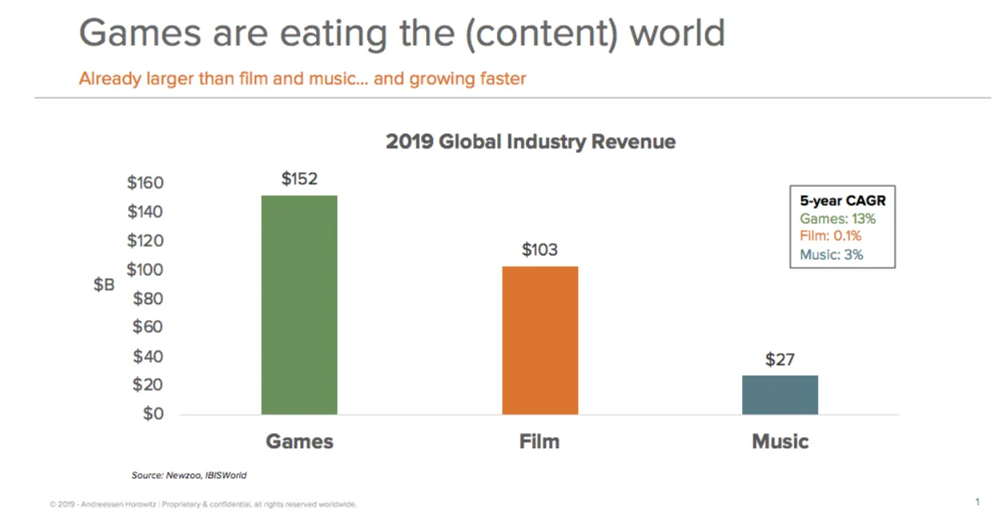

## Conclusiones

1. Los videojuegos son el próximo fenómeno cultural y la realidad virtual liderará esa revolución
2. El momento en que reequilibres tu cartera de inversión puede suponer una diferencia significativa en tus rendimientos
3. Somos malos describiendo probabilidades y aún peor combinándolas

### Los videojuegos acabaron con la estrella del deporte

El 21 de noviembre\, la popular empresa de videojuegos [Valve](https://store.steampowered.com/ 'Steam') anunció un nuevo juego\, [Half-Life Alyx](https://half-life.com/en/alyx 'Alyx')\. Alyx es una secuela de la saga Half\-Life\, considerada ampliamente como uno de los mejores juegos de todos los tiempos\; la última actualización se lanzó hace doce años\. Puedes ver el tráiler de 2 minutos de Alyx a continuación\. Ten en cuenta que está pensado para jugarse _¡en VR\!_

  <iframe src="https://www.youtube.com/embed/O2W0N3uKXmo" title="Alyx Trailer" frameborder="0" allowfullscreen style="position:absolute;top:0;left:0;width:100%;height:100%;"></iframe>

<a href="https://www.youtube.com/watch?v=O2W0N3uKXmo" target="_blank" rel="noopener">Watch on YouTube</a>

¿Por qué es esto importante\? Estáis suscritos para leer sobre tecnología\, finanzas y algún chiste autocrítico\; probablemente la mitad de vosotros no hizo clic en el vídeo\. _¿A quién le importan los videojuegos\?_

Aquí tienes por qué deberías importarte\. Creo que los videojuegos y los esports \(ver videojuegos por diversión\) son el próximo fenómeno cultural\. Así como te sentirás excluido de las conversaciones si no has visto la última película de Los Vengadores\, pronto llegará el día en que te sentirás marginado porque no has jugado o visto el videojuego más reciente [^1]\. También creo que la AR y la VR serán la próxima forma de cómo nos entretiene\, como lo han sido los teléfonos móviles\, el PC o la televisión\. Espero que Alyx sea el catalizador para llevar la VR al gran público\, pero reconozco que el mercado aún puede ser prematuro\.

Suena ridículo\, ¿verdad\? Después de todo\, Vengadores\: Juego final fue una película recaudadora de 3\.000 millones de dólares\, no puedes lanzar una piedra [^2] sin llegar a un meme poco gracioso de los Vengadores\, y [Marvel movie spinoffs are reproducing like rabbits](https://time.com/5167535/upcoming-marvel-movies/ 'List of upcoming Marvel movies')\. _¿Qué tamaño podrían tener los videojuegos\?_

Bueno\:

Los juegos son más grandes que el cine\, pero aún así crecen más rápido\. Con el [global sports industry at $500bn in size](https://www.businesswire.com/news/home/20190514005472/en/Sports---614-Billion-Global-Market-Opportunities 'Sports')\, hay mucho margen para que los juegos crezcan antes de alcanzar el mismo tamaño que los deportes\.

Para que los juegos lo hicieran\, tendrían que ir más allá de los niños jugando a Fortnite con las tarjetas de crédito de sus padres\. [The largest esports tournament already has about the same number of viewers as the Super Bowl](https://marginalrevolution.com/marginalrevolution/2018/08/esports-update.html 'MR')\, pero los torneos más pequeños aún no se comparan\. Querrías que los juegos nuevos fueran experiencias inclusivas que adultos e incluso mayores pudieran apreciar\. _¿La abuela jugaría alguna vez a un videojuego\?_

Bueno [^3]\:

No soy el único optimista respecto a los videojuegos\. A16Z\, una conocida firma de capital riesgo\, ha aumentado su interés por los videojuegos\, y [wrote about some trends they believe in](https://a16z.com/2019/10/16/trends-revolutionizing-games/ 'a16z') [^4]\:

> Los juegos son la próxima red social

> A medida que el juego multiplataforma se convierte en el nuevo estándar\, los juegos multijugador crecerán mucho más rápido y grandes que las generaciones anteriores

> La próxima gran franquicia de películas\, parque temático o línea de juguetes probablemente vendrá de los videojuegos\.

Hay al menos tres razones por las que estoy seguro de que esto ocurrirá\:

1. Demografía\. Los niños gamers están creciendo y convirtiéndose en padres gamers\. Sus hijos probablemente serán gamers ellos mismos\, ya sin tener que explicar por qué no puedes pausar una partida multijugador\.

2. Mayor inclusión e interacción\. Todo el mundo puede jugar a videojuegos\, [even a Saudi prince](https://www.dailydot.com/parsec/saudi-arabian-prince-on-steam/ 'Saudi')\. Puedes pasar directamente de ver ganar a un equipo a jugar tú mismo en la misma sala\. Cuando la realidad virtual por fin despegue\, ni siquiera tendrás que preocuparte por controles complicados porque la interacción será intuitiva\.

3. Ansiando comunidad\. Todo el mundo quiere pertenecer a algo\. Los juegos ofrecen opciones prácticamente infinitas para identificarse como parte de una tribu más grande\. A medida que más juegos se den cuenta de que también ofrecen una experiencia social\, los desarrolladores empezarán a incluir funciones comunitarias similares a [Fortnite's in-game concert](https://www.theverge.com/2019/2/21/18234980/fortnite-marshmello-concert-viewer-numbers 'Fortnite') [^5]

Me pregunto cómo cambiará el modelo económico para los videojuegos a partir de esto\. Vender objetos virtuales dentro del juego por dinero real es [not that old](https://www.eurogamer.net/articles/USD25-wow-horse-makes-millions 'WoW')\, lo que implica que la monetización en los juegos sigue siendo inmadura y que deberíamos ver evolución de los modelos de monetización en el futuro\. Sobre los esports\, Mitch Lasky\, exejecutivo de una empresa de videojuegos [^6]\, señala que [the current structure of esports is different from live sports](https://www.quora.com/What-is-your-view-on-the-future-of-eSports-in-comparison-to-other-major-US-sports 'Mitch')\. Los juegos de esports están directamente vinculados a los editores\, que ven los esports más como una herramienta de marketing\. Los equipos de esports sí ganan dinero\, pero solo una pequeña parte de los ingresos totales del partido\. Esto contrasta con los deportes en directo\, que reciben ingresos por entradas de estadios y contratos de televisión\, donde los equipos y jugadores acaparan una mayor parte\.

Quizá intento convencerme de que las miles de horas que pasé jugando a videojuegos no fueron en vano\. Aunque lo dudo [^7]\, y creo que los videojuegos y la realidad virtual han llegado para quedarse\. Predigo con un 90\% de certeza que jugar a videojuegos se convertirá en la norma y no en la excepción\, y con un 50\% de certeza de que la realidad virtual es la plataforma que permite este cambio\. Si no quieres sentirte excluido\, creo que merece la pena probar una experiencia de realidad virtual para presumir ante tus hijos la próxima vez que fuiste uno de los primeros en adoptar\.

### Tiempo\, suerte y suerte

Los inversores con una cartera diversificada suelen reequilibrar sus carteras regularmente\, es decir\, ajustan sus inversiones para volver a las proporciones ideales de su cartera\. Por ejemplo\, si tu cartera ideal es 60\% acciones y 40\% bonos\, una vez al año podrías comprobar esa proporción y comprar y vender según sea necesario para volver al 60\% de acciones y 40\% bonos\.

¿Importa el momento en que haces este reequilibrio\? [This research by Corey Hoffstein](https://blog.thinknewfound.com/2019/11/the-dumb-timing-luck-of-smart-beta/ 'Newfound Research') afirma que sí\. Definen y miden la \"suerte temporal\" como la diferencia en el rendimiento respecto a elegir una fecha de reequilibrio\, por ejemplo\, elegir junio en lugar de diciembre\. Luego construyen carteras con diversas estrategias de inversión\, número de inversiones y frecuencia de reequilibrio\; Omito los detalles por brevedad [^8]\.

Descubren que\:

> Las estrategias con mayor rotación tienen mayor suerte en el momento\.

> Las estrategias que reequilibran con más frecuencia tienen menos suerte en el tiempo\.

> Las estrategias con un universo menos restringido tendrán mayor suerte en el timing\.

En otras palabras\, si tienes alta rotación\, reequilibras menos con frecuencia o tienes menos restricciones\, mayor será el impacto que el tiempo de reequilibrio tendrá en tus rendimientos finales\. La flecha de abajo representa la diferencia entre la variación de mejor rendimiento y la peor de desempeño\, _del mismo portafolio_\.

También presentan una tabla resumen que muestra ese diferencial entre diferentes estrategias de inversión\. Para entender lo siguiente\, se dice que 1 \$ en la cartera de \"Valor Mejorado\" podría haberte devuelto de 4\,45 \$ a 5\,45 \$\, y que toda esa diferencia de 1 \$ se debe a la suerte en el reequilibrio\.

Concluyen diciendo\:

> Para carteras razonablemente concentradas \(100 acciones\) con frecuencias de reequilibrio semestrales \(común en muchas definiciones de índices\)\, la suerte del momento anual osciló entre el 1 y el 4\%\, lo que se tradujo en un intervalo de confianza del 95\% en la dispersión anual del rendimiento de aproximadamente \+\/\-1\,5\% a \+\/\-12\,5\%\.

> La magnitud de la suerte en el momento pone en duda nuestra capacidad para sacar conclusiones significativas sobre el rendimiento relativo entre dos estrategias\.

Para ponerlo en contexto\, [stocks have averaged a nominal return of ~10% a year](https://mebfaber.com/2018/11/14/episode-129-mebs-take-on-return-expectations-portfolio-construction-and-practical-market-approaches/ 'Meb')\. Suponiendo que tu cartera tenga un retorno similar [^9]\, hasta 4 puntos porcentuales de los 10 podrían deberse solo a la fecha de reequilibrio\.

Una solución propuesta para el inversor individual es dividir tu cartera\, aunque esto parece mucho trabajo\:

> Creemos que nuestra cartera de Momentum debería reequilibrarse cada trimestre \\\[\.\.\.\\\] Propusimos dividir nuestro capital entre las tres carteras que abarcaron diferentes periodos de reequilibrio de tres meses \(por ejemplo\, enero\-abril\-julio\-octubre\, feb\-mayo\-ago\-noviembre\, mar\-jun\-sep\-dic\)\. Esta solución se denomina \"tranching\" o \"carteras solapadas\"\.

Alternativamente\, puedes reducir la suerte del timing invirtiendo las condiciones mencionadas antes\. Tener una baja rotación\, reequilibrar con más frecuencia o tener una cartera menos concentrada reducirá el efecto que el timing tendrá sobre la margen esperada de rentabilidades\.

### ¿Qué probabilidad es probable

Si te digo\:

- Un experto dice que probablemente dejé mi trabajo para ser la camarera exclusiva de Jameela Jamil [^10]
- Un segundo experto también dice que es probable

¿Crees que es \"probable\" o \"muy probable\" que esto ocurra\?

¿Y si\:

- El primer experto dice que hay un 80\% de probabilidades de que ocurra lo anterior
- El segundo experto dice que hay un 70\% de posibilidades

¿Cuál crees que es la probabilidad de que esto ocurra ahora\? ¿Y dirías que eso es \"probable\"\? \"Altamente probable\"\?

[This paper by Celia Gaertig and Robert Mislavsky](https://papers.ssrn.com/sol3/papers.cfm?abstract_id=3454796 'paper') Analiza cómo las personas combinan predicciones de probabilidad de múltiples fuentes\, realizando experimentos similares a los anteriores\. Si llevas un tiempo leyendo este boletín\, no debería sorprenderte que seamos inconsistentes en nuestro juicio y en la combinación de probabilidades [^11]\.

Todos tratamos las probabilidades verbales y numéricas de forma diferente\; las organizaciones y las personas tienen ideas distintas sobre cuán probable es que sea \"probable\"\:

> un evento descrito como \"probable\" en un informe del IPCC del Panel Intergubernamental sobre Cambio Climático debe tener entre un 66\% y un 100\% de probabilidad de ocurrir\. Por otro lado\, un evento descrito como \"probable\" en un informe del DNI del Director Nacional de Inteligencia de EE\. UU\. debe tener una probabilidad del 55\% al 80\%\.

Y\, por supuesto\, si encuestas a tus amigos sobre su definición de \"probable\"\, [you'd get such a wide range of answers it'd be unhelpful.](https://link.springer.com/article/10.3758/BF03327890 'polls')

El artículo propone que\:

> En general\, las probabilidades numéricas son precisas pero carecen de dirección\, mientras que las probabilidades verbales tienen dirección pero carecen de precisión

Con dirección aquí significando connotaciones positivas o negativas\. Por ejemplo\, escuchar que un evento es \"probable\" me da más contexto y confianza en comparación con una predicción del \"80\%\"\.

Tras establecer la diferencia entre probabilidades numéricas y verbales\, los autores estudian cómo las personas combinan estas probabilidades\:

> Nos referimos a los participantes que utilizan estrategias de \"promedia\" o \"conteo\" al combinar pronósticos\,

> \"Promedia\" para referirse a una estrategia combinada mediante la cual el participante toma una media ponderada de las previsiones de los asesores\, situando su propia previsión entre las previsiones de los asesores

> \"contar\" para referirse a una estrategia combinada mediante la cual los participantes interpretan cada uno de los pronósticos de los asesores como una señal positiva y ajustan sus propios pronósticos en la dirección de la señal

Por ejemplo\, si recibieras múltiples pronósticos que oscilan entre el 60 y el 80\%\, una estrategia de \"promedia\" te acercaría al 70\%\, mientras que una estrategia de \"conteo\" te haría superar el 80\%\, ya que muchas previsiones confirmaron tu punto de vista [^12]\. Si recibieras múltiples pronósticos que en su mayoría decían que un evento era \"probable\"\, una estrategia de \"promedia\" concluiría que es \"probable\"\, mientras que una estrategia de \"conteo\" pensaría que el evento es \"muy probable\"\, ya que mucha gente dijo que era \"probable\"

Los investigadores descubrieron que las personas combinaban probabilidades numéricas y verbales de forma diferente\:

> Aunque las personas promedian múltiples predicciones numéricas\, \"cuentan\" múltiples predicciones de probabilidad verbal\, lo que resulta en predicciones más extremas que las previsiones de cada asesor

En otras palabras\, en el ejemplo anterior llegamos a un promedio del 70\%\, pero una vez que conviertes esas predicciones numéricas en verbales\, \"contamos\" el número de predicciones y obtenemos \"altamente probable\" en lugar de promediar\. Los investigadores también muestran que esto influye en el comportamiento\, y los consumidores pueden ser influenciados para comprar un artículo dependiendo de cómo se presenten las predicciones\.

Sin embargo\, si deberías \"contar\" o \"promediar\" depende de si tus expertos tienen información similar o diferente\. Si trabajan con la misma información\, el \"promedio\" funciona mejor para cancelar errores idiosincráticos\. Si no es así\, entonces \"contar\" podría ser una aproximación de una estrategia bayesiana que mejora tu previsión personal\.

## Otros

1. [Obvious career mistakes (that might not be so obvious)](https://www.calnewport.com/blog/2019/11/11/the-obvious-way-to-improve-your-career-that-might-not-be-so-obvious/ 'Cal')

   > Error obvio en la carrera \#1\: normalmente pides consejos generales

   > Error obvio en la carrera \#2\: copias la superficie\, no la causa

   > Error obvio en la carrera \#3\: planificas una ruta fácil\, aunque no esté dirigida a tu destino

2. [What the WSJ got wrong in their investigation of Google's search algorithms](https://searchengineland.com/misquoted-and-misunderstood-why-we-the-search-community-dont-believe-the-wsj-about-google-search-325241 'SEL')
3. [How has the dating market changed?](https://gallery.mailchimp.com/2506bda6ca9a8b7ce8b3c54b4/files/1a8cc94c-6198-4f3d-b27d-8a6060ed6c5d/Tyro_Dating_Market_Thesis_Final_For_Twitter_Pub_v2.pdf 'Tyro')

   

   > Fíjate en los gráficos anteriores el aumento de \"se encontraron en un bar o restaurante\"\. En ciencia de datos\, el término técnico para estas personas que informan es \"mentirosos\"\.

4. [How to build a pyramid](https://analog-antiquarian.net/2019/08/30/chapter-16-how-to-build-a-pyramid/ 'pyramid')
5. [Explaining a math olympiad problem](https://aeon.co/videos/can-you-solve-this-slippery-maths-puzzle-that-doubles-as-a-morality-tale 'aeon')

[^1]: Ya hay 2\.500 millones de videojugadores\, definidos de forma aproximada\, [according to Statista.](https://www.statista.com/statistics/748044/number-video-gamers-world/ 'Stats') Incluso si recortas esa cifra considerablemente para justificar una mala metodología estadística\, seguirá siendo grande\. Los gamers\: viven entre nosotros\. Verás que me refiero a videojuegos y esports de forma intercambiable\, cuando técnicamente los esports son una pequeña fracción del total de videojuegos\. Creo que hay suficiente ambigüedad en la definición y que los esports crecerán lo suficiente como para que la distinción deje de importar\.

[^2]: Je\.

[^3]: Tengo un ~~Irracional~~ muy justificado y fuerte rechazo a Pokémon Go\, pero reconocemos que se ha convertido en solitario a personas más antiguas ~~adicta~~ más que cualquier otro juego que conozca

[^4]: No estoy de acuerdo con todas sus tendencias\, especialmente el punto de impacto puntual \(los juegos siguen siendo éxitos puntuales en expectativa\) ni el punto de descubrimiento orgánico \(es solo un cambio de canal publicitario\)\, pero dejaré ese comentario para otro artículo\.

[^5]: Sigo teniendo esperanzas en algún tipo de plataforma metajuego de Ready Player One que conecte todos los juegos que quieres jugar en una sala de VR\, y tu estatus en un juego se transfiera a otro\.

[^6]: Fuente\: [Blake Robbins](https://twitter.com/blakeir/status/1110954210747650052?s=20 'Blake')

[^7]: La persuasión de mí mismo\, no la pérdida de tiempo\. Definitivamente fue tiempo perdido\.

[^8]: Puedes encontrar los detalles en el artículo\, y un resumen rápido es que crearon cuatro carteras diferentes basadas en las posiciones del S\&P 500 de 2000 a 2019\: 1\) Valor\: Ordenar según la rentabilidad de beneficios\. 2\) Impulso\: Ordenar según los rendimientos previos de 12 meses y 1 mes\. 3\) Baja volatilidad\: ordenar según la volatilidad realizada a 12 meses\. 4\) Calidad\: Ordenar por puntuación media de posiciones del ROE\, ratio de acumulación y ratio de apalancamiento\. Para cada una de estas 4 carteras\, variaron aún más el 1\) Número de posiciones\: 50\, 100\, 150\, 200\, 250\, 300\, 350\, 400 y 2\) Frecuencia de reequilibrio\: trimestral\, semestral y anual\.

[^9]: Una suposición grande\, por supuesto\, pero razonable para simplificar\. Podrías argumentar que esperas rendimientos mucho mayores que el 10\%\, pero también lo hace todo el mundo y dudo que la gente realmente los obtenga sin un riesgo esperado significativamente mayor\.

[^10]: Conocida por su reciente papel en la increíble serie [The Good Place](https://www.nbc.com/the-good-place 'Good') y también para la defensa de la salud\. Esto es un escenario puramente hipotético\, por supuesto\. A menos que seas Jameela\, en cuyo caso _Por favor\, contratame\, gracias\, es muy probable\._

[^11]: Un subtítulo para este boletín podría ser \"Cómo los humanos somos malos en todo lo que hacemos\"\, pero suena dramático\.

[^12]: Por supuesto\, esto depende de la distribución de esas predicciones y de cómo las ponderes\, pero simplifico para facilitar la explicación\.
