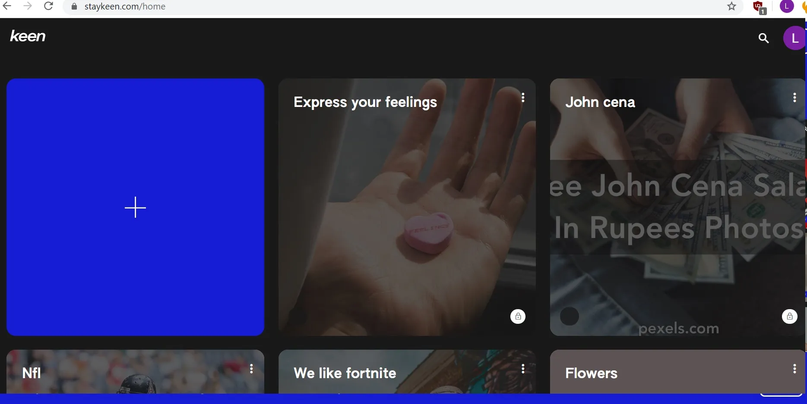
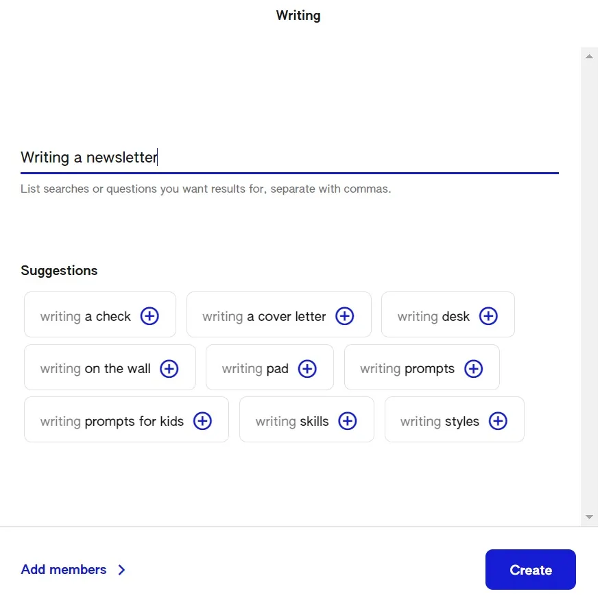
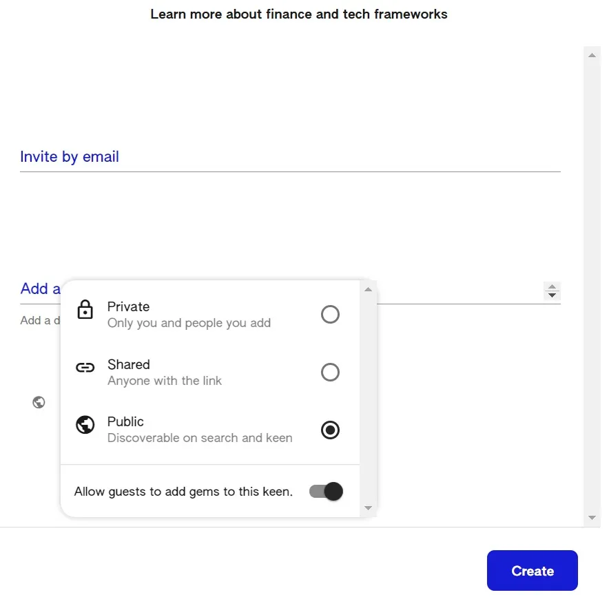

## Conclusión

Keen es un producto nuevo de Google pensado para seguir tus intereses\, aunque no estoy seguro si está pensado para ser más social o más enfocado en las ideas

## Guía interesante

Me invitaron a probar una beta de [Keen](https://staykeen.com/ 'Keen')\, un nuevo producto de [Area 120, Google's workshop for experimental products](https://area120.google.com/ '120') [^1]\. Keen está pensado para \"ayudarte a ampliar tus intereses\"\, \"manteniéndote interesado en tus intereses\, recibiendo recomendaciones y seleccionando buenas ideas\"\.

Echemos un vistazo más detallado al producto\.

### Registro y flujo de usuarios

El proceso de registro es sencillo si tienes una cuenta de Google y ya estás conectado en tu navegador\. No vi ninguna opción para personas sin cuentas de Google y supongo que eso cambiará cuando salgan de la Beta\.

Después de registrarte\, la primera vista es la de una pantalla en mosaicos\, con un gran signo de más a la izquierda\. Los otros mosaicos parecen tratar varios temas que podría interesarme consultar\. Si alguna vez hubo un argumento de que Google no te está espiando a ti y a tus datos\, podría ser este\, ya que ninguna de las sugerencias iniciales se acercaba a mis intereses\. ¿Quizá lo pre\-poblan según lo que pueda interesar al estadounidense medio\?

No estaba claro qué debía hacer primero entre el signo de más y las otras cartas\, así que hice clic en el signo de más\.

Esto me llevó a una opción de \"crear\"\, donde podía escribir lo que tenía ganas de hacer\. De ahí el nombre\, imagino\. Siempre estar atento a más oportunidades para promocionar mi boletín [^2]\, puse \"Escritura\"\.

También había una opción al final para \"enviarme un correo sobre nuevos hallazgos\"\. Normalmente no querría más correos\, ni siquiera para un servicio nuevo\, pero dejé la casilla marcada porque quería ver cómo serían las sugerencias de correo\. Al momento de escribir esto aún no he recibido ningún correo\; actualizaré la publicación si hay algo importante que destacar\.

El siguiente paso aparecía un cuadro de texto para \"listar búsquedas o preguntas para las que quieres resultados\.\" No estaba seguro de si poner tantas búsquedas como fuera posible era mejor que tener solo una frase\, así que solo puse una consulta de búsqueda\. Supuse que esto me daría resultados más específicos comparado con poner una larga lista de frases\, pero no puedo confirmarlo\.

También podría añadir miembros a esta lista \(¿un Keen\?\)\. Los miembros podrían añadir gemas al Keen\. Como no tengo amigos\, dejé eso intacto\, igual que la mayoría de nosotros en cuarentena\.

Ese fue el último paso para crear esta ficha\/carta\/keen [^3]\. Acabé en una pantalla que me recordó un poco a Pinterest\. Había 3 elementos en el menú de navegación\: \"feed\"\, \"gems\" y \"following\"\. Debajo estaba la página y los elementos de lo que hubiera elegido en el menú\. En la captura de pantalla de abajo puedes ver que sigo en \"feed\"\.

La web me pidió añadir una gema a mi colección y también gemar lo que me gustaba\. Así que vimos varias colecciones en la página inicial y podemos crear una colección nosotros mismos\. Dentro de una colección hay otra página que muestra varias gemas\, y también podemos crear gemas\.

Vamos a crear una joya entonces\. Volví a hacer clic en ese signo de más y apareció una ventana emergente que me indicaba \"añadir algo nuevo\"\. En ese momento estaba perdido\, ya que la interfaz parece una sola línea\, y me preguntaba si debería añadir un enlace\, una imagen\, un cuerpo de texto o algo más\. Si escribes mucho texto\, empieza a desplazarse hacia abajo\, pero sin una barra de desplazamiento visual a la derecha\. Supongo que es por motivos de diseño\. El cuadro de texto llega a un máximo de 4 líneas antes de desplazarse hacia abajo\, ya sea en móvil o en escritorio\, lo que supongo es para dejar suficiente espacio en blanco debajo para la vista previa de la publicación\.

Al final miré las colecciones de otros antes de volver a esto\, que no parece un gran flujo de usuarios\. Según lo que hacían los demás\, puse un título\, un enlace al artículo y luego un montón de hashtags [^4]\. Intenté poner saltos de línea pero no aparecían cuando se publicó la gema\.

La ventana emergente muestra una vista previa del enlace tras un pequeño retraso\. No puedes editar esa vista previa\, y tampoco desaparece si eliminas todo el texto del cuadro\, a menos que empieces a escribir más texto\.

Después de hacer clic en guardar\, mi gema se creó\, y pude encontrarla haciendo clic en la opción \"gemas\" en el menú de navegación\, que supongo muestra todas las gemas que he creado\. Esto sería en comparación con \"feed\"\, que serían gemas que Keen cree que debería revisar\. La opción \"seguir\" me da la opción de añadir más búsquedas o preguntas a esta colección\.

Ese es el proceso desde el registro hasta el paso de creación de la colección\, así que veamos también cómo funciona la navegación\.

### Navegando por otras colecciones

Para navegar por gemas y colecciones que no son tuyas\, tienes que volver a la página principal\. Desde ahí\, puedes desplazarte hacia abajo hasta \"explorar la comunidad\" y \"añadir tus ideas a solicitudes públicas\"\. Parece que Keen te da una lista aleatoria de cartas\, y puedes lanzar los dados en la esquina superior derecha para refrescar la lista\. Al principio me pareció extraño que no puedas buscar una frase y dejarlo al azar\, pero luego me di cuenta de que en realidad hay un botón de búsqueda cuando retrocedes hasta arriba\.

Parecía que había colecciones públicas limitadas para que las revisara\, ya que seguía encontrando repeticiones\. Sin embargo\, nunca vi mi propia colección pública en la lista sugerida\, así que quizá esa suposición sea errónea\. Después de tirar varias veces y obtener resultados como \"cómo posar para fotos \(para chicas\)\" y \"planear un baby shower\"\, dejé de buscar nada relevante para finanzas o tecnología\, y me metí en una colección pública titulada \"mantente productivo\"\.

La colección mostraba gemas de un grupo de otros colaboradores\, que habían subido una mezcla de enlaces de YouTube y páginas web\. Cada carta de gemas te da la opción de compartir\, comentar o abrir\. Hacer clic en la parte superior de las cartas no sirve de nada\, pero al hacer clic en algunas partes de la imagen o título inferior se abre el enlace adjunto\.

Compartir mostraba un enlace para copiar o enviar por correo electrónico o WhatsApp\.

Al abrir\, me llevó a una nueva página\, con una versión ampliada de la tarjeta\, pero no era tan diferente de ver la carta en la colección\. Lo importante es que esto aún no abre todo el artículo enlazado\, y es un paso adicional para hacer clic hasta el enlace\, que abre otra pestaña\. En otras palabras\, la gema solo da una pequeña vista previa\, la función de abrir no parece hacer mucho trabajo adicional en este momento\, y tendrás que rebotar en la web de Keen para leer el artículo real\.

Comentar me llevó a la misma página que la apertura\, pero anclada al final de la tarjeta para que pudiera escribir un comentario\. Publiqué un comentario en una tarjeta solo para probar la funcionalidad\. Puedes editar o eliminar comentarios después de haberlos publicado\.

Después de abrir la tarjeta\, hay un espacio debajo donde Keen resalta \"más por explorar\"\. Estas parecían gemas de la misma colección\, aunque no podía asegurarlo\. No podía \"abrir\" estas gemas\, y al hacer clic en ellas me llevo directamente al enlace\, en lugar de a la página a la que te llevas al \"abrir\" una gema\.

Eso es todo en cuanto a navegar\. Si quieres volver atrás y explorar otras colecciones desde la página abierta de gemas\, no puedes volver directamente\, ya que el logo de Keen que normalmente está en la esquina superior izquierda no está\, ya que ha sido reemplazado por una flecha que te devuelve a la colección de gemas\. Desde ahí puedes volver a la página principal y seguir tirando los dados para más colecciones\.

### Reflexiones sobre Keen

Después de experimentar con Keen\, a continuación van algunas ideas iniciales\, teniendo en cuenta que esto aún está en beta y es más bien un experimento\:

1. ¿Quién es el creador de contenido previsto en Keen\? Cuando añado colecciones y gemas\, ¿se supone que solo debo estar spameando enlaces\, ya que no hay espacio para crear mi propio contenido en Keen\? Si asumimos que esto se convierte en un producto escalado\, ¿cuál es el incentivo para que un creador de contenido siga publicando enlaces\?

   Supongo que es para el número de seguidores\, ya que no hay gustos ni visualizaciones\. Así que parece que esto sería otro Pinterest\, salvo por ideas\. Como creador de contenido\, estoy abierto a añadir mi contenido a más sitios para alcanzarlo\, siempre que crea que el retorno en visualizaciones merece la pena por la inversión de tiempo\. El tamaño de Keen probablemente aún no esté al alcance\, pero podría estar en un caso tordo\.

   Sin embargo\, dado que todos los enlaces me alejarán de Keen\, prefiero construir esa relación directamente con el usuario\, por ejemplo\, prefiero que leas mi boletín por correo electrónico antes que que lo navegues en Keen\. Esto implica que no tengo incentivos para mantenerte en Keen una vez que me sigues fuera de ella\, e incluso podría desincentivarme\, ya que encontrarás otro contenido que no es mío\.

2. ¿Quién es el consumidor de contenido objetivo en Keen\?

   La función de colección aleatoria es un poco más parecida a TikTok\, Stumble Upon o Instagram\. No parece estar relacionada ni con mi historial de búsquedas en Google ni con las colecciones y joyas que ya he subido\. ¿Es el usuario medio alguien aburrido y buscando entretenimiento\? A gran escala\, supongo que habría suficientes categorías interesantes para que la gente explore cada vez que se arriesga\. Parece un pequeño grupo de personas que buscaría \"contenido no relacionado con lo que a mí me gusta pero lo suficientemente aleatorio para ser interesante\.\"

   Keen está pensado para ayudarme a \"mantenerme interesado en tus intereses\, recibir recomendaciones y seleccionar buenas ideas\.\" Supongo que si creara colecciones solo de lo que me interesa y dependiera del feed dentro de esas colecciones para devolver resultados aleatorios\, quizá encontrara ocasionalmente un enlace relevante\. Como no sé cómo se clasifican y devuelven esos resultados\, no estoy seguro de si merecerá la pena que los revise\, especialmente porque siempre me expulsarán de la página de Keen\.

   Hay una función de comentarios en Keen\, pero otras funciones sociales parecen escasas y no pude acceder a los perfiles de usuario\. Me hace pensar que el caso de uso es más para ideas que para un producto social\.

3. ¿Cómo se va a monetizar esto\?

   Con Google\, quizá nunca\. Si monetiza\, supongo que vendría en forma de anuncios display\, quizá en forma de colecciones patrocinadas o joyas patrocinadas\.

4. ¿Cómo crecerá esto y atraerá creadores y consumidores\?

   Hay poco incentivo para que los creadores promocionen Keen\, ya que prefieren promocionar su contenido directamente si tienen la opción\. Por ejemplo\, si publico en Twitter\, prefiero dirigirte a mi sitio personal antes que a Keen\.

   Los consumidores podrían estar interesados en promocionar Keen como una nueva forma de descubrir contenido\, siempre que haya suficiente contenido de calidad para navegar\. Quizá algunos de ellos se conviertan en creadores\.

   Eso implica que el factor clave para el crecimiento será la adquisición de suficientes creadores en la plataforma\, antes de que haya suficiente escala para los consumidores como para que merezca la pena\. Si yo fuera Google\, estaría dirigiéndome a creadores de contenido en otros sitios y dándoles ventajas por publicar en Keen [^5]\. Y si tuvieran una función para destacar una tabla de líderes de creadores por seguidores\, colecciones o gemas\, y luego premiar a los creadores más destacados\, eso también podría ser interesante\.

5. ¿Cómo crecerán los costes\?

   Supongo que el plan es tener un volante de usuarios que atraigan creadores a usuarios a largo plazo\, para que los costes de adquisición de clientes sean bajos\. A corto plazo\, están los costes fijos de los empleados que trabajan en esto\, y lo que podría ser un alto coste variable en la adquisición de nuevos creadores y usuarios mediante anuncios y redes sociales\.

6. ¿Por qué no hay un feed de página principal con todas mis colecciones y gemas\?

   Parece que la intención era tener un feed separado para cada interés\, lo cual se vuelve molesto cuando llegas a la escala\. Tampoco puedo personalizar cómo quedan mis colecciones o gemas\.

7. ¿Por qué no puedo añadir una gema sin añadirla a una Keen\?

   Dicho de otro modo\, ¿no puedo simplemente crear gemas en vez de tener que montar un Keen para alojarlas\? Si tuviera 10 intereses diferentes\, ¿tendría que encontrar 10 Keens para añadir mis gemas\? Teniendo en cuenta que también estoy etiquetando las gemas\, parece complicado\.

   En general\, Keen me recuerda a una versión más visual y ágil de Pinterest mezclada con Stumbleupon\. Todavía no tengo claro cuál es el caso de uso ni cómo harán crecer el producto dado el alineamiento actual de incentivos\, pero ya veremos con el tiempo\. Como la mayoría de los productos sociales\, es difícil predecir el éxito a partir de una beta\.

[^1]: No es tan exclusivo como parece\, simplemente estaba en un grupo de Slack con una persona que las repartía\. Para ser sincero\, se habló de dar tarjetas regalo a los betatesters\.

[^2]: ¿Sabías que escribo cosas así regularmente en [Avoid Boring People?](https://avoidboringpeople.substack.com/ 'ABP')

[^3]: Podría estar equivocado\, pero creo que la expresión \"keen\" aún no había aparecido en el producto a estas alturas\, a menos que hagas clic para añadir miembros

[^4]: La captura de pantalla de abajo fue tomada después de que ya hubiera creado algunas gemas\; mis primeros intentos de hacerlo dieron errores en el proceso debido a lo que creo que fue un problema de inicio de sesión de cuenta cuando estaba usando la cuenta de un administrador o de otra persona

[^5]: O hacer pruebas beta y enviar enlaces a esas pruebas\. Hmm\.
