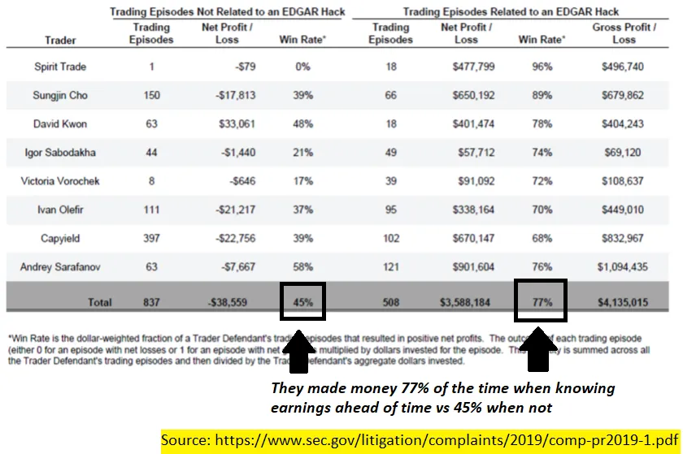
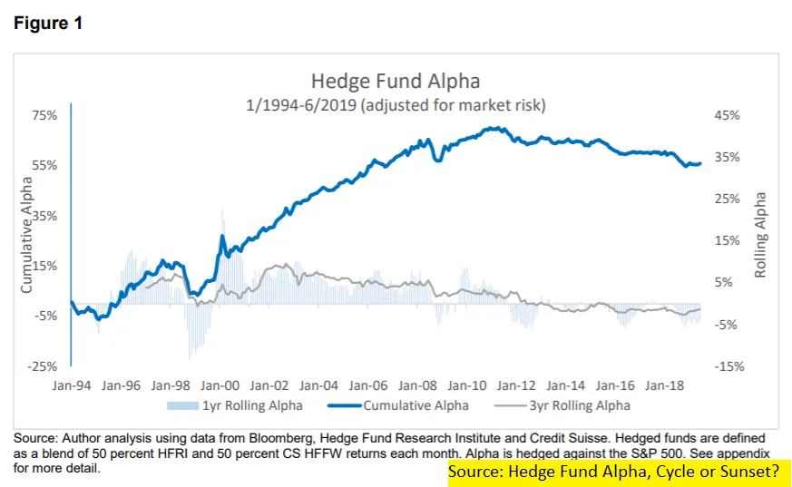

## Conclusiones

1. Invertir se trata de un rendimiento relativo\, no absoluto
2. La competencia tecnológica se basa en la fuerza relativa\, no absoluta
3. La sociedad trata sobre el estatus relativo\, no absoluto

## 1\. No apuestes por el ganador más probable

Imagina que eres analista de inversiones [^1]\.

Los analistas de inversiones investigan empresas y deciden qué acciones comprar o vender\. Ya has hecho tu trabajo [Tencent](https://en.wikipedia.org/wiki/Tencent 'tencent')\, una empresa china de internet\, concluyendo que las tendencias empresariales\, de gestión y macro parecen buenas\. Juegos y entretenimiento online [will continue increasing in importance](https://www.statista.com/outlook/203/117/video-games/china 'stat')\, [the executive team is experienced](https://chinachannel.co/a-deep-dive-into-tencents-restructuring-the-struggle-to-master-b2b/ 'tencent')\, y el crecimiento poblacional proporciona un viento a favor [for at least ten years.](https://ourworldindata.org/future-population-growth 'population')

Modelas todo eso en Excel\. Escribe un sencillo memorando de inversión de 5 páginas\. Prepara 50 páginas de gráficos complicados de bolsillo por si acaso [^2]\.

Convencido de tu brillantez y dedicación\, presentas a tu jefe en Tencent\. Sincronizas perfectamente la reunión\, un poco después de que él esté en la oficina\, pero antes de que se ocupe buscando casas de verano\.

Parece ir bien al principio\. Tu jefe conoce a Tencent\, ya que jugó al golf con el cuñado del COO de Tencent\. Está de acuerdo con todos tus puntos sobre negocio\, gestión y macro\. Genial\.

Al llegar al final de tu presentación\, te sientes bien y esperas que tu jefe inicie un pequeño puesto en Tencent\. En cambio\, se recuesta en su silla\, vuelve a abrir las pestañas de casas de vacaciones y te dice que no has entendido el punto\. No es tan bueno\.

¿Qué salió mal\?

**Donde te equivocaste fue no teniendo en cuenta el consenso del mercado\.** Es un error que cometen la mayoría de los inversores minoristas\, y a veces también los profesionales\.

**Invertir es un juego de familiares\, no de absolutos\.** Así es como funciona la acción _relativo a las expectativas_ Eso determina si obtienes rendimientos por encima de la media o no\.

Toda esa investigación que hiciste no importa si es ampliamente conocida\. Por definición\, eso ya está presupuestado en el mercado\. Lo que necesitas demostrar es [what the market is missing, and why that misperception will correct itself.](https://medium.com/graham-and-doddsville/pitch-the-perfect-investment-1a4e8d0c077b 'market') Si no tienes ventaja [^3]\, tu discurso no tiene sentido\.

Por eso las empresas que publican buenos datos en sus informes de resultados aún pueden ver cómo el precio de sus acciones baja\.

Por eso puedes obtener rendimientos por debajo de la media comprando una gran empresa con precios perfectos\, y por eso puedes obtener rendimientos por encima de la media comprando una mala que se dejó por muerto\.

Y por eso conocer ilegalmente los beneficios de la empresa con antelación [doesn't mean you'll make money 100% of the time.](https://www.sec.gov/litigation/complaints/2019/comp-pr2019-1.pdf 'SEC') [^4]

En la inversión\, [you want to bet on the mispriced horse, not the horse most likely to win.](https://www.oaktreecapital.com/docs/default-source/memos/you-bet.pdf 'bet')

**Esto se aplica tanto a nivel micro a las presentaciones individuales de acciones como a nivel macro al rendimiento de las firmas de inversión\.** La habilidad absoluta no importa\. Es la habilidad del fondo _Relativo a la competencia_ Eso determina si puede obtener rendimientos superiores a la media\.

Por eso información como la tarjeta de crédito\, la descarga de aplicaciones o los datos satelitales ya no son factores para el rendimiento superior\, sino que son factores importantes\.

[It's why luck is playing a bigger role, since the dispersion in skill has been reduced.](https://research-doc.credit-suisse.com/docView?language=ENG&format=PDF&source_id=em&document_id=805456950&serialid=LsvBuE4wt3XNGE0V%2B3ec251NK9soTQqcMVQ9q2QuF2I%3D 'CS')

Y es por eso [the overall outperformance (alpha) for hedge funds has stagnated,](http://finance.darden.virginia.edu/wp-content/uploads/2019/08/Hedge-Fund-Alpha_09.29.2019.pdf 'alpha') A medida que más inversores conocen las mejores prácticas y marcos\.

En la inversión\, todo es relativo\.

## 2\. Tu familiar tecnológico tiene ocho años

Imagina que estás en una empresa tecnológica vendiendo productos online\.

Has encontrado un canal publicitario que te cuesta 1 dólar para conseguir un cliente\, y cada cliente te da 10 dólares en valor de vida [^5]\.

Parece un gran negocio\, así que empiezas a gastar tu presupuesto de marketing en ello\. Funciona\, y empiezas a buscar casas de vacaciones de verano para comprar con el beneficio extra\.

Pero empiezas a darte cuenta de que el número de clientes que consigues sigue bajando\, lo que implica que tu coste de adquisición de clientes \(CAC\) sigue subiendo\. Con el tiempo\, apenas estás equilibrando a los clientes\. Sueños de vacaciones de verano destrozados\.

¿Qué salió mal\?

**Donde te equivocaste fue si no considerabas cuál era el equilibrio del mercado\.** No importa lo eficiente que haya sido tu inversión en marketing\, si tus competidores fueron más eficientes que tú\.

Gastarán más que tú\, conseguirán más clientes\, obtendrán más beneficios y repetirán\. En el proceso\, impondrán eficiencia de precios en el mercado y en ti\. Tú optimizabas para los máximos locales\; todos los demás resolvían para los máximos globales\.

Por eso saber quiénes son tus competidores es fundamental para la supervivencia del negocio\. Si estás contento con tu CAC offline como un negocio mayoritariamente offline\, más te vale esperar que alguien no lo esté [dropship your product](https://www.theatlantic.com/technology/archive/2018/01/the-strange-brands-in-your-instagram-feed/550136/ 'dropship') y subir tu CAC\. Si estás contento con tu CAC online como negocio mayormente online\, será mejor que esperes que alguien no lo esté [open a retail store](https://www.businessinsider.com/online-direct-to-consumer-brands-with-retail-stores-locations-2018-2#allbirds-3 'DTC') y te cierran\.

Por eso las cuotas de mercado relativas son más importantes que las absolutas\. La diferencia en la eficiencia del gasto\, no solo la eficiencia del gasto\, es lo que se acumula a lo largo del tiempo para obtener rendimientos por encima de la media\.

Y es por eso [word of mouth and customer loyalty is important](https://medium.com/@gavin_baker/scale-and-loyalty-are-more-important-online-than-offline-which-drives-much-of-the-winner-take-992345be93a9 'loyalty')\, ya que permite posponer temporalmente los efectos de las comparaciones relativas\. Cuando el CAC está en un mínimo de \$0\, ya no es el factor limitante [^6]\.

Esto se aplica no solo a la captación de clientes\, sino a todas las partes de la empresa\, desde el talento que contratas hasta la calidad del producto que haces\. Conocer sus fortalezas por sí solo\, sin saber cómo se comparan con otros\, no tiene sentido\.

Antes\, cuando la información\, las personas y los productos viajaban más despacio\, esto era menos problemático\. Los clientes te comparaban con las alternativas físicamente más cercanas y daban por terminado\. Hoy en día\, el familiar relevante está en todas partes y en todo\. Estás compitiendo contra [8 year old toy reviewers](https://canoe.com/business/money-news/highest-paid-youtube-star-is-an-eight-year-old-boy 'toy') y [engineers outsourcing their own jobs to China so they can surf reddit.](https://www.npr.org/sections/thetwo-way/2013/01/16/169528579/outsourced-employee-sends-own-job-to-china-surfs-web 'reddit') El efecto de la tecnología ha reducido la importancia de la proximidad física\.

Es el [Red Queen hypothesis](https://en.wikipedia.org/wiki/Red_Queen_hypothesis 'Queen') Desarrollándose\, con las empresas necesitando encontrar constantemente una ventaja y la carrera acelerándose cada año\. Los descubrimientos se comparten y se converten en mercancías con el tiempo\, erosionando constantemente tu ventaja\. Cuando no tienes ventaja\, obtienes rendimientos medios\.

En tecnología\, todo es relativo\.

## 3\. Relativamente hablando\, el multimillonario no es rico

Imagina que solo intentas vivir tu vida\.

No\, espera\, no tienes que imaginar\, eso somos todos\.

Has leído los libros de autoayuda\, has ido a ese retiro zen y has visto esa charla TED\. Todos te dicen que te centres en mejorar y que estés menos obsesionado con compararte con los demás\.

Incluso Google devuelve 1\.800 millones de resultados para \"no compararte con los demás\" frente a 0\.400 millones para \"cómo compararte con los demás\"\. Y los mejores resultados de estos últimos son todos artículos sobre cómo hacerlo _¡Para_ comparando\.

Y eso es cierto\. Deberías centrarte en mejorar y en intentar [be 1% better every day.](https://heleo.com/get-1-better-every-day/19161/ '1%')

Pero ya sabes a dónde voy con esto\.

Hay una diferencia entre lo que la gente dice y lo que realmente hace\. Puedes juzgarte a ti mismo con un estándar absoluto\, pero todos los demás te juzgan por uno relativo\. En relación con sus expectativas sobre ti\, o respecto a otra persona\.

La sociedad es una gran sociedad [sorting algorithm.](https://en.wikipedia.org/wiki/Sorting_algorithm 'sort') [^7]

Por eso nos gusta apoyar al desvalido\, la historia de la recuperación o la apuesta remota\. Premiamos a quienes rinden mejor de lo esperado y nos importan menos quienes rinden como se espera\, aunque hayan sido geniales todo el tiempo\. Incluso hay toda una parábola bíblica sobre ello\, [the prodigal son.](https://en.wikipedia.org/wiki/Parable_of_the_Prodigal_Son 'prodigal') [^8]

Por eso nos obsesionamos con métricas cuantificables que puedan demostrar nuestro estatus relativo entre nosotros\. Seguidores\, me gusta\, compartidos\. Mientras sea algo que muestre dónde estamos en comparación\, siempre lo desearemos\. [^9]

Y por eso el CEO de Goldman Sachs y multimillonario Llyod Blankfein [doesn't feel rich, since he's comparing himself against his multi-billionaire friends.](https://markets.businessinsider.com/news/stocks/goldman-sachs-ex-ceo-lloyd-blankfein-might-vote-trump-sanders-2020-2-1028927812 'CEO')

¿Qué deberías hacer entonces\?

Poco prometedor y con resultados superiores parece ser una forma popular de hacerlo\. La gente saca las expectativas y ancla a otros en un rendimiento más bajo porque funciona [^10]\.

Elegir tu propio grupo de competidores para compararte podría ser otra forma\. Si no estás satisfecho con tu grupo de compañeros\, hay mil millones de personas con quienes intercambiar\.

Y deberías seguir buscando medirte por tu propio scorecard y mejorar por el simple hecho de hacerlo\. Solo debes saber que no es así como te miden los demás\.

En la vida\, todo es relativo\.

## Otros

1. [Jukebox is an AI that makes music. Check out a re-rendition of Ella Fitzgerald](https://openai.com/blog/jukebox/ 'Juke')
2. [Higher reputation sellers are less likely to take advantange of shortages in supply by price gouging](http://leixu.org/xu_price_gouging.pdf 'price')
3. ["The SEC is basically saying 'spring loading' is legal insider trading."](https://nongaap.substack.com/p/profiting-from-corp-governance-dark-bef 'Mike')
4. ["Lying somewhere between a club and a loosely defined set of friends, the Small Group is a repeated theme in the lives of the successful"](https://jmulholland.com/small-group/ 'small')
5. ["Turns out, even patients who appear \[to be\] in a coma can have more cognitive function than can be observed with standard clinical methods"](https://aeon.co/essays/to-say-what-consciousness-is-science-explores-where-it-isnt? 'coma')

[^1]: Probablemente algunos de vosotros sí\. Me refiero a los analistas del lado comprador\, no a los vendedores \(que investigan pero no invierten para la firma\) ni a los analistas de banca de inversión \(al contrario del nombre\, no invierten en absoluto\)\.

[^2]: Un memorando de inversión es un informe sobre la acción que estás promocionando\, comúnmente utilizado en la industria de inversiones como una forma de resumir tu idea\.

[^3]: Un marco para la ventaja de inversión es [the information, analysis, or time horizon framework that John Huber uses](http://sabercapitalmgt.com/what-is-your-edge/ 'Huber')

[^4]: De [page 34 of the pdf](https://www.sec.gov/litigation/complaints/2019/comp-pr2019-1.pdf 'pdf')\. Véase [this paper](https://pdfs.semanticscholar.org/a537/e9c2776ca4b50c059ada99a94110359ec3c9.pdf 'Chloe') por Chloe Xie\, que además muestra la baja \(mala\) relación señal\-ruido en esas operaciones

[^5]: Dicho de forma sencilla\, [every customer pays you $10 for every $1 you're spending on them](https://blog.hubspot.com/service/how-to-calculate-customer-lifetime-value 'LTV')

[^6]: Supongo que puedes tener CAC negativo\, donde alguien más te paga para adquirir usuarios de pago\, en una situación de tres partes\. No lo he visto mucho\, pero dime si es una peculiaridad del sector en el que estás\.

[^7]: Un algoritmo de ordenamiento es un programa que coloca los elementos en el orden que deseas\, una parte fundamental de la programación

[^8]: Un padre tiene dos hijos\, uno bueno y otro malo\. El malo se va de casa para divertirse\, pierde todo su dinero tras muchos años y vuelve avergonzado\. Para sorpresa de ambos hijos\, el padre recibe al malo en casa con una fiesta\. El padre dice que el hijo malo se perdió y ahora está encontrado\, y eso merece la pena celebrarlo\. El hijo bueno se queda con todo el dinero y se muda a París\, haciendo que el padre se dé cuenta de que no debería haber dicho eso\. Puede que esté recordando mal la moraleja de la historia\.

[^9]: Los usuarios de Reddit inventan historias para conseguir \"puntos de karma\" cuando todo está inventado y los puntos no importan\. Incluso los rechazados sociales como [hikikomoris](https://en.wikipedia.org/wiki/Hikikomori 'hiki') seguirá deseando cierto estatus\, como comentar en línea qué serie de anime es superior y refleja un mejor gusto del espectador

[^10]: [There is a study that disputes this advice, claiming it has no significant impact](https://www.inc.com/jessica-stillman/underpromise-and-overdeliver-is-terrible-advice.html 'study')
