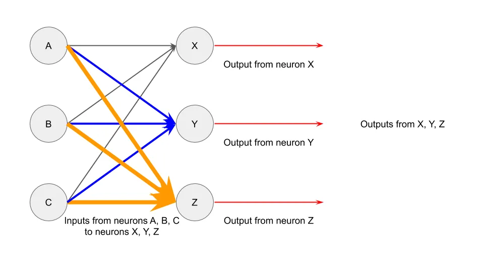
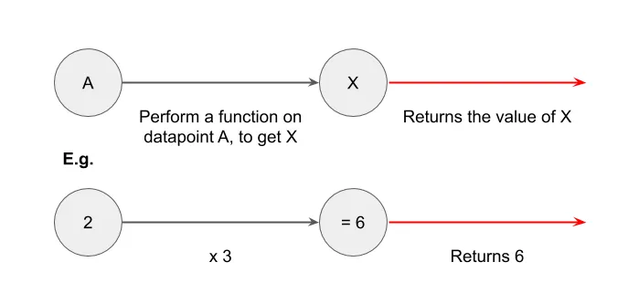

## Conclusión

El aprendizaje automático da menos miedo de lo que crees y es más común de lo que crees\.

## Magia del aprendizaje automático

Ahora oímos hablar constantemente de aprendizaje automático \(ML\)\, deep learning o inteligencia artificial [^1]\.

De los intereses de búsqueda\:

A menciones en libros\:

A los titulares de los periódicos sobre robots que toman el control de nuestros empleos\:

Hay un interés creciente en el aprendizaje automático\, y parece que cada dos días surge una nueva startup que recauda 100 millones de dólares gracias a su nueva tecnología de aprendizaje automático\.

Sin embargo\, la mayoría de la gente se intimida con el aprendizaje automático\, lo equipara con magia que solo hacen las startups de vanguardia\. No ayuda que las matemáticas puedan ser intimidantes\:

Hoy quiero ayudaros a tener una mejor intuición sobre el aprendizaje automático\, primero observando una empresa que utiliza el aprendizaje automático y luego repasando lo básico de cómo funciona una red neuronal\. Mi objetivo al final de esto es que os asustéis menos cuando alguien usa el término \"ML\" como si fuera demasiado guay para el colegio\.

## Estudio de caso de aprendizaje automático

Imagina que viniera a ti buscando inversión en una empresa que use ML\. Aquí va la presentación\:

\"La Compañía M utiliza ML y [optical character recognition (OCR)](https://en.wikipedia.org/wiki/Optical_character_recognition 'OCR') para comparar datos de entrada con cientos de millones de registros en fracciones de segundo\. Ya tiene alianzas con Amazon\, el gobierno de EE\. UU\. y Fedex\. La empresa M ya ha escalado hasta permitir \>100\.000 millones de transacciones anuales y ha ampliado su cobertura a todo Estados Unidos\.\"

Suena emocionante\, ¿verdad\? He seleccionado algunos idiomas\, pero no está tan lejos de eso [actual press releases by other companies:](https://www.eu-startups.com/2020/01/anyline_raises_over_10_million_and_zooms_to_us/ 'eu')

\"Anyline\, una startup líder en Reconocimiento Óptico de Caracteres \(OCR\) que utiliza IA para el reconocimiento de texto\, ha recaudado 10\,7 millones de euros en financiación Serie A\. La startup austriaca\, que ya trabaja con grandes nombres como Toyota\, IBM\, Canon\, la ONU y PepsiCo\, utilizará los fondos para abrir su primera oficina en Estados Unidos en Boston\"

Pero volviendo a la empresa M\. La parte de OCR se refiere a que miran una imagen y reconocen lo que dice mediante ML\. Parece que lo hacen de forma eficiente\, precisa y a gran escala\. Sus alianzas también parecen respetables\. Probablemente pienses que son un unicornio prometedor liderado por graduados de Stanford que empezaron a programar mientras llevaban pañales\.

¿Invertirías\?

Si dijiste que sí\, simplemente invertiste en el [United States Postal Service](https://www.enterpriseai.news/solution_content/hpe/governmentacademia/machine-learning-applications-for-the-modern-enterprise/ 'USPS')\.

No\, en serio\, la oficina de correos lleva mucho tiempo usando ML\. [They started trialing it in 1997, and by 2014 were already mostly recognising addresses via ML algorithms.](https://www.buffalo.edu/content/dam/www/research/pdf/Postal-Automation-Highlights_20160516.pdf 'ML') No es exactamente el estereotipo de startup que te imaginabas\.

Mi punto aquí no es criticar Anyline ni startups similares\. Estoy seguro de que están resolviendo problemas difíciles y no son pura publicidad [^2]\. Más bien\, quiero que te des cuenta de que **El aprendizaje automático se está utilizando en escenarios que suenan mundanos\, y lleva haciéndolo desde hace tiempo\.** La próxima vez que alguien te proponga ML\, tenlo en cuenta\.

## Intuición del aprendizaje automático

Ahora que sabemos dónde se usa el ML\, vamos a ver cómo puede funcionar el ML\. Voy a usar un [neural network](http://news.mit.edu/2017/explained-neural-networks-deep-learning-0414 'NN') para esto\, hay muchas otras formas de ejecutar ML\.

Las redes neuronales se modelan a partir de las neuronas del cerebro\, así que será útil entender cómo funciona esa conexión\. Así es como es una neurona\:

Mientras aún estemos [aren't quite sure how the brain works, a leading theory is that the neurons can take inputs, do some computation, and then send outputs.](https://www.quantamagazine.org/neural-dendrites-reveal-their-computational-power-20200114/ 'neural') [^3] Una forma simplificada de representar la interacción de dos neuronas podría ser así\. Imagina que el círculo es el cuerpo principal\, y esa línea es el axón que conecta con otras neuronas\:

Y si tuvieras tres pares de neuronas\, podría verse así\:

Y si las neuronas pudieran interactuar entre sí\, podría verse así [^4]\:

Tengamos esa imagen en cuenta mientras pensamos en cómo podría relacionarse esto con los ordenadores y el aprendizaje automático\.

Tomemos una ecuación matemática sencilla\, como 2 x 3 \= 6\. Pongamos \"2\" como datos de entrada\, \"x 3\" como función que queremos realizar y \"6\" como datos de salida\. Esto nos da algo así\:

¿Y si tuvieras más de un dato de entrada\? Podrías hacer \(2 \+ 5\) x 3 \= 21\. Esto nos da algo así\:

Y una vez más podemos combinar múltiples funciones que interactúan en múltiples entradas\, así\:

Puedes ver cómo esto se parece al diagrama de interacción neuronal anterior\, de ahí el nombre \"red neuronal\"\.

Vamos un paso más allá\. Imagina que tienes valores en A\, B y C\, igual que antes\. Esta vez\, los valores representan [pixel values.](https://homepages.inf.ed.ac.uk/rbf/HIPR2/value.htm#:~:text=For%20a%20grayscale%20images%2C%20the,is%20taken%20to%20be%20white. 'pixel') En este caso\, estamos hablando de 3 píxeles\.

De forma similar puedes hacer algún tipo de función matemática sobre esos puntos de datos y obtener resultados en X\, Y\, Z\. Ignoraremos exactamente qué función matemática estamos usando por ahora [^5]\, pero solo devuelve 0 o 1 de los puntos de datos\. No solo eso\, sino que también solo nos dará un único \"1\"\, con el resto siendo \"0\"\. Las salidas aquí representan el alfabeto predicho\, si se devuelve un \"1\" en ese círculo\.

Esto se parece\:

En este ejemplo\, podemos ver que se devolvió un \"1\" para la salida originalmente denotada como X\. Se devolvió \"0\" para las otras salidas\. Esto nos indica que X es el valor predicho\, basado en las entradas de los 3 píxeles \(0\, 100\, 255\) que le damos\.

Puedes imaginar ampliar ese marco para todas las letras del alfabeto y para tantos píxeles de entrada como necesites\. La intuición es similar\, solo que hay más pasos implicados\. Por ejemplo\, si quisieras predecir cualquiera de las 26 letras basándote en una imagen de 1000 píxeles\, necesitarías 1000 entradas a la izquierda y 26 salidas a la derecha\. De las salidas\, solo 1 tendría \"1\" y el resto sería \"0\"\.

Tampoco estás limitado a solo dos capas de entrada y salida\. También puedes incluir más \"capas ocultas\" que toman la entrada desde la izquierda y luego devuelven una salida a la derecha\. Mientras configures tus funciones de modo que devuelvan \"1\" y \"0\" en la última capa\, estás bien\. Puede haber cualquier número de capas ocultas\, y cada capa puede tener cualquier número de elementos\, sin necesidad de ser igual a la entrada o a la salida\.

¡Y eso es todo\! Has visto cómo un proceso puede convertir entradas de datos \(como los valores de píxeles de imágenes\) en salidas \(alfabetos y direcciones\)\. Ahora entiendes cómo funcionan la mayoría de las redes neuronales\. Muchas implementaciones de ML usan redes neuronales\, lo que significa que ahora también conoces el concepto subyacente que impulsa estas empresas de ML\.

Por supuesto\, la configuración en sí es más complicada y requiere mucho más tiempo y experiencia [^6]\. He pasado por alto todas las matemáticas\, estadísticas y programación que hacen que el aprendizaje automático sea realmente más difícil de implementar en la vida real\. Sin embargo\, espero que la intuición que tienes ahora te intimide menos cuando alguien use \"ML\" como palabra de moda en el futuro\.

[^1]: A lo largo del texto usaré aprendizaje automático \(ML\)\, aprendizaje profundo \(DL\) o inteligencia artificial \(IA\) de forma intercambiable\, pero técnicamente son cosas diferentes\, [some being a subset of the other.](https://towardsdatascience.com/clearing-the-confusion-ai-vs-machine-learning-vs-deep-learning-differences-fce69b21d5eb 'ML') Por el bien del post\, realmente no importa\.

[^2]: Bueno\, algunos probablemente sean completos estafadores

[^3]: No soy científico\, corrígeme si me equivoco\.

[^4]: He mostrado todas las entradas de una neurona en un solo color y tamaño para facilitar la comprensión\, especialmente al traducirlas a las matemáticas de la red neuronal\. Sin embargo\, podrías pensar en los agrupamientos de otras maneras\, como todas las salidas de una neurona como un solo color\.

[^5]: Lo que ocurre aquí es que se realiza una primera función de los parámetros multiplicados por las entradas\, y luego una [logistics function](https://en.wikipedia.org/wiki/Logistic_function 'log') aplicado para limitar el rango de salida de 0 a 1\. La idea es entrenar los datos repetidamente sobre el conjunto de datos de entrenamiento de modo que la primera función de parámetros te dé un bajo error de predicción al compararse con un conjunto de datos de validación\.

[^6]: Por ejemplo\, ¿cómo sabes qué función usar\? ¿Cómo configuras esto en un programa\? ¿Cómo compruebas que las predicciones sean precisas\? He simplificado la mayoría de los aspectos técnicos\, pero si te interesa aprender más\, [Andrew Ng's coursera is a good place to start](https://www.coursera.org/learn/machine-learning 'coursera')\. Advertencia\: es mucho más complejo y difícil\.
