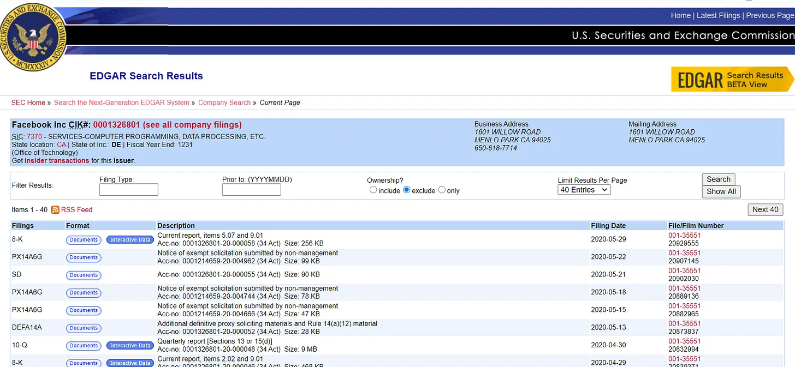
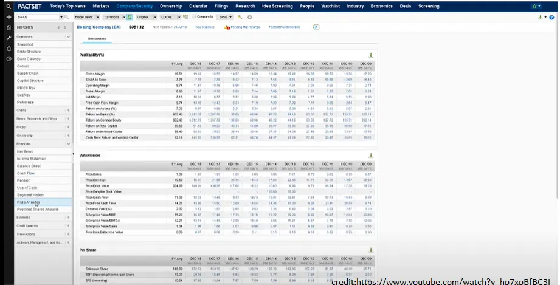

## Conclusión

Es poco probable que tengas ventaja informativa como inversor minorista frente a profesional\; deberías buscar ventaja en otro sitio

## Uso de datos en la inversión

La semana pasada\, analizamos [how companies use machine learning to take data, process it, and come to a conclusion.](/writing/ml 'ML')

Esta semana\, analizaremos un proceso más orientado a lo humano\. Repasaremos cómo los analistas de una firma de inversión obtienen datos\, los analizan y forman una tesis de inversión\. Con inversores [spending >$30bn on data](https://www.ft.com/content/222855de-4fbf-11e9-9c76-bf4a0ce37d49 'spend')\, ¿a dónde va todo ese dinero\?

Lo haré de forma típica [long/short fundamental hedge fund](https://en.wikipedia.org/wiki/Long/short_equity 'LS') Punto de vista\, más que una empresa cuantitativa [^1]\. Por comodidad\, también hablaré de esto desde la perspectiva de una empresa estadounidense\, aunque el proceso general que se aplica a continuación se aplica internacionalmente\.

Mi objetivo es que tú\, como inversor minorista\, tengas una mejor comprensión de la ventaja que tienen los profesionales y lo que eso implica en la ventaja que puedes tener [^2]\.

### Datos públicos

Empresas cotizadas en bolsa [have to file financial statements regularly with the SEC.](https://www.sec.gov/edgar.shtml 'SEC') Estos están disponibles públicamente tanto en las páginas de relaciones con inversores de la empresa como en las páginas de relaciones con inversores de la empresa [SEC Edgar](https://www.sec.gov/edgar/searchedgar/companysearch.html 'Edgar') para que lo busques\.

Las empresas también organizan llamadas regulares de resultados para cada anuncio importante de resultados\, a las que cualquiera puede acceder [^3]\. Las transcripciones de las llamadas a veces también se pueden encontrar en las páginas de relaciones con inversores\, o en sitios como [Seeking Alpha.](https://seekingalpha.com/earnings/earnings-call-transcripts 'SA') Sin embargo\, pueden ser más difíciles de localizar que los estados financieros\.

Las empresas suelen publicar noticias a través de [PR newswire](https://prnewswire.mediaroom.com/about-pr-newswire 'PR') además de publicarla en su propia página web\. Estas noticias pueden ser los informes financieros mencionados anteriormente o eventos especiales como adquisiciones y cambios de gestión\. La noticia se distribuye a través de un canal de noticias de relaciones públicas a otros sitios de noticias\.

Además de los datos públicos mencionados anteriormente\, un analista dedicaría tiempo a consultar Twitter\, buscar Google o leer reddit\. Recopilan todas estas fuentes primarias para formarse una opinión sobre si invertir en la empresa\.

Esta es una parte del proceso de investigación de inversión\, el descubrimiento y uso de información pública que cualquiera puede hacer también\. A partir de lo anterior\, ya tienes suficientes datos para construir un modelo financiero de empresa\, analizar tendencias y formar una tesis de inversión\. De hecho\, muchos inversores minoristas nunca van más allá de esta parte y aun así les va bien\. Como he mencionado antes\, hay muchas formas de tener éxito en la inversión\.

### Acceso a datos públicos

Entonces\, si eso es todo lo que se necesita\, ¿por qué existen tantas otras empresas para proporcionar información a los inversores\? ¿Cómo fabrica Bloomberg [$20k a year from a single subscription?](https://www.vox.com/2020-presidential-election/2019/12/11/21005008/michael-bloomberg-terminal-net-worth-2020 'Bloomberg')

Pues resulta que\:

1. Obtener datos directamente de SEC Edgar es un gran problema
2. La gente siempre quiere más datos\, porque cree que más datos es mejor
3. Hay muchos otros datos privados que puedes comprar

En esta sección hablaré del primer punto\, el de la experiencia del usuario\.

Supongamos que quieres mirar rápidamente los ingresos de una empresa a lo largo del tiempo\. Si lo hicieras de la forma tradicional en Edgar\, tendrías que buscar la empresa\, lo que resultaría en una página como esta\:

Luego tendrías que buscar cada presentación que quieras\, descargarlos todos y copiar los datos en una hoja de cálculo [^4]\. Después de limpiar los datos y añadir filas para hacer los cálculos año tras año\, por fin obtendrías las tendencias que querías\.

Eso fue mucho trabajo por muy pocos beneficios\, por eso existen empresas como Bloomberg\, FactSet y Thomson\. Recopilan datos financieros y los tienen fácilmente accesibles dentro de la plataforma\.

¿Todo ese trabajo que hiciste para encontrar los ingresos de una empresa\? FactSet lo tiene disponible para todas las empresas cotizadas\:

Por supuesto\, los datos almacenados no siempre son perfectos [^5]\. Sin embargo\, por todas las veces que necesites algo rápido para consultar\, las plataformas que ya han hecho todo el trabajo en un formato fácil de digerir son invaluables\. No necesitas pasar horas extrayendo datos cuando están disponibles con unas pocas pulsaciones\. Este factor de comodidad es una de las razones por las que las plataformas pueden cobrar una base fija de suscriptores [^6]\, aunque disruptores como [Koyfin](https://www.koyfin.com/ 'koy') están intentando socavarlos\.

También hay empresas como BamSEC y Last10K\, que facilitan encontrar las presentaciones\. Por ejemplo\, BamSEC categoriza diferentes tipos de presentaciones\, muestra los títulos de las presentaciones y te permite encontrar rápidamente ediciones anteriores de presentaciones\. Estas empresas no tienen tantas funciones como las plataformas anteriores\, pero aun así ahorran tiempo a un analista\.

### Acceso a datos de investigación del lado de venta

Hemos hablado de la experiencia del usuario\, ahora hablemos de los puntos sobre obtener más datos y pagar por ellos\.

Además de proporcionar datos financieros agregados sobre empresas\, las plataformas Bloomberg\, etc\.\, también proporcionan estimaciones de investigación del lado de la venta \(sellside\)\.

Como recordatorio\, estos investigadores son personas de bancos de inversión que publican informes sobre la empresa\. Normalmente son las personas a las que se hace referencia cuando las noticias dicen \"un analista degradó una empresa a venta\" o \"los bancos suben el precio objetivo de una empresa\"\. La investigación del lado de la venta propone sus propios modelos financieros con estimaciones para futuras finanzas de la empresa\, supuestamente usando el modelo para llegar a un objetivo de precio [^7]\.

A muchos inversores les gusta ver estos números del lado de venta para hacerse una idea de dónde está el consenso del mercado\. Por ejemplo\, si la media de las estimaciones del lado de venta para los ingresos del próximo año es de 100 dólares\, pero crees que serán 1000\, o vas a pasar un muy buen rato o uno muy malo\.

Si eres un inversor profesional\, siempre puedes enviar un correo electrónico a los bancos para obtener su investigación [^8]\. Si realmente quisieras\, podrías compilar todos esos PDFs y Excel juntos\, y hacer el benchmark tú mismo\.

Obviamente\, nadie quiere hacer eso [^9]\, así que los investigadores proporcionan estos datos a las plataformas\, que luego los muestran a la comunidad inversora\. Si quieres un resumen rápido de dónde está el consenso del lado de la venda\, también está disponible en unas pocas pulsaciones\.

### Acceso a la gestión de la empresa

Muchos inversores evalúan las empresas en función de la calidad de sus equipos directivos\. Para facilitar esto\, tanto las empresas como la investigación del lado vendedor organizan conferencias regulares para inversores\. La intención es que la dirección se reúna con los inversores\, explique la estrategia de la empresa a los nuevos inversores sustituyendo a todos los que han sido despedidos y responda preguntas\.

Los inversores pueden actualizar sus modelos financieros o su opinión sobre la empresa basándose en estas reuniones con la dirección\. Por ejemplo\, si un equipo directivo ha dado una respuesta pobre a tu pregunta\, podrías estar interesado en vender en corto la acción\.

\"Espera\, esto suena a uso de información privilegiada\"

No\, no lo es\. ¿Pensarías que la conferencia anual de accionistas de Buffett\, [attracting 40k people yearly](https://www.investopedia.com/articles/investing/121715/how-attend-berkshire-hathaways-annual-meeting.asp 'Buffett')¿es el uso de información privilegiada\? Si no\, ¿qué hace que las conferencias mencionadas sean diferentes\? Que no te inviten a una fiesta no significa que sea ilegal\. Hay normas que regulan lo que la dirección puede decir\, pero esta práctica lleva mucho tiempo en marcha\.

### Expertos del sector

Los inversores también están interesados en hablar con empleados de los sectores que están investigando\. Por ejemplo\, si intento entender cómo podrían ser los ingresos por publicidad en Facebook\, querría hablar con grandes compradores de anuncios en Facebook\. Si son más optimistas respecto al producto\, eso podría ser una señal positiva\.

[Expert network firms like GLG, AlphaSights, Third Bridge](https://www.forbes.com/sites/jonyounger/2020/02/12/the-global-expert-network-business-is-growing-fast-meet-inex-one/#435336b2f257 'GLG') existen para ayudar a los inversores a encontrar a esas personas\. Estas empresas cobran por poner en contacto a inversores con expertos del sector\; los consultores también cobran por su tiempo\. Te sorprendería cuántos ex ejecutivos hacen este tipo de trabajo en su tiempo libre\.

\"Espera\, esto suena a uso de información privilegiada\"

No\, no lo es\. Si estuvieras interesado en invertir en una empresa sanitaria\, ¿pensarías que preguntar a tus amigos médicos sobre la empresa es uso de información privilegiada\? Si no\, ¿por qué lo anterior debería ser diferente\? Que no puedas permitirte el intermediario no significa que sea ilegal [^10]\.

### Datos del sector

Por último\, los inversores también utilizan \"datos alternativos\" para predecir mejor los resultados de las empresas\. Por ejemplo\, si te interesa saber cómo va una app móvil\, puede que te interesen las estadísticas de descargas de esa empresa\. Si te interesan las ventas en e\-commerce\, puede que te interesen los datos de tarjetas de crédito de un sector\. Si quieres monitorizar el peso de los camiones para estimar si una empresa está haciendo más ventas \(camiones más pesados\)\, hay una empresa para eso [^11]\.

Hay un [large market of sellers for such data](https://alternativedata.org/data-providers/ 'mkt')\. Empresas como AppAnnie\, SensorTower y QuestMobile son bien conocidas por proporcionar datos de aplicaciones\. Empresas como Earnest Research y Second Measure también son conocidas por proporcionar datos de tarjetas de crédito\.

\"Espera\, esto suena a uso de información privilegiada\"

¿Sería ilegal salir y contar clientes en una tienda\?

### Qué significa esto para el inversor minorista

Hemos revisado tanto los datos públicos como privados que un inversor fundamental típico podría utilizar\. ¿Qué significa eso para ti como inversor minorista\?

Si crees que tu ventaja de inversión fue tener más información sobre la empresa que otras personas\, debes creer creíblemente que tu proceso de investigación fue más exhaustivo que lo anterior\. Alternativamente\, que tu proceso de investigación fue lo suficientemente diferente y utilizó fuentes distintas como las que podría usar un profesional típico\.

Vamos a repasar algunos ejemplos\.

Si crees que tu ventaja era un artículo de periódico citando cómo la dirección estaba entusiasmada con un nuevo producto\, tendrías que argumentar que la dirección no estaba ya hablando de esto con los inversores hace mucho tiempo\.

Si crees que tu ventaja fue la descarga de datos de la app que viste en Twitter\, tendrías que argumentar que los inversores no tenían acceso a esos datos antes que tú\.

Si crees que tu ventaja era ese pariente experto en la industria\, tendrías que argumentar que conoce el sector mejor que las personas con las que hablan los profesionales\.

Para que quede claro\, todos los escenarios anteriores podrían ser ciertos\. Quizá la dirección simplemente cambió de opinión recientemente\, los inversores vieron pero no les importaron los datos de la app\, o los expertos del sector no eran tan expertos después de todo\.

Mi punto aquí no es decir que sea imposible\, sino que debes ser consciente de cuál es la competencia y de lo que eso implica en la ventaja que necesitas tener\.

Por ejemplo\, si encuentras una pequeña empresa que tiene un conjunto de datos útil\, pero que aún no vende a inversores\, eso podría ser una fuente de ventaja\.

Si contrataras a gente para hacer trabajos manuales y pesados [counting store traffic and taking pictures of receipts](https://www.qsrmagazine.com/fast-food/luckin-coffee-faces-fraud-allegations-anonymous-report 'luckin') En lugar de depender de los datos de las tarjetas de crédito\, eso podría ser una fuente de ventaja\.

Si hacías visitas anónimas a fábricas de empresas para ver qué tan ocupadas estaban\, eso podría ser una fuente de ventaja\.

Lo que tienes que hacer es encontrar las cosas que un profesional normal sería reacio a hacer\. En un mundo donde los profesionales tienen acceso a más recursos que tú\, tienes que buscar ventajas en las áreas menos deseables\. Mira el gráfico de abajo y detecta las lagunas\.

[^1]: No tengo experiencia en una firma cuantitativa\, así que no puedo hablar personalmente de eso\. Conozco cuantitativos [pay for order flow though,](https://www.institutionalinvestor.com/article/b1m2p1cv68bx56/Twitter-Freaked-Out-Over-Robinhood-Selling-Its-Trade-Flow-But-the-App-and-Others-Have-Been-Doing-It-for-Years 'order') Y eso probablemente se incluya en la cifra de 30\.000 millones de dólares\. Por otro lado\, hay que tener en cuenta que una firma de inversión como un fondo de cobertura es diferente de un banco de inversión\; la mayoría de los analistas de inversión hacen trabajos muy distintos a los de los banqueros de inversión\. [Sellside equity research is the role most similar to a hedge fund analyst, but researchers don't actually invest money.](/writing/time 'Sellside')

[^2]: La ventaja aquí se refiere a la ventaja relativa que tienes frente a la competencia\. Lo hemos comentado [why this was important in investing last month.](/writing/relative_billionaire 'edge') Un saludo a Barak Paz por animarme a escribir sobre esto basándonos en una conversación que tuvimos\.

[^3]: Pero normalmente no hacen preguntas\. Algunas empresas raras permiten que el público haga preguntas\; la mayoría de las veces las preguntas provienen de investigación sellside \(no de analistas de inversión buyside\)

[^4]: Es aún peor si extraes datos de 8K en lugar de 10Q\/K\. Fíjate que no hay títulos porque a la SEC le gusta verte sufrir\.

[^5]: Una gran parte de la banca de inversión consiste en descargar los datos y luego hacer los ajustes necesarios para que la empresa \"refleje con precisión\"\. Con precisión aquí refiriéndote a lo que tu jefe quiera mostrar\.

[^6]: Sin embargo\, esta no es la única razón\. Bloomberg tiene un sentido de comunidad\, hay una situación de señalización de estado y desbloquear mensajes directos es útil\. Byrne Hobart entra en más detalle sobre esto [here](https://marker.medium.com/why-its-hard-to-kill-the-bloomberg-terminal-61073482e496 'Byrne')

[^7]: Si tienen un objetivo de precio en mente y luego ajustan los números para ajustar\, o al revés\, te dejo decidir\. Ten en cuenta que esta crítica puede aplicarse tanto a inversores del lado vendedor como del lado comprador

[^8]: Los inversores minoristas están en su mayoría sin suerte aquí\. Normalmente tienes que ser cliente del banco y hacer operaciones a través de ellos para que les importe\. Esto nos lleva al modelo de negocio de la investigación sellside\, que hoy en día está fuera del alcance\.

[^9]: A menos que seas un banquero de inversión al que tu jefe le ordene que lo haga\, en cuyo caso pasas días escribiendo manualmente números de un conjunto limitado de PDFs porque tu banco está restringido a la investigación de otros bancos\. Y entonces tienes que ajustar manualmente las estimaciones porque algunos números del lado de la venta están desactualizados o usan suposiciones incorrectas\. Sí\, esto pasa todo el tiempo\. Sí\, en su mayoría es una pérdida de tiempo\. Trabajo glamuroso\, la banca\.

[^10]: Sin embargo\, esto puede volverse más confuso\. Black Edge\, un libro sobre el supuesto uso de información privilegiada en SAC\, analiza aquí el potencial de abuso\. Todos estos chats se supone que deben ser supervisados por el cumplimiento normativo\. Ha habido ocasiones en las que el inversor forma una \"amistad\" con el experto del sector y luego empieza a pedir información material no pública\.

[^11]: No encuentro la empresa de memoria\, aunque sé que he leído sobre ello en algún sitio\. Creo que usaban datos de cámara para fotografiar camiones y ver lo cerca que estaban de la carretera\. Cuanto más cerca\, más pesado\, lo que implica más ventas\.
