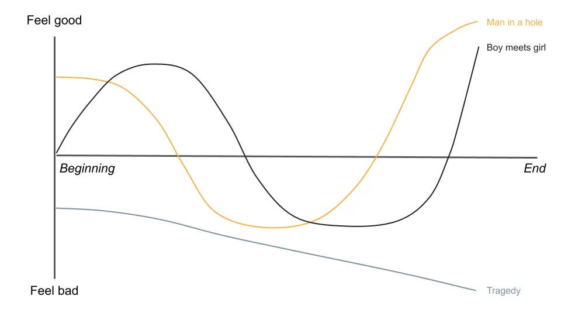
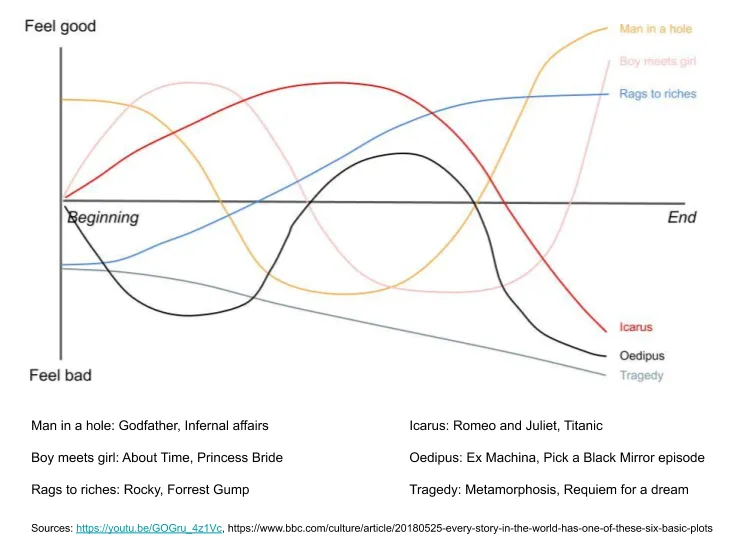

## Conclusión

Esta vez no hay conclusiones\, arruinará la historia\.

---

Empecemos con una historia sobre historias\.

[Bestselling author Kurt Vonnegut](https://en.wikipedia.org/wiki/Kurt_Vonnegut 'Kurt') es conocido por Matadero\-Cinco\, La cuna del gato y muchas otras obras\. En su autobiografía\, [he claimed that this was his greatest contribution to culture:](https://books.google.com/books?id=Zd_9o3uyoVsC&pg=PA285&dq=vonnegut+shape+story+thesis&hl=en&sa=X&ei=tasCU8yjEML-oQSXloKIBQ#v=onepage&q=vonnegut%20shape%20story%20thesis&f=false 'book')

Así que\, _Las historias tienen formas\,_ dice\.

¿Qué significa eso\? Kurt lo explica [^1]\:

Imagina que tienes un gráfico\, con buena y mala suerte en un lado\, y en el otro lado que muestra el progreso de la historia de principio a fin\.

Podrías trazar cualquier historia en este gráfico para ver su forma\. Y si representaras todas las historias del mundo\, surgirían un par de patrones comunes\.

Por ejemplo\, en [The Godfather,](https://en.wikipedia.org/wiki/The_Godfather 'Godfather') Michael comienza feliz\, pero la familia se mete en problemas y se ve obligado a abandonar el país\. Finalmente regresa\, recupera el control y elimina a la mayoría de sus opositores\, convirtiéndose en el padrino de la mafia de la ciudad\.

Lo representaremos en el gráfico y lo llamaremos una historia del tipo \"hombre en un agujero\"\. El hombre va bien\, cae en un agujero\, luego sale y está mejor que antes\.

Por otro lado\, en [About Time,](<https://en.wikipedia.org/wiki/About_Time_(2013_film)> 'About Time') [^2] Los protagonistas se enamoran\, se pierden y luego se reencuentran tras una serie de acontecimientos\.

Llamaremos a esto una historia del tipo \"chico conoce chica\"\. Como puedes imaginar\, esto es típico en muchas películas románticas\.

Y en una historia como [The Metamorphosis,](https://en.wikipedia.org/wiki/The_Metamorphosis 'Kafka') Las cosas solo empeoran para nuestro protagonista mientras se convierte en un bicho y muere\. Esto sería una \"tragedia\"\.

Además de las formas anteriores\, Kurt pensó en algunas más que podrían funcionar\. Una historia de \"la pobreza a la riqueza\" podría implicar un ascenso constante\, un ["icarus" story](https://en.wikipedia.org/wiki/Icarus 'icarus') podría implicar un ascenso y luego un descenso\, y un ["oedipus" story](https://en.wikipedia.org/wiki/Oedipus 'oedipus') Podría implicar una caída\, un ascenso y otra caída\.

Siguiendo con esta idea\, [a team of researchers from Vermont and Adelaide used machine learning to classify 1,327 famous stories](https://arxiv.org/pdf/1606.07772.pdf 'paper') en [Project Gutenberg](https://www.gutenberg.org/ 'proj')\. Descubrieron que la mayoría de las historias podían agruparse en algunos tipos principales\. Consulta la nota al pie para detalles sobre su metodología [^3]\.

Aquí han sustituido \"chico conoce chica\" por \"cenicienta\"\, pero básicamente demuestra que Vonnegut tenía razón [^4]\. _Las historias tienen formas\, y hay algunas formas estándar\._

¿Qué tiene esto de relevancia\? Has venido aquí por consejos de acciones y charlas basura sobre startups [^5]\, ¿qué pasa con todas esas notas sobre narrativas\?

Pronto pondré el enlace\, y por ahora tengamos en cuenta esas formas de la historia\.

---

### Las culatas tienen formas

El mes pasado\, hablamos de una de las razones por las que tu discurso de inversión es un desastre\: [you aren't accounting for consensus.](/writing/relative_billionaire 'pitch')

Este mes\, hablemos de otra razón común que puede resultar aún más frustrante\.

Consideremos esta empresa a fecha de 30 de abril de 2018\:

La empresa X es una empresa de internet\, que principalmente obtiene beneficios de suscripciones a aplicaciones gracias a su monopolio en una categoría de consumidores en expansión\. Cuenta con 7 millones de suscriptores en total\, de los cuales 3 millones son suscriptores de su aplicación principal\. Sus ingresos crecen \~ 30\% interanual\. Los márgenes EBITDA \(un tipo de métrica de beneficios\) son del 40\%\. El precio de la acción está en un máximo histórico\, habiéndose más que duplicado en el último año [^6]\.

Tiene buena pinta\, quizá valga la pena investigar más para ver si te gustaría tenerla\.

También considera la misma empresa a fecha de 1 de mayo de 2018\:

La empresa X es una empresa de internet\, que principalmente obtiene beneficios de suscripciones a apps gracias a su monopolio en una categoría de consumidores en expansión\. Cuenta con 7 millones de suscriptores en total\, de los cuales 3 millones son suscriptores de su aplicación principal\. Está aumentando sus ingresos \~ 30\% interanual\. Los márgenes EBITDA \(un tipo de métrica de beneficios\) son del 40\%\. El precio de la acción está en un máximo histórico\, habiéndose más que duplicado en el último año\. _[Facebook just announced they're planning to enter the category](https://techcrunch.com/2018/05/01/facebook-dating/ 'FB')_

Los fundamentos de la empresa no han cambiado\, pero esa caída del 22\% en el precio en un día se demuestra claramente _algo_ ha\. Eso\, por supuesto\, es el _Historia_ que los inversores están hablando de la acción\.

**¿Qué es una propuesta sino una historia sobre la acción\?**

El 30 de abril\, el lanzamiento consensuado [^7] era que la empresa había estado creciendo rápidamente\, con un margen alto y sin competencia\. Los inversores seguían comprando acciones\, y el precio seguía subiendo\.

El 1 de mayo\, la historia llegó a un punto muerto\. Podrías decir que Facebook iba a aplastar esta empresa y que deberías vender todo lo que puedas\. O podrías decir que el miedo estaba exagerado\, que el historial de productos no esenciales de Facebook es malo y que deberías comprar todo lo que puedas\.

¿Te suena familiar\?

La empresa en este caso era Match\.com\, la empresa matriz de Tinder\, y volvería a duplicar su precio de acciones aproximadamente un año después de esa caída\. Chico conoce chica funcionó\.

El 1 de mayo\, ambas historias eran igualmente válidas\, y había inversores inteligentes que tomaban ambos bandos en esa operación\. Lo importante es que el precio de la acción reaccionó incluso antes de que ocurriera algún cambio real en el negocio de Match\. La historia había llegado a una encrucijada y los inversores ahora elegían bandos diferentes\. Los que pensaban que sería como \"Ícaro\" perdieron\, y los que pensaban lo contrario ganaron\. A medida que cambian las historias\, también lo hacen los precios de las acciones\.

**¿Qué significa esto para tu discurso de inversión\?** Implica que contar historias es clave para una buena presentación\. Cuanto mejor puedas contar una historia\, más probable es que tenga tracción\. Tanto con tu jefe como con otros inversores\. Es molesto\, pero la \"mejor idea\" suele ser la \"mejor historia\"\.

**¿Por qué importa si tu idea tiene éxito\?** Recuerda que invertir no es solo tener razón\, sino también lograr que otros se den cuenta de que tienes razón\. No ganas dinero sentado en una gran empresa si el precio no cambia [^8]\. Ganas dinero estando en contra del consenso y teniendo razón\, pero si no consigues que otros se unan a tu lado\, siempre estarás en contra del consenso y te equivocarás\. El mercado de valores puede ser una máquina de votar a corto plazo y una báscula a largo plazo\, pero si no difundes tu historia\, tu máquina está rota [^9]\.

**¿En qué deberías centrarte\?** Si tu horizonte de inversión es a corto plazo\, probablemente estarás buscando puntos de inflexión en el arco argumental\; también conocidos como catalizadores\. Por ejemplo\, querrás tener un argumento creíble de por qué una acción está actualmente en un agujero y por qué parece que saldrá\. Si tu horizonte temporal es a largo plazo\, quizá te interesen más historias del tipo \"de la pobreza a la riqueza\"\.

Por supuesto\, las historias pueden ir en ambos sentidos\. Mostré un ejemplo de una acción que se recuperó\, y fácilmente podría haber elegido una que fuera en sentido contrario\. La gente contaba grandes historias sobre Enron\, Tilray\, Luckin y más\, antes de que todos se derrumbaran\. Toda la narrativa del mundo no puede generar ingresos mágicamente \(aunque sí generó mucho dinero para quien saliera de su puesto a tiempo\)\.

Tampoco digo que solo tengas que ajustar los precios de las acciones a las curvas para ganar dinero [^10]\. Lo que digo es que la percepción de las acciones sigue un arco narrativo\, y eso a menudo se refleja en el precio\. Saber qué historia quieres contar mejorará tu presentación\.

Hace tiempo que sabemos que los fundamentales no son los únicos que impulsan los precios de las acciones\; mira [Shiller's work on a history of stock forecasting theory.](https://pubs.aeaweb.org/doi/pdfplus/10.1257/089533003321164967 'shiller') La capacidad de contar una buena historia es clave para transmitir ideas de inversión\. ¿Por qué crees que tantos inversores hablan públicamente de sus ideas\? Cuanto más puedas convencer a otros de tu historia\, más probable será que ganes dinero como inversor\.

Los inversores se cuentan historias entre ellos y apuestan por lo que esperan que sea verdad\.

### Las startups tienen formas

La narración también importa en tecnología\. Así es [startups raised millions with just a pitch deck,](https://www.businessinsider.com/pitch-decks-that-helped-hot-startups-raise-millions-2019-4 'pitch') o cómo [Masa raised $45bn in an hour from the Saudis](https://youtu.be/Sa2_VBu0d7k?t=92 'masa')\. En el primero\, las startups decían a las empresas de capital riesgo cómo podían crecer hasta 1\.000 millones de dólares\. En el segundo\, Masa convenció a Mohammed bin Salman de que podía crecer hasta 1\.000 millones de dólares\. Su historial sin duda influye\, pero la imagen que pintan en la mente de los inversores fue clave para asegurar financiación\.

Nadie quiere apostar por un perdedor\, así que depende de la startup contar su historia de una forma que les haga quedar lo mejor posible\. Intentan posicionarse como un \"de la pobreza a la riqueza\"\, mientras los inversores intentan determinar si son un \"ícaro\"\. Cuando un capitalista riesgo rechaza una empresa\, está diciendo implícitamente que piensa que la historia es demasiado aburrida\. Evita historias aburridas\.

Esto también implica que **Las startups están incentivadas a contar la historia más emocionante sobre sí mismas\.** Al hacerlo\, la mayoría exagerará la verdad al máximo\. Prefieren venderte el capítulo final en lugar del principio\. Los inversores experimentados lo saben\, aunque probablemente el público sea menos consciente\. Si esto se convierte en fraude o no es una línea muy fina\.

Imaginemos este escenario\:

> Tu empresa llegó demasiado pronto a una tendencia y te has endeudado intentando salvarla\. Recibes una llamada de un universitario que te dice que tu producto es genial\. Tan bueno que está escribiendo un programa para ello que te hará ganar mucho dinero\. Te interesa y aceptas quedar con el chico para una demostración\.

> Al otro lado de esa llamada\, un universitario nervioso cuelga\, dándose cuenta de que está cerca de conseguir su primer contrato\. ¿El único problema\? Ni siquiera tiene una copia de tu producto\, y mucho menos algún programa funcional para él\.

¿Fraude o pensamiento optimista\? Quizá estés pensando que deberías evitar hacer negocios con este chico para siempre\. Si lo hicieras\, [you just missed out on Bill Gates, and the forming of Microsoft.](http://www.computinghistory.org.uk/det/5946/Bill-Gates-and-Paul-Allen-sign-a-licensing-agreement-with-MITS/ 'MITS') A veces una historia que no es del todo cierta _todavía_ puede convertirse en la verdad\.

Imaginemos otro escenario\:

> Te reúnes con un joven fundador\, que te presenta una solución revolucionaria en salud\. Los prototipos que te muestran no están tan pulidos\, pero confían en que eventualmente construirán un producto terminado listo para su uso a gran escala\.

> El fundador sigue recibiendo más publicidad\, aparece en varias portadas de revistas y firma grandes acuerdos con farmacias\. El consejo de administración también parece estar lleno de personas famosas\, aunque no entiendes muy bien por qué tan pocos tienen experiencia en el sector sanitario\.

La startup\, en este caso\, por supuesto\, es [Theranos](https://www.businessinsider.com/theranos-former-board-members-henry-kissinger-george-shultz-james-mattis-2019-3 'Theranos')\, que pasaría a la historia como uno de los mayores fraudes de esta década\. Holmes tenía una historia tan fantástica que todo el mundo quería escucharla\; los inversores dicen estar \"cautivados\" por su propuesta\. Si la lección que sacaste del escenario de Microsoft fue \"cree en todas las historias emocionantes\"\, puedes entender por qué eso será un problema\. A veces\, historias que aún no son ciertas serán para siempre cuentos de hadas\.

**Esa línea entre el fraude y el pensamiento optimista puede ser muy fina\.** Steve Jobs era famoso por su [reality distortion field](https://en.wikipedia.org/wiki/Reality_distortion_field 'rdf')\, o la capacidad de convencer a cualquiera de que algo era posible\. Estoy seguro de que Holmes en aquel momento creía que podía lograr lo imposible\, como tantos otros fundadores de startups\. Ahora los juzgamos por sus resultados\, pero puedes imaginar fácilmente un escenario en el que el regreso de Steve a Apple simplemente no funcionara\.

O considera otros fracasos iniciales donde un giro argumental podría haber dado un final diferente\. [WeWork, Pets.com, Moviepass etc](https://f3fundit.com/11-of-top-startup-failures-in-history/ 'startup') Todos tenían grandes historias pero han caído en desgracia\. WeWork podría estar mejor si no hubiera crecido tan rápido\, Pets\.com tiene un sucesor espiritual en Chewy\, y Moviepass podría haber funcionado con más financiación [^11]\. Hasta el final\, estoy seguro de que toda la gente de la compañía esperaba que su arco argumental mejorara a la vuelta de la esquina\.

**Además de los inversores\, la historia de tu startup también importa para empleados\, clientes y la competencia\.**

La participación es una parte en tu historia\. Como los empleados de startups suelen cobrar menos en efectivo y más en stock\, apuestan a que tu historia será buena\. La parte difícil al reclutar talento es convencerles de que hay suficiente potencial en la empresa como para sacrificar alternativas mejores y más seguras [^12]\.

Los clientes miran tu historia antes de decidir comprar\. Piensan en lo que tu producto podría hacer por ellos\, ya sea ahorrar tiempo\, reducir el esfuerzo\, elevar el estatus o algo más\. Como se ha comentado antes\, a nadie le gusta apoyar a un perdedor\.

Tu competencia también está mirando la historia que cuentas y haciendo planes según lo que pareces estar haciendo\. Si creces más rápido que ellos\, intentarán averiguar por qué\. Si lo haces peor\, aprovecharán para presentar su propia historia a tu público objetivo\.

La importancia de las historias para las startups es bien conocida\. Más allá de atraer inversores\, también importa para cualquier otra persona con la que la startup interactúe\. [As Bill Gurley from Benchmark put it:](http://abovethecrowd.com/1999/10/18/the-rising-importance-of-the-great-art-of-storytelling/ 'Bill')

> En el entorno empresarial único de Internet actual\, el arte de contar historias ha adquirido una importancia cada vez mayor\. Debido a los fenómenos del \"efecto red\" y el \"rendimiento creciente\"\, muchas personas creen que los primeros en moverse \(o al menos las empresas que son las primeras en alcanzar una escala significativa\) probablemente se llevarán la mayor parte del mercado de Internet\.

Las empresas nos cuentan sus historias y trabajan para hacerlas realidad\.

### Forma de ti

Empezamos con una historia sobre historias\.

Terminemos con una historia sobre el yo\.

Érase una vez una persona que dejó su hogar para explorar el mundo\. Experimentó altibajos y\, en su punto más bajo\, sufrió un dolor inimaginable\. Pero superó eso y creció para ser mejor que antes\.

¿Te suena familiar\?

¿Pero qué historia es esta\?

Podría ser [the story of Jesus, from Christianity](https://www.learnreligions.com/the-resurrection-story-700218 'Jesus')\.

Podría ser [the story of the Buddha, from Buddhism](https://tricycle.org/magazine/who-was-buddha-2/ 'Buddha')\.

Y podría incluso ser la historia tuya\.

**Todos somos protagonistas en nuestros propios arcos argumentales\,** Intentando continuamente ajustar nuestras historias hacia arriba y hacia la derecha\. Por una combinación de suerte\, habilidad y esfuerzo\, algunos de nosotros ya podemos sentir que estamos ahí\. Otros pueden sentir que han estado atrapados en alguna tragedia implacable\. Depende de nosotros crear nuestra propia historia\, y vivimos con las consecuencias de nuestras decisiones\. La vida es injusta\, pero aún hay cosas que podemos hacer por nuestra cuenta\.

Como somos nuestros propios autores\, también significa que no conocemos todo el arco argumental de los demás\. Podemos verles disfrutando de la vida\, sin saber cuánta desgracia tuvieron que atravesar\. Podemos verles experimentar miseria\, sin saber cuánto han intentado evitarla\. Compararemos dónde están ellos con dónde hemos estado\, y nos frustramos porque nuestra experiencia promedio no es tan buena como su mejor momento\.

El mundo es un escenario\, pero no somos actores\, somos el director\. Solo nosotros decidimos cuánto esfuerzo queremos poner en construir nuestra narrativa\. Decirte a ti mismo que tendrás éxito no significa necesariamente que lo lograrás\, pero creer que tu arco argumental está destinado a la tragedia es una buena forma de asegurarse de que lo sea\.

[As Neil Gaiman put it:](https://www.youtube.com/watch?v=Xn2n7N7Q2vw 'Neil')

> La gente cuenta historias y es una parte enorme de lo que nos hace humanos\. Haremos muchísimo por las historias\, y soportaremos mucho por las historias\. Y las historias\, a su vez\, nos ayudan a soportar y a dar sentido a nuestras vidas\.

Puedes contarme una historia\, y depende de ti hacerla realidad\.

## Otros

1. [How SaaS securitisation could look like](http://conordurkin.com/some-thoughts-on-saas-abs/ 'SaaS')
2. [Does Commodification Corrupt? Lessons from Paintings and Prostitutes](https://scholarship.shu.edu/cgi/viewcontent.cgi?article=1732&context=shlr 'corrupt')
3. [Spatial is allowing AR/VR users to attend meetings with desktop users](https://www.wired.com/story/spatial-vr-ar-collaborative-spaces/ 'Spatial')
4. ['The argument that Apple should change its practices developed to price as it does, distribute as it does or design as it does because it was too successful or is “unfair” is getting the causality wrong.'](http://www.asymco.com/2020/06/20/subscribe-again/ 'subscribe')
5. [Weddell seals make tardis sounds.](https://www.youtube.com/watch?v=megeZ8zhKJ0&feature=youtu.be 'weddell') H\/t \@rosetazetta\. También hay un [2 hour version](https://www.youtube.com/watch?v=4dbSA4dTICc 'seal') que puede que haya terminado de escuchar o no mientras escribía esto\.

[^1]: Tanto en su autobiografía como en su charla [here](https://youtu.be/GOGru_4z1Vc 'Kurt')

[^2]: No voy a dejar de promocionar esta película\; es una de mis favoritas

[^3]: El artículo completo es [here](https://arxiv.org/pdf/1606.07772.pdf 'paper')\. Estos métodos fueron Análisis de Componentes Principales \/ Descomposición de Valores Singulares\, agrupamiento jerárquico y agrupamiento con aprendizaje automático no supervisado\. Primero aplicaron análisis de sentimiento para obtener el valor emocional a lo largo de las historias\. No estoy seguro de cómo usaron exactamente SVD\, y parece que aplicaron reducción de dimensiones\, luego extrajeron las características principales de una matriz de similitud\, encontrando los tipos de historias principales que pudieron explicar la mayoría de las variaciones\. El agrupamiento jerárquico parece ser un dendrograma estándar para agrupar los tipos de historias\. El aprendizaje automático no supervisado usó el Mapa Auto\-Organizador de Kohonen\, que parece ser un algoritmo para agrupar grupos juntos\, haciendo algo como K significa\.

[^4]: Técnicamente\, Vonnegut separa chico conoce chica de Cenicienta\, ya que Cenicienta tiene una construcción más escalonada y una caída pronunciada antes de recuperarse\. Son lo suficientemente similares a mí como para haberlas agrupado\. Vonnegut también propone una línea plana única para historias como Hamlet donde \"no pasa nada\"\. No estoy de acuerdo con esa forma y la he dejado fuera por simplicidad\. Para una visión diferente sobre los tipos de historias\, [Christopher Booker discusses seven basic plots](https://en.wikipedia.org/wiki/The_Seven_Basic_Plots)

[^5]: Por favor\, no hayáis venido aquí por consejos de stock o comentarios de iniciativa\, os decepcionará que no hago lo primero y solo ocasionalmente hago lo segundo\.

[^6]: 8\.000 para la empresa [here](https://d18rn0p25nwr6d.cloudfront.net/CIK-0001575189/63f15bf6-7324-446e-b762-fb1ac98ccf14.pdf 'MTCH')\, aunque arruinarás la sorpresa\.

[^7]: Ignoremos lo que decían los shorts para simplificar\, el rendimiento del precio implica que la gente fue alcista\.

[^8]: Sí\, sé que existen dividendos\, [they're less important in driving returns](https://media-publications.bcg.com/pdf/VCR/2006-VCR-Spotlight-on-Growth.pdf)

[^9]: Nunca he entendido realmente qué significa una máquina de votación\; creo que simplemente se refiere a una máquina que lleva un conteo continuo de votos y\, por tanto\, cambia constantemente\.

[^10]: Las personas que se dedican al análisis técnico no estarían de acuerdo aquí\.

[^11]: Todo esto son hipotéticos\, y no hay una forma real de llegar a una conclusión aquí\. ¿Es irrealista esperar que Moviepass consiga una gran base de suscriptores mientras prende dinero en efectivo\? Quiero decir\, realmente depende de la cantidad de dinero que pudieran gastar\, ¿no\? ¿Y si Softbank le hubiera dado dinero en lugar de WeWork\?

[^12]: Algunas personas pueden no estar de acuerdo en que las empresas tradicionales sean más seguras que las startups\. Se puede argumentar que trabajar en tecnología te da seguridad para tu carrera pero no para tu empleo\. Diría que para la mayoría de la gente ser despedido sigue siendo una faena y puede ser financieramente muy dañino\.
