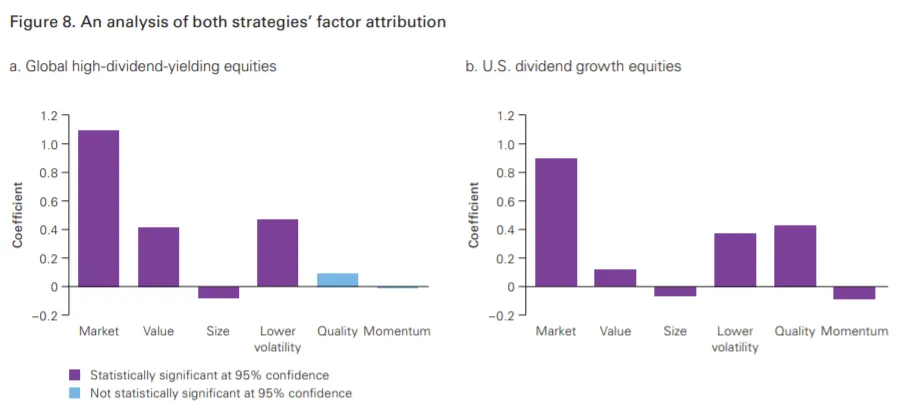

## Conclusión

Invertir por dividendos tiene más matices de los que podría parecer a primera vista\.

## Retorno de los dividendos

En [footnote 8 of last week's post](/writing/stories 'footnote') Hice un comentario al pasar sobre que los dividendos importan menos que el retorno de capital porque no quería dedicar más tiempo a investigar el tema\.

Hoy\, vamos a profundizar realmente en los dividendos\.

Haremos un resumen de los dividendos\, luego hablaremos de los inconvenientes y terminaremos con enlaces a otras investigaciones que complican la historia\.

Como siempre\, nada de esto es consejo de inversión [^1]\.

### ¿Qué hacer con todo ese dinero en efectivo\?

Supongamos que eres una empresa que cotiza en bolsa y obtiene beneficios [^2]\. Has pagado a tus proveedores\, a tus empleados y te has pagado a ti mismo\. Pero aún te queda más efectivo\, ¿qué puedes hacer con eso\?

Primero\, no podrías hacer nada\. Déjalo en algún banco [^3]\.

Dos\, podrías reinvertir en el negocio\. ¿Esa máquina que querías para tu línea de fabricación\? ¿Ese producto de software para tu equipo de RRHH\? [That Gulfstream G650 to get high?](https://www.wsj.com/articles/this-is-not-the-way-everybody-behaves-how-adam-neumanns-over-the-top-style-built-wework-11568823827 'WSJ') Quizá ahora sea el momento de comprarlas\.

Tercero\, podrías comprar otros negocios\. Quizá haya un competidor más pequeño que puedas adquirir barato y conseguir todas esas \"sinergias\" de las que te cuentan tus amigos bancarios para aumentar tu cuota de mercado [^4]\.

Cuatro\, podrías recomprar algunas de tus acciones\. Esto aumenta la propiedad que tienes de tu empresa\, lo que implica que obtendrás más potencial de crecimiento si la empresa va bien\. Las recompras están fuera del alcance de este artículo\, puedes leer una opinión inicial \(sesgada\) sobre ellas por Cliff Asness [here.](https://images.aqr.com/-/media/AQR/Documents/Journal-Articles/Buyback-Derangement-Syndrome.pdf 'Cliff')

Quinto\, podrías pagar un dividendo a los inversores\. Por cada acción que tengan los inversores\, les entregas algo de efectivo cada trimestre\.

He simplificado\, como siempre\, y las acciones anteriores son las principales cosas que hacen las empresas con su dinero\. Un gráfico de CS nos muestra cómo ha cambiado la combinación de esas acciones con el tiempo\:

Hoy nos centraremos en la acción cinco\, el pago de dividendos\. Voy a saltarme la discusión sobre la irrelevancia teórica de las estructuras de capital [^5]\, pero puedes leer un repaso sobre Modigliani Miller [here.](https://pubs.aeaweb.org/doi/pdfplus/10.1257/jep.2.4.99 'MM')

### Evaluación de dividendos

A primera vista\, un dividendo te suena bien como inversor\. Recuperar algo de dinero de tus acciones parece agradable\. Veamos cómo podríamos evaluarlo\.

Si te dijera que un dividendo de la empresa es de 5 dólares\, ¿sería bueno o malo\? Parece mucho dinero\, pero realmente no lo sabemos a menos que lo comparemos con el precio\.

Si hubieras comprado las acciones por 5 dólares y te devolvieran 5 dólares\, eso sería alto\. Efectivamente\, ya te han devuelto el dinero de tu inversión ahí mismo\.

Si hubieras comprado la acción por 10\.000 dólares y te devolviera 5 dólares\, probablemente eso sea insignificante\.

Así que sabemos que **El precio importa\, como en todo lo relacionado con la inversión\.** Para incorporar esto\, podemos calcular un rendimiento por dividendo\, que es simplemente la cantidad del dividendo dividida por el precio\. Comparando los rendimientos por dividendo entre sí\, podemos determinar qué acciones tienen dividendos \"altos\" y cuáles tienen dividendos \"bajos\"\.

Como apunte\, por convención aceptaríamos una suma de 12 meses de dividendo\. La mayoría de las empresas pagan dividendos trimestralmente\, así que si una empresa paga 1 dólar por trimestre\, su dividendo anual es de 4 dólares\. También ignoraremos los impuestos [^6]\.

Además de permitirnos evaluar los rendimientos por dividendo entre acciones que pagan dividendos\, ese rendimiento también nos permite comparar entre otros valores\. El rendimiento es como el rendimiento esperado\, al fin y al cabo\. Así que podríamos comparar un rendimiento por dividendo del 4\% con un bono que paga un 1\%\, y decir que todo lo demás igual\, la acción con dividendos nos está dando un ingreso mayor\.

Que es lo que vemos en esto [Vanguard report](https://personal.vanguard.com/pdf/ISGADOS.pdf 'Van')\, con el gráfico siguiente mostrando que **Los rendimientos por dividendo han sido superiores a los de los bonos en los últimos 10\+ años\.**

A mirarlo bien\, esto parece aún mejor ahora\. ¿Un periodo prolongado en el que recibes más dinero que bonos\? ¿Deberíamos buscar todos las acciones con mayor rentabilidad por dividendo y comprarlas todas\? ¿Cuál es el truco\?

### Rendimiento total\, no solo dividendo

La primera es sencilla\, y algo que ya hemos mencionado en parte\: el tema del precio\. Un alto rendimiento por dividendo podría deberse a que la empresa pague mucho en efectivo\, resultando en un dividendo relativamente grande sobre un precio relativamente pequeño\. O también podría deberse a que el precio de la acción bajó mucho\, resultando en ese mismo dividendo relativamente grande en un precio relativamente pequeño\.

En el ejemplo de abajo\, habrías estado mucho más satisfecho con la rentabilidad del 1\% en división frente al 50\%\, debido a las circunstancias que llevaron a ese punto\. Debido a la caída del precio en el segundo caso\, en realidad has perdido mucho más dinero del que has ganado con el \"aumento\" en la rentabilidad por dividendo\.

Ni siquiera puedes estar seguro de que el alto rendimiento dure\, ya que esa cantidad de dividendo no está garantizada para el futuro\. Es cierto que a las empresas no les gusta recortar sus dividendos porque temen que los accionistas se vendan de sus acciones\. [However, that also menas that a company can cut its dividend when things are so bad they have no choice.](https://www.cnbc.com/2018/12/07/ge-makes-it-official-lowers-dividend-to-a-penny.html 'GE')

Esto significa que tenemos que **Considere un factor adicional más allá del rendimiento por dividendo\, el cambio de precio\.** Al combinar este retorno de capital \(cambio de precio\) con el rendimiento por dividendo\, obtendremos una cifra de rentabilidad total más cercana a la medida de rendimiento que queremos\. Esto suena obvio ahora que lo hemos mencionado\, pero con frecuencia verás muchos folletos de inversión que promocionan acciones con altos dividendos\, sin tener en cuenta el componente de retorno de capital\.

¿Qué ocurre cuando consideramos el retorno de capital\? Veamos los componentes del rendimiento total\, pero primero hagamos una suposición de cómo podría verse eso\. Podríamos pensar que para las acciones con alto rendimiento por dividendo\, la mayor parte del rendimiento proviene del dividendo\. Para las acciones de bajo \(o nulo\) rendimiento\, la mayor parte del rendimiento se debe al cambio de precio\.

Sorprendentemente\, esto no es lo que encontramos\. En lo mismo [Vanguard report](https://personal.vanguard.com/pdf/ISGADOS.pdf 'Van')\, los autores clasificaron las acciones en 4 categorías\, de alta a baja\, de rentabilidad por dividendo\. Luego compararon el retorno de dividendos frente al precio\. Vemos que **El retorno de capital ha contribuido más al rendimiento total\,** Incluso incluyendo las acciones con altos dividendos\.

Aún más interesante\, un [Miller Howard report](https://mhinvest.com/download.html?docId=2246 'Miller') demuestra que cuando divides las acciones de dividendos en 10 categorías\, la mayoría en realidad se dividen **Bajo rendimiento** el índice S\&P de los últimos 10 años\. Lo peor es que el grupo con mayores rendimientos por dividendo son los que tienen un rendimiento inferior al máximo\. Esto implica una estrategia de inversión completamente opuesta a la que habíamos imaginado antes\.

### Factores correlacionados

La segunda condición es menos evidente\, y es la de otros factores correlacionados con altos rendimientos por dividendo\.

Imaginemos que seleccionamos las 100 principales acciones basándonos en su alta rentabilidad por dividendos\. Si descubriéramos que todas esas acciones tienen algo más en común\, digamos [Emma Watson being on the board of directors](https://www.mugglenet.com/2020/06/emma-watson-joins-kerings-board-of-directors-to-advocate-for-sustainable-fashion/ 'Emma')\, quizá no sea la rentabilidad por dividendos lo que realmente importa\, sino el poder estelar de Emma que misteriosamente afecta a los rendimientos totales\.

De hecho\, hay algunos factores comunes que la gente utiliza para clasificar acciones\. Estos incluyen alguna medida de relación calidad\-precio\, tamaño de la empresa y momentum de precio\. Por ejemplo\, podrías querer agrupar todas las pequeñas empresas y descubrir que las pequeñas superan a las grandes\. Si encontraste pruebas suficientemente sólidas de ello\, podrías crear una cartera compuesta solo por pequeñas empresas\.

Voy a saltarme la explicación de cómo se crearon estos factores\; puedes leer más sobre esto en [Fama and French's five factor model here.](https://www.sciencedirect.com/science/article/abs/pii/S0304405X14002323 'model') Lo importante a tener en cuenta es que tenemos otras características que describen una acción\, más allá de la rentabilidad por dividendo\.

El [Vanguard report](https://personal.vanguard.com/pdf/ISGADOS.pdf 'Van') Distinguió entre dos tipos de acciones de dividendo\: 1\) alta rentabilidad por dividendo y 2\) alto crecimiento de dividendos\. Luego compararon la correlación de esos grupos con algunos de los factores comunes que mencionamos anteriormente [^7]\.

Resulta que muchas de las características están correlacionadas\, ya sea del grupo 1 o del grupo 2\. Dicho de otro modo\, si ignoras el factor del dividendo y solo consideras estos otros factores\, te ayudarías mucho a captar el retorno de las acciones con dividendos\.

[Meb Faber went ahead to do just that,](https://www.cambriainvestments.com/wp-content/uploads/2017/10/DTAX-10.23.17.pdf 'Meb') creando carteras compuestas que pudieran replicar los perfiles de las acciones con dividendos\, sin que en realidad fueran acciones de dividendos\. Esto significa que encontró acciones que daban el mismo rendimiento que las acciones con dividendos\, pero que en realidad no pagaban dividendos\. Sus hallazgos muestran que **Los rendimientos de dichas carteras superan a los de dividendos\.** Compara la columna de la caja negra con el resto de la derecha\:

Y esos resultados se mantuvieron cuando comparó después de declaraciones de impuestos también\:

## Conclusión y complicaciones

En resumen\,

1. El precio y el rendimiento total de una acción claramente importan\, más que solo el rendimiento por dividendo
2. Podemos duplicar los factores positivos de las acciones con dividendos creando una cartera alternativa que excluye intencionadamente las acciones con dividendos\. Esto rinde incluso mejor que la cartera de dividendos

Como ocurre con toda inversión\, existen algunas complicaciones\. Algunos investigadores consideran que el periodo de tiempo de los estudios importa\. Al llevar a cabo el estudio durante un periodo mucho mayor que 10 años\, aumenta la importancia de los dividendos respecto a los rendimientos\. Otros argumentan que las empresas tienen pocas acciones productivas que tomar con su efectivo\, y que devolverlo a los accionistas beneficia a los accionistas\, que ahora pueden elegir dónde redistribuir sus dividendos\. Y algunos dicen que el crecimiento de los dividendos es un indicador de una empresa saludable\.

Sin embargo\, los que he visto aún no han refutado la investigación alternativa de carteras de Meb\, por eso sigo siendo menos entusiasta de invertir en dividendos en general\. Si puedes crear una cartera con mayor rentabilidad y ventaja después de impuestos\, parece que debería ser la mejor opción\.

Os dejo que exploréis los enlaces de abajo y veáis si os resultan persuasivos\:

1. [Is dividend investing dangerous?](https://blog.thinknewfound.com/2016/12/dividend-investing-dangerous/ 'Divd')
2. [Surprise! Higher Dividends = Higher Earnings Growth](https://www.researchaffiliates.com/documents/FAJ_Jan_Feb_2003_Surprise_Higher_Dividends_Higher_Earnings_Growth.pdf 'Divd')
3. [Dividends and the three dwarfs](https://www.researchaffiliates.com/content/dam/ra/documents/FAJ_Mar_Apr_2003_Dividends_and_the_Three_Dwarfs.pdf 'Divd')

[^1]: Nunca he dado ni daré consejos de inversión\. No me demandéis\, no tengo dinero\.

[^2]: Un suceso sorprendentemente menos frecuente de lo que uno podría pensar últimamente\.\.\.

[^3]: En la realidad no es tan sencillo\, y las empresas tienen departamentos de tesorería que gestionan cuánto efectivo líquido tienen disponible frente a otros instrumentos monetarios que ofrecen cierto rendimiento\. Nadie tiene realmente miles de millones en billetes en papel\, ni siquiera en cuentas corrientes\, para el caso\.

[^4]: Las sinergias suelen considerarse como sinergias de ingresos o de coste\. Las sinergias de ingresos provienen de poder vender más cosas y las sinergias de costes de despedir gente\.

[^5]: Bajo ciertas suposiciones\, la forma en que se financia una empresa no importa\. Si ese es el caso\, entonces las políticas de asignación de capital son esencialmente las mismas\.

[^6]: El tratamiento fiscal de los dividendos puede variar según tu situación\. Sin embargo\, normalmente tu rentabilidad neta de un dividendo se reduce porque tienes que pagar un impuesto considerable sobre esos ingresos\.

[^7]: Para una división diferente\, mira [this other source doing a similar analysis](https://www.indexologyblog.com/2020/05/15/why-did-dividend-indices-underperform-during-the-coronavirus-sell-off/ 'div')
