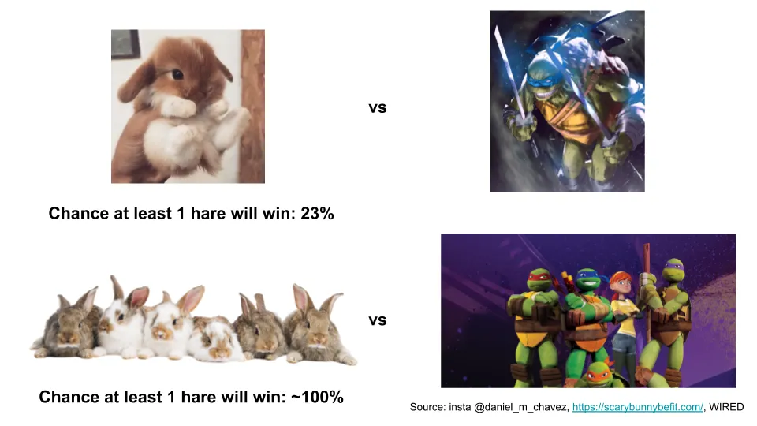

## Conclusión

No se incentiva a las empresas para asumir riesgos\, lo que perjudica la innovación dentro de la empresa y aumenta la probabilidad de que una startup les gane\.

## Tortuga vs liebre

Da por hecho que todo el mundo conoce el [tortoise vs hare fable.](http://read.gov/aesop/025.html 'aesop') La liebre corre contra la tortuga\, se queda dormida\, pierde y pasa el resto de su vida viviendo en la vergüenza antes de escribir una revelación explosiva sobre cómo fue [all a shell game](https://en.wikipedia.org/wiki/Shell_game 'shell') [^1]\.

[Drawing on this post by Farnam Street](https://fs.blog/2016/07/james-march-the-trouble-with-genius/ 'FS')\, vamos a extender la analogía con un poco de matemáticas\. Sé que eso asusta a la mitad del público de inmediato\, pero no nos pongamos nerviosos todavía\. Hablando de alguien que recientemente perdió 15 minutos en un problema de matemáticas porque sumé mal 1 \+ 1\, mantendré las matemáticas simples aunque solo sea por mí [^2]\.

Pongamos una pista de carrera de 1 km\. Suponemos que la tortuga tarda 100 minutos en correr 1 km\, y la liebre tarda 20 minutos en correr 1 km\. Sin embargo\, el horario de sueño de la liebre se ha desajustado por el covid y hay un 95\% de probabilidad de que duerma en cada bloque de 20 minutos\. Dicho de otro modo\, hay un 5\% de probabilidad de que esté despierta durante los minutos 0\-20\, y otro 5\% de que esté despierta entre los minutos 20\-40\, y otro 5\% de que esté despierta en los minutos 40\-60\, etc\.

¿Qué probabilidad hay de que la liebre gane a la tortuga\?

Para quienes recordáis la probabilidad de secundaria\, podemos calcular esto con un [binomial distribution formula.](https://online.stat.psu.edu/stat414/lesson/10/10.3 'binom') La fórmula es la siguiente\:

Pero eso da miedo con signos de suma y signos de exclamación\, y prometí mantener las matemáticas simples\. Una forma de acortar el cálculo es observar que hay 5 \"bloques de 20 minutos\" para que la liebre se duerma o esté despierta\, ya que la liebre es 5 veces más rápida que la tortuga\. Mientras la liebre esté despierta una vez\, ganará\. Así que\, la única vez que la liebre pierde es cuando duerme todas esas veces\. Ese es un cálculo mucho más sencillo\, ya que eso es solo un 95\% multiplicado por sí mismo 5 veces\, o 0\,95 elevado a la potencia de 5 [^3]\.

Eso nos da un 77\%\, lo que implica que\, bajo nuestras suposiciones\, la liebre pierde el 77\% de las veces contra la tortuga y solo gana el 23\%\.

Ahora\, cambiemos un poco nuestro enfoque\. Si corriéramos 100 carreras\, ¿qué probabilidades hay de que al menos una en la que gane la liebre\?

Solo hay un caso en el que ninguna liebre gana\, que es cuando todas las carreras las ganan tortugas\. Suponiendo que la mafia de las tortugas no haya manipulado el juego de nuevo\, la probabilidad de que eso ocurra es el 77\% multiplicado por sí mismo 100 veces\, lo que se redondea a 0\%\.

En otras palabras\, es casi seguro que al menos una vez ganará una liebre\.

He puesto las matemáticas en una hoja de Google [here](https://docs.google.com/spreadsheets/d/1-_LV1ewb0D4DsERENaM_xp0oy8pHH7xWmAvNX8H9bdE/edit?usp=sharing 'sheet') con la que puedes jugar [^4]\. También puedes ver en el gráfico de abajo que ni siquiera hacen falta tantas carreras para que las probabilidades de que al menos una liebre gane se acerquen al 100\%\. Recuerda\, esto es una liebre ganando\, no la mayoría de las liebres\.

Sin embargo\, las matemáticas son menos importantes que la conclusión\. **Lo que hemos inferido es que\, incluso cuando las probabilidades de que algo ocurra por sí solo son bajas\, una partida repetida probablemente asegurará que el evento ocurra una vez\.** Igual que es poco probable que ganes la lotería\, es probable que haya al menos un ganador\.

## Tortuga vs tecnología

Relacionemos esto con la tecnología\. La industria tecnológica se enorgullece de la innovación\, pero hay que señalar que es la suma de fracasos acumulados lo que impulsa el progreso\. Si piensas en las startups como las liebres en este escenario\, y en las grandes empresas como la tortuga\, hay pocas probabilidades de que alguna startup en particular gane contra un titular\, pero hay muchas posibilidades de que al menos una lo haga\.

Hay múltiples ejemplos de grandes empresas que simplemente han fallado en enormes oportunidades de ingresos\. Para algo reciente\, piensa en cómo tanto Microsoft como Google perdieron un valor valorado en 70\.000 millones de dólares [(mkt cap of Zoom)](https://finance.yahoo.com/quote/ZM/ 'ZM') Teniendo un producto de videoconferencia aceptable pero no excelente\. Para algo más antiguo\, piensa en cómo [Xerox invented the mouse, graphical user interface, and the PC, but failed to follow up on them](https://www.forbes.com/sites/tendayiviki/2017/07/01/as-xerox-parc-turns-forty-seven-the-lesson-learned-is-that-business-models-matter/#eaf579075482 'xerox')\.

Hay varias razones por las que la mayoría de las empresas son malas en esto\. Primero\, **La gente es reacia al riesgo\,** En el sentido de que no están dispuestos a tolerar la enorme cantidad de fracasos necesarios para que las nuevas ideas funcionen\. El éxito de los proyectos se determina a nivel individual\, no a nivel de empresa\. \"¿Puedes apoyar este proyecto donde el resultado más probable es un desperdicio total de recursos\?\" no es el mejor lema de ventas\.

El problema es que el genio es volátil\. Si quieres resultados locos\, a veces necesitarás gente loca\. Ya sea por suerte\, habilidad o una combinación de ambas \(más probable\)\, la gama de resultados de proyectos más locos se repartirá en un rango más amplio de posibilidades\. Por cada iPhone\, hay cien [cheetos lip balm](https://www.usatoday.com/story/money/2018/07/11/50-worst-product-flops-of-all-time/36734837/ 'cheetos') Proyectos que nunca despeguen\.

Ya que la mayoría de la gente también piensa en términos de [outcomes rather than process,](https://www.schroders.com/id/uk/the-value-perspective/blog/all-blogs/outcomes-and-timeframes--with-annie-duke-part-3/?t=true 'annie') El juicio sobre los proyectos es binario\. O son un éxito o un fracaso\. Y nadie quiere ser asociado con fracasos\, incluso cuando la recompensa potencial es alta\, ya que el valor esperado es bajo\. Queremos a la genio solo después de que la hayan identificado\, y no estamos dispuestos a soportar las pérdidas previas\.

En segundo lugar y relacionado\, **falta alineación con incentivos** En empresas grandes\, para que los proyectos pequeños tengan éxito\. En general\, la gente en grandes empresas busca no ser despedida en lugar de destacar\. Y con razón\, ya que el valor generado en una empresa grande va principalmente a la empresa y no a ti\. En cambio\, la gente en empresas pequeñas busca no hacer que la empresa quiebre [^5]\. Hay un mayor grado de alineación de incentivos para las personas en startups frente a las grandes empresas\, lo que resulta en una mayor cantidad media de esfuerzo por persona\.

¿Podrían las empresas arreglar esto\? Posiblemente\, pero incentivar y gestionar a las personas es un campo notoriamente complicado\. Probablemente podrías intentar pagar a la gente por encima del mercado\, darles [15 percent time for special projects](https://www.fastcompany.com/1663137/how-3m-gave-everyone-days-off-and-created-an-innovation-dynamo '15')\, o ofrecer algún programa de recompensas y reconocimiento para animar a tus empleados\. Sin embargo\, el empleado medio probablemente seguiría preocupado más por sus planes de Netflix después del trabajo que por su proyecto especial que probablemente fracase\. Probablemente haya una cantidad de dinero que funcionaría\, pero ese coste adicional probablemente sea demasiado para que la mayoría de las empresas lo justifique [^6]

Por último\, **A las empresas les gusta \"centrarse\"\.** Normalmente esa es una palabra de moda para recortes de costes y reorganizaciones\, como cuando [Ruth Porat took over as Google CFO.](https://www.bizjournals.com/sanjose/news/2015/07/15/google-reins-in-hiring-and-spending.html 'Ruth') Se pueden ver situaciones similares ahora con los despidos por el covid\, con la mayoría de empresas diciendo que tienen que \"priorizar sin piedad\" por alguna razón favorable a la relación\. Cuando las cosas van mal\, la dirección clasifica las cosas entre lo que es bueno tener y lo imprescindible\, y la mayoría de los proyectos innovadores acaban en la basura\.

Incluso en una buena situación económica\, los proyectos suelen ser rechazados porque son \"demasiado pequeños para avanzar\" o \"no escalan\"\. ¿Te imaginas intentar presentar AirBNB a Marriott\? Te costaría no solo justificar cómo el tamaño del mercado podría ser lo suficientemente grande como para tener sentido para invertir tiempo\, sino también por qué es buena idea canibalizar tus propios ingresos\.

La innovación no es fácil\, y se complica aún más porque la mayoría de los sitios juzgan los resultados y no los procesan\. Si eres una startup que quiere revolucionar un sector\, averigua qué es el [base rate](https://en.wikipedia.org/wiki/Base_rate 'base') del éxito lo es\, y prepárate para el fracaso\. Mucho fracaso\. Si eres una empresa que espera seguir siendo relevante\, ten en cuenta que casi todas tus estructuras de incentivos están diseñadas para la media\. Y **A largo plazo\, la media significa irrelevancia\.**

[^1]: También conocida como la \#Me [Tu](https://www.echineselearning.com/blog/chinese-character-tu-rabbit-beginner 'tu') movimiento\.

[^2]: Vale\, fue 1 \- 1 y me equivoqué con el cartel en mi cabeza\, así que no fue tan malo\. No\, no me pongo a la defensiva por ello\.

[^3]: He elegido los números aquí específicamente para mantener el ejemplo simple\. Buscaba algo donde la liebre perdiera la mayor parte del tiempo y solo tuviera unos pocos intervalos\.

[^4]: He hecho el cálculo de probabilidad de varias maneras\, mostrando la fórmula factorial y con la función binomdista de Google Sheet\, solo para demostrar que son equivalentes

[^5]: Probablemente no sea tan grave para los empleados de startups hoy en día cuando la empresa fracasa\, ya que hay muchos puestos disponibles\, especialmente para ingenieros de software\. Dicho esto\, sigue siendo una faena que te despidan\, y hay más posibilidades de que eso ocurra con una startup\.

[^6]: Por ejemplo\, imaginemos un escenario extremo en el que los empleados obtienen el 50\% de los ingresos o el 50\% del ahorro que obtienen para el negocio\. Ignoraremos las dificultades de medición por ahora\, pero probablemente eso sea suficiente motivación en grandes empresas donde pequeños cambios pueden ahorrar millones de dólares\. El problema viene entonces del hecho de que el empleado ha ganado dinero pero la empresa no\.
