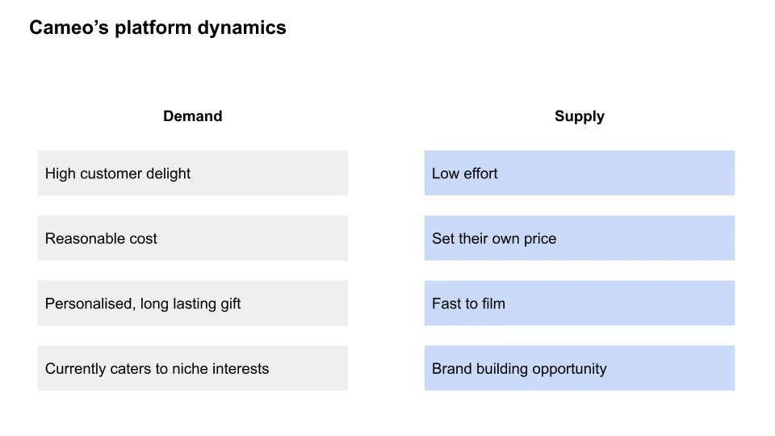
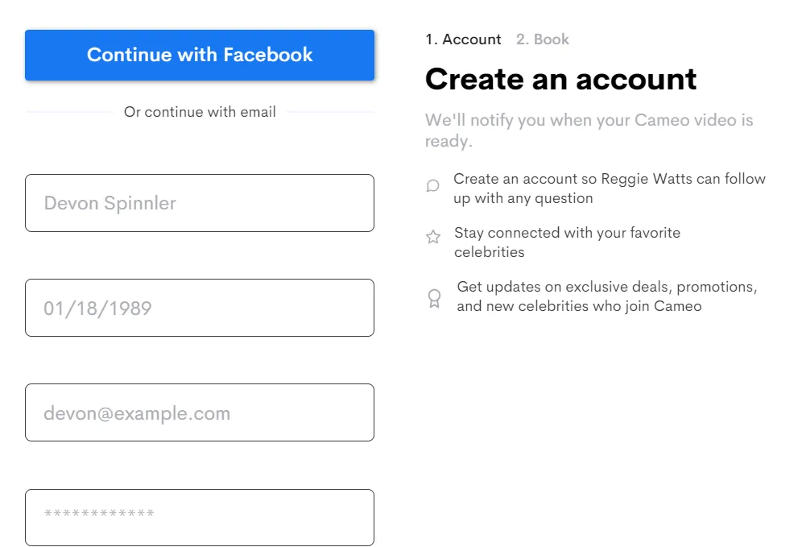

## Conclusiones

Cameo es una empresa que ha aprovechado la larga cola\, dándose cuenta de que un pequeño gesto de una celebridad menor puede marcar una gran diferencia para un fan\.

## 1\. Camafeo y la larga cola larga

[Kevin Kelly,](https://kk.org/biography 'Kevin') cofundador de la revista Wired\, acuñó la expresión [1,000 true fans](https://kk.org/thetechnium/1000-true-fans/ '1000') Hace muchos años\. [Li Jin](https://li.substack.com/people/1021248 'Li') Recientemente fui desarrollando esa idea con ella [100 true fans](https://a16z.com/2020/02/06/100-true-fans/ '100') artículo\. Si no has leído ninguno de los dos\, la idea es que una cantidad alcanzable de fans leales \(100 o 1\.000\) es suficiente para que los creadores se ganen la vida\. Por ejemplo\, alguien que tuviera 1\.000 fans pagando 100 dólares al año tendría suficiente para salir adelante en la mayoría de las ciudades\; lo mismo ocurre con un creador que tenía 100 fans pagando 1\.000 dólares al año\. Y conseguir 1\.000 fans no suena tan descabellado\.

Ambos artículos atestiguan que internet ha reducido costes para los creadores\, **lo que permitió descubrir y apoyar una larga cola de talento\.** Todos somos raros\, y ahora es más rápido\, barato y fácil encontrar gente afines que produzca cosas que queremos ver\. Tu virtuosismo actuando como un perro ya no quedará descubierto\; [it might even make you a six figure income](https://www.dailydot.com/irl/onlyfans-puppy-jenna-phillips-tiktok/ 'dog') [^1]\.

Si la mayoría de los creadores en esta nueva economía podrán alcanzar realmente ese objetivo de 1\.000 fans reales está por verse\. Veremos muchas historias de éxito de artistas independientes\, pero siento que no veremos a toda la gente que se retiró por el camino\. Si alguna vez has intentado aumentar tu número de seguidores en redes sociales\, sabes que es más difícil de lo que parece\. Hoy en día\, **cualquiera puede ser una estrella\, pero no todo el mundo lo será\.**

Me subiré al carro de los escritores que nombran frameworks\, y llamaré a esto **el efecto de la cola larga larga\,** considerando que es la única referencia para el término [is a children's book.](https://www.amazon.com/Long-Tail-Joy-Cowley/dp/0780248880 'tail') Lo que dice el efecto de la larga cola es que la cola larga es más larga y extraña de lo que la gente espera\, incluso si ya esperan lo extraño\. Lo que implica es que si quieres elegir un ganador en esta nueva economía\, es mejor elegir una plataforma que elegir un creador\. Aunque la probabilidad de éxito para cualquier creador es baja\, la probabilidad de éxito para la plataforma que consolida creadores es alta\.

Por tanto\, en lugar de hablar de los deprimentes mercados de actuación canina\, hoy quiero analizar las plataformas que los impulsan\. En particular\, quiero analizar más de cerca [Cameo,](https://www.cameo.com/ 'cameo') Un mercado que ofrece mensajes de vídeo personalizados de celebridades\. Por el barato precio de 30 dólares\, puedes conseguir un mensaje de vídeo personalizado de Kirpa Sudick\, Kevin Fortenberry\, o tres \(\!\!\) vídeos de Paris el cerdito mini [^2]\. Normalmente\, la gente les hace desear feliz cumpleaños a familiares y amigos\, graduación u otra celebración\, [to the delight of the recipients.](https://www.youtube.com/watch?v=VeYm5TZknsc 'reaction')

Primero mencioné a Cameo [about a year ago](/writing/cameo 'Cameo') mientras intentaba hacer sentir culpable a la gente para que me comprara un cameo de Jenna Coleman [^3]\, y son un buen ejemplo de beneficiarios de la larga cola\. El mercado funciona porque el rendimiento individual para estas celebridades por sí solas es bajo\, pero el rendimiento combinado de todas ellas es alto\. Paris la mini cerdita por sí sola probablemente no generará suficiente para su dueño\, pero si la combines con Fiona el Hipopótamo o Lola la Perezosa\, podrías tener un negocio viable para la plataforma que ofrece el servicio\.

Los marketplaces tienen éxito agregando la demanda y la oferta\, así que empecemos analizando los Cameo\.

### La oferta y la demanda de Cameo muestran el ajuste al mercado

Cameo no parece tener un lema de empresa\, y lo que debería ser es **\"La basura de uno es el tesoro de otro\.\"** Sí\, sé que nunca lo usarán oficialmente\, pero es consecuencia directa de la larga cola\. Puede que no te importe el concursante \#23 en [the Asian Bachelor,](https://www.youtube.com/watch?v=ag1IisyP1ak 'Asian') [^4] Pero alguien en algún lugar ahí fuera sí\. Mucho\. Les alegraría el día\, y están dispuestos a pagar\.

Esta asimetría en la experiencia de usuario es la razón por la que Cameo está en una posición tan buena\. [Customer delight?](https://en.wikipedia.org/wiki/Customer_delight 'customer') [Creating minimum viable happiness?"](https://medium.com/@sarahtavel/the-hierarchy-of-marketplaces-introduction-and-level-1-983995aa218e 'Sarah') Si le compras a la tía May un cameo de su estrella de cine favorita\, eso es todo lo que hablará durante años\, y quizá por fin deje de insistir con que te cases\.

Supongo que estos cameos también son fáciles de grabar para las celebridades\, ya que solo tienen que leer un guion y mirar el móvil durante unos minutos\. Dado lo fácil que es\, no es de extrañar que tantos se hayan unido\. [Since the talent also sets the price](http://www.chicagomag.com/Chicago-Magazine/January-2020/Cameo-Steven-Galanis/ 'price')\, eso implica que las celebridades cobran lo que consideren que les da un equilibrio entre reservas y facturación\. Podrían subir sus tarifas si estuvieran sobrevendidas\, y bajarlas en caso contrario\. Mercado eficiente en acción aquí\.

Una rápida mirada a la web muestra que los precios varían principalmente entre 30 y 100 dólares\, lo cual no me sorprende\. Si alguna vez has estado en una comic con\, las fotos o los autógrafos suelen ir a precio [somewhere in that range](https://planetcomicon.com/autographphoto-op-price-chart/ 'range')\, implicando que hay demanda probada en ese rango de precio\. **Lo que ha hecho Cameo es habilitar la larga cola\.** Ahora puedes tener una experiencia sustituta de Comic Con en cualquier momento y lugar\. [By Grabthar's hammer, what a savings.](https://www.youtube.com/watch?v=kgv7U3GYlDY 'galaxy quest')

Un incentivo adicional para que las celebridades participen en Cameo es la oportunidad de crear una marca para sí mismas\. No solo ganan dinero con el vídeo\, sino que permanecen en la conciencia de sus verdaderos fans\. El mayor miedo de la fama es ser olvidados\, y Cameo reduce esa preocupación\. Los fans famosos también están incentivados a compartir el vídeo\, lo que les hace más propensos a resurgir en las conversaciones\. Como dice Cameo\, [the talent is getting paid to promote their own content.](https://www.producthunt.com/stories/inside-cameo-the-rocketship-making-influencers-money 'Cameo')

La oferta también trae más oferta\. Cuando ves a tu compañera estrella de Bachelorette \(que fue eliminada antes que tú\) recibiendo una reacción viral en vídeo de sus fans [^5]\, probablemente estés un poco celoso\. Cuando descubras que ella también cobró por ese vídeo de 1 minuto\, probablemente te apuntarás tú mismo a la plataforma\. No elimina la necesidad de que el equipo de ventas de Cameo contrate a celebridades\, pero sí facilita su trabajo [^6]\.

¿Es suficiente\? Cameo despegó trabajando en la larga cola\, y seguirá necesitando el apoyo de ese grupo durante mucho tiempo\. Sin embargo\, tiene sentido que quieran empezar a apuntar también a estrellas más grandes\, debido a los precios más altos que se pueden cobrar y a la mayor publicidad\. En lugar de perjudicar la larga cola de las celebridades\, esto realmente les ayuda\. Ahora pueden decir que están en la misma plataforma que Fulanito\, un punto de prestigio\. Los fans de la larga cola también las buscan específicamente\, así que más celebridades no deberían canibalizar los ingresos de otros que ya están en la plataforma\.

¿Podrán llegar a un punto de inflexión en el que más estrellas se sientan cómodas uniéndose\? Supongo que esto es como la incomodidad de AirBnB o Uber cuando empezaron\, y que la idea se normalizará con el tiempo\. Ya han traído a personas como Elijah Wood \(famoso por El Señor de los Anillos\)\, Sarah Jessica Parker \(famosa por Sexo en Nueva York\) o Snoop Dogg \(famoso por fumar marihuana\) en la plataforma\, así que no parece tan difícil seguir expandiéndose allí\.

Hemos establecido el caso a favor de la demanda y el argumento de la oferta\, viendo que hay un claro [product market fit.](https://a16z.com/2017/02/18/12-things-about-product-market-fit/ 'pmf') ¿Y qué pasa con la economía de la plataforma en sí\?

### Cameo tiene una alta tasa de adquisición\, una estructura de costes semiescalable y un gran mercado dirigido

Para entender mejor la economía de las plataformas\, me gustaría analizar tres cosas [^7]\:

- El [take rate](/writing/rake 'take')\, o la tarifa que cobra Cameo
- La probable estructura de costes de Cameo
- Tamaño total del mercado direccionable \(TAM\)

Cameo tiene un [75/25 revenue split](https://www.producthunt.com/stories/inside-cameo-the-rocketship-making-influencers-money 'rev')\; Cameo se queda con el 25\% de cada 1 dólar reservado\. Es una tasa de aceptación relativamente alta y\, según una investigación superficial\, más alta que la [celeb agents get (10%)](https://www.backstage.com/magazine/article/pay-agent-8943/ 'agent') o qué [celeb managers get (20%)](https://www.billboard.com/articles/business/6605758/what-artists-managers-really-earn-its-not-cheap-to-be-available-24-7 'manager')\, aunque\, por supuesto\, los servicios que ofrecen son diferentes\. Preferiría que lo hicieran [lower their take rate](http://abovethecrowd.com/2013/04/18/a-rake-too-far-optimal-platformpricing-strategy/ 'take')\, pero eso siempre ha sido un sesgo personal mío cuando pienso en los marketplaces\.

¿Podría un agente o un talento organizarlo ellos mismos y desintermediar a Cameo\? Potencialmente\. Las celebridades podrían haber hecho ofertas en sus cuentas de Instagram o Snapchat todo este tiempo\, pero la mayoría no lo ha hecho\. Probablemente sea una combinación de privacidad\, normas sociales y complicaciones\. La celebridad no quiere revelar su información de contacto personal\, lo que implica que el saludo debe hacerse en la plataforma\. Sin embargo\, eso significa que el feed de la celebridad estará saturado de vídeos cameo\, lo cual probablemente no sea deseable\. Tener que configurar todos los pagos y los pedidos de seguimiento también es molesto\.

¿Ofrece Cameo una forma más sencilla de ganar dinero sin tener que publicitarte\? Sin duda\. Una vez registrados\, las celebridades no tienen que hacer nada más que pedir el pedido y grabar el vídeo con sus móviles\. **Promoción\, privacidad\, pagos\: todo ese dolor lo gestiona Cameo\.**

La estructura de costes de Cameo sí me preocupa\. Como el producto se entrega digitalmente\, probablemente tengan bajos costes marginales\, un par de puntos porcentuales en el procesamiento de pagos y algo desconocido pero bajo en infraestructura de datos [^8]\. Eso está genial\, y lo que más me intriga es la base de costes semi\-fija\.

Hace aproximadamente un año [^9]\, [Cameo claimed to have 120 employees, of which 80 were dealing with talent.](https://www.producthunt.com/stories/inside-cameo-the-rocketship-making-influencers-money 'talent') Eso es mucha gente haciendo ventas o soporte\. También muestra el problema de servir en esa larga cola\: son demasiados\. Tendrías que asumir que esta función de costes crece más despacio que la tasa de crecimiento del talento para que el negocio sea viable\. Quizá puedas externalizar el soporte al cliente\, pero probablemente el soporte al talento se hará internamente\.

Yelp y Angi homeservices son otras empresas que también atienden a la larga cola\: Yelp vendiendo anuncios a restaurantes\, y Angi siendo un mercado para contratistas de servicios a domicilio\. Si Cameo acaba teniendo una estructura de costes similar\, eso implica que \~50\% de sus ingresos se destinarán a ventas y marketing [^10]\. Eso es mucho y podría ser la partida clave que decida si Cameo es rentable o no\.

Por último\, ¿qué tamaño tiene el mercado\? El tamaño del mercado suele ser más arte que ciencia\, especialmente cuando empiezas a hacer modelado cenital\. Si hiciste todo [$700bn US entertainment market](<https://www.selectusa.gov/media-entertainment-industry-united-states#:~:text=The%20U.S.%20media%20and%20entertainment,the%20largest%20in%20the%20world.&text=The%20U.S.%20industry%20is%20expected,Outlook%20by%20PriceWaterhouseCoopers%20(PwC).> 'pwc') y dijo que Cameo podría tomar algunos puntos básicos de eso\, eso ya es mil millones en ingresos\, aunque con supuestos muy agresivos\. Dado [Cameo's raised venture funding at a $300mm valuation,](https://techcrunch.com/2019/06/25/cameo/ 'Cameo') Supongo que algún capitalista de riesgo ha hecho los cálculos para justificar que eventualmente lleguen a una valoración unicornio\.

Creo que las matemáticas anteriores asumen una base demasiado grande\, así que veamos qué hacen las convenciones de cómics en su lugar\. Supuestamente [NY Comic Con does $100mm in revenue](https://fortune.com/2019/10/06/new-york-comic-con-organizer-reedpop-is-perfecting-the-business-of-pop-culture/#:~:text=Over%20the%20past%20six%20years,further%20expanded%20into%20international%20markets. 'NYCC')\, así que parece razonable suponer que Cameo podría algún día tener la misma alcance que una convención de una sola ciudad\. Eso es aproximadamente el 1\% de la población estadounidense pagando 30 dólares por un cameo\, lo cual no me parece tan descabellado\. Probablemente recibirías un porcentaje menor de la población\, pero una cantidad media más alta\.

Si este tipo de negocio es recurrente o más bien de naturaleza puntual también es algo a tener en cuenta\. Creo que hay suficiente interés como para pedir cameos

En general\, la tasa de adquisición parece lucrativa\, la estructura de costes potencialmente preocupante\, y el TAM estadounidense razonable para respaldar una valoración considerable para Cameo\.

### Cameo para el futuro

Si yo fuera Cameo\, aquí hay algunas cosas que me preocuparían para el futuro\:

- Competición imitadora\, tanto de redes sociales nuevas como existentes
- Calidad de cameo
- Expansión más allá de Estados Unidos

Como se mencionó antes\, parece que Insta o Snap no han captado esta tendencia del mercado\, por querer preservar la experiencia existente del feed de usuarios\. Sin embargo\, la gente pagará por tener aún más interacción con sus celebridades\, como se ve en [virtual gifting in China](https://www.wowza.com/blog/live-streaming-in-china 'china')\, streaming de videojuegos en Twitch\, o OnlyFans en EE\. UU\.

Dado que Insta y Snap tienen opciones de comercio electrónico\, parece posible que también lancen una función de cameo\. Irías a la página de una celebridad para pedir un cameo\, recuperarías ese cameo como vídeo público o privado\, y podrías compartirlo con amigos\, todo en la misma plataforma\. Como los fans más dedicados probablemente ya sigan a sus celebridades favoritas en redes sociales\, eso supone menos fricción para ellos comparado con ir a la web de Cameo\. Lo que Cameo puede hacer aquí es que la experiencia sea más fácil para las celebridades hacer cameos\, y seguir creciendo para que consigan más reservas\.

Cameo no sufre el problema de emparejamiento entre oferta y demanda que [most marketplaces face](https://www.slideshare.net/jbreinlinger/marketplace-pricing-and-feedback 'feedback')\. Como los usuarios saben lo que buscan\, no necesitas sistemas sofisticados de valoración o recomendación de usuarios para adaptar el talento a la demanda\. Eso supone un posible ahorro que se puede gastar en adquirir más talento\.

Cameo tampoco parece tener opciones de ordenación efectivas en este momento\, así que esa es una función nueva potencial\. Ordenar por lo más caro o lo más solicitado podría aumentar el total de reservas\. La preocupación de nuevo es probablemente cómo se sentirá el talento cuando pueda ver su popularidad relativa\. Hay una razón por la que Masterclass no publica información sobre lo populares que son sus clases\.

No estoy seguro de si hacer un perfil de usuario para reservar cameos merece la pena\. Claro\, puedes vincularlo con Facebook para facilitar la creación de cuentas\, pero parece que hacer cuentas de invitado también funcionaría\. Supongo que hay alguna ventaja en sugerir más cameos que puedan gustar a los usuarios\, basándonos en los anteriores que hicieron\.

La expansión internacional parece un paso obvio a seguir\, con Europa probablemente como la geografía más natural que sigue\. La dificultad probablemente sea montar el equipo de ventas en esa ubicación y conseguir que las primeras celebridades locales se sumen\. No veo grandes problemas de localización aquí\, pero podría estar equivocado\. A diferencia de algunos marketplaces que solo tienen efectos de red locales\, Cameo parece tener efectos de red más amplios\, ya que conseguir una celebridad británica generará demanda de un cliente estadounidense que ve programas británicos\. En cierta medida\, eso también beneficiará expandirse en países no anglófonos\, ya que probablemente seguirá habiendo demanda de cameos internacionales de celebridades por parte de la población local\. [Lotta avengers fans in China.](https://www.wikiwand.com/en/List_of_highest-grossing_films_in_China 'China')

### Reflexiones finales de un cameo

Si has visto uno de esos memes de cuarentena de celebridades en casa\, Cameo es el producto que lo hace realidad\. El fan habitual ahora puede comprar algo de tiempo con su celebridad favorita\.

Cameo tuvo éxito inicial a través de la larga cola\, dándose cuenta de que un pequeño gesto de una celebridad menor podría tener un impacto desproporcionado en una persona\. Está claro que hay demanda del producto y la oferta probablemente está limitando el crecimiento del mercado por ahora\. Su TAM parece grande\, la tasa de aceptación podría reducirse y la estructura de costes podría ser un problema\. Mirando al futuro\, la expansión internacional parece un paso evidente\, siempre que puedan mantener la calidad de su producto y no vean imitadores\.

## 2\. \& 3\. La larga y larga cola en las finanzas y la vida personal

Normalmente también hago una parte de finanzas y otra de crecimiento personal\. Dada la extensión de la sección tecnológica anterior y [the GPT-3 article on AI from last week](/writing/dr_gpt 'GPT')\, voy a mantener breve la sección de este mes sobre ambos\.

La cola larga larga también es un fenómeno en finanzas\, y el ejemplo más sencillo de esto es [Robinhood](https://robinhood.com/us/en/ 'Robinhood')\, la startup que ofrece operaciones sin comisiones\. La opinión está dividida sobre si esto es algo bueno o si Robinhood está robando a los pobres para alimentar a los ricos mediante pagos por el flujo de pedidos [^11]\. En cualquier caso\, el auge de Robinhood y sus competidores ha permitido que crezca un grupo de traders más nuevo\, grande y extraño\. Y como antes\, elegiría la plataforma para que sea la ganadora en lugar de a cualquier individuo individual\.

Y lo que implica la larga cola para tu vida personal es que\, independientemente de tus intereses\, probablemente podrás encontrar un grupo que te reciba\. Especialmente en estos tiempos más aislados\, encontrar una pequeña comunidad para ti mismo te hará sentir menos solo\, ya sea en un nicho [subreddit](https://www.reddit.com/ 'reddit') o [discord chat group.](https://discord.com/new 'discord') Eres un copo de nieve único\, como todos los demás\.

## Otros

1. [The Tesseract: Economics of an Information Space](https://geoff-yamane.com/blog/2020/6/30/the-tesseract-economics-of-an-information-space 'Geoff') y cómo las redes definen el mundo digital
2. ["This is a few short stories about things that never change in a world that never stops changing."](https://www.collaborativefund.com/blog/same-as-it-ever-was/ 'Morgan')
3. [Varieties of Motte and Bailey](https://stefanfschubert.com/blog/2020/6/4/varieties-of-motte-and-bailey 'Motte')
4. [Using algorithms to improve your touch typing](https://www.keybr.com/ 'keybr')
5. He trasteado con el chatbot [Replika](https://replika.ai/ 'Replika') Hace unos años\, parece que han hecho algunas mejoras y han relanzado desde entonces\.

[^1]: Advertí que sería raro\. Además\, parece que gana seis cifras _mes_\. 1\.000 verdaderos fans de Only\, sin duda\. Suspiro\.

[^2]: No\, no tengo ni idea de quiénes son estas personas o mascotas\, pero supongo que hay gente que los adora absolutamente\. París es un trato cruel\.

[^3]: Sin éxito\, lamentablemente\. Se puede esperar\. Me conformaría con David Tennant\.

[^4]: Esto no es algo real\, por si la gente se lo preguntaba

[^5]: ¿O es él\? Nunca recuerdo cuál tiene a todos los chicos y cuál a todas las chicas\.

[^6]: Cameo también tiene un [talent to talent referral system](https://www.producthunt.com/stories/inside-cameo-the-rocketship-making-influencers-money 'PH')\, donde el talento recibe un 5\% \(de la parte de Cameo\) de las contrataciones para el nuevo talento referido\.

[^7]: Técnicamente\, TAM no forma parte de economía\, pero lo he agrupado aquí por comodidad

[^8]: Sé que a algunas personas no les gusta el tratamiento de ingresos netos y dirían que el recorte del 75\% es COGS\, pero eso realmente no importa para la estructura de costes por debajo de esa línea\, que es más importante en mi opinión\.

[^9]: ¿Puedo decir lo molesto que me molesta cuando los artículos no tienen una fecha obvia de \"publicación\"\?

[^10]: Según los documentos de Yelp [here](https://www.yelp-ir.com/financials/sec-filings/default.aspx 'yelp') o las presentaciones de la ANGI [here](http://ir.angihomeservices.com/quarterly-earnings 'ANGI')\. No recuerdo si tienen en cuenta los costes de soporte dentro de la línea de S\&M o fuera de ella\, así que ese 50\% podría ser aún mayor\.

[^11]: Personalmente creo que las preocupaciones no están justificadas\, véase [Matt Levine](https://www.bloomberg.com/opinion/articles/2018-10-16/carl-icahn-wants-to-fight-dell-again 'Matt') o [Patrick McKenzie](https://www.kalzumeus.com/2019/6/26/how-brokerages-make-money/ 'Pat') para más detalles
