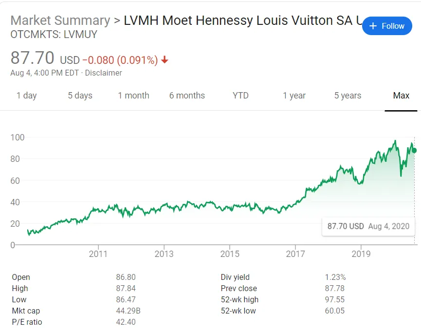

## Conclusión

Como CEO de LVMH\, Bernard Arnault cree que las marcas estrella requieren creatividad para las ideas pero control sobre la ejecución\, combinado con una mezcla de pasado y presente

## Lo más alto de la cadena de lujo

[LVMH](https://en.wikipedia.org/wiki/LVMH 'LVMH') es la empresa matriz de muchas marcas de lujo que conocemos\. [Formed in 1987](https://www.thefashionlaw.com/lvmh-a-timeline-behind-the-building-of-a-conglomerate/ '1987') gracias a la fusión de \"Louis Vuitton\" y \"Moët et Chandon and Hennessy\"\, ahora alberga más de 70 marcas en vino\, moda\, joyería y más\. En comparación con su competidor más cercano\, Kering [^1]\, [LVMH makes more than 2x the amount of revenue.](https://www.themds.com/companies/kering-versus-lvmh-it-bags-and-influencers-vs-heritage-and-size.html 'rev')

Y en la cima de todo está [Bernard Arnault](https://en.wikipedia.org/wiki/Bernard_Arnault 'Bernard')\, que ha sido el jefe del grupo desde 1990\. Le ha dado buenos resultados\, convirtiéndole en uno de los hombres más ricos del mundo\.

[Brett Bivens tweeted this HBR interview of Bernard a while back](https://twitter.com/brettbivens/status/1251505408960794624?s=20 'Brett')\, y hoy quiero ampliar ese artículo con algunas fuentes más\. Entenderemos mejor **cómo Bernard ve la creatividad\: donde permite el caos y donde restringe el control\.**

Bernard suele contar la historia de su primera visita a Estados Unidos\. Le preguntó a un taxista qué sabía de Francia\. [The driver couldn't name France's president, but could name Dior.](https://www.ft.com/content/21f64410-9117-11e9-aea1-2b1d33ac3271 'FT') Desde entonces\, Bernard siempre ha recordado **El poder que puede tener una marca\.**

Bernard construyó su marca comprando\. De su [first takeover of the textile company Boussac](https://www.forbes.com/sites/susanadams/2019/10/31/the-100-billion-man-how-bernard-arnault-stitched-together-the-worlds-third-biggest-fortune-with-louis-vuitton-dior-and-77-other-brandsand-why-hes-not-done-yet/#22a97e114efb 'Boussac') a [the many deals done since taking over LVMH,](https://www.thefashionlaw.com/lvmh-a-timeline-behind-the-building-of-a-conglomerate/ 'LVMH') Bernard ha llevado a LVMH a su estado actual con una serie de adquisiciones\, a veces de forma controvertida [^2]\. Hay una razón por la que se le conoce como el \"lobo de cachemir\"\.

Sin embargo\, el francés está lejos de ser solo un financiero\. Bernard también tiene opiniones firmes sobre la creatividad\, aplicada principalmente a la industria de la moda\. Mis lecturas han revelado algunos temas recurrentes\, y los repasaré sucesivamente\:

1. Caos vs control
2. Ideas vs ejecución
3. Pasado vs presente

### 1\. No renuncies a la creatividad en el proceso de diseño

Bernard entiende la importancia de dejar que sus diseñadores hagan su trabajo\, dándoles la libertad de ser creativos en la fase de ideación\:

> Todo nuestro negocio se basa en dar a nuestros artistas y diseñadores total libertad para inventar sin límites\.

> Lo importante es que no puedes comprometer la creatividad desde su nacimiento\.

Esto contrasta con la [A/B testing](https://www.crazyegg.com/blog/ab-testing/ 'AB') que la mayoría de las empresas tecnológicas hacen hoy en día\, lo cual Bernard afirma que no es apropiado para su negocio\:

> Algunas empresas son muy orientadas al marketing\; siguen al consumidor\. Y tienen éxito con esa estrategia\. Salen\, prueban lo que la gente quiere y luego lo hacen\. Pero ese enfoque no tiene nada que ver con la innovación \\\[\.\.\.\\\] No puedes cobrar un precio premium por dar a la gente lo que espera\, y nunca tendrás productos que se destaquen así—los tipos de productos que la gente hace cola por la manzana\. Tenemos eso\, pero solo porque damos libertad a nuestros artistas\.

> No lanzaremos un producto si las pruebas muestran claramente que va a fracasar\, pero tampoco usaremos pruebas para modificar productos\.

Esto recuerda a la cita de Steve Jobs\: \"los clientes no saben lo que quieren hasta que se lo muestras [^3]\.\" Si recordamos que la moda está en la cima de [the pace layer diagram](/writing/pace 'pace')\, tiene sentido que Bernard piense así\, dado el rápido ritmo de cambio en la industria\. Siempre está buscando algo nuevo para la temporada y necesita dictar el gusto del consumidor en lugar de dejarse guiar por él\.

Sin embargo\, Bernard pone límites en los procesos de producción y operaciones\. Aquí\, busca controlar la mayor parte posible de la acción\. Puedes ser creativo en las ideas pero no en la ejecución\:

> \\\[LVMH\\\] solo contrata a directivos tan respetuosos con el proceso creativo que soportarán su caos necesario\. Sin embargo\, cuando se trata de llevar su creatividad a las estanterías\, el caos desaparece\. La empresa impone una disciplina estricta a sus procesos de fabricación\,

> Nuestros productos tienen una calidad increíblemente alta\; tienen que tenerla\. Pero su producción está organizada de tal manera que también tenemos una productividad increíblemente alta\.

Y él también cumple con lo que dicen\, literalmente\. [Bernard does weekly store visits, and will flag concerns to his brand CEOs:](https://www.forbes.com/sites/susanadams/2019/10/31/the-100-billion-man-how-bernard-arnault-stitched-together-the-worlds-third-biggest-fortune-with-louis-vuitton-dior-and-77-other-brandsand-why-hes-not-done-yet/#22a97e114efb 'Bernard')

> Cada sábado\, recorre sus tiendas minoristas\, reorganizando las vitrinas de bolsas y haciendo sugerencias a los dependientes\.

Esta es la primera dualidad\: control frente a creatividad\. Aquí\, Bernard permite la creatividad en las primeras etapas cuando se necesita innovación\, y controla las etapas posteriores donde se requiere consistencia\.

### 2\. Favorecer la creatividad funcional

No dejes que la sección anterior te haga pensar que LVMH es un refugio para la artista torturada e incomprendida que necesita una vía de escape para expresarse\. Aunque Bernard da libertad a los artistas\, también cree que la creatividad no es un fin en sí misma para LVMH\. Bernard sigue siendo un hombre de negocios y quiere que sus cosas se vendan\.

Cree que las mejores personas creativas no solo quieren sus creaciones como piezas de exposición en museos\, sino que se lleven\:

> Las personas creativas más exitosas \\\[\.\.\.\\\] quieren ver sus creaciones en la calle\. No inventan solo para inventar\. Sí\, se les ocurren muchas ideas emocionantes\, y muchas de ellas sorprenden\; al principio parecen locas\, completamente locas\. Pero los verdaderos artistas que hacen que LVMH tenga éxito\, no quieren que el proceso termine ahí\. Quieren que la gente lleve sus vestidos\, o rocie su perfume\, o cargue el equipaje que han diseñado\.

> El crecimiento es función de un alto deseo\. Los clientes deben querer el producto

Bernard lo trata como su trabajo hacer que la creatividad funcione\, convirtiendo ideas locas en un producto increíblemente atractivo\:

> Lo que me divierte es intentar transformar la creatividad en realidad empresarial en todo el mundo\. Para ello\, tienes que estar conectado con innovadores y diseñadores\, pero también hacer que sus ideas sean vivibles y concretas

> Creatividad\: sí\, pero ejecutada de una manera que a la gente le guste y pueda usar

Y esto está impulsado por su creencia de que la ejecución importa\:

> Necesitas ideas\, pero la idea es solo un 20\%\. La ejecución es un 80\%\.

Esta es la segunda dualidad\: ideas frente a ejecución\. Bernard reconoce claramente la importancia de las ideas\; todo lo que hablamos antes sobre la libertad creativa lo deja claro\. Además\, Bernard reconoce que\, aunque ellos hacen arte\, LVMH no está en la industria del arte\. El arte que no se vende no es bienvenido\.

### 3\. Combinar tradición y modernidad

Bernard también cree que la creatividad requiere referenciar el pasado pero también mirar hacia el futuro\. En su opinión\, los mejores productos son aquellos que pueden atraer a ambos aspectos simultáneamente\:

> El proceso LVMH tiene un objetivo\: las marcas estrella\. Según Arnault\, las marcas estrellas nacen solo cuando una empresa consigue fabricar productos que \"hablan a la eternidad\" pero que resultan intensamente modernos\. Estos productos se venden rápido y frenéticamente\, todo ello mientras obtienen beneficios\.

> Cuando veo un producto de algunas de nuestras mejores marcas\, tiene que ser atemporal\, pero también debe tener algo de la máxima modernidad\.

> ¿Es entonces la herencia la característica principal de una marca estrella\? Diría que se requieren cuatro características\. Una marca estrella es atemporal\, moderna\, de rápido crecimiento y altamente rentable [^4]

Como resultado\, la mayor parte de los ingresos proviene de productos clásicos\, ya que LVMH modera la frecuencia con la que se lanzan nuevos productos al mercado\. Esto parece algo contradictorio y probablemente sea similar a la mayoría de las empresas de consumo\, por ejemplo\, una empresa de bebidas que introduce nuevos sabores constantemente pero sigue obteniendo la mayor parte de su dinero con el sabor original\. Me cuesta algo consolidar esta idea con su opinión de que la creatividad es importante\. ¿Quizá sea porque tienen tan pocas oportunidades para probar nuevos productos\?

> No ponemos en riesgo a toda la empresa presentando productos nuevos todo el tiempo\. De hecho\, en un año dado\, solo el 15\% de nuestro negocio proviene de los nuevos\; el resto proviene de productos tradicionales y probados—los clásicos\.

Su énfasis en la tradición probablemente proviene tanto de esa estadística mencionada como de su experiencia intentando lanzar una marca desde cero\:

> al principio pensamos\: \"Vale\, aquí tenemos un genio con Christian Lacroix\"\, pero aprendimos que el genio no es suficiente para triunfar\. Fue un shock\, para ser sinceros\, descubrir que ni siquiera un gran talento podía lanzar una marca desde cero\. Una marca debe tener un legado\; no hay atajos\.

Lo que explica por qué intenta mantener a la gente durante las adquisiciones\. Esto es sorprendente\, dado que una de las principales razones del ahorro tras la adquisición es el despido de personas de la empresa que acabas de adquirir\.

> La calidad también viene de contratar a personas muy dedicadas y luego mantenerlas durante mucho tiempo\. Intentamos mantener a la gente de las marcas\, especialmente a los artesanos \\\[\.\.\.\\\] La mayoría de las empresas limpian la casa cuando adquieren una nueva marca\. No lo hacemos porque hayamos descubierto que perjudica mucho la calidad\. Cuando limpias la casa\, sacas a las personas que más respetan la marca y que contribuyen a su longevidad—su atemporalidad\, su autenticidad\.

Esta es la tercera dualidad\: pasado vs presente\. Bernard cree que los consumidores miran al pasado\, pero quieren vivir en el presente\.

## Construir una marca a largo plazo

Hemos tratado 3 dualidades con las que Bernard lidia\, surgidas de la experiencia que ha tenido construyendo la marca\. Al permitir la creatividad con control\, ejecución de ideas y combinando tradición y modernidad\, Bernard cree que está construyendo LVMH a largo plazo\:

> [When we discuss a brand, I always tell them my real concern is what the brand will be in five or ten years, not the profitability in the next six months.](https://www.forbes.com/sites/luisakroll/2017/09/26/business-icon-bernard-arnault-reveals-his-most-important-mentor-biggest-mistake-in-qa/#4e8836af2ccc 'Forbes')

Y eso le ha funcionado hasta ahora\, al menos según el precio de la acción y la cuota de mercado de LVMH\:

¿Cuánto de su marco es aplicable a otros negocios\? En general\, estoy de acuerdo en el énfasis en la creatividad pero también en la excelencia operativa\. Según la nota reciente sobre [why companies are bad at innovating](/writing/turtle 'turtle') Aunque no estoy seguro de que la mayoría de las empresas estén dispuestas a aceptar la volatilidad implícita al aceptar más creatividad\. No estoy seguro de si la dualidad pasado\/presente se implementa fácilmente\, más allá de alguna campaña de marketing solo para aparentar\.

Con todo lo que Bernard ha conseguido\, uno pensaría que estaría listo para retirarse\. Pero no ha terminado de construir un imperio\. Incluso ahora\, Bernard sigue creyendo [it's day 1:](https://www.forbes.com/sites/quora/2017/04/21/what-is-jeff-bezos-day-1-philosophy/#1867a2be1052 'Day')

> Todavía somos pequeños\. Acabamos de empezar\. Esto es muy divertido\. Somos los número uno\, pero podemos ir más allá\.

## Fuentes

1. [HBR interview](https://hbr.org/2001/10/the-perfect-paradox-of-star-brands-an-interview-with-bernard-arnault-of-lvmh 'HBR')
2. [FT interview](https://www.ft.com/content/21f64410-9117-11e9-aea1-2b1d33ac3271 'FT')
3. [Forbes interview](https://www.forbes.com/sites/luisakroll/2017/09/26/business-icon-bernard-arnault-reveals-his-most-important-mentor-biggest-mistake-in-qa/#4e8836af2ccc 'Forbes')
4. [NYT interview](https://www.nytimes.com/2019/11/25/fashion/bernard-arnault-tiffany-lvmh.html 'NYT')
5. [Reuters coverage of LVMH/Tiffany deal](https://www.reuters.com/article/us-tiffany-m-a-lvmh-deal/how-lvmhs-whirlwind-courtship-sealed-16-billion-tiffany-deal-idUSKBN1XZ2F7 'LVMH')

[^1]: [Kering owns Gucci, Saint Laurent, Bottega Veneta, Balenciaga, Alexander McQueen, Brioni, and more](https://www.kering.com/en/talent/who-we-are/our-houses/ 'Kering')

[^2]: Su [firing of workers at Boussac](https://www.nytimes.com/1989/12/17/magazine/a-luxury-fight-to-the-finish.html 'Bossac')\, [ouster of LVMH leadership](https://www.forbes.com/sites/susanadams/2019/10/31/the-100-billion-man-how-bernard-arnault-stitched-together-the-worlds-third-biggest-fortune-with-louis-vuitton-dior-and-77-other-brandsand-why-hes-not-done-yet/#22a97e114efb 'LVMH')\, y la oferta hostil por Hermes han atraído muchas críticas\, por nombrar algunas\.

[^3]: Supuestamente malinterpretado\, según [this article](https://www.businessinsider.com/steve-jobs-quote-misunderstood-katie-dill-2019-4 'katie')

[^4]: Bernard también dice que a veces hay algo inexplicable\: \"Muchas marcas tienen el potencial de ser estrellas\, pero están mal gestionadas\. Eso es una pena para ellas\. Pero hay más marcas que están tan bien gestionadas como se puede estar\, y nunca serán estrellas\. Nunca tendrán éxito en todo el mundo\. No tienen ese algo—esa magia que realmente no puedes explicar\.\"
