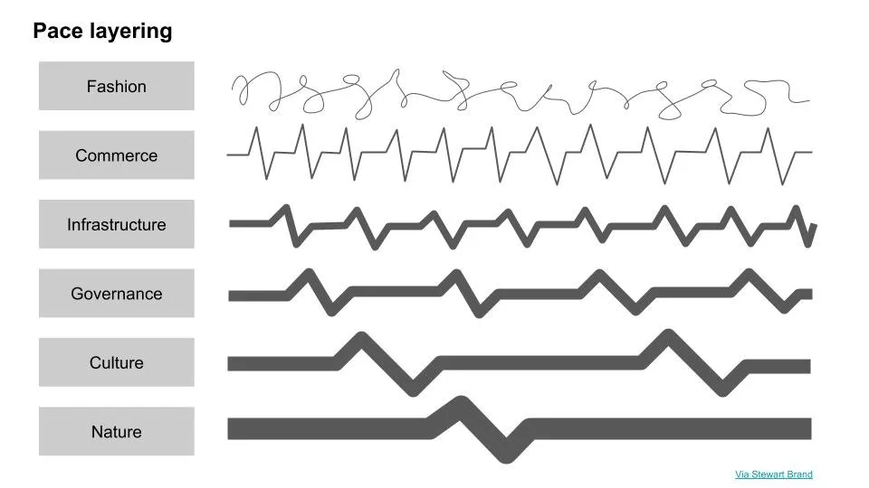
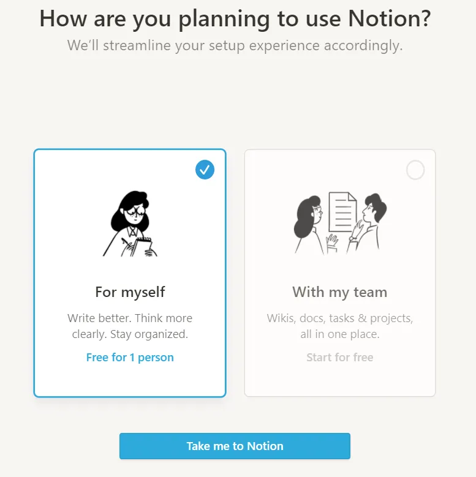
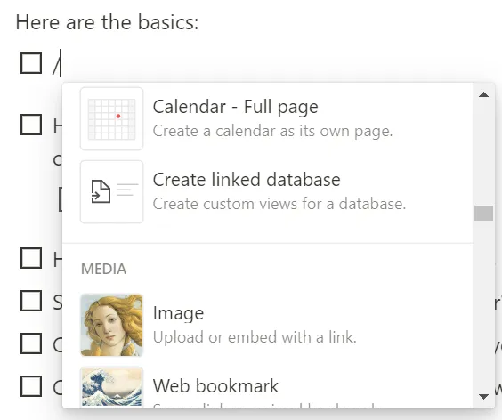
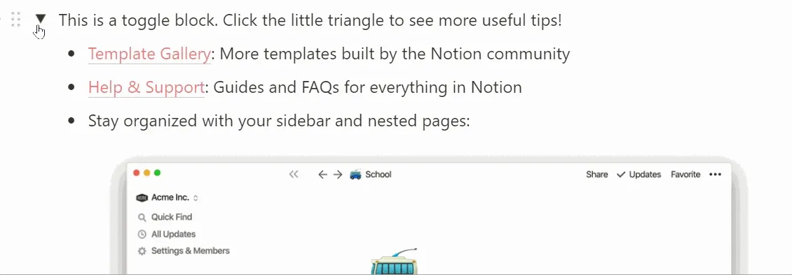
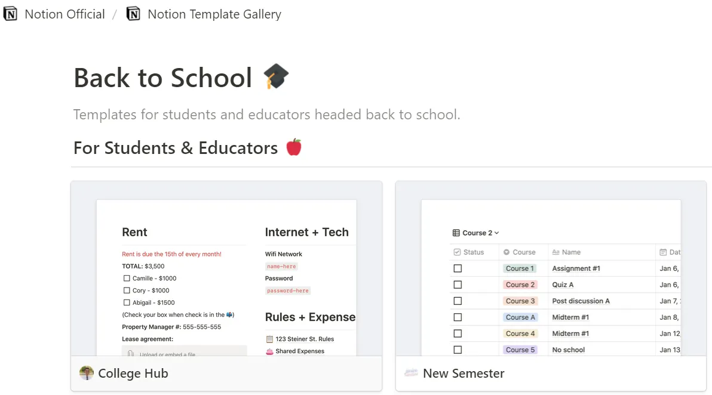
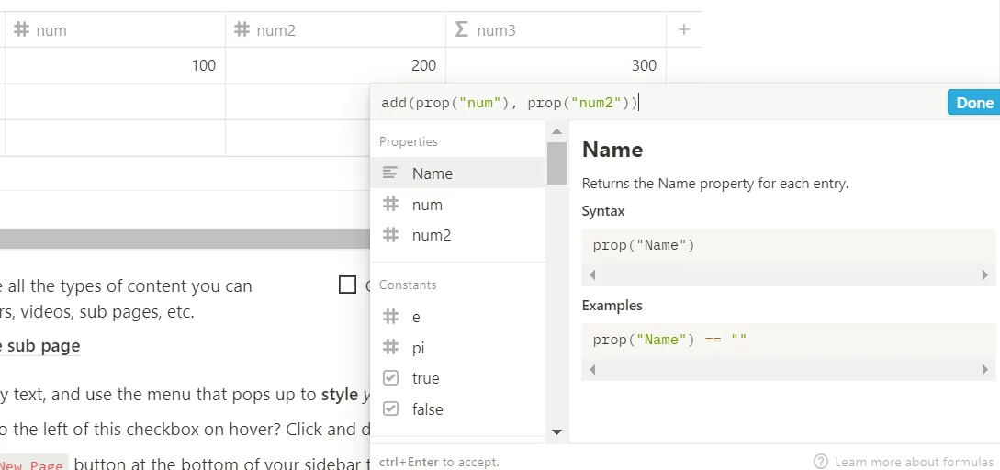

## Conclusión

1. Notion es un enfoque visual para la organización y colaboración de la información
2. Las mayores fortalezas de Notion son los formularios flexibles\, la construcción visual y las opciones de plantillas
3. Los mayores problemas de Notion probablemente estén relacionados con la calidad\, y doy algunas ideas de marketing y productos para solucionarlos

## Espacio de trabajo Notion para tu lugar de trabajo

En la película [Inception by Christopher Nolan,](https://en.wikipedia.org/wiki/Inception 'Inception') Los personajes principales deambulan por capas anidadas de sueños para cumplir una tarea\. Sus acciones dentro de esa capa afectan a la capa en sí\, y también a las capas superiores o inferiores\. A veces te interesa lo que ocurre en esa capa\, otras veces afecta a otras capas\.

Quiero que tengas ese marco en mente \- **de capas\, interacción dentro de capas e interacción entre capas\.** Volveremos a ello en breve [^1]\.

Recientemente\, startups de productividad como Notion\, Coda y Roam han subido rondas a altas valoraciones para su tamaño\. [The hustle has Notion at a $2bn valuation, Coda at $600mm, and Roam at $200mm](https://thehustle.co/09142020-roam-research/ 'Hustle')\. Teniendo en cuenta lo jóvenes que son estas empresas [^2]\, son evaluaciones optimistas de capital riesgo sobre el potencial de este tipo de empresas\.

Hoy quiero analizar más de cerca [Notion](https://www.notion.so/ 'Notion')\. Vamos a ir [^3]\:

1. Cuál es el propósito de Notion
2. Repaso de características de muestra
3. Sugerencias para el equipo de Notion

Así\, al final de esto\, tendrás una idea de por qué existen estas startups\, cómo son y cómo podrían cambiar en el futuro\.

Empecemos\.

## 1\. Notion es un enfoque visual para la organización y colaboración de la información

Para entender mejor Notion\, necesitamos obtener más contexto sobre la historia de nuestra interacción con la información y la evolución de la informática\.

Podemos pensar de forma burda en los humanos como una función\. Tomamos datos como entrada\, los procesamos y damos alguna respuesta como resultado\. Esos datos de salida influyen en otros que ellos mismos los procesan y reaccionan en consecuencia\.

Antes almacenábamos datos físicamente\, y tenías que ir a una biblioteca o a un profesional en persona para conseguir algún pergamino de verdad [how likely Jack Sparrow would have visited Singapore](https://www.reddit.com/r/AskHistorians/comments/gd7cww/in_pirates_of_carribbean_jack_sparrow_says_youve/ 'Reddit') [^4]\.

Con los ordenadores\, hemos pasado a almacenar datos digitalmente\, incluso permitiendo que varios colaboradores estén en un documento al mismo tiempo\. **Ya no estamos atados por la ubicación física de los datos o de la persona\, lo que abre oportunidades para interactuar con la información a escala global\.** Antes\, había pocas posibilidades de que pudiera trabajar con alguien en Uganda\, dada la rapidez de la transferencia de información\. Ahora\, no solo podemos trabajar juntos\, sino que incluso podemos trabajar en el mismo documento simultáneamente\.

Sin embargo\, nos costó un tiempo llegar hasta aquí\, ya que requería cambios de mentalidad\, tecnología y diseño para permitir nuestros hábitos laborales actuales\.

Un gran cambio fue el **[graphical user interface](https://www.youtube.com/watch?time_continue=39&v=BFlop4sP8Os&feature=emb_title 'GUI')\.** Antes de esto\, [people were interacting with computers via a command line interface,](https://www.wired.com/1997/12/web-101-a-history-of-the-gui/#:~:text=In%201979%2C%20the%20Xerox%20Palo,first%20prototype%20for%20a%20GUI.&text=When%20Jobs%20saw%20this%20prototype,expensive%3B%20no%20one%20bought%20it. 'CLI') Muy parecido a lo que se indica a continuación\.

Como puedes ver\, no es la forma más intuitiva de trabajar con un ordenador\. Diré que dejé ese error ahí como un momento de aprendizaje\; la verdad es que olvidé la sintaxis correcta\. La interacción por línea de comandos puede ser poderosa\, pero supone una gran barrera de entrada para la mayoría de los usuarios\. Al rediseñar el uso en torno a una experiencia visual\, [Apple achieved a breakthrough](https://en.wikipedia.org/wiki/History_of_the_graphical_user_interface 'Apple') En la creación de la computación para el mercado masivo [^5]\. El progreso informático se habría ralentizado significativamente si hubiéramos seguido trabajando solo en línea de comandos\.

Un segundo gran cambio fue internet\, que llegó en dos oleadas\. Antes de esto\, la gente almacenaba el trabajo en soportes físicos como disquetes [^6]\. Si quisieras compartir algo\, aún tendrías que transportar físicamente tu almacenamiento temporal a la otra persona\.

**El correo electrónico ayudó a cambiar eso\,** eliminando poco a poco la necesidad de hardware y aumentando la comodidad y velocidad de la transferencia de datos\. En lugar de enviarte un solo pendrive con una versión editada y finalizada de tu propuesta\, tu jefe ahora puede enviarte diez correos electrónicos separados y sin enlace dándote comentarios sobre el formato del tamaño de la nota al pie\.

En los últimos 10 años\, el aumento del ancho de banda de internet también ha permitido nuestro **Pasar a la nube\.** En lugar de enviar correos electrónicos\, ahora todos pueden colaborar en tiempo real en el mismo documento\, aumentando aún más la comodidad y reduciendo problemas de control de versiones\. Ahora puedo sentarme en pijama viendo [Dark](<https://en.wikipedia.org/wiki/Dark_(TV_series)> 'Dark') Mientras respondía a medias a los comentarios en un documento de Google\. No es que lo hiciera\, claro\.

Internet y la nube proporcionaron la base para el crecimiento de todos los [Software as a Service (SaaS)](https://www.bmc.com/blogs/saas-vs-paas-vs-iaas-whats-the-difference-and-how-to-choose/ 'SaaS') Las empresas que vemos hoy\. Al dar por hecho que alguien más proporcionará la infraestructura \(IaaS\) o la plataforma \(PaaS\) necesaria para soportarlos\, las empresas de software pueden centrarse en atender las necesidades de un segmento específico\.

Con el [low cost of capital](/writing/capital 'low')\, altos márgenes potenciales y una base de ingresos pegajosa\, no es de extrañar que hayamos visto tantas empresas de software intentar digitalizar funciones que antes eran físicas\. Tenemos wikis de empresas que sustituyen compendios\, tableros kanban sustituyen notas adhesivas y aplicaciones de toma de notas que sustituyen diarios\. La mayoría de nosotros tenemos que lidiar con al menos 10\, si no más\, plataformas de software diferentes mientras trabajamos\.

Aquí es donde entra Notion\. **[Notion wants to be your all-in-one workspace,](https://www.notion.so/product 'Notion')** El principal lugar donde escribes\, planificas y organizas tu trabajo\. ¿Todo ese software separado que acabamos de mencionar\? Notion quiere agruparlos todos y ofrecerte una experiencia de usuario coherente con suficiente flexibilidad para cubrir la mayoría de tus tareas\.

¿Quieres una wiki de empresa\? Puedes crearla en Notion\.

¿Quieres un tablero de tareas\? Puedes crearlo en Notion\.

¿Quieres una página para tomar notas\? Ya te haces una idea\.

Por si crees que me lo estoy inventando\, [here's a quote from cofounder Ivan Zhou:](https://www.invisionapp.com/inside-design/ivan-zhou-notion-interview/ 'ivan')

> estamos en este oscilación pendular de un solo producto\, Microsoft Office\, a demasiados productos SaaS\. Y ahora el péndulo vuelve a moverse hacia algo más compacto\. Quiero que Notion \\\[\.\.\.\\\] se contagie de esa ola\. Puede ser un producto tan potente como esas cinco herramientas SaaS diferentes\.

Este ya es un mercado grande y viable para servir\, pero especulemos sobre el potencial de Notion y cómo puede crecer aún más\. Es hora de introducir la analogía de Inception desde el principio y aplicarla a cómo existen las capas de datos en una empresa\.

Una empresa tiene que recopilar y almacenar datos\. A esto lo llamaremos el **capa de almacenamiento de datos\,** y agrupar aquí todas las empresas relacionadas con infraestructura para simplificar\. Por ejemplo\, si eres un minorista\, almacenas los registros de transacciones para poder cumplir los pedidos más adelante\, y usarías Amazon Web Services \(AWS\) para ello [^7]\.

Una empresa también tiene que analizar los datos que ha recopilado\. Llamaremos a esto el **capa de análisis de datos\,** y agrupa aquí todas las herramientas que pueden interactuar con bases de datos para hacer cálculos\. Por ejemplo\, podrías querer averiguar cuántos clientes has conseguido este mes\, y usarías SQL para consultar esa información de tu base de datos\, y Excel para perfeccionar aún más tu investigación\.

Una empresa también tiene que ver los resultados de ese análisis\. Llamaremos a esto el **capa de visualización de datos\,** Y agrupa aquí todo el software relacionado con presentaciones\. Por ejemplo\, podrías usar Google Slides para mostrar un gráfico de esos datos que acabas de extraer\, mostrando que tus clientes crecieron un 50\% semana tras semana\.

Queda una última capa principal encima de todo eso\. Llamaremos a esto el **capa de sincronización de datos\,** Y es donde se coordina la información\. No sirve de nada si tu equipo es el único que sabe cómo va el negocio\, así que necesitas una forma de comunicar esa información y poner a todos en la misma página\. Por ejemplo\, podrías enviar un mensaje de Slack a toda la empresa haciendo un resumen de métricas financieras recientes\.

A medida que los datos fluyen a través de la empresa en estas capas\, **se vuelve más visual y visible\,** lo que resulta en que más personas puedan interactuar con él\. Las herramientas de la capa de sincronización de datos\, por ser las más \"orientadas al usuario final\"\, suelen tener un enfoque de diseño más orientado al visual\, lo que las hace más fáciles de aprender para el profano\. Por ejemplo\, el correo electrónico es fácil\, [hadoop](https://en.wikipedia.org/wiki/Apache_Hadoop 'hadoop') es difícil\.

El marco anterior nos da una mejor idea de dónde está el valor añadido de Notion\. **Notion está actualmente en la capa de sincronización de datos y a medio camino de la capa de visualización de datos\.** Antes había dicho que este era un mercado grande\, así que justifiquémoslo antes de explorar oportunidades de expansión\.

La capa de sincronización de datos está intentando resolver un **Problema de coordinación de información a todas las escalas**\, desde pequeños grupos dentro de la empresa hasta partes interesadas externas\. El objetivo es asegurarse de que todos estén en sintonía respecto a un problema\. Tener una aplicación de mensajería permite a tu equipo acordar los siguientes pasos\, y tener una web pública permite que tus clientes accedan a información sobre tu negocio\. Slack es una empresa de límite de 15\.000 millones de dólares centrada en la mensajería\; Wix es una empresa de 13\.000 millones de dólares con tope de comercio que construye sitios web\. Podemos listar más empresas para wikis\, tableros de tareas\, toma de notas\, pero creo que eso es suficiente para demostrar que hay una oportunidad multimillonaria aquí\.

En cuanto a la visualización de datos\, [Tableau was bought for $15bn](https://techcrunch.com/2019/06/10/salesforce-is-buying-data-visualization-company-tableau-for-15-7b-in-all-stock-deal/ 'Tableau')\, así que creo que podemos decir que también hay una oportunidad de varios miles de millones aquí\. Sin embargo\, considero que Notion está solo a mitad de camino en esta capa\, ya que las funciones actuales están lejos de alcanzar la paridad con las de sus pares\, como mostrará la guía posterior\.

Algunos de vosotros habréis notado que he omitido Office y G Suite al hablar de las capas anteriores\. Esto se debe a que creo que para la mayoría de los usuarios de Office\/G Suite\, tener cierta capacidad para hacer cálculos de datos es necesario para trabajar\. Por lo tanto\, adquirir las capacidades en la capa de análisis de datos es crucial para integrarse en la fuerza laboral como esas herramientas actualmente\. El rendimiento de Notion aquí es pobre\, pero eso también significa un alto potencial de expansión\.

¿Qué tamaño de mercado desbloquearía eso\?

Microsoft informa de los ingresos de Office como parte del segmento \"Productividad y Procesos de Negocio\"\, agrupando Office Comercial\, Office Consumer y algunas otras pequeñas empresas\. En su [recent annual report](https://www.microsoft.com/investor/reports/ar19/index.html 'ar')\, generaron 41\.000 millones de dólares en ingresos para todo el segmento\, con 16\.000 millones de dólares en ingresos operativos\, con un margen del 39\%\. Por supuesto\, no son todos los ingresos de oficinas\, pero probablemente sea el subsegmento más grande [^8]\.

Google informa de los ingresos de G Suite como parte del segmento \"Google Cloud\"\, desplazando también a Google Cloud y otros servicios empresariales en esta línea\. En su artículo reciente [10K](https://abc.xyz/investor/static/pdf/20200204_alphabet_10K.pdf?cache=cdd6dbf 'Google') Mostraron 9\.000 millones de dólares para el segmento\. Google Cloud probablemente sea la mayor parte de los ingresos aquí\, y creo que G Suite está entre 1\.000 millones de dólares o más\.

Está claro que el mercado de \"Word\, PowerPoint\, Excel\" es de varios miles de millones en términos de ingresos\, y probablemente mucho mayor\. El tamaño del mercado es la razón **Yo diría que Notion tiene más capacidad analítica** Con el tiempo\. Quieres cubrir la mayor parte posible del caso de uso de tu cliente\.

Imagina que empiezas tu día en el trabajo primero revisando tu tablero de tareas\, luego los comentarios de una propuesta y después actualizando una página de anuncios generales con nuevas tareas para asignar a tus compañeros\. **Todo esto ya se puede hacer en Notion\.**

Por la tarde extraías datos de abandono de clientes\, los filtrabas y recortarías para mostrar lo que necesitas\, y luego los resumías en algunos gráficos para compartir con tu equipo\. En general\, **esto ya no se puede hacer en Notion\, pero ¿te imaginas si se pudiera\?** Podrías dedicar casi todo tu tiempo a una sola aplicación\. Esa es una forma en la que Notion podría ser un gran éxito\, reemplazando Office y G Suite por un solo software\. Si estuviera en desarrollo corporativo en Microsoft o Google\, estaría observando Notion de cerca y buscando invertir en ellos o comprarlos\.

Si pensamos en la analogía de Inception\, no solo nos interesa cuánto espacio ocupará Notion dentro de sus capas actuales\, sino también cómo interactuará o incluso tomará el control de otras capas\. Si tu análisis de datos\, visualización y sincronización pudieran hacerse con Notion\, eso haría que gran parte del software que usamos ahora sea redundante\.

Probablemente haya un [pace layer](/writing/pace 'pace') Comparaciones aquí también\, con las capas visuales superiores y más rápidas moviéndose más rápido y dominando el ciclo de atención\.

Cuando pensaba en este artículo\, inicialmente quería hacer un modelo financiero para Notion\, [like the one I did for newsletters](/writing/community 'news')\. Sin embargo\, dada la falta de datos\, estaría haciendo demasiadas suposiciones\. He leído que ya son rentables con una tasa de ingresos de [$30mm](https://www.forbes.com/sites/davidjeans/2020/04/01/buzzy-work-app-notion-hits-2-billion-valuation/#15da831578ec '30')\, y puedo imaginar que generarán 10 veces esos ingresos con un margen del 40\%\, mientras siguen creciendo cifras de dos dígitos\. Tendremos que esperar a más datos\, pero no es de extrañar que la gente esté emocionada [^9]\.

Eso es suficiente justificación para la valoración de Notion\, y volveremos a algunas ideas más locas sobre cómo aumentar el mercado dirigido\. Por ahora\, hagamos un resumen de las características del producto\.

## 2\. Las mayores fortalezas de Notion son las formas flexibles\, la construcción visual y las opciones de plantillas

Iniciar sesión en Notion es sencillo\, pero empezar no lo es\, y ese es un tema al que volveré más adelante en la sección de sugerencias\. Puedes iniciar sesión con tu cuenta de Google y luego elegir si configuras un espacio de trabajo para ti o para un equipo\.

Más allá de eso\, verás una página de \"Cómo empezar\" con consejos sobre cómo empezar a trabajar en Notion en el centro\. A la izquierda\, verás que empiezas con algunas plantillas predefinidas como una lista de tareas o una lista de lecturas\.

**La unidad básica de Notion es un bloque\.** Piensa en cómo una celda en Excel es fundamental para trabajar allí\. Los bloques en Notion son así\, pero con muchas más funciones\. Los bloques se pueden personalizar tanto en lo que muestran como en cómo se muestran\. La clave a recordar es que Notion es una aplicación visual y basada en el diseño\, así que deberías poder organizar los bloques y modificarlos según tus necesidades\.

Puedes convertir un bloque en muchas cosas\, como una lista de tareas\, un calendario o una tabla\. Estos son bloques\, así que puedes mover el enlace creado en tu página original\.

**Puedes anidar un bloque\/página bajo otro\,** facilitando la creación de una red conectada de todo tu trabajo\. Si eres de las personas a las que le gustan los mapas mentales y conectar todo con lo que interactúas\, este estilo de diseño es para ti\.

Además de la posibilidad de crear páginas independientes a partir de bloques\, otra característica que me gustó fue la **Bloque de palanca**\. Si eres fan de agrupar y desagrupar filas en Excel [^10]\, te gustará esta función de mostrar vistas resumen y luego detalladas\.

Hemos hablado de cómo ha sido Notion **bloques modulares que te permiten interactuar visualmente con la página que estás construyendo\.** Antes\, si querías cambiar el aspecto de una página web\, estabas limitado por las funciones que ofrecía tu editor web\. Por ejemplo\, Substack tiene opciones limitadas de formato de texto\. Para conseguir más que eso\, tendrías que programar el HTML\/javascript\/CSS tú mismo\.

Con Notion\, obtienes muchísima funcionalidad y flexibilidad\, lo que permite a los programadores que no son front\-end para construir más\. **Esto también ha dado lugar a una gran variedad de plantillas\, ya que los usuarios se enorgullecen de compartir en qué han trabajado\.** Por ejemplo\, si fueras a volver a estudiar\, podrías usar una plantilla predefinida para planificar todo tu trabajo académico\.

**Las plantillas de Notion son actualmente una gran fortaleza\, y también potencialmente una gran debilidad\.** Primero cubriremos las fortalezas y luego las debilidades en la sección de sugerencias\. La fortaleza de tener plantillas es que\, una vez que alguien decide lo que quiere y selecciona su plantilla\, ponerse al día es rápido\, ya que la mayoría de la funcionalidad que quiere debería estar ya creada\. Por ejemplo\, no hace falta crear páginas y secciones desde cero si quieres crear un tablero de tareas\, ya que ya existe una plantilla para ello\.

A continuación\, encuentro una plantilla de lista de tareas en Notion\:

Y luego puedo añadir rápidamente mis propias tareas\. Fíjate que dentro de una tarea puedo crear subtareas anidadas\, lo que ayuda a organizar\.

Eso es todo para la visión general de Notion\, y puedes ir a su [youtube page](https://www.youtube.com/c/Notion/featured 'youtube') Para ver más sobre lo que puedes crear en Notion\. Ahora quiero repasar los problemas con Notion y terminar con algunas sugerencias de moonshot para la empresa\.

## 3\. Notion probablemente enfrentará problemas de calidad de selección y debería invertir en el ecosistema para prevenirlos

Aquí están algunos de los problemas que veo con Notion\, que van desde estrategias más grandes hasta pequeños detalles de diseño\.

### Problema 1\: Las plantillas también son una barrera para la adopción y el inicio

Si las plantillas son una fortaleza para Notion\, cuantas más plantillas haya\, mejor\. Ya hemos visto a mucha gente promocionar sus propias plantillas\, algunas incluso cobrando por ello\. Supongamos que Notion ha empezado un volante de inercia aquí\, y que [the quantity of templates is not going to be a problem](https://www.notion.so/Notion-Template-Gallery-181e961aeb5c4ee6915307c0dfd5156d#90f6a0e426e1403093bb2a54ea33140d 'Notion')

**Lo que será un problema entonces es la selección de la plantilla\.** Esto también está relacionado con el problema de empezar que señalé al principio de la guía\. Ahora mismo\, la gente tiene que 1\) averiguar qué quiere y 2\) encontrar la plantilla adecuada que se adapte a sus necesidades\. En el estado actual de Notion\, ambas siguen siendo difíciles y desincentivarán su uso\.

**Para el primero\, entender lo que es posible es una tarea en sí misma\.** No me sorprendería que hubiera gente que usara Notion para planificar cómo quería usar Notion\, y se viera atrapada en esta espiral de productividad de intentar constantemente encontrar el diseño óptimo sin hacer ningún trabajo real\.

**Para el segundo\, filtrar la calidad de las plantillas disponibles también es una tarea\.** Para los usuarios nuevos\, encontrar una buena opción sin mucho contexto es difícil\. Tener demasiada selección es un problema mejor que muy poca\, pero también significa que será necesaria alguna forma de curación\. [You're already seeing unofficial template directories](https://templates.notion.vip/ 'vip') demostrándolo\.

También es interesante señalar que la mayoría de nosotros no usamos tantas plantillas en nuestras herramientas actuales de Word\/Excel\/PowerPoint\. No es por falta de opciones\, ya que sí tienen plantillas estándar\. Más bien\, nos hemos dado cuenta de que preferimos la flexibilidad que ofrece empezando desde cero\. Quizá con el tiempo\, la gente use menos plantillas y cree más páginas por sí misma a medida que se acostumbre a Notion\.

Es como el arte\, donde empiezas dibujando a partir de referencias \(plantillas\)\. Una vez que hayas desarrollado tus habilidades\, querrás empezar a crear tus propias composiciones\. Notion debe poder apoyar casos de uso para todo ese camino\.

### Problema 2\: El diseño visual requiere verlo en acción antes de que la gente \"lo entienda\"

Ya hemos argumentado que Notion es una herramienta visual\. Esto significa que\, en lugar de describirla\, **Tienes que enseñárselo a la gente** antes de que entiendan el potencial\. Imagina si este artículo se hubiera escrito sin imágenes\; probablemente aún no tendrías ni idea de qué trata Notion\.

En cuanto a la comunicación\, eso significa que tener imágenes es el mínimo indispensable\, y los gifs o vídeos son muy superiores al texto plano\. No sé tú\, pero a mí me molesta tener que ver varios vídeos sobre un tema comparado con simplemente leerlo\. Este problema no es un impedimento\, pero va a ralentizar la adopción por parte de las masas\.

### Problema 3\: Falta de funcionalidad básica de análisis de datos

Ya lo he señalado antes\, sobre cómo Notion no se acerca a Excel en cuanto a funcionalidades\. Como [RadReads](https://radreads.co/notion-formulas/ 'Rad') señala que Notion actúa como una base de datos\. No está pensado para ser Excel\, así que solo te da vistas funcionales de secciones enteras\. Por ejemplo\, no puedes hacer un cálculo solo en dos celdas\, tienes que aplicarlo a toda la columna [^11]

Si miras la imagen de arriba donde intento sumar dos números\, también puedes ver lo poco elegante que parece la fórmula\. Las fórmulas en Notion parecen venir de una mentalidad de programación\, con funciones que toman variables como entradas en una larga línea\. Esto contrasta completamente con el enfoque de diseño visual de Notion y me sorprendió\.

Para ser claros\, acercarse a Excel en funcionalidades va a ser tremendamente difícil\. No espero que el equipo de Notion priorice esto\, pero por los puntos mencionados en una sección anterior se ha demostrado la gran oportunidad que tienen aquí\. Si pudieras hacer tu análisis de datos\, presentación y colaboración dentro de la misma herramienta\, eso sería enorme\. El hecho de que terceros estén creando [chart plugins](https://www.notion.vip/charts/ 'charts') demuestra que habrá mercado\.

Este problema también ilustra el compromiso que Notion tendrá que asumir a medida que crece\, sobre si debe atender a usuarios más ocasionales o a usuarios avanzados\. Los usuarios avanzados estarán dispuestos a pagar más\, pero hay más usuarios ocasionales a los que pagar\.

### Otros problemas

Lo siguiente es más detallado\, así que los enumeraré todos juntos\. Idea [used to have a feature roadmap](https://twitter.com/NotionHQ/status/766137732980613120?s=20 'Road') pero ya ha desaparecido\, así que simplemente asumiré [they're prioritising their top feature requests](https://www.notion.so/How-do-I-request-features-19830881751e4f68bcd674212c6c317c 'feature')

**La búsqueda es lenta\:** Por alguna razón\, la función de búsqueda es _de verdad_ lento\. No sé qué pasa con eso\, pero es un lastre para todo el diseño de la \"red conectada\"

**Incontables clics\:** Esto podría deberse a que soy un usuario nuevo y he visto que tenía que hacer clic para crear muchas de las cosas que quería\. Se agradecería más atajos y navegación con el teclado\.

**Espacio en blanco raro\:** Esto es una preferencia personal de diseño\. Todas las páginas\/bloques en Notion tienen espacio en blanco de sobra a la izquierda y a la derecha del bloque\. Un usuario debería pensar que no pasaría nada si hace clic ahí\, ya que al final está vacío\. En cambio\, el área de selección de un bloque se extiende más allá del área visual\, así que acabas haciendo clic en el bloque\, según el gif de abajo\.

Hemos tratado algunos problemas\, veamos algunas ideas\. Las dividiré en ideas de comunidad\/marketing que sean más accionables y ideas de productos que sean más inverosímiles\.

### Idea de marketing 1\: Invertir en calidad de plantilla

Si las plantillas son críticas para Notion ahora\, la empresa debería garantizar su calidad\. Algunas tácticas\:

- Ten un sistema de calificación\, aunque estos están sujetos a muchas advertencias
- Organiza una competición de plantillas como [Kaggle](https://www.kaggle.com/ 'Kaggle') o [ProductHunt](https://www.producthunt.com/ 'PH') donde se premian las mejores plantillas
- Compra las mejores plantillas online y ponlas a disposición de todos

### Idea de marketing 2\: Invertir en contenido comunitario

Notion se difundió sobre todo por el boca a boca\, y por algunos artículos supongo que marketing ya está haciendo un trabajo similar aquí\. Dicho esto\, seguir invirtiendo en personas que crean plantillas\, organizan eventos y escriben sobre Notion merece la pena investigarlas\.

Si Notion puede invertir o patrocinar defensores\, eso les dará mucho alcance a un coste relativamente bajo\. Dicho de otro modo\, si acabamos en una situación en la que la gente puede ganarse la vida enseñando a otros a usar Notion\, es cuando sabes que tienes encaje en el mercado de producto\.

### Idea de marketing 3\: Invertir en formación

Hay industrias enteras basadas en la certificación de AWS\, la formación en SQL y cómo construir un modelo financiero en Excel\. Del mismo modo\, Notion debería empezar a crear certificaciones para que la gente se convierta en experta en el producto\. Pueden complementar las certificaciones con formación\, seminarios\, tutorías y más\. Parte de esto ya se está haciendo de forma no oficial por la comunidad\, y tiene sentido que Notion proporcione aún más financiación y apoyo aquí para ampliar la especificación de trabajo \"profesional de Notion\"\. Un objetivo final puede ser que las empresas empiecen a contratar campeones internos especializados en Notion para gestionar su configuración de Notion\.

Ahora\, pasemos a las ideas más descabelladas\.

### Idea del producto 1\: Análisis de datos

Ya he hablado de esto antes al hablar de Excel\.

En general\, si estuviera ejecutando producto en Notion\, miraría todas las cosas que permiten integrar\. Las vería tanto como fracasos para Notion como oportunidades de expansión\. Incluso podrías usar eso como la hoja de ruta del producto con visión general\. Por ejemplo\, todas las capacidades de Google Drive podrían duplicarse algún día\. Esto llevará años\, y el objetivo final es que no necesites dejar Notion por nada\.

### Idea del producto 2\: Correo electrónico

Nos hemos quedado atrapados en el concepto de que el correo tiene que ir y venir\, debido al concepto físico de enviar cartas\. No toda la comunicación tiene que hacerse así\. Si Notion puede reducir la necesidad de correo electrónico o chat\, y agrupar todo eso en las páginas de Notion\, supondría un cambio importante en los hábitos laborales\, ojalá para mejor\.

### Idea del producto 3\: Más código

Notion actualmente se basa en lo visual\, pero hay todo un mundo de código escrito\, ya sea extracciones de datos SQL o Machine Learning Jupyter Labs\. Integrar estas capacidades ampliaría enormemente el uso del producto\.

Volviendo al marco de capas de datos\, si puedes ofrecer algo que toque todas las partes del flujo de datos excepto el almacenamiento\, tendrás un producto de alta visibilidad y mucho contacto con el que miles de millones de usuarios podrán interactuar\. Con un producto SaaS así alojado en la nube\, **ni siquiera necesitarás un sistema operativo\.** Sí\, eso significa que esto podría convertirse en una amenaza para los 46\.000 millones de dólares de ingresos personales de Microsoft\, o para la cuota de mercado de Apple\. Si todo lo que necesitas es un navegador de internet para acceder a las herramientas que usas para trabajar\, toda la capa del sistema operativo se convierte en una mercancía\.

## Noción de una idea\; Idea de una noción

Notion es un enfoque visual y basado en el diseño para replantear cómo trabajamos\. Actualmente se encuentra principalmente en la capa de \"sincronización de datos\" de la organización y está avanzando en la capa de \"visualización de datos\"\. Quizá algún día también esté en la capa de \"análisis de datos\" y pasemos todos nuestros días exclusivamente en Notion [^12]\.

También es interesante pensar en los compromisos de Notion\. Las empresas suelen enfrentarse a un trilema de crecimiento\, rentabilidad y calidad\. En el caso de Notion\, supuestamente ya han alcanzado la rentabilidad\, y dada la fuerza de la adopción temprana\, es poco probable que el crecimiento sea un problema en los próximos tres años\. **El paso que determina la tasa es entonces la calidad** del producto\, lo que explicaría por qué Notion se lanza con características más lentas que la competencia\.

¿Qué te permite crear Notion\, qué tipo de personalización está disponible y cuánto control tienes sobre el diseño final\? Empujar los límites de estas preguntas permitirá que la forma de trabajo de Notion se colue en más áreas de nuestras vidas\.

Notion actualmente pretende reducir el coste del intercambio de información\, y algún día podría hacer mucho más\. Está empezando impulsando la idea de que la forma en que trabajamos va a cambiar\.

Hay una cita sobre ideas en Inception\:

> ¿Cuál es el parásito más resistente\? ¿Bacterias\? ¿Un virus\? ¿Un gusano intestinal\? Una idea\. Resistente\.\.\. altamente contagiosa\. Una vez que una idea se ha apoderado del cerebro\, es casi imposible erradicarla\. Una idea completamente formada \- completamente entendida \- que se queda\; justo ahí en algún lugar\.

Te dejo con eso\, y con la idea de lo que podría llegar a ser Notion\. Veremos si se mantiene\.

_Crédito a [Hadar Dor](http://hadardor.com/ 'Hadar')\, [Ryan Rodenbaugh (who also writes an Asia tech newsletter)](https://eastmeetswest.substack.com/ 'Ryan')\, [Valentin Hernandez](https://www.linkedin.com/in/valentinhernandez/ 'Valentin')\, [Nathan Lui](http://nathanlui.com/ 'Nathan')\, [Theodore Wu](https://www.linkedin.com/in/theo/ 'Theo')\, [Nadia Eldeib](https://twitter.com/nseldeib 'Nadia') para recursos en Notion\, [Packy McCormick for corrections](https://notboring.substack.com/ 'packy')\. Y sí\, [I’ve recreated this article in Notion as well](https://www.notion.so/Inception-Nolan-and-Notion-3478471a315945a9a0f87a79974714e1 'Notion')_

[^1]: Reconozco que la mitad de la razón por la que hago esta referencia es para poder insertar un póster de Marion Cotillard\, pero luego veréis que la analogía tiene sentido\. Bueno\, al menos para mí\.

[^2]: Yo sí [Notion founded in 2013, ](https://www.crunchbase.com/organization/notion-so 'Notion') [Coda in 2014](https://www.crunchbase.com/organization/coda-add7 'Coda')\, y [Roam in 2017](https://pitchbook.com/profiles/company/343764-28#funding 'Roam')\, pero también he escuchado que se lanzaron versiones beta tempranas antes de esas fechas\.

[^3]: Me siento más cómodo analizando negocios de internet frente a software\, pero veamos a dónde nos lleva esto\. Como siempre\, no dudes en comentar\, especialmente si no estás de acuerdo\. También ten en cuenta que\, debido a limitaciones de tiempo\, no he hecho una revisión completa de Roam o Coda antes de escribir esto\.

[^4]: El comentario principal dice poco probable\, por si sirve de algo\.

[^5]: Sí\, robaron la idea de Xerox\; Les doy crédito por la ejecución de la idea\. Apple ejecutó bien la idea\; Xerox la ejecutó\. Sí\, me retiraré yo mismo\.

[^6]: Recuerdo curiosamente sentirme muy orgulloso de ello [zip drive](https://en.wikipedia.org/wiki/Zip_drive 'zip') que mi padre me dio porque era más nueva\, más elegante y tenía _Más almacenamiento\!\!_ que otras personas\. O cuando la gente comparaba tamaños de memorias USB\.

[^7]: Como con todas las demás capas\, esta es una versión simplificada de la realidad\. Muchas empresas abarcan múltiples capas con múltiples ofertas de productos\.

[^8]: No he encontrado más detalles sobre partidas concretas\, pero puede que existan en algún lugar de las presentaciones\, dime si lo sabes\. MSFT afirma suscriptores de Office Consumer de 43 mm en su llamada de resultados [here](https://view.officeapps.live.com/op/view.aspx?src=https://c.s-microsoft.com/en-us/CMSFiles/TranscriptFY20Q4.docx?version=0d57e08d-7bdf-419e-da08-e83b4800706a 'MSF')\. En [$100 per year](https://www.microsoft.com/en-us/microsoft-365/buy/compare-all-microsoft-365-products?tab=1 'pricing') eso supone 400 millones de dólares en ingresos de Consumer\, y probablemente muchas veces más para Office Commercial\.

[^9]: Notion\'s [pricing page](https://www.notion.so/pricing 'pricing') no muestra sus precios Enterprise\, pero supongo que está en torno a los 20 dólares por usuario al mes\, dado que es algo cercano [G suite is charging](https://support.google.com/a/answer/1247360?hl=en 'GOOG')\. Como en la mayoría de las empresas de software\, una vez superan el gran obstáculo inicial de vender a la empresa\, los ingresos deberían ser rígidos después de eso\, ya que es un fastidio cambiar\. Esto implica que Notion puede aumentar el precio cada pocos años para cualquier cliente en particular\. Creo que modelar cualquier supuesto de tasa de crecimiento ahora mismo es difícil\, a menos que estés dispuesto a aceptar un amplio rango en la valoración final que podría ser una diferencia de magnitud entre el bajo y el alto del rango\.

[^10]: Por cierto\, en la mayoría de los casos nunca \"ocultes\" filas o columnas en tu hoja de cálculo\. Agrúpalas y desagrúpalas en su lugar\. Ocultar dificulta darse cuenta de que hay datos adicionales\, y eso reduce la facilidad de uso para la siguiente persona\. Hablo de analistas de banca de inversión\.

[^11]: En este sentido\, es un poco más parecido a SQL\.

[^12]: Para que quede claro\, no creo que esto sea probable\. No lo he tratado en profundidad\, pero dado el gran volumen de software especializado que hay\, creo que construir una herramienta de propósito general que pueda crear todos esos programas acaba significando crear un lenguaje de programación\. Que no es el punto\.
