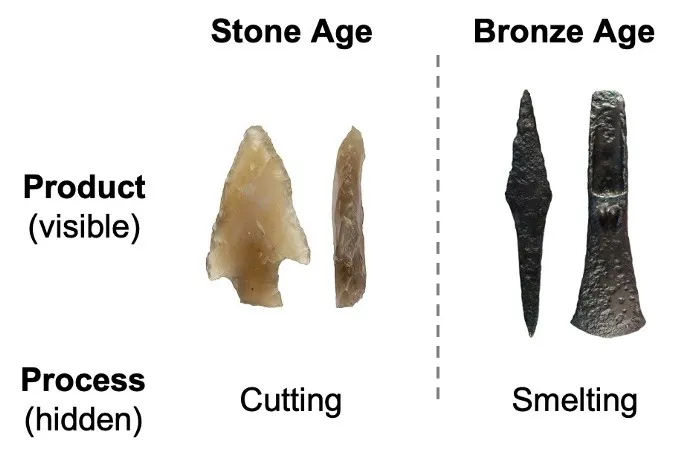
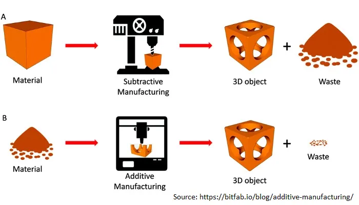

## Conclusión

Michael Filler y Matthew Realff proponen que todos los procesos provienen de 8 tipos diferentes de pasos\. Al entender qué pasos están disponibles\, puedes reorganizarlos para obtener mejoras de procesos\. La mejora de procesos está infravalorada debido a su naturaleza intangible\.

## Proceso vs producto

Si te pidieran comparar el objeto de la izquierda con el de la derecha\, ¿qué puntos harías\?

Una de las primeras cosas que notarías sería el material\. La izquierda es de piedra\, la derecha de bronce\.

También podrías mencionar que la punta de flecha de piedra probablemente no es tan afilada como la de bronce\, es menos duradera y asimétrica\.

Lo que has inferido pero probablemente no has dicho explícitamente es que el proceso de fabricación también es diferente\. La piedra requiere corte\, pero el bronce requiere fundición\.

Centrándonos en este tema del proceso\, [Michael Filler and Matthew Realff propose that Fundamental Manufacturing Process Innovation (FMPI) is central to progress.](https://medium.com/@processinnovation/fundamental-manufacturing-process-innovation-changes-the-world-471adcc77c48 'FMPI') Veamos a qué se refieren con FMPI\, por qué es importante y algunos ejemplos\.

Los autores proponen que hay mejoras en los procesos que han resultado en un gran progreso visible para la humanidad\. Sin embargo\, la gente pasa por alto los cambios en el proceso intangible y se centra demasiado en los cambios en el producto físico\. En nuestro ejemplo de la punta de flecha anterior\, la gente se centra en el resultado entre piedra y bronce\, sin fijarse en la mejora del proceso de corte frente a fundición [^1]\. Estas innovaciones de procesos de alto impacto son lo que llaman FMPI\.

Es difícil notar mejoras en el proceso porque son intangibles y requieren que veas la situación desde un punto de vista diferente\. Estás abstrayendo de los detalles y tratando de encontrar relaciones de alto nivel para representar lo que haces\. Es algo parecido a cómo la teoría de grupos en matemáticas intenta abstraer la aplicación práctica\.

Investigar el FMPI es importante porque si puedes cuantificar los distintos métodos que han llevado al progreso para la humanidad\, tienes un marco alternativo para mejorar\. Por ejemplo\, saber que las líneas de montaje obtienen más eficiencia al incorporar un proceso en piezas secuenciales es útil para ver dónde más podrías aplicar la misma técnica\.

La implicación práctica de esto para tu vida diaria es revisar todos los procesos recurrentes en los que participas\. Ya sea en el trabajo o en un hobby\, intenta ver si hay alguna forma de reorganizar los pasos para que tus procesos sean más efectivos\:

- Si hay un proceso repetitivo que implica transferir datos de un software a otro\, [zapier](https://zapier.com/ 'zapier') Quizá se pueda automatizar eso
- Si siempre tienes que enseñar a otros a hacer cosas\, [scribe](https://cursive.io/scribe 'scribe') Quizá puedas reducir tu carga de trabajo
- Si siempre has hecho algo por defecto\, quizá grabarte y repasar visualmente todos los pasos del proceso te ayude

A continuación\, analizaremos los diferentes pasos en las mejoras de procesos y veremos ejemplos de innovaciones que se debieron al FMPI\.

### FMPI se produce a través de ocho esquemas

Definen el proceso como una serie conexa de pasos que transforman un estado inicial en otro estado\. Reorganizar los pasos puede dar lugar a la mejora del proceso\. Los \'pasos\' son los bloques básicos de los procesos\, y reorganizar los pasos puede conseguir procesos más efectivos\.

Los autores proponen 8 tipos \(esquemas\) de mejoras de procesos\:

La paralelización \(tipo 1\) se refiere a múltiples instancias en las que el mismo paso se realiza simultáneamente\.

Si tienes paralelización\, eso implica que puedes separar los pasos \(tipo 2\) y los pasos de fusión \(tipo 3\)

Si divides un paso y envías las piezas a diferentes escalones aguas abajo\, eso se conoce como separación \(tipo 4\)\.

Puedes combinar varios pasos \(tipo 5\) o convertir un paso en varios \(tipo 6\) [^2]

Por último\, puedes eliminar cosas siendo sustractivo \(tipo 7\) o añadir cosas siendo aditivo \(tipo 8\)

Usando varias variantes de los 8 tipos anteriores\, puedes cambiar la forma en que haces las cosas para mejor\. Veamos ejemplos más concretos\.

### La fabricación de circuitos integrados requiere paralelización\, resta y suma

El trabajo de Jean Hoerni y Robert Noyce en Fairchild Semiconductor a finales de los años 50 demostró que [a transistor could be made within silicon, and that circuitry could be built on top of the surface](https://www.computerhistory.org/revolution/digital-logic/12/329 'wafer') [^3]\. Poder tener múltiples transistores en una superficie fue un ejemplo de paralelización \(tipo 1\)

El proceso de fabricación también incluye muchos pasos de resta \(tipo 7\) y suma \(tipo 8\)\. En el diagrama siguiente de [Electronics Tutorial](https://www.electronics-tutorial.net/CMOS-Processing-Technology/planar-process-technology/ 'Elec')\, se puede ver la eliminación de silicio \(SiO2\) y la adición de material dopado para crear propiedades semiconductoras para el material\.

### La secuenciación del ADN mejoró mediante paralelización

En los años 70\, la secuenciación del ADN era lenta y laboriosa\, ya que se pensaba que había que trabajar secuencialmente en toda la cadena de ADN\. Joachim Messing y Peter Seeburg desarrollaron una [shotgun approach](https://en.wikipedia.org/wiki/Joachim_Messing 'DNA')\, que descompone el ADN en fragmentos aleatorios para permitir una secuenciación más rápida\. Al realizar múltiples fragmentos superpuestos\, esto permitió la paralelización \(tipo 1\) en el proceso de secuenciación\, aumentando considerablemente la velocidad\, disminuyendo el coste y disminuyendo la cantidad de ADN requerida [^4]\.

### La impresión 3D es un cambio de mentalidad de la resta a la suma

La mayoría de las técnicas de fabricación convencionales implican la resta \(tipo 7\) del material de una forma en bruto del material\. Por ejemplo\, si quieres crear una mesa\, estás cortando un árbol y luego serrando las partes que no necesitas\.

Como puedes imaginar\, esto genera material desperdiciado\. Para muchas empresas\, intentar optimizar la cantidad de producto intermedio que pueden obtener del producto bruto es esencial para la rentabilidad\. Por ejemplo\, [fabric optimisation](https://www.resourceefficient.eu/en/technology/design-efficiency-%E2%80%93-zero-waste-patterns 'shirt') en la industria de la confección puede resultar en [30% cost savings](https://fashioninsiders.co/toolkit/how-to/cutting-fabric-for-production-versus-sampling/#:~:text=In%20clothing%20manufacturing%20fabric%2C%20costs,%2D30%25%20in%20a%20fabric. 'fabric') [^5]

En cambio\, [3D printing](https://3dprintingindustry.com/3d-printing-basics-free-beginners-guide '3D') es aditivo \(tipo 8\)\. Esto significa que hay mucho menos desperdicio en la producción\, ya que imprimes casi exactamente lo que necesitas desde abajo hacia arriba\. [Besides the cost savings, this also allows creation of more complicated structures in fewer steps.](https://bitfab.io/blog/additive-manufacturing/ 'bit')

### Preguntas abiertas sobre FMPI

Los autores afirman que las mejoras en los procesos mencionadas fueron fundamentales para la reducción de costes en esos sectores\, como se muestra a continuación\.

Además de permitir una vía para que las tecnologías escalen\, el FMPI presenta las siguientes características\:

- Comportamiento en curva S con una adopción lenta inicial\, adopción generalizada una vez resueltos los problemas y luego saturación del mercado
- Agravando los beneficios construyendo sobre mejoras anteriores\. Por ejemplo\, añadir más capas a chips de circuito integrado fue posible gracias a mejoras previas en el proceso
- Introduciendo diferentes sesgos en la producción\. Por ejemplo\, la optimización y el alto coste fijo de la producción de circuitos integrados significan que estamos \"comprometidos\" a usar silicio como material base en lugar de explorar otras opciones

Terminan con algunas preguntas abiertas\:

- ¿Con qué frecuencia se producen los FMPIs y cuál es su rango de impacto\?
- ¿Qué sectores se benefician más del FMPI y cuáles menos\?
- Propusieron 8 tipos de FMPI\, pero ¿podría haber más\?
- ¿Cómo podemos predecir el FMPI\?
- ¿Cómo podemos incentivar el FMPI\?

[^1]: Proponen 3 razones para ello\: a\) El proceso tiene una naturaleza efímera y es más transitorio que el producto b\) La mejora del proceso tiene una gran extensión de aplicación y es fácilmente ignorada por los profesionales especializados \(no estoy seguro de lo que querían decir aquí\) c\) Se piensa que el proceso es simplemente una reorganización de pasos\, una actividad trivial

[^2]: El factoring me parece mucho a separación\, y creo que la diferencia que quieren hacer es que la separación va a diferentes pasos posteriores\. El factoring va al mismo paso

[^3]: No estoy del todo seguro de los detalles específicos de la producción de chips semiconductores\, véase [here](https://www.mepits.com/tutorial/384/vlsi/steps-for-ic-manufacturing 'IC') o [this youtube video](https://www.youtube.com/watch?v=oBKhN4n-EGI 'yout') Para más detalles\. Creo que todo el proceso de producción se denomina proceso planar porque la oblea de silicio tiene que ser plana\, y luego apilas el circuito encima haciendo la capa de óxido de silicio\, añades una capa de photoresist\, añadimos una máscara\, expones a la luz UV para eliminar selectivamente la máscara\, permitiendo grabar el óxido y luego dopas selectivamente el silicio expuesto\.

[^4]: Puedes encontrar más detalles en su artículo [here](https://academic.oup.com/nar/article-abstract/9/2/309/2359970 'paper')\. Está más allá de lo que sé\, así que no voy a añadir más detalles aquí\. Una versión más fácil de entender del proceso de la escopeta es [here](https://www.yourgenome.org/facts/what-is-shotgun-sequencing 'genome')

[^5]: Esto implica usar un ordenador \(o una persona\, supongo\) para generar un patrón de tela que maximice el uso de tu tela\, organizando el patrón de la tela para que \"cubre\" el material sin muchos huecos\.
