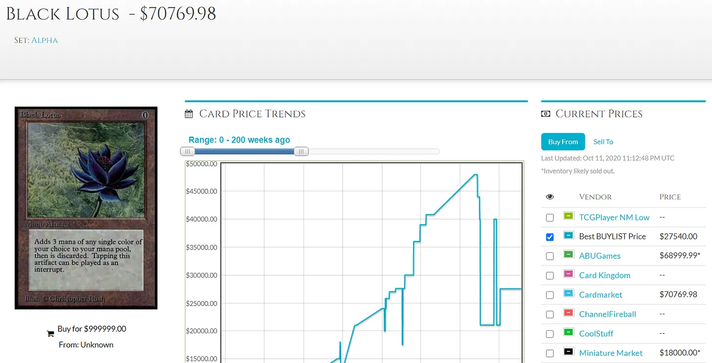
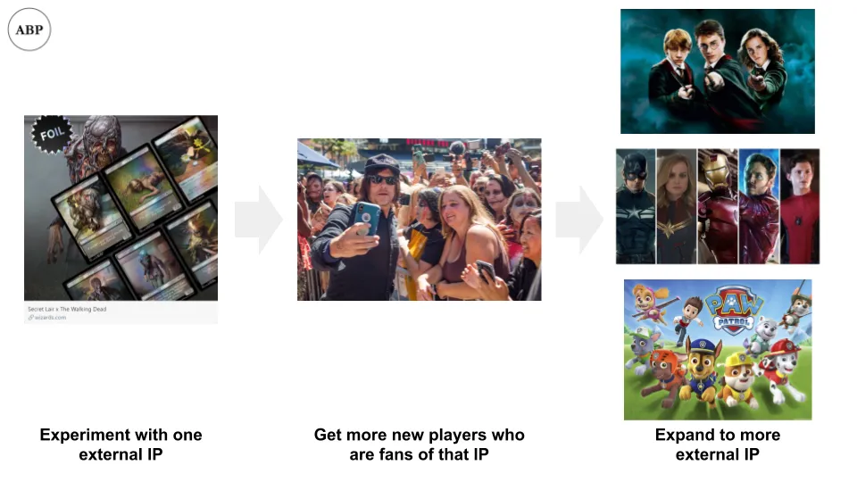

## Conclusión

Magic\: The Gathering es un negocio lucrativo de juegos de cartas que se ha enfrentado a una controversia autoinfligida debido a una monetización excesivamente agresiva

## Cartas\, Comandante\, Crack de cartón

¿Cuánto puede costar el cartón\?

Si es la carta [Black Lotus](https://mtg.gamepedia.com/Black_Lotus 'black') del juego de cartas coleccionables [Magic: The Gathering,](https://en.wikipedia.org/wiki/Magic:_The_Gathering 'MTG') Quizá puedas comprar uno por 27\.000 dólares\.

Y eso incluso podría ser una ganga\, teniendo en cuenta una copia vendida por [$166,000 at auction](https://www.ebay.com/itm/1993-Magic-The-Gathering-MTG-Alpha-Black-Lotus-R-A-BGS-9-5-GEM-MINT-PWCC-/143136537077?_trksid=p2047675.m43663.l10137&nordt=true&rt=nc&orig_cvip=true 'ebay') [^1]\. Son 166\.000 dólares por un trozo de cartón del tamaño de una carta de juego\.

Hace mucho tiempo\, en otra vida\, solía jugar mucho a Magic\, el juego de cartas coleccionables al que a veces se llama sin ironía \"Cardboard Crack\" debido a su naturaleza adictiva [^2]\. No he seguido la escena en una década\, pero una controversia actual despertó mi curiosidad\.

Junto con la reciente publicación de Byrne Hobart sobre la importancia de [games vs metagames](https://diff.substack.com/p/the-gamerarbitrageur-to-generalist? 'Diff') [^3]\, quizá esté destinado a escribir sobre ello este mes\. Hoy repasaremos\:

1. Introducción a la magia y contexto para las quejas de la comunidad
2. Qué es el metajuego y su relevancia en Magic
3. La controversia actual en \"Commander\"\, un popular metajuego de Magic

Echemos un vistazo a las cartas\, [Commander,](https://magic.wizards.com/en/content/commander-format 'Commander') y [cardboard crack.](https://cardboard-crack.com/ 'crack')

## 1\. Introducción a la magia

Para entender la controversia\, necesitamos más contexto\. Magic es un juego de cartas coleccionables [^4]\, donde los jugadores crean una baraja de cartas y se enfrentan entre sí\. Las cartas tienen efectos\, y el objetivo es reducir los puntos del oponente a cero [^5]\. Os turnáis para robar cartas\, jugarlas y activar sus efectos para lograr ese objetivo [^6]\.

Las cartas se publican en el **Mercado principal** por [Wizards](https://magic.wizards.com/en 'Wizards')\, una filial de una empresa cotizada en bolsa [Hasbro](https://investor.hasbro.com/investor-relations 'Hasbro')\. Los magos diseñan\, imprimen y venden regularmente nuevas cartas en un \"set\"\. La mayoría de las cartas se venden en tiendas locales en forma de \"sobres de refuerzo\"\. Estos sobres contienen cartas aleatorias del nuevo set\, lo que significa que no sabes qué te llevas antes de abrirlas [^7]\.

Por ejemplo\, podrías comprar un paquete con la esperanza de conseguir una carta rara ["Uro, Titan of Nature's Wrath"](https://scryfall.com/card/thb/229/uro-titan-of-natures-wrath 'Uro') y en su lugar consigue ["Bronzehide Lion."](https://gatherer.wizards.com/Pages/Card/Details.aspx?multiverseid=476461 'Lion')

Como mucha gente prefiere comprar una tarjeta sin depender de la suerte\, también existe una **mercado secundario\.** Los traders compran cartas y las revenden con un margen de marge\. Con el tiempo\, eso incluso se ha convertido en esencialmente un [stock market for the cards](https://www.mtgstocks.com/news 'MTG')\, con su propio club de especuladores\. Como se señaló antes\, algunas de estas cartas pueden ser extremadamente caras\.

Cabe destacar que Wizards normalmente no vende cartas individuales para evitar parecer [predatory.](https://mtg.gamepedia.com/Predator 'predator') Podrían manipular el mercado si quisieran\, ya que solo tienen que imprimir más papel\. Normalmente no lo hacen\, por miedo a que la comunidad se hundiera\. Por ejemplo\, imagina las quejas si Wizards vendiera directamente una buena carta por 500 dólares\. Tenlo en cuenta\; volveremos a esto\.

**La demanda de las cartas viene de jugadores que quieren usarlas** en sus mazos\. Hay tanto una escena competitiva oficial con premios en metálico\, como una escena casual donde la gente juega solo por diversión\. La popularidad de las cartas en las competiciones es uno de los factores que impulsan su uso en el juego casual\. Por ejemplo\, si Uro se hiciera popular en competiciones y se conociera como una carta poderosa\, más gente podría querer usarla en sus mazos [^8]\. Como en la mayoría de los mercados\, esto hace que el precio de la tarjeta suba\.

**Otra razón por la que una tarjeta puede subir de precio es por la oferta** \(qué [shock](https://gatherer.wizards.com/pages/card/details.aspx?name=Shock 'shock')\)\. Mencioné que Wizards imprime cartas en un set con regularidad\. Los sets se imprimen durante un tiempo\, antes de que llegue el momento de que otro set tome el relevo\. Esto crea escasez para una carta que podría estar en un set y luego no volver a aparecer\.

Por ejemplo\, una carta podría estar en set Alpha y luego no en set Beta [^9]\. La carta Black Lotus de antes es una de esas cartas que fue [printed early on but never again,](https://mtg.gamepedia.com/Reserved_List 'mtg') lo que resulta en el alto precio en el mercado secundario\.

De forma similar a cómo el deporte de \"correr\" tiene diferentes \"pruebas\" como los 100m\, 200m o 400m\, **el juego de Magic también tiene [different formats](https://mtg.gamepedia.com/DCI#Tournament_formats 'format')** decidida por los magos\. No necesitamos saber los detalles\, solo que una diferencia importante son los tipos de cartas que puedes usar\. Esto suele depender de si se han lanzado recientemente y si están \"prohibidas\" o no\.

Por ejemplo\, puedes jugar con los 8 sets más recientes y una baraja de 60 cartas en un formato\, y cualquier carta posible en una baraja de 100 en otro\. Como esto afecta a lo bien que están emparejados los juegos\, la gente jugará barajas del mismo formato entre sí\. Se considera de mala educación jugar el mazo de otro formato sin avisar al oponente\, y los torneos oficiales indican el formato esperado\. Esto determina **Metajuego** Para ese formato\, un concepto que exploraremos en breve\.

La escena casual también se ha desarrollado **formatos \"favoritos de los fans\"\, siendo el más popular \"Commander\"\.** De nuevo\, los detalles de Commander no importan\, solo piénsalo como un conjunto de reglas \"meta\" que la gente elige seguir al crear sus mazos y jugar entre sí [^10]\. Igual que tu padre pudo establecer reglas caseras en Monopoly que decían que el jugador más mayor podía usar el dinero del banco\, la comunidad de jugadores decidió reglas a seguir para un formato\.

Las reglas de los comandantes están reguladas por una comunidad ["rules committee,"](https://mtgcommander.net/index.php/faq/ 'RC') que supuestamente es independiente de Wizards\. El comité tiene en cuenta la opinión de los jugadores al decidir qué cartas permitir en Commander\, para cada nuevo set que se imprime\. Normalmente son las cartas más nuevas las que causan problemas\, ya que las cartas antiguas llevan más tiempo para que la gente juegue con ellas\, y cualquier interacción que rompa el juego debería haberse descubierto\.

El comité no hace cumplir las reglas\, ya que eso sería imposible para partidas casuales\, pero sirve como una guía estándar que los jugadores siguen\. Por ejemplo\, podría decir que \"Uro\" está prohibido\. Si jugaras una partida de Commander contra un desconocido y usaras Uro\, probablemente no querría continuar\. Sin embargo\, también podrías aceptar jugar con las cartas que quieras\, incluido Uro\.

Ahora sabemos qué es Magic\: un juego de cartas coleccionables donde se imprimen cartas nuevas regularmente\, los precios de las cartas se fijan por el mercado y diferentes restricciones de formato dan lugar a distintos metajuegos\. Vamos a ampliar ese último concepto\.

## 2\. Magia del metajuego

Imagina que eres Wizards y estás creando una carta\. Hay una [balance](https://gatherer.wizards.com/Pages/Card/Details.aspx?multiverseid=413544 'balance') que tienes que golpear si quieres que la carta se juegue y sea deseable\. Si haces los efectos demasiado débiles\, nadie la querrá\. Si la haces demasiado fuerte\, todos la usarán\.

Por ejemplo extremo\, imagina que hicieras una carta que dijera \"Si robas esta carta\, ganas la partida\.\" Todos la jugarían\, pero los juegos ya no serían divertidos\.

Por eso\, tienes que crear cartas nuevas que sean chulas\, pero no tanto como para \"romper\" el formato en el que se juegan\. Si empiezas a fijarte en cartas que aparecen en todos los mazos\, eso es una señal de que podrías haberte pasado [^11]\.

Los mazos y cartas óptimos forman el \"metajuego\" de los formatos de Magic\. Si juegas de forma competitiva\, quieres las cartas que te den las mejores probabilidades de ganar\. Los jugadores las descubren mediante teoría y experimentación\. No puedes saber solo qué cartas son buenas\, sino cuáles son buenas **Para el formato en el que juegas [^12]\.**

En un meta equilibrado\, habrá un par de mazos que sean \"mejores\" que el resto\, pero ninguno dominante en solitario\. Por ejemplo\, tu mazo de ardillas puede ganar al de mi mazo de goblins\, pero que te gane un mazo de hada de media\.

En un meta desequilibrado\, solo habrá un mazo que sea \"mejor\" que todo lo demás\. Por ejemplo\, tu mazo elemental podría tener probabilidades favorables frente a cualquier otro mazo\. Cuando esto ocurre\, es racional [everyone to start playing that deck if they want to win.](https://magic.gg/news/2020-season-grand-finals-metagame-breakdown 'mtg') Como puedes imaginar\, **Esto se vuelve aburrido rápido\.**

Cuando esto ocurre\, una solución es prohibir las cartas que sean \"demasiado poderosas\"\. Como se mencionó antes\, para los formatos oficiales\, Wizards indicará qué cartas ya no pueden usarse\. Para el formato no oficial \"Commander\"\, el comité de normas de la comunidad elegirá las cartas\. **Los baneos son una forma de equilibrar\.**

Aquí es donde comienza la controversia actual\.

## 3\. La amistad es magia

La mayoría de las veces\, las nuevas cartas impresas forman parte de un multiverso más grande de Magic\, siendo Magic IP y creadas originalmente para Magic\. Magic está mayormente basada en fantasía\, lo que ha dado lugar a cartas como ángeles y dragones\:

Más recientemente [^13]\, Wizards ha estado realizando más colaboraciones externas\. Esto suele implicar crear una tarjeta personalizada basada en otras IP\. Por ejemplo\, [a My Little Pony series](https://magic.wizards.com/en/articles/archive/news/magic-extra-life-2019-10-03 'pony') Para recaudar fondos para la caridad\:

O un [Godzilla themed series as alternate art for some cards:](https://articles.starcitygames.com/news/all-19-godzilla-series-monster-cards-revealed/ 'zilla')

Ahora\, ponte en el lugar del Comité de Reglas del Comandante\. Cuando se publiquen estas cartas\, ¿deberías permitirlas en ese formato\?

Además de los argumentos estéticos [^14]\, la razón por la que no puedes decir que sí fácilmente es que estas cartas especiales suelen tener **efectos especiales que pueden desequilibrar el juego\.** Por ejemplo\, que [Princess Twilight Sparkle](https://shop.tcgplayer.com/magic/ponies-the-galloping/princess-twilight-sparkle 'pony') La habilidad lo haría [one powerful pony.](https://www.reddit.com/r/CompetitiveEDH/comments/dczkyh/twilight_sparkles_metarending_magic/ 'pony')

Históricamente\, los magos evitaban la ambigüedad haciendo algunas cosas\:

1. Haciendo que las cartas especiales \"divertidas\" fueran con borde plateado\. Al emitir una regla general que prohibía las cartas de borde plateado para el juego \"normal\"\, los magos podían imprimir lo que quisieran sin afectar al metajuego
2. Hacer que las cartas especiales tengan el mismo efecto que las cartas con borde negro y \"legales\"\, solo que con arte alternativo\. Como estas cartas se imprimen como parte de los sets normales y están equilibradas para el juego\, no debería tener un efecto significativo en el metajuego

**Aquí está la controversia\.** Wizards acaba de lanzar un [limited edition set of new cards in partnership with TV show The Walking Dead.](https://secretlair.wizards.com/us/product/612738/secret-lair-x-the-walking-dead 'dead') Estas cartas únicas solo están disponibles durante un tiempo antes de que Wizards deje de imprimirlas\. Es importante destacar que tienen borde negro \(\"legal\"\)\, pero no están disponibles en ningún otro lugar salvo comprando este box set\. Como era de esperar\, el box set tiene un precio elevado\.

**¿Deberían estas tarjetas ser legales\?** La web oficial de Wizards dice\:

> NOTA\: Estas son cartas completamente nuevas\, no reimpresiones ni parte de un set principal\. Por lo tanto\, no son legales en Estándar\, ¡pero son perfectas para Commander\!

Para aclarar lo anterior\, Wizards está señalando explícitamente el formato casual \"Commander\"\, diseñando cartas específicamente para ello y vendiendo las cartas directamente a un precio premium en una tirada limitada\.

Puedes ver por qué ha sido así [made many players upset, ](https://twitter.com/wizards_magic/status/1312987380115148805?s=20 'twitter') [calling for the cards to be banned immediately.](https://www.reddit.com/r/magicTCG/comments/j1glk8/petition_for_the_commander_rules_committee_to_ban/ 'ban')

Espera\, dices\, pensé que el _Comité de Reglas_ ¿decidió qué cartas estaban permitidas o no\? De hecho\, algunos jugadores mantenían la esperanza de que el Comité actuara de forma independiente y declarara las cartas criminales en Commander\.

[Unfortunately not.](https://mtgcommander.net/index.php/2020/10/02/rc-statement-on-secret-lair-the-walking-dead/ 'dead')

Probablemente tengas alguna pista de los incentivos contradictorios aquí\. Echemos un vistazo más de cerca a la [main complaints first](https://twitter.com/ghirapurigears/status/1313145100319494145?s=20 'twitter') [^15]\:

**1\. Disponibilidad de tarjetas\.** Las cartas nunca se reimprimirán por cuestiones de licencia\, a diferencia de otras cartas que podrían reimprimirse en futuras colecciones\. Esto limita artificialmente la oferta y a las personas que pueden conseguir las cartas\.

**2\. Ventas abiertamente depredadoras\.** Las cartas no son \"legales\" en los formatos oficiales\, sino solo en el formato casual de Commander\. Si quieres usar las cartas\, tendrás que comprarlas a un precio premium\, debido a la escasa cantidad\.

**3\. Preocupación de que esto sea el inicio de una tendencia\.** A la gente le parecen bien los sobres\, ya que se dan cuenta de que Wizards necesita ganar dinero\. Sin embargo\, ¿y si Wizards empezara a vender cartas directamente a precios altos\? Si vendieran una carta \"poderosa\" a 500 dólares y nunca la prohibieran\, los jugadores tendrían que comprarla para seguir siendo competitivos\. El metajuego se arruinaría\.

Y ahora veamos la justificación de Wizard\:

Ah\, espera\, imagen equivocada\:

Sí\, no tengo nada\, es una forma bastante evidente de sacar dinero\. Si consideras el objetivo de Hasbro \(empresa matriz de Wizards\) de [doubling Wizards revenue over the next five years,](https://investor.hasbro.com/static-files/88b2a83b-2368-463a-9489-6cf31dc209ac 'wizards') No es de extrañar que el equipo de Wizards esté incentivado a explorar formas de vender más cartas a un precio más alto [^16]\. Mayor volumen\, precios más altos\, múltiplo de valoración más alto\. Si la gente está dispuesta a pagar 100 dólares por una carta\, ¿por qué no imprimir las cartas y venderlas directamente en vez de a través de sobres\?

Los magos podrían haber 1\) hecho las cartas con bordes plateados y \"ilegales\"\, o incluso 2\) hecho versiones artísticas alternativas de otras cartas \"legales\"\. No lo hicieron 1\) porque las cartas de borde plateado se venden menos que las cartas de borde negro\, y no lo hicieron 2\) por alguna razón mágica que no entiendo\, pero probablemente dinero

Para empeorar las cosas\, las cartas apuntan al formato Commander\, porque se ha convertido en uno de\, si no el [most popular format.](https://www.dicebreaker.com/categories/trading-card-game/how-to/magic-the-gathering-popular-formats 'mtg') ¿Un factor importante para la popularidad de Commander\? Wizards rompió el metajuego para formatos \"oficiales\"\, imprimiendo cartas demasiado desequilibradas\, haciendo que los juegos fueran aburridos\.

No envidio la postura del comité de normas aquí\. Podrían haber prohibido las cartas\, pero eso sería un descarado [betrayal](https://gatherer.wizards.com/pages/card/Details.aspx?multiverseid=3633 'betrayal') de Wizards\. En el peor de los casos\, Wizards podría haberlos anulado y recuperado el control de Commander\, convirtiéndolo en un formato \"oficial\" en lugar de uno de fans [^17]\.

Los jugadores no se lo han tomado de brazos cruzados\, [complaining vocally on public threads,](https://www.reddit.com/r/magicTCG/comments/j204ww/has_anyone_completely_lost_confidence_in_wotc_and/g73xmqe/?context=1 'complain') [listing demands to be met before they return to the game](https://www.reddit.com/r/magicTCG/comments/j67brt/for_those_who_are_choosing_to_no_longer_spend/ 'game')\, y hasta [creating a new format, "Captain."](https://twitter.com/PlayCaptainMTG/status/1313164508068810752?s=20 'captain') Queda por ver si alguno de estos tendrá realmente un impacto en la impresora de dinero que es Magic [^18]\.

Resulta que [selling paper is hard work.](https://www.youtube.com/watch?v=1QQBB3cwNM0 'prices') La controversia pone de relieve algunas cosas aplicables de forma más general\:

1. Los usuarios entenderán si monetizas\, pero se enfadan si eres demasiado agresivo\. Piensa [a rake too far](http://abovethecrowd.com/2013/04/18/a-rake-too-far-optimal-platformpricing-strategy/ 'rake')
2. La respuesta a un error puede ser más importante que intentar evitarlo\. Piensa en disculpas reales frente a palabras de palabra\.
3. Los grupos gestionados por la comunidad vinculados a una organización oficial se verán obligados a ceder a la organización\. Piensa en responsabilidad frente a autoridad y quién tiene realmente qué

Quizá la verdadera magia sean todos los amigos que hicimos por el camino\.

## Otros recursos para aprender más

1. Kendra Smith escribió un gran artículo con más historia de MTG sobre por qué esto es controvertido [here](https://www.coolstuffinc.com/a/kendrasmith-09302020-the-problem-with-the-walking-dead-secret-lair 'kendra')
2. \@ghirapurigears tuiteó un hilo con más detalles sobre las quejas [here](https://twitter.com/ghirapurigears/status/1313145100319494145?s=20 'twitter')
3. El youtuber Mitch ofrece una buena refutación de otros argumentos que Wizards ha hecho [here](https://www.youtube.com/watch?v=degV1Masii8 'commander')

[^1]: Lo simplifico por el texto principal\, pero el estado de las cartas es una posible razón de esa disparidad de precio\. Las cartas coleccionables se califican según su estado y lo \"usadas\" que se usan por servicios como [Beckett Grading Services](https://www.cardboardconnection.com/collectopedia/card-grading-companies/beckett-grading-services-bgs#:~:text=Fees%20for%20BGS%20and%20BVG,card%20for%20especially%20large%20batches. 'beckett')\. El Lotus\, de 166\.000 dólares\, estaba en condiciones casi perfectas y de una tirada temprana\.

[^2]: Incluso hay un webcómic que lleva el nombre de la frase [here](https://cardboard-crack.com/ 'crack')\. Además\, para que quede claro\, nunca fui muy bueno en Magic\. Encontré que el draft limitado me resultaba más divertido después de unos años\, ya que incluso entonces los mazos Construidos eran caros para mí\.

[^3]: \"El juego es limitado\, y el metajuego no\, pero si no eres bueno en el juego principal\, el conocimiento sobre el meta es básicamente inútil\.\"

[^4]: En realidad es el _Primero_ Juego de cartas coleccionables\, creando el formato\. El original\, podrías decir\.

[^5]: Obviamente\, esta es una explicación simplificada\, y puedes leer más sobre las reglas [here](https://magic.wizards.com/en/game-info/gameplay/rules-and-formats/rules 'rules')\. Hay diferentes tipos de cartas\, algunas temporales y otras permanentes\. No todas afectan directamente a los puntos de tu oponente \(el total de vida\)\. Al menos en 2005 existían [28 ways to win a game of Magic](https://magic.wizards.com/en/articles/archive/arcana/let-me-count-ways-2005-08-15 'MTG')

[^6]: A menos que juegues contra un mazo de huevos\, en cuyo caso simplemente observas cómo tu oponente hace todo durante horas y más vale que lo hagas [walk away while they're playing](https://www.reddit.com/r/spikes/comments/1ai0my/modern_lets_talk_about_eggs/ 'eggs')

[^7]: Wizards también vende muchos mazos pre\-hechos\, pero lo he dejado fuera en el texto principal por simplicidad\. Además\, podría estar equivocado\, y no creo que comprar mazos solo para conseguir una carta haya sido algo habitual desde el desastre de los mazos de Jitte \/ Rats\, aunque la promo de Nexus of Fate también fue problemática\. Aunque no sigo Magic desde hace siglos\.

[^8]: Un ejemplo real en este caso\. Uro lo ha hecho desde entonces [been banned](https://gamerant.com/magic-the-gathering-uro-ban/ 'ban') Por ser demasiado poderoso\. ¿Prohibido de qué exactamente\? Tiene sentido prohibir una carta en competiciones\, pero ¿cómo puedes impedir que alguien las juegue en formatos casuales\? Esa es una pregunta relacionada con la controversia\, así que sigue leyendo\.

[^9]: Alpha y Beta son conjuntos reales en Magic\, pero esta vez es un ejemplo falso\. Creo que cualquier carta en Alpha también se imprimió en Beta\, y [some new cards were actually added in Beta](https://mtg.gamepedia.com/Beta 'beta')

[^10]: Algunos de los cambios incluyen jugar contra más de un jugador\, tener más cartas en tu mazo\, tener cartas restringidas a un tipo concreto y tener una carta especial\: tu \"Comandante\"\. El Comandante también era conocido como Elder Dragon Highlander\, debido a sus orígenes en que la gente jugaba con ciertas cartas de dragón como sus comandantes\.

[^11]: Wizards ha afirmado públicamente que siguen una [FIRE philosophy](https://magic.wizards.com/en/articles/archive/card-preview/fire-it-2019-06-21 'mtg') \- Quieren que Magic sea divertido\, acogedor\, rejugable\, emocionante\.

[^12]: Si recuerdas\, esto es similar a la [relative vs absolute skill](/writing/relative_billionaire 'relative') Punto sobre el que escribí hace un tiempo\. No importa si tu mazo es bueno en absoluto\, sino cómo se compara con los mazos típicos que probablemente te enfrentarás en competición\, el \"meta\"

[^13]: En realidad\, no es la primera vez que Wizards hace IP externa\, ya que ha creado decorados como Arabian Nights o Three Kingdoms que están basados exactamente en el nombre que les da\. Lo dejo fuera en el texto principal por simplicidad\.

[^14]: Teniendo en cuenta eso [alters](https://magicalter.com/ 'alter') son una cosa y [harmless offering](http://www.mtgmintcard.com/articles/writers/freyalise/holistic-wisdom-10-cutest-cards-ever 'harm') es una carta legal\, no encuentro tan fuerte la queja de que diferentes IPs arruinarán el juego como los argumentos que detallaré más adelante\. Aunque sí importa para un grupo de jugadores muy ruidosos\.

[^15]: Hubo muchas quejas\, y quiero centrarme en aquellas que parecían argumentos más sólidos y sobre las que más gente expresó su opinión\.

[^16]: Saludos hilo de reddit [here](https://www.reddit.com/r/magicTCG/comments/j6rwjc/hasbro_goal_double_wotc_revenue_will_this_destroy/ 'reddit')

[^17]: Como se mencionó antes\, nada impide que los jugadores decidan simplemente ignorar al comité de reglas y prohibir las cartas entre amigos\. El escándalo se debe en parte a que los jugadores se dan cuenta de que el comité de reglas actúa en contra de sus intereses y también ignoran los temas clave al esquivarlos en su anuncio\. Todo el mundo sabe que esto es una forma dirigida de sacar dinero

[^18]: Para que quede claro\, no estoy recomendando a la gente que venda a corto Hasbro ni nada por el estilo\. No tengo suficiente experiencia para predecir aquí\, y diría que probablemente hay un 80\% de posibilidades de que Magic sobreviva a esto y siga creciendo\, expandiéndose a múltiples IPs populares\. Mucha gente rica dispuesta a pagar por el papel\.
