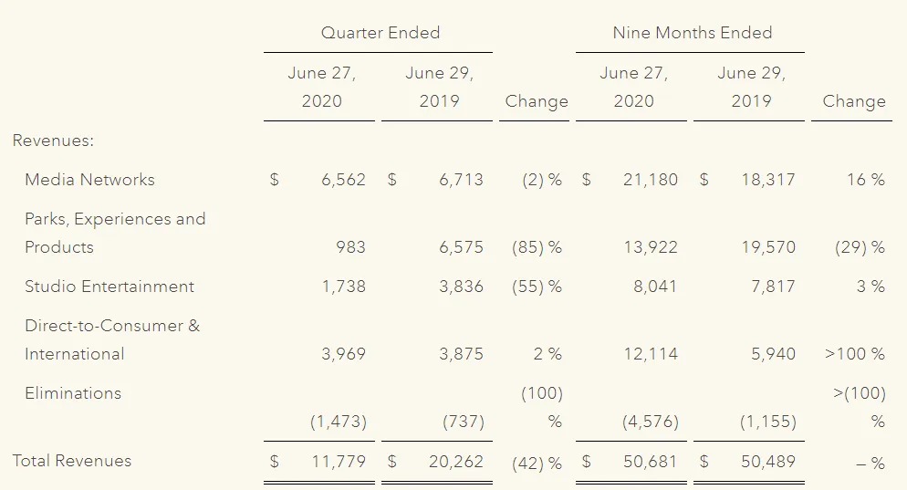
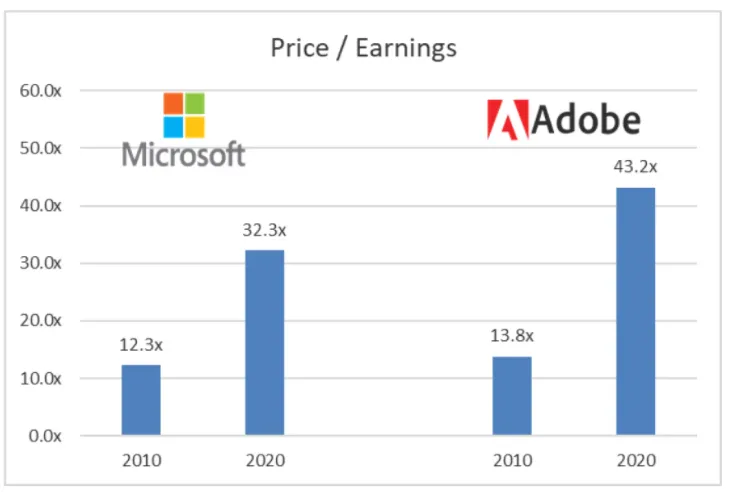

## Conclusión

Third Point sostiene que Disney debería dejar de pagar su dividendo e invertir en streaming\; Semper Augustus no está de acuerdo\.

## Activismo en Disneyland

El fondo de inversión activista Third Point publicó recientemente una [letter to Disney,](https://www.valuewalk.com/2020/10/third-point-walt-disney-company/ 'disney') sugiriendo que la empresa cambie su estrategia empresarial [^1]\. Esto llevó a [a rebuttal by another investment firm](https://valueinvestingworld.substack.com/p/chris-bloomstrans-letter-to-the-walt 'Semper')\, Semper Augustus \(gracias a Joe Koster\)\. Es menos común que las firmas de inversión presenten contraargumentos contra un activista\, así que echemos un vistazo a ambos lados [^2]\.

Para poner el contexto\, repasemos brevemente el activismo y el negocio de Disney\, para quienes no lo sepan\.

### Resumen sobre el activismo

Fondos activistas como Third Point [usually take a small stake in a company, before publicly agitating for company management to take actions which the activists believe will increase company value](https://en.wikipedia.org/wiki/Activist_shareholder 'activism')\. Estas acciones podrían incluir pagar un dividendo\, vender unidades de negocio malas o reemplazar la dirección de la empresa\. El valor de la empresa aquí se define normalmente como un aumento del precio de la acción\. El activismo ha ganado popularidad en la última década\; cuando estaba en banca incluso trabajé defendiendo una empresa frente a una lucha activista por poderes \(que salió fatal\, pero eso es otra historia\)\.

Fondos e inversores famosos incluyen a Carl Icahn\, Pershing Square de Bill Ackman y Greenlight Capital de David Einhorn\. Como los activistas quieren ser escuchados\, suelen tener un perfil más alto que otros fondos de cobertura\. Les ayuda cuando tienen cobertura mediática y se les incentiva a buscar publicidad\.

El éxito para un inversor activista es así\: comprar acciones de una empresa\, decirle a la empresa qué hacer\, la empresa lo hace\, el precio de las acciones sube\, todos están contentos\, el activista vende acciones y obtiene beneficios\. La mayoría de los activistas son titulares a corto plazo\, aunque hay excepciones\.

El fracaso podría ser cualquier parte de ese paso que falla\. Por ejemplo\, una empresa podría no escucharte\. Y aunque lo hiciera\, quizá el precio de la acción no se mueva\.

Ahora que tenemos una idea aproximada del activismo\, veamos Disney\.

### Resumen de Disney

Nunca cubrí Disney cuando estaba en inversiones largas\/cortas\; un colega lo hizo\. Por eso\, echemos un vistazo a [the financials](https://thewaltdisneycompany.com/app/uploads/2020/01/2019-Annual-Report.pdf 'ar') Y aprended juntos cómo se gestiona el negocio\. Voy a mirar su informe anual de 2019 para simplificar\, así que todo el impacto del covid aún no está incluido\. Volveremos a eso\.

Disney informa de cuatro segmentos principales\: Redes de Medios\, Parques\, Entretenimiento de Estudio y Directo al Consumidor \(DTC\)

Mis primeras impresiones sobre lo anterior son\:

- Los ingresos de Media Networks están creciendo dos dígitos\, pero el crecimiento de los ingresos operativos es solo del 2\%\, lo que sugiere un desapalancamiento
- Parks\, por su parte\, está creciendo un 6\% de rev\, pero está obteniendo apalancamiento operativo para aumentar los ingresos operativos un 11\%\.
- El estudio aumentó las revoluciones pero redujo los ingresos operativos\; eso es inesperado
- DTC creció \>100\% con la reactivación\, y su pérdida operativa también creció \>100\% [^3]\. Es raro ver a una empresa tan grande crecer tan rápido\, ¿quizá les va muy bien\? ¿Tuvo Disney\+ tanto éxito\?

Si miramos los márgenes operativos de esos segmentos\, son bastante similares\, entre un 20 y un 30\%\. Eso me sorprendió\, habría pensado que habría un segmento de alto margen \"subvencionando\" a uno de bajo margen\, por ejemplo\, mi primera suposición habría sido que los parques tienen bajos márgenes\.

Si los perfiles de margen son realmente similares\, la dirección debería mostrarse indiferente a invertir en cualquiera de ellos\; quizá prefiriendo Media debido al margen ligeramente mayor [^4]\.

Disney dedica 17 páginas de su informe anual a describir su negocio [^5]\, así que los resumiré para evitar que todos os vayáis antes de empezar\.

- Los medios incluyen cadenas de cable nacionales y cadenas de televisión como Disney y ESPN [^6]\. Los ingresos provienen de las cuotas de afiliados que la gente les paga por su contenido \(programación\) y publicidad en sus propias redes
- Los parques incluyen parques temáticos como Disneyland y la licencia de su propiedad intelectual para productos de consumo\. El rev proviene de la venta de entradas y de las regalías de licencia\. Hay una mención interesante sobre cómo el \>75\% del gasto de capital de Disney se ha destinado al negocio de los parques\, que lo tendré en cuenta
- El estudio incluye películas como Fox\, Marvel\, Lucasfilm\. Rev proviene de las licencias de las películas para los cines
- DTC incluye servicios de streaming Disney\+\, y también incluyen televisión internacional aquí\. Rev proviene de las tarifas publicitarias en la televisión internacional y las cuotas de suscripción para streaming

Leer esta sección también responde a algunas preguntas que tenía\:

Había un **adquisición en 2019\,** lo que resultó en una \"rev extra\" tanto para los segmentos de Medios como para DTC\. Esto explica por qué el crecimiento de DTC fue tan alto\, y también la aceleración en la Rev de Medios\. Ahora recuerdo eso [Disney bought 21st Century Fox.](https://www.vox.com/culture/2019/3/20/18273477/disney-fox-merger-deal-details-marvel-x-men 'Fox')

Si fuera yo en la banca\, habría pasado horas intentando hacer análisis financieros pro forma para ajustar esto y conseguir un crecimiento \"normalizado\"\, viendo ambos negocios por separado\.

Ya no estoy en la banca y ~~No me apetece~~ Lo dejaré como un ejercicio para el lector\, así que sigamos\. Pero eso también implica que la tasa de crecimiento de los medios es menor de lo que pensaba\. No me sorprendería que fuera más parecida a la tasa de crecimiento de 2018 del \~3\%\.

También pensé inicialmente que DTC estaba mostrando éxito en Disney\+\, pero no es así\. También me di cuenta de que Disney\+ se lanzó en noviembre\, así que no contribuye a los ingresos\, ya que el año fiscal de Disney termina en septiembre\.

**Los parques también tienen márgenes más altos de lo que pensaba** Porque agrupan la revolución de licencias IP en ese segmento\. Supongo que es para evitar mostrar un segmento de bajo margen\, que es un comportamiento típico en muchas empresas\, pero no tengo contexto aquí\.

Así que mis reflexiones revisadas son\:

- Los medios \(toda la televisión de la televisión\) son grandes pero de crecimiento lento
- Los parques son grandes pero de crecimiento lento y requieren mucha inversión de capital
- El estudio es más pequeño pero crece rápido\, debido a la popularidad de las películas de Marvel\, imagino
- DTC es más pequeño y no puedo decir bien la tasa de crecimiento\, pero supongo que también es rápido ya que Disney\+ es nuevo

Una gran complicación es el impacto del Covid en el negocio\. [For the first nine months of its fiscal year:](https://thewaltdisneycompany.com/the-walt-disney-company-reports-third-quarter-and-nine-months-earnings-for-fiscal-2020/ 'dis')

- Los medios bajaron ligeramente trimestre tras trimestre \(qoq\)\, pero subieron en lo que va de año \(año acumulado\)
- Los parques murieron\, con una caída del 85\% en calidad de calidad y un 29\% acumulado
- Studio también murió\, bajando un 55\% de qoq y sorprendentemente un 3\% acumulado
- Las cifras DTC no son comparables por la adquisición\, pero supongo que la tasa de crecimiento sigue siendo rápida

He puesto las finanzas de Disney en un modelo sencillo [here](https://docs.google.com/spreadsheets/d/1h6yW8z2AcCCm-vn6bEkk0g5_nN-bzLge1lkok94PFaI/edit?usp=sharing 'goog') Por si alguno de vosotros quiere jugar con los números\. Tened en cuenta que las suposiciones son solo números ficticios y no diligenciados\.

Ahora veamos lo que dicen los inversores\.

### Los argumentos de Third Point y los contraargumentos de Semper Augustus

Mi plan original era presentar los argumentos y contraargumentos para ambos inversores\. Resulta que\, en realidad\, solo hay un punto principal [^8]\, así que vamos directos al grano\, saltándonos los habituales discursos iniciales de ambas firmas sobre lo increíbles que son sus firmas y Disney\.

[Third Point:](https://www.valuewalk.com/2020/10/third-point-walt-disney-company/ 'third')

> creemos que la empresa debería suspender permanentemente su dividendo anual de 3\.000 millones de dólares y redirigir este capital enteramente a la producción y adquisición de contenidos para los negocios DTC de The Walt Disney Company\, centrados en Disney\+\.

Lo busqué en Google y me di cuenta [Disney suspended their dividend](https://www.barrons.com/articles/disney-suspends-first-half-dividend-amid-covid-19-disruption-51588715645 'divd') debido al Covid\. La sugerencia de Third Point es interesante\, ya que dicen que quieren que Disney dé menos dinero a los accionistas \(como ellos mismos\) y lo reinvierta en el segmento DTC de rápido crecimiento que vimos antes\. **Normalmente verías a activistas argumentar lo contrario\.**

El tercer punto explica\:

> Estos dólares incrementales\, según nuestro análisis\, generarían rendimientos que sean múltiplos de la rentabilidad por dividendo actual de la acción al atraer suscriptores de alto valor de vida \(\"LTV\"\) hacia tu plataforma DTC\.

Argumentan que el valor total de un suscriptor en streaming es alto\, por lo que Disney debería invertir más en contenido para **Consigue más suscriptores** Es decir\, un dólar devuelto a un inversor como dividendo vale menos que si Disney usara ese dólar para crear contenido y conseguir más suscriptores

> Más allá de atraer más suscriptores a la plataforma\, una mayor velocidad de producción de contenido dedicado generará varios beneficios adicionales repartidos en tu base existente\, incluyendo mayor interacción\, menor rotación y mayor poder de fijación de precios\. Para poner esto en perspectiva\, mejorar la rotación de Disney\+ hasta los niveles de abandono doméstico de Netflix de \~2\%\, líderes en la industria\, más que duplicaría el LTV bruto de suscriptores\.

Táctica común de comparar una empresa con un ejemplo de \"primera clase\"\, diciendo que si la empresa puede rendir tan bien como el ejemplo\, [dreams come true](https://disneyparks.disney.go.com/in/#:~:text=Disney%20Parks%20%7C%20Where%20Dreams%20Come%20True 'dis')\. En este caso\, dicen que más suscriptores seguirán suscritos\, verán más programas y Disney podría cobrarles más\.

> Igualmente importante\, acelerar de forma significativa el gasto en contenido DTC ampliará aún más la brecha entre The Walt Disney Company y sus homólogos tradicionales de los medios —WarnerMedia de AT\&T\, Discovery\, ViacomCBS\, NBCUniversal de Comcast y Fox— ninguno de los cuales tiene la capacidad financiera para ejecutar un plan tan audaz

No tengo suficiente contexto aquí\, ya que no sé cuánto gastan esos compañeros\. Me sorprende que ninguno tenga suficiente dinero para gastar en programación\.

> Hemos observado numerosos precedentes de transiciones exitosas de modelos de negocio no lineales que han dado muy buenos resultados para los accionistas\. Entre estas transformaciones empresariales\, Adobe y Microsoft destacan como ejemplos especialmente relevantes \\\[\.\.\.\\\] Además\, las acciones fueron recompensadas con múltiplos significativamente más altos\, reflejando la superior calidad de sus nuevas fuentes recurrentes de ingresos por suscripción

E incluyen un gráfico que muestra el aumento múltiple\. Un múltiplo es una forma de valorar una empresa\, mostrando cuánto está dispuesta a pagar la gente por tu acción\. Cuanto más alto\, generalmente mejor\. [^9]\.

> Por último\, creemos que Disney debería mantener su enfoque en la transición hacia una fuente de ingresos DTC basada en suscripciones y evitar la tentación de maximizar beneficios a corto plazo mediante estrategias transaccionales de precios VOD\.

También es interesante que no estén pidiendo a Disney que monetice agresivamente \(haciendo que los consumidores paguen por cada película [^10]\)\, y en su lugar hacer que la suscripción sea lo más rentable posible\.

Mi primer pensamiento es **Esta es una pregunta activista inusual e interesante\.** En lugar de querer un retorno a corto plazo pidiendo más dividendos\, Third Point está pidiendo lo contrario\. Ni siquiera quieren que la empresa impulse la monetización y parecen preferir esperar a un cambio a largo plazo en el modelo de negocio\.

[Now what does Semper have to say:](https://valueinvestingworld.substack.com/p/chris-bloomstrans-letter-to-the-walt 'semper')

> Sin embargo\, desafío la recomendación de \"suspender permanentemente el dividendo anual de 3\.000 millones de dólares de Disney y redirigir el capital enteramente a la producción de contenidos y adquisición de los negocios DTC de Disney\, centrados en Disney\+\.\" Sin embargo\, esta carta no sugerirá que reintroduzca el dividendo a la tasa anterior\, sino que utilice este tiempo como una oportunidad para evaluar todas las flechas de asignación de capital disponibles en su alcaj\.

Así que dicen que no aceptemos la sugerencia de Third Point de inmediato\, **sino que considere todas las alternativas\.** ¿Cuáles podrían ser\?

> Retirar una parte de la ahora engorrosa deuda asumida para financiar la adquisición de Twenty First Century Fox

> Haz adquisiciones adicionales

> Recompra de acciones ordinarias en el mercado abierto

> Aumentar el gasto en contenido\, capital\, investigación y desarrollo o publicidad en los parques o en los estudios y negocios de medios\.

Estas son opciones bastante estándar de asignación de capital\. De hecho\, las tres primeras son cosas que normalmente esperaría que un activista pidiera\, y antes de leer la carta de Third Point suponía que dirían algo así\. Aquí tienes una imagen rápida para refrescar tu memoria sobre la asignación de capital\, de Michael Mauboussin\:

Volviendo a Semper\:

> Parece que la industria del entretenimiento está en una carrera armamentística nuclear con la idea de que quien produzca más contenido gana\. Eso no me parece el estilo Disney\.

Semper prefiere que Disney se centre en la calidad y no en la cantidad\.

> Sí\, si el número de suscriptores crece más rápido de lo esperado a corto plazo\, es probable que el precio de la acción se beneficie a corto plazo\. Con un aumento suficiente de la acción\, apostaríamos por Third Point y ese tipo de especuladores a corto plazo\, definiendo el éxito como una expansión del múltiplo precio\-beneficio\, estarán por la puerta de salida\.

Esta es una crítica común a los activistas\: que solo son titulares a corto plazo\. Generalmente estoy de acuerdo en que los activistas en promedio son a corto plazo\, aunque he visto pruebas contrarias [^11]\.

### Me inclino por Third Point aquí

Con la enorme salvedad de que no cubro Disney y nunca lo he hecho\, me inclino por Third Point aquí\. Lo cual es sorprendente\, ya que normalmente encuentro la mayoría de los argumentos activistas débiles\. Un par de razones\:

- No soy muy fan de los dividendos\; mira [here](/writing/dividend 'divd') por qué
- El contenido en streaming probablemente será una tendencia de alto crecimiento en los próximos X años \(¿5\? 10\? ¿20\?\)\, así que gastar más aquí probablemente sea un retorno alto
- Estoy de acuerdo en que no está claro cuánto es ese retorno\, y que las cuentas de suscriptores de Third Point son totalmente inventadas\, pero creo que será un rendimiento mayor que el pago de dividendos
- Cobrar más por películas en régimen de pago por visión también me parece una tontería cuando intentas montar un negocio de streaming\. Recuerda lo que acabo de escribir [Magic and overcharging](/writing/mtg 'Magic')
- El argumento de Semper se reduce a\: Espera\, veamos todo lo que podemos hacer aquí\. Lo cual\, bueno\.\.\. ¿cierto\? Quiero decir\, no se puede discutir eso\, solo que no es realmente fuerte\. Estoy seguro de que Disney consideraría todas sus opciones antes de decidir reinvertir su dividendo\, así que no es un argumento impactante para mí
- No conozco la estructura completa de la deuda de Disney\, pero los 10\.000 demuestran que sus tipos actuales no están realmente mal \(ver imagen abajo\)\. No estoy seguro de si tiene mucho sentido pagar la deuda de forma agresiva
- Especialmente en nuestro entorno actual de tipos de interés bajos\, si Disney necesitara efectivo para financiar una adquisición o recompra de acciones\, supongo que les resulta fácil pedir prestado barato

De nuevo\, aclaro que esto no es asesoramiento de inversión y que conozco menos el sector\, pero esa es mi opinión actual\. Como he mencionado\, puedes hacer una copia del modelo financiero que he elaborado [here](https://docs.google.com/spreadsheets/d/1h6yW8z2AcCCm-vn6bEkk0g5_nN-bzLge1lkok94PFaI/edit#gid=0 'goog') Jugar con los números\. Las suposiciones que pongo ahí son números ficticios\, así que por favor no te bases en ellos [^12]\.

¡No dudes en responder y contarme qué te parece\!

[^1]: He enlazado a un sitio de terceros para el texto de la carta\, y también puedes encontrarlo [here](https://thirdpointlimited.com/portfolio-updates 'third') en la web oficial de Third Point si te interesa\. Ese enlace no parece ser permanente para la carta\, de ahí el enlace de terceros\.

[^2]: Pero no es algo inaudito\. Bill Ackman vs Carl Icahn en Herbalife es un ejemplo famoso\.

[^3]: El 100\% en la tabla representa un crecimiento del \>100\%\, similar al \>\(100\)\% que representa un descenso superior al 100\%

[^4]: Esta es una visión simplista\, ya que podría haber otros costes no contemplados en los ingresos operativos aquí reportados\. El tratamiento fiscal para las empresas o el gasto por intereses podrían ser diferentes\, solo por poner ejemplos\.

[^5]: Es la primera sección de su [annual report](https://thewaltdisneycompany.com/app/uploads/2020/01/2019-Annual-Report.pdf 'ar')\, si te interesa echar un vistazo más de cerca

[^6]: Creo que la gente sabe que ESPN es la fuente principal de ingresos para Disney por algunas cifras públicas que se han hecho públicas\, pero no voy a indagar más a menos que sea necesario\.

[^7]: Disney adquirió Twenty First Century Fox \(TFCF\)\, que también les otorgó una participación en Hulu\. \"El 20 de marzo de 2019\, la Compañía adquirió el capital en circulación de TFCF\, una empresa global diversificada de medios y entretenimiento\.\" y \"El precio de compra de la adquisición fue de 69\.500 millones de dólares\, de los cuales la Compañía pagó 35\.700 millones en efectivo y 33\.800 millones en acciones de Disney\.\" y \"Como parte de la adquisición de TFCF\, la Compañía adquirió el 30\% de participación de TFCF en Hulu\, aumentando nuestra participación al 60\%\. Como resultado\, la Compañía comenzó a consolidar Hulu\" desde la página pdf 98 de los 10K de 2019\.

[^8]: El argumento principal de Third Point comienza en el tercer párrafo\, y no estoy seguro de si esto fue intencionado para _Tercero_ Punto\.

[^9]: De nuevo\, una visión simplista\. Si quisiera profundizar\, revisaría los múltiplos que muestran esas empresas\, cómo se calculan y cómo han evolucionado con el tiempo\. Sin duda MSFT y ADBE han hecho bien su giro y han sido recompensados por ello\. Al mismo tiempo\, 2010 parece ser poco después de la crisis del 09\, así que los múltiplos probablemente estaban deprimidos\. Los múltiplos en 2020 probablemente también sean más altos de lo normal\. Así que parte de la expansión múltiple se debió a la transición del modelo de negocio\, parte a comparar un punto alto con un listón bajo\.

[^10]: Disney intentó esto con Mulán y buscando series en Google la gente piensa que no salió bien\.

[^11]: Normalmente lo presentan los propios activistas\, que muestran alguna tabla de \"Oh\, he tenido tal o cual acción durante 10 años\" y luego resulta que la acción es Amazon o algo que todo el mundo querría tener a largo plazo\. Para ser claro\, no estoy diciendo activistas _No puedo_ Sé tenedor a largo plazo\, solo que el modelo de negocio por naturaleza incentiva acciones a corto plazo\.

[^12]: Para que quede claro\, si tuviera que modelar Disney\, tendríamos que entrar en mucho más detalle\, como estimar el número de suscriptores y construir cada segmento de negocio desde abajo\. El modelo es simplificado con suposiciones ficticias\; la intención es que la gente tenga una visión rápida del negocio y los impulsores
