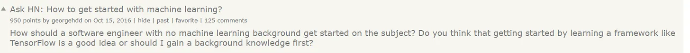
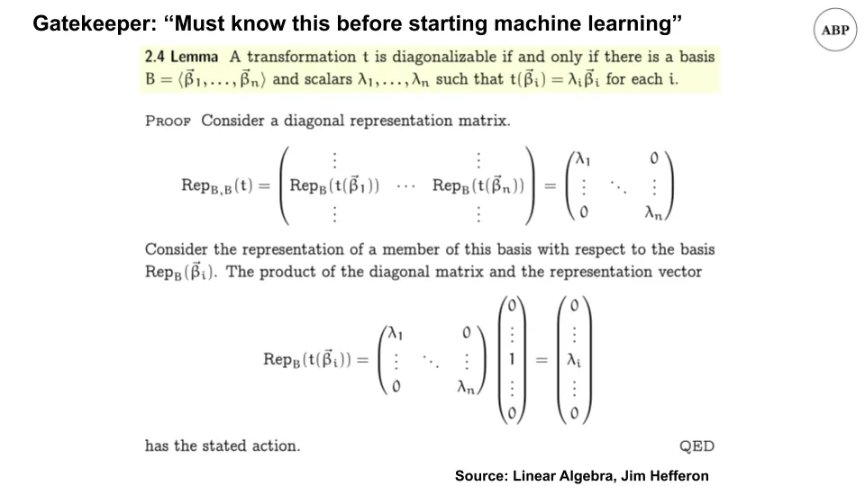
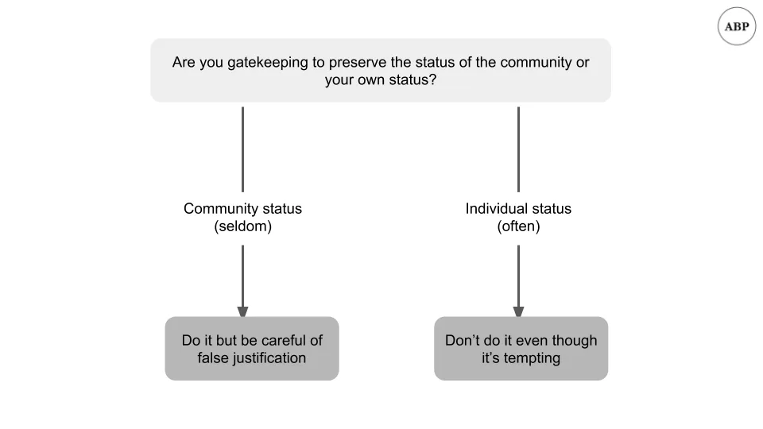

## Conclusiones

1. El gatekeeping suele hacerse para preservar el estatus individual en lugar del estatus grupal\, y debe evitarse
2. Las espirales de coste de capital e iliquidez están vinculadas en un bucle de retroalimentación

## 1\. Acceso a la categoría de grupo vs individual

Ya lo has visto antes\.

Un principiante\, con los ojos brillantes y con la cola tupida\, vendrá buscando consejos sobre cómo empezar en una materia\.

Y un montón de expertos lo harán [emerge from the depths](https://youtu.be/Y2fwe0rnHak?t=118 'balrog') decirles que no se puede hacer\, que deberían volver atrás y pasar años aprendiendo los requisitos previos\, y que deberían avergonzarse por hacer la pregunta en primer lugar\. _\"Qué descaro de algunas personas\, pensando que podrían evitar pagar sus cuotas\.\"_

Algunos \"expertos\" incluso encuentran motivos para quejarse cuando otros lanzan cursos para ayudar a los principiantes a hacer precisamente eso\.

Nos encontramos con el gatekeeping todo el tiempo\, y sobre todo se hace para preservar el estatus\. Hay algunas formas válidas de gatekeeping\, y ya hablaré de eso en un momento\. Pero casi siempre se hace para excluir a la gente y ser cruel\. Curiosamente\, los guardianes nunca parecen darse cuenta de que ellos también pueden ser excluidos\.

Por ejemplo\, podrías decir que no puedes empezar con aprendizaje automático a menos que aprendas cálculo\, estadística y álgebra lineal\, igual que el comentario anterior\.

Y también podrías decir que no puedes empezar álgebra lineal a menos que aprendas teoría de grupos\, cómo [matrices are a ring](https://www.youtube.com/watch?v=_RTHvweHlhE 'ring')\, y [when to work with linear groups or not](https://www.youtube.com/watch?v=AJTRwhSZJWw 'group') [^1]

Y podrías hacer un control adicional y decir que lo anterior depende de [set theory](https://plato.stanford.edu/entries/set-theory/ 'set')\, [Peano axioms](https://en.wikipedia.org/wiki/Peano_axioms 'Peano')\, y [philosophy](https://plato.stanford.edu/entries/philosophy-mathematics/ 'philo')\. Me pregunto cuánto de ese comentarista dedicó el comentario a estudiar durante la carrera\.

Si quisiéramos\, podríamos hacer de guardianes de cualquier cosa\.

**Tampoco llegaríamos a ninguna parte porque nunca empezábamos\.**

Existen formas válidas de gatekeeping\. Si excluyes a alguien porque sería perjudicial para la comunidad\, eso es razonable\. Por ejemplo\, si estás formando un grupo de jugadores y recibes una solicitud de membresía de alguien que quiere prohibir videojuegos\, probablemente no tenga sentido aceptarla\.

Sin embargo\, más a menudo\, el gatekeeping es un intento de individuos del \"grupo interno\" de mantener su estatus\, como si de alguna manera perdieran cuanto más gente sepa lo que sabe\. Viene de un lugar de inseguridad\; de personas que temen que otros se den cuenta de lo que hacen también pueden hacerlo otros\. Como escribí el mes pasado\, eso es como cortar la lotería\, y probablemente sea una mala idea\. Por ejemplo\, los pintores impresionistas estaban todos controlados cuando empezaron\, pero mira su influencia en el arte actual [^2]\.

Ahora\, ten en cuenta que los guardianes no están del todo equivocados\. **De hecho\, sus sugerencias suelen tener sentido\.** Por ejemplo\, sería tremendamente útil conocer álgebra lineal mientras estudias aprendizaje automático\. Y si quieres convertirte en un experto\, tienes que dominar todas las matemáticas requeridas [^3]\. Pero impedir artificialmente que la gente empiece una asignatura no ayuda a nadie\. Una mejor respuesta habría sido\: \"Sí\, aquí tienes cursos más sencillos para empezar\, vuelve y revisa los fundamentos después\.\" Habilita en lugar de desactivar\.

Si has tenido un sesgo hacia el acceso a la puerta de acceso\, te animaría a pensar si estás ayudando a la comunidad o a ti mismo [^4]\. Si te has decidido por ti mismo leer este boletín\, puedes hacerlo mejor\.

Los campos son lo suficientemente grandes como para que cuanta más gente los persiga\, mejor\. Rara vez\, si es que alguna vez\, es un juego de suma cero\, y más bien [infinite game](https://fs.blog/2020/02/finite-and-infinite-games-two-ways-to-play-the-game-of-life/ 'infinite')\. Siendo abiertos de mente y aceptando a los principiantes\, podemos hacer crecer todo el pastel y tener más para nosotros mismos\. Así es como podemos impulsar el progreso como individuos\; así tenemos el pastel y lo comemos también\.

Abrir más puertas\, y [be kind.](https://www.youtube.com/watch?v=xnouj9Yz-Gs&feature=youtu.be&t=23 'who')

## 2\. Espirales de liquidez

También lo has visto antes\.

Un mercado va funcionando\, haciendo lo que hace\: equilibrando el mercado y emparejando compradores y vendedores\. Cuando de repente ocurre un shock\, el mercado se congela y se vuelve \"ilíquido\"\.

Por ejemplo\, [how flour was in short supply a while back](https://www.theatlantic.com/health/archive/2020/05/why-theres-no-flour-during-coronavirus/611527/ 'flour') [^5]\.

O cómo la crisis del 08 provocó corridas en instituciones bancarias\, llevando a algunas a la bancarrota\.

Y recordemos a principios de este año cuando discutimos que la liquidez era la causa de las crisis\, no el capital\.

Hoy veremos los momentos destacados del artículo ["Market Liquidity and Funding Liquidity"](https://www.nber.org/system/files/working_papers/w12939/w12939.pdf 'Markus') por Markus Brunnermeier y Lasse Pedersen\. El artículo es extenso y mayormente matemático [^6]\, pero aún podemos revisar las conclusiones\.

Markus y Lasse analizan qué causa estas espirales de iliquidez\, encontrando que el coste del capital [^7] Funciona en un bucle de retroalimentación con la liquidez\. Más difícil conseguir fondos\, menor liquidez\, mayor volatilidad\.

Primero analizan los requisitos de margen [^8]\, y observa cómo cambian en respuesta a las crisis\. Como era de esperar\, los márgenes \(que aquí toman el papel de los costes\) se vuelven menos líquidos cuando hay más incertidumbre\, y se vuelven más líquidos cuando hay menos incertidumbre\.

Otra forma de reducir la liquidez es disminuir el capital de los participantes\:

> Es importante destacar que cualquier selección de equilibrio tiene la propiedad de que pequeñas pérdidas de los especuladores pueden provocar una caída discontinua de la liquidez del mercado\. Esta \"seca repentina\" o fragilidad de la liquidez del mercado se debe a que\, con altos niveles de capital especulador\, los mercados deben estar en un equilibrio líquido y\, si el capital especulador se reduce lo suficiente\, el mercado debe finalmente cambiar a un equilibrio de baja liquidez y alto margen

Lo que puede llevar a espirales de iliquidez de dos maneras\:

> Primero\, surge una \"espiral de márgenes\" si los márgenes están aumentando en la iliquidez del mercado porque una reducción en la riqueza de los especuladores disminuye la liquidez del mercado\, lo que conduce a márgenes más altos\, endureciendo aún más la restricción de financiación de los especuladores\, y así sucesivamente

> En segundo lugar\, surge una \"espiral de pérdidas\" si los especuladores mantienen una posición inicial elevada que está negativamente correlacionada con el choque de demanda de los clientes

La primera parece autoexplicativa\; lo que la segunda significa es que si eres un vendedor forzado\, el precio va a bajar mucho y tendrás que vender más\.

Esto les lleva a conclusiones tanto para inversores como para bancos centrales\:

Para los inversores\, se subestima la importancia de tener un margen de seguridad\, lo cual parece obvio\:

> Finalmente\, el riesgo por sí solo de que la restricción de financiación se convierta en vinculante limita la provisión de liquidez de mercado por parte de los especuladores\. Nuestro análisis muestra que la política óptima de gestión de riesgos \(de financiación\) de los especuladores es mantener un \"colchón de seguridad\"\.

Más interesante es lo que concluyen sobre los bancos centrales y la política monetaria\.

> Los bancos centrales pueden ayudar a mitigar los problemas de liquidez del mercado controlando la liquidez de financiación\. Si un banco central es mejor que los financiadores típicos de especuladores distinguiendo choques de liquidez de choques fundamentales\, entonces el banco central puede transmitir esta información e instar a los inversores a relajar sus necesidades de financiación

> Los bancos centrales también pueden mejorar la liquidez del mercado reforzando las condiciones de financiación de los especuladores durante una crisis de liquidez\, o simplemente manifestando la intención de proporcionar financiación adicional en tiempos de crisis

**Que es lo que se está viendo en los mercados actuales\.** Ten en cuenta que hay tres acciones separadas que un banco central puede realizar aquí\: 1\) transmitir información\, 2\) proporcionar financiación\, 3\) simplemente _di_ pueden proporcionar financiación\; puede que ni siquiera necesiten hacerlo al final\. En la crisis actual\, [markets recovered after (3), even though the actual funding provided was small.](https://www.ft.com/content/a1fba7cd-5329-46e6-82a8-57149e409f6c 'fed')

Incluso la Fed se ha dado cuenta de que no debe ser el guardián de último recurso\.

## Otros

1. [A brief history of graphics (youtube video)](https://www.youtube.com/watch?v=QyjyWUrHsFc&list=WL&index=8 'gfx')
2. ["Colour blindness is an inaccurate term"](https://commandcenter.blogspot.com/2020/09/color-blindness-is-inaccurate-term.html 'colour')\. Como persona daltónica\, fue interesante de leer\, sobre todo porque tenía información nueva
3. ["The long tail turns out toe be a major cause of the economic challenges of building AI businesses"](https://a16z.com/2020/08/12/taming-the-tail-adventures-in-improving-ai-economics/ 'a16z')
4. [Intro to abstract algebra and group theory by Socratica (youtube series)](https://www.youtube.com/watch?v=IP7nW_hKB7I 'aa')\. Recomendado\, adecuado para principiantes\.
5. ["Fusion reactor very likely to work"](https://futurism.com/mit-researchers-fusion-reactor-very-likely-work 'fusion')

[^1]: Como no conocía la teoría de grupos hasta este año\, tendría que decir que es lo más fascinante que he aprendido sobre todo el año\. Realmente me ayudó a tener intuición sobre por qué definimos las \"cosas\" y \"operaciones\" del álgebra de la manera en que lo hacemos\. ¿Por qué la multiplicación de matrices no es conmutativa\, por ejemplo\?

[^2]: Los impresionistas recibieron su nombre por primera vez [from critics ridiculing them for their "unfinished" artwork that were mere "impressions"](https://smarthistory.org/how-the-impressionists-got-their-name/ 'art')

[^3]: Para ser claro\, estoy de acuerdo en que para ser bueno en aprendizaje automático\, tendrás que ser bueno en cálculo\, estadística\, álgebra lineal\, etc\. El comentarista tiene razón en ese sentido\. No estoy de acuerdo en que debamos limitar a la gente durante años porque no ha aprendido todo lo que se necesita

[^4]: He omitido la discusión sobre temas de seguridad\, por ejemplo tú _debería_ Impide que alguien haga free\-only si nunca ha escalado nada antes\. Confío en que el lector tenga sentido común aquí\; espero que no sea pedir demasiado

[^5]: Verás que no usé papel higiénico como ejemplo\. Eso es porque tengo una opinión muy fuerte contra un artículo popular de TP que se hizo viral hace un tiempo y que creo que es mayormente inexacto\. Estoy planeando escribir sobre ello y sobre ese tipo de artículos de \"aquí va una explicación contraintuitiva\" que no son contraintuitivos sino que simplemente están equivocados\; aún no he tenido tiempo para ello\.

[^6]: Además\, para ser totalmente sincero\, no entiendo del todo las matemáticas del artículo\. En particular\, hay una conclusión de retorno sesgado por especuladores que no acabo de entender\.

[^7]: Para los lectores que no saben lo que significa el coste del capital\, piensen en ello como el coste de financiación\. Ya escribí más sobre ello anteriormente [here](/writing/capital 'sub')

[^8]: \"Cuando un operador — por ejemplo\, un intermediario\, un fondo de cobertura o un banco de inversión — compra un valor\, puede usar el valor como garantía y pedir prestado contra él\, pero no puede pedir prestado el precio completo\. La diferencia entre el precio del valor y el valor de la garantía\, denotada como margen\, debe financiarse con el propio capital del operador\"
