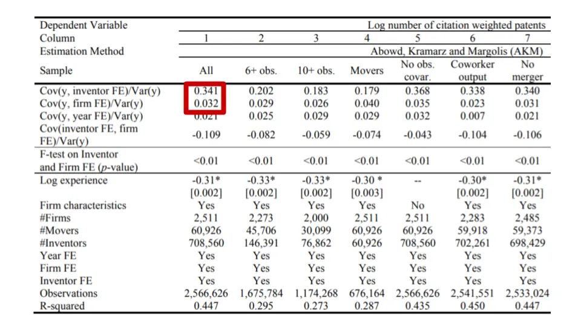

## Conclusión

Un artículo de investigación propone que deberías buscar trabajar con compañeros de equipo fuertes y no con empresas fuertes si te interesa la innovación

## Personas vs Empresas

Hablamos [middlemen in financial capital last week](/writing/ib_value 'ib')\. Esta semana\, veamos a los intermediarios en el capital humano\.

En el periódico ["Are Inventors or Firms the Engines of Innovation?"](https://papers.ssrn.com/sol3/papers.cfm?abstract_id=3081933 'paper') Ajay Bhaskarabhatla\, Luis Cabral\, Deepak Hegde y Thomas Peeters investigan si deberíamos dar más crédito a los humanos o a las empresas por las innovaciones\. Sorprendentemente\, descubren que **Los humanos merecen mucho más mérito\.** Vamos a echar un vistazo más de cerca\.

Podemos pensar en las empresas como un papel de intermediario de \"emparejar a las personas\"\, reuniendo a personas con ideas y a quienes quieren ejecutar\. Hay todo un [Theory of the Firm](https://en.wikipedia.org/wiki/Theory_of_the_firm 'Theory') sobre cómo existen las empresas para reducir los costes de transacción \[\^1\]\. Bajo este marco\, podríamos intentar repartir el efecto de la innovación entre las personas y la empresa\.

Si las empresas o las personas merecen más crédito puede hacerlo **Ayúdanos a saber en qué centrarnos** Si queremos conseguir más innovación\:

> De hecho\, si la capacidad de inventar depende de la estructura\, cultura y rutinas específicas de cada empresa\, que son difíciles de trasladar a través de las fronteras organizativas\, entonces los inventores pueden ser sustituibles y las empresas deberían desarrollar capacidades que impulsen la innovación\. Si\, por otro lado\, el capital humano es fundamental para la innovación\, entonces la innovación de las empresas dependerá de su capacidad para seleccionar\, atraer y retener a trabajadores talentosos\.

Para estudiar esto\, los investigadores definen primero el conteo de patentes inventor como la medida de la innovación\. Cuantas más patentes cree alguien\, más innovador \[\^2\]\.

Luego analizan un subconjunto de empresas cuyos inventores se desplazaron entre empresas dentro de ese conjunto\. Intuitivamente\, un inventor que se mueve de una empresa a otra permite medir el efecto de la persona frente a la empresa\, antes y después del traslado\. Esta restricción les dio 709\.000 inventores en 2\.500 empresas cotizadas en EE\. UU\. para analizar \[\^3\]\.

Utilizando esos datos\, realizan una regresión para ver si el recuento de patentes puede predecirse a partir de causas relacionadas con el inventor\, las de la empresa u otras variables\. Encuentran que\, aunque tanto el inventor como la empresa son explicadores estadísticamente significativos del recuento de patentes\, **La importancia de los inventores es casi 10 veces mayor que la de la empresa\:**

> Los efectos fijos específicos del inventor explican entre el 18 y el 37 por ciento de la varianza observada en el rendimiento de los inventores en las patentes\. En contraste\, solo entre el 2 y el 7 por ciento de la varianza global en la productividad del inventor se explica por efectos fijos de la empresa\. Las variables observadas a nivel de empresa\, como la edad\, el tamaño\, el stock de patentes y la intensidad de la investigación y desarrollo\, explican entre el 1 y el 8 por ciento de la varianza total\. Estos resultados sugieren que el capital humano específico del inventor explica gran parte de la varianza en la producción del inventor

La tabla de abajo tiene muchos números\, y vamos a ignorarlos todos excepto los dos del recuadro rojo\. Esa comparación de 0\,341 para inventores frente a 0\,032 para empresas es a lo que se refieren los investigadores en la cita anterior\; números más altos significan más poder explicativo para el recuento de patentes\. Para nuestros propósitos\, simplemente piensa en efectos fijos como \"efecto\"\, pero puedes leer más sobre la definición real [here](http://www.jblumenstock.com/files/courses/econ174/FEModels.pdf 'fixed')\.

Si lo anterior es cierto\, entonces eso significa que como individuos\, **Deberíamos buscar trabajar con compañeros de equipo sólidos\, en lugar de con empresas sólidas** Si nos interesa ser más innovadores\. Dicho de otro modo\, es un dato que indica por qué deberías preocuparte tanto por las personas con las que vas a trabajar directamente\, más que por la reputación de la empresa\.

Otro resultado contraintuitivo que encuentran los investigadores es que las \"buenas\" empresas no necesariamente tienen más inventores \"buenos\"\:

> Los inventores con bajo capital humano coinciden con las empresas con alta capacidad de innovación\. La idea es que el impulso a la innovación proporcionado por las empresas con altas capacidades de innovación es especialmente valioso para los inventores con bajo capital humano\, que están dispuestos a aceptar salarios más bajos a cambio de la \"comodidad\" de mayores tasas de innovación\.

> En cambio\, los inventores con alto capital humano se agrupan en empresas con bajas capacidades de innovación\. Intuitivamente\, estos inventores tienen menos que ganar con las capacidades innovadoras de su empleador\, lo que otorga un peso relativamente mayor a su compensación financiera

Lo anterior dice que si crees que no eres tan innovador\, irás a trabajar en una empresa más conocida por su innovación\, para intentar obtener algún beneficio para ti\. Como compensación\, estás dispuesto a aceptar salarios más bajos\.

Si crees que eres más innovador\, te importará menos la empresa y preferirás un salario más alto porque no necesitas el beneficio de innovación de la empresa \[\^4\]\.

Este resultado me resulta más difícil de aceptar y entender\. El artículo afirma haber controlado el tamaño y la etapa de la firma \[\^5\]\, y aún me pregunto si aquí hay algún efecto de empresa startup\. Si las startups tienen menos producción de patentes que las nuevas empresas y son más selectivas con la contratación\, podrías ver el caso de un alto capital humano que se une a empresas de baja innovación y negocia una compensación financiera más alta una vez que se incluye el capital\. No sé lo suficiente como para profundizar en su metodología\, pero podría ser algo a considerar\.

Los investigadores también incluyen una página entera con otras limitaciones del estudio\. Las principales incluyen usar el recuento de patentes como definición de innovación y asumir que los salarios y la producción potencial de innovación se están intercambiando\. Puedes leer más en la nota al pie o en la página 23 de [the paper](https://papers.ssrn.com/sol3/papers.cfm?abstract_id=3081933 'paper') \[\^6\]\.

Sin embargo\, suponiendo que creas en su investigación\, las principales conclusiones son\:

- Son las personas\, y no las empresas\, quienes impulsan la innovación
- Si quieres llevar los límites de la innovación\, es mejor encontrar buenas personas con las que trabajar\, en lugar de una buena empresa
- Un efecto secundario interesante es que tu salario también podría ser más alto como resultado

1. La wiki afirma\: \"Según el ensayo de Ronald Coase La naturaleza de la empresa\, las personas comienzan a organizar su producción en las empresas cuando el coste de transacción de coordinar la producción a través del intercambio de mercado\, dada información imperfecta\, es mayor que dentro de la empresa\"
2. Específicamente\, \"Para cada inventor ݅i en la firma ݆j en el año t\, medimos el número total de patentes ponderadas por citas anticipadas excluyendo las autocitas durante los primeros cinco años tras la publicación de la patente\.\" También corrigen el trabajo en equipo y ajustan las patentes \"revolucionarias\" y las patentes \"inútiles\"
3. \"Para desentrañar las contribuciones relativas de empresas e inventores a la innovación\, aplicamos la estrategia de identificación de Abowd\, Kramarz y Margolis \(1999\) \(en adelante AKM\)\. Esta estrategia requiere que utilicemos una submuestra de inventores que trabajan en empresas conectadas entre sí moviendo inventores\.\" Aún no he revisado el artículo de AKM\, así que no tengo muy claro la metodología aquí
4. El equipo asume que las personas están alternando entre salarios e innovación\. \"nuestro modelo formaliza la idea propuesta por Bonhomme et al \(2019\)\, quienes señalan que los trabajadores pueden estar dispuestos a sacrificar salarios a cambio de mejores características laborales no salariales o \"comodidades\.\" Lamadon et al \(2019\) muestran la importancia relativa de las comodidades \(por ejemplo\, proximidad al trabajo\, horarios flexibles\, preferencia por el tipo de tareas realizadas\) para la clasificación de trabajadores en el mercado laboral estadounidense\. En nuestro caso\, postulamos que\, para los inventores\, una utilidad importante es proporcionada por la innovación producida\. Específicamente\, nuestro modelo teórico considera una función de utilidad del trabajador con dos insumos\: salario y innovación de producción\"
5. \"los efectos de la empresa explican una mayor parte de la varianza para empresas pequeñas con menos de 50 inventores en comparación con las empresas con más de 1000 inventores \(10 por ciento frente a uno por ciento\)\. Como se ha comentado antes\, el efecto de la empresa en empresas más pequeñas puede asumir parte del efecto del capital humano a nivel de grupo\. Aun así\, la contribución de los efectos de inventor es mucho mayor en toda la distribución del tamaño de la empresa\, con valores que oscilan entre el 34\,5 y el 40 por ciento\.\"
6. \"Sin embargo\, una suposición crítica de nuestro modelo es que a los inventores les importan los salarios así como el resultado inmediato de sus esfuerzos\, es decir\, la innovación
   Producción\. Los inventores pueden tener preferencias intrínsecas sobre la producción de innovación \(por ejemplo\, publicaciones o patentes\, como en Stern 2004\) o valorar las salidas como señal de su productividad para los mercados laborales \(Melero\, Palomeras y Wehrheim 2019\; Kline et al 2019\)\. Además\, asumimos que la utilidad marginal de los inventores sobre la producción de innovación está disminuyendo\: una patente adicional importa más para un inventor con menos patentes que para uno con más patentes en su historial\. Específicamente\, asumimos que la utilidad marginal de la innovación disminuye a un ritmo más alto que una función logarítmica\"
