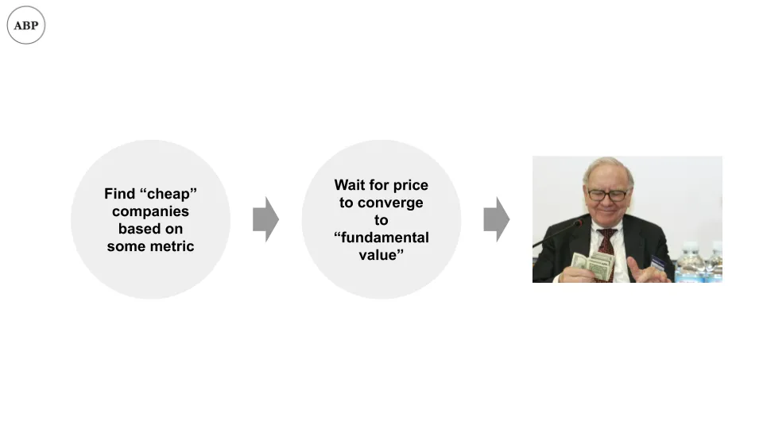

## Conclusión

AQR analiza el rendimiento de la inversión en valor \(mala\)\, críticas comunes a la inversión en valor \(inválida\)\, y propone su propia explicación de por qué la inversión en valor no ha funcionado \(¿válida\?\)

## Valoraciones

Ya hemos hablado de [whether investment bankers add value](/writing/ib_value 'bank') \(¿probablemente\?\)\, [whether companies add value](/writing/company_value 'co') \(menos de lo que pensamos\)\, y esta semana cerraremos la serie de valor \[\^1\] analizando si invertir en valor aporta valor\.

El periódico [Is (Systematic) Value Investing Dead?](https://papers.ssrn.com/sol3/papers.cfm?abstract_id=3554267 'paper') por Ronen Israel\, Kristoffer Laursen\, Scott Richardson de la conocida firma de inversión AQR analiza si la inversión en valor sigue funcionando\. A continuación [an earlier paper this year](https://papers.ssrn.com/sol3/papers.cfm?abstract_id=3525096 'paper') de Fama y French\, los profesores que popularizaron la inversión en valor como factor de inversión\, que concluyeron que el retorno de la inversión en valor ha disminuido en los últimos años \[\^2\]\. En otras palabras\, ya no es bueno ser inversor en valor\.

El artículo de AQR concluye \(sorprendentemente\) que\, a pesar de un rendimiento débil últimamente\, **La inversión en valor \(según su definición\) no está muerta\:**

> Tanto desde una perspectiva teórica como empírica\, las expectativas sobre la información fundamental han sido y siguen siendo un motor importante de los retornos de los valores\. También abordamos una serie de críticas dirigidas a la inversión en valor y consideramos que generalmente carecen de sustancia\.

El artículo primero define qué entienden por inversión en valor\, luego aborda las críticas y termina explicando cómo añaden criterios a la inversión en valor para que funcione mejor\. Además\, tiene 57 páginas\, así que vamos a resumirlo en mucho menos tiempo\. Iré añadiendo reflexiones a lo largo del camino\, como siempre\.

## Definiciones

¿Qué se entiende exactamente por inversión en valor\? Si queremos decir \"comprar barato y vender caro\"\, entonces por definición todo el mundo es inversor en valor\. No ganas dinero vendiendo algo por menos de lo que compraste \[\^3\]\.

Si queremos decir \"invertir bajo algún criterio que haga que el precio de las acciones de la empresa parezca barato\"\, entonces tenemos un problema mucho más manejable que explorar\.

Por eso las definiciones son importantes\. Si tu \"más tarde\" en \"yo lavo los platos más tarde\" significa dentro de dos semanas frente a su \"más tarde esta noche\"\, vas a tener problemas\.

Para empezar\, necesitamos definir qué se entiende por \"valor\" y luego usar esa definición para clasificar las acciones en \"buen valor \/ barato\" y \"mal valor \/ caro\"\.

Fama y French popularizaron por primera vez el concepto de \"valor\" como factor de inversión en su [1992 paper](https://rady.ucsd.edu/faculty/directory/valkanov/pub/classes/mfe/docs/fama_french_jfe_1993.pdf 'paper')\. Por \"valor\" se referían a alguna métrica calculable para una empresa que pudiera usarse para clasificarlos\. El artículo original utilizaba el \"valor en libros\" de la empresa frente al \"valor de mercado\" como métrica\, calculando la relación entre el valor contable de las acciones y el valor de las acciones cotizadas en bolsa \[\^4\]\. Si la proporción era baja \(bajo valor en libros frente a las acciones\)\, la empresa era barata\.

Con el tiempo\, las proporciones utilizadas se han ampliado para incluir otras métricas comúnmente utilizadas\. El artículo AQR utiliza cinco como definición de valor\:

1. Libro a precio\, lo que acabamos de mencionar
2. Ganancias a precio\, es decir\, beneficio neto sobre capitalización bursátil
3. Beneficios a futuro respecto al precio\, es decir\, el analista de investigación del lado de venta predijo beneficios futuros sobre capitalización bursátil
4. De las ventas a valor empresarial\. Está fuera del alcance de este artículo hablar de la diferencia entre valor empresarial y valor de capital\; simplemente trátalos igual si no estás familiarizado \[\^5\]
5. Flujo de caja a valor empresarial

Si todo eso te pasó por encima\, no pasa nada\. Piénsalo como que AQR propone cinco formas de medir si una acción es barata o no\, basándonos en cifras públicas y relativamente objetivas\. Necesitamos esto para invertir en valor de forma sistemática basada en esos criterios\. Si no\, no hay forma de juzgar si el \"valor\" funciona\; lo que tú dices barato podría ser caro para mí \[\^6\]\.

**La idea general entonces es invertir en empresas \"baratas\" y obtener beneficios cuando se vuelvan menos baratas porque los precios convergen hacia lo que la empresa \"debería\" valer\.**

Parece que debería funcionar\, ¿no\? Bueno\, veamos\.

## Críticas

Lo que encuentran es\:

> Durante todo el periodo muestral\, las estrategias de valor sistemático generaron rendimientos ajustados al riesgo positivos\. Sin embargo\, la última década ha visto una reducción notable en el rendimiento de las estrategias de valor sistemático

Esto se puede ver en su gráfico\, donde presentan los ratios de Sharpe para todas sus diferentes estrategias de valor a lo largo del tiempo\. Para quienes no estén familiarizados con los ratios de Sharpe\, simplemente piensen en ellos como un \"rendimiento excesivo\"\, cuanto mayor mejor\. Fíjate cómo\, en el gráfico de abajo\, pasado 2011\, **Todos los rendimientos bajan y se mantienen bajos\. Eso es malo\.**

¿Por qué está ocurriendo esto\? El equipo de AQR analiza cinco críticas comunes a una estrategia de \"inversión sistemática en valor\" que podrían explicar esto\. Al final\, rechazan la mayoría de estas críticas y proponen su propia explicación\.

La crítica \#1 es sobre una de las \"métricas de valor\"\, Book to Price\. La gente lleva tiempo diciendo que esta medida en particular está desactualizada\, y AQR generalmente está de acuerdo\. Voy a saltarme las matemáticas de regresión \[\^7\]\; el resumen es que **De libro a precio no funciona bien\,** especialmente si se incluye el factor entre ganancias y precio\. Sin embargo\, el AQR también añade\:

> ¿Qué significa esto para los propietarios de activos y gestores interesados en obtener rendimientos de las estrategias de valor\? Centrarse solo en un ancla fundamental para el valor intrínseco probablemente no será una estrategia exitosa\. En su lugar\, asegúrate de que se utilicen multitud de medidas fundamentales para comparar con el precio

> Necesitas ampliar tus horizontes a la hora de medir el valor\. El valor en libros no es el único ancla fundamental para el precio

Supongo que eso es justificable\, aunque tengo una objeción a simplemente dejar de lado añadir medidas y \"expandir horizontes\" como algo no controvertido\. Si estamos de acuerdo en añadir cualquier ancla fundamental\, acabaríamos volviendo al punto de partida\, intentando definir qué significa invertir en valor\. Alguien podría añadir una medida de \"vistas de usuario a la plantilla\" y decir que eso es una medida de \"valor\"\.

La crítica \#2 es sobre cómo las empresas están haciendo más recompras de acciones últimamente\, lo que podría hacer que las métricas sean defectuosas y que la inversión en valor deje de funcionar\. AQR concluye que **La cantidad de recompras de acciones no ha tenido un efecto significativo en el rendimiento del valor\:**

> En cuanto al rendimiento de las carteras de valor en las particiones de intensidad de recompra de acciones\, solo vemos evidencia mixta de que el valor funciona peor para la submuestra de recompra de acciones \'Alta\'\.

Ten en cuenta que no están diciendo que la inversión en valor funcione bien con bajas recompras de acciones\, solo dicen que las recompras de acciones no parecen importar de ninguna manera\.

La crítica \#3 es cómo las empresas tienen más valor en activos intangibles\, como el poder de la marca\, y eso está infradeclarado en los balances convencionales\. Por ejemplo\, Disney tiene una marca fuerte\, y eso no es en cifras contables\, sino en el precio de las acciones\. Si este es el caso\, entonces usar cualquier métrica financiera podría ser erróneo\.

AQR toma prestado un proceso de Credit Suisse para ajustar todos estos efectos\. Me saltaré los detalles \[\^8\]\, pero concluyen que **Tales intangibles tampoco parecen explicar el rendimiento del valor\:**

> El reciente bajo rendimiento de las estrategias de valor se extiende a las medidas de valor que intentan corregir deficiencias en el sistema de informes financieros\. Parece poco probable que la creciente importancia de los intangibles o los cambios en los modelos de negocio expliquen el bajo rendimiento de las estrategias de valor\.

La crítica \#4 es cómo el entorno de tipos bajos ha hecho que invertir en valor sea menos atractivo\. Esta vez\, AQR encuentra que **Los tipos de interés bajos sí afectan al valor\, aunque afirman que es débil\:**

> Sin embargo\, hay algunas pruebas de que el rendimiento de las estrategias de valor está positivamente relacionado con los cambios en la pendiente de la curva de rendimientos tanto de las acciones estadounidenses como internacionales \(es decir\, las acciones de valor tienen un mal desempeño cuando la curva de tipos se aplana\)\. \\\[\.\.\.\\\] esta relación es débil y explica solo una parte muy modesta de los rendimientos

Para quienes no estén familiarizados con las curvas de rendimiento\, piensen en ellas como los tipos de interés que pagan los bonos\. AQR apunta además que si pudieras predecir la curva de tipos como se ha implicado en lo anterior\, sería mejor invertir directamente en bonos en lugar de en acciones\:

> ¿Y no tendría sentido negociar bonos directamente si tuvieras la habilidad de prever cambios en la forma de la curva de rendimientos\?

No estoy seguro de estar de acuerdo con ambas cosas\. Hay muchas razones por las que la gente se queda en acciones\: es un sector más de moda\, más \"prestigioso\" y más común para entrar\. Además\, como ya he escrito antes\, [low rates imply people should take more risk](/writing/capital 'risk')\, y invertir en valor por su naturaleza implica menos riesgo\.

La crítica \#5 es que demasiada gente sabe sobre inversión en valor\, y por eso se ha vuelto \"saturada\"\, lo que reduce los rendimientos\. **AQR no está de acuerdo en que la inversión en valor se haya saturado** \(más popular como estrategia de inversión\) y dice que la evidencia es lo contrario\:

> Si todo el mundo estuviera al tanto y se hubiera desplegado un capital considerable\, un resultado natural sería una compresión significativa en los \'diferenciales de valor\'\. Es decir\, las acciones más baratas parecerían hoy menos baratas en comparación con las más caras \\\[\.\.\.\\\] Si acaso\, los diferenciales de valor se han ampliado en los últimos años\, haciendo que la saturación sea una explicación poco probable para la reciente caída\.

Esto se relaciona con evidencia anecdótica\: los conocidos inversores de \"valor\" han estado en las noticias en los últimos años por su bajo rendimiento\. Si fuera así\, cada vez más de sus socios limitados habrían empezado a retirar capital\, lo que habría causado que se utilizara aún menos capital para \"valorar\" a corto plazo\. Normalmente habría gente que vendría a explotar esta \"tacañez\"\, pero a veces no es así\.

## Añadidos

Lo que nos lleva a la conclusión de AQR\, sobre lo que creen que está causando el mal rendimiento de la \"inversión en valor\" últimamente\:

> Cuando el valor tiene un rendimiento inferior al máximo\, se debe a una combinación de deterioro de los fundamentos de las acciones baratas \(pero no mucho mayor de lo normal\) y a un ensanchamiento de la brecha entre precios y fundamentos \(aunque considerablemente más que la media\)\.

Recuerda nuestro modelo sencillo de cómo podría funcionar la inversión en valor\. Si 1\) tu métrica ya valora todo de forma justa\, o 2\) los precios nunca convergen hacia el valor fundamental\, la estrategia de inversión va a fracasar\.

Los AQR funcionan por encima de las afirmaciones de que \(1\) no es cierto\, y que es \(2\) la causa\. En otras palabras\, actualmente existe un periodo prolongado en el que los precios se mueven sin relación con la información fundamental\:

> En consonancia con los resultados anteriores\, los fundamentales sí importan para los rendimientos de las acciones\, pero hay periodos en los que los precios de las acciones se conectan menos con la información fundamental y\, en esos periodos\, las estrategias de valor rinden por debajo del esperado\. Esto ya ha ocurrido antes\, está ocurriendo ahora y probablemente volverá a suceder\.

Lo demuestran haciendo carteras de inversión basadas en \"información perfecta\"\, tomando predicciones de investigación del lado de venta \"con antelación\" y usando eso para crear carteras \"retrospectivas\"\, es decir\, usando una estimación hecha en 2019 \(cuando 2018 ya se conoce\) para crear una cartera en 2018\.

Como usan \"información perfecta\"\, la cartera rinde bien\: si conocieras los informes de beneficios de la empresa de antemano\, ganarías dinero de media \[\^9\]\. Ahora la pregunta interesante es\, ¿cuánto dinero extra ganarías y cómo cambiaría eso con el tiempo\? AQR encuentra que este \"rendimiento excesivo\" también ha disminuido en los últimos años\, lo que implica que la información fundamental de beneficios es menos relevante últimamente\. Fíjate en cómo el gráfico de abajo tiende a la baja desde 2007\:

No es una explicación especialmente satisfactoria\, ya que equivale a decir \"menos gente cree en la importancia del valor\, por lo tanto funciona menos\.\" Sin embargo\, hay una buena parte de verdad en ello\. Recuerda el artículo anterior sobre [stories and stocks](/writing/stories 'story')\, en la que argumento la importancia de las historias\. Si la gente en general ha decidido que lo que más importa es el \"crecimiento\"\, eso crea un bucle de retroalimentación auto\-reforzante en los mercados\. Esto normalmente requiere un ciclo económico para corregirse\, pero aún no hemos visto uno\.

\[\^1\] Me gustaría decir que esto se planeó desde principios de este mes\, pero fue una coincidencia\. 
\[\^2\] Simplifico en el texto principal aquí\, en realidad dicen que aunque el rendimiento ha disminuido en la segunda mitad del periodo julio de 1963 a junio de 2019\, [there's not enough data yet to conclude if value investing as an investment factor works or not.](https://www.institutionalinvestor.com/article/b1k3pd2z3ptx9g/Ken-French-There-Is-No-Way-to-Tell-If-Value-Premium-Is-Disappearing 'ii') Ten en cuenta que utilizo el factor de inversión aquí como algo específico\, es decir\, un criterio filtrable para ponderar una cartera de inversión\, como se menciona más adelante en el texto principal\. 
\[\^3\] No me hagas un \@ con una estrategia de seguros cubierta cuando sabes el punto que quiero decir\. 
\[\^4\] También se utiliza el inverso\, de [price to book](https://en.wikipedia.org/wiki/P/B_ratio 'pb')\. Consulta el enlace para más detalles sobre los cálculos\. 
\[\^5\] \"EV se calcula como la suma de la capitalización total de las acciones\, acciones preferentes\, intereses minoritarios y deuda total\. Estos tres últimos componentes se basan en valores contabiles reportados\, no en valores de mercado\, ya que es difícil obtener datos de mercado fiables para estos elementos para nuestra muestra global de empresas \(y las diferencias entre valor contable y de mercado probablemente sean pequeñas para la mayoría de las empresas\)\" 
\[\^6\] Esto\, por supuesto\, no resuelve del todo el problema\, y es por eso que tanta gente sigue debatiendo sobre definiciones y medidas hoy en día\. Sin embargo\, es una forma de hacer que la declaración del problema sea más fácil de explorar\, así que nos quedaremos con ella por falta de mejores alternativas\. 
\[\^7\] Los detalles están en pdf\, pág\. 16\. \"Si limitas la muestra solo a las acciones más grandes y te centras en carteras de ordenación simples\, entonces B\/P no es significativo en presencia de E\/P\.\" 
\[\^8\] PDF pág\. 24\. Si conoces a Michael Mauboussin\, los ajustes de CS HOLT están relacionados con su trabajo\. \"Para este propósito\, utilizamos datos de Credit Suisse HOLT\. Específicamente\, HOLT construye un flujo de caja bruto ajustado a la inflación que se calcula como beneficio neto ajustado por partidas especiales\, depreciación y amortización\, gasto por intereses\, gasto por alquiler\, participación minoritaria y varios otros ajustes económicos propietarios \(CF HOLT\)\. 
\[\^9\] Curiosamente\, no vas a ganar dinero todo el tiempo\. Hubo un caso de gente hackeando la SEC para obtener información temprana de ganancias\, así que tenían información 100\% perfecta\, pero creo que solo ganaban dinero \~70\% de las veces\.
