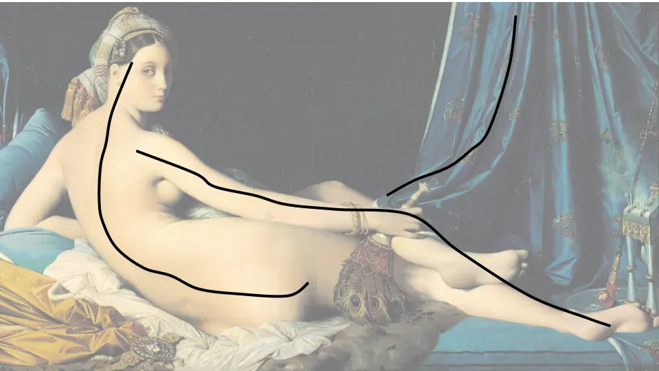

## Conclusión

Comparar las obras de Tiziano\, Dominique\-Ingres y Manet muestra cómo los artistas se han influido mutuamente y se han rebelado contra la tradición a lo largo del tiempo\.

## Analizando a Tiziano\, Ingres y Manet

Diciembre es un momento conveniente para reflexionar\. Como en años anteriores\, haré una reflexión más completa sobre el año en la publicación mensual\. Dedicaré las revistas semanales a destacar nuevos temas que he aprendido este año\.

Lo primero es la historia del arte\. Este año he empezado a dedicar más tiempo a aprender sobre arte\, por varios factores\:

- El Covid canceló muchas de mis aficiones
- Siempre he sentido curiosidad por el arte y creo que sigue teniendo relevancia hoy en día
- El arte es mucho mejor cuando tienes contexto para la pieza

Encontré [Smarthistory](https://smarthistory.org/) ser una web accesible pero completa\, y he estado trabajando en muchas de las páginas\. Leer sobre las intenciones detrás de piezas famosas ha hecho que entender las obras sea más fácil y agradable\. Por ejemplo\, finalmente entender de qué trata Picasso [in an earlier article I wrote](/writing/picasso 'picasso')

Con eso en mente\, echemos un vistazo a tres piezas con un tema similar y veamos cómo el contexto histórico puede darnos una mejor comprensión de lo que el artista intentaba hacer\.

Arriba vemos tres desnudos reclinados\, un tema popular entre artistas durante mucho tiempo [^1]\. En orden horario tenemos un Tiziano del siglo XVI\, un Dominique\-Ingres de principios del siglo XIX y un Manet de finales del siglo XIX\. Todos estos artistas eran famosos entonces\, y lo siguen siendo ahora\. \"Venus\" fue bastante poco controvertida en su época\, pero las otras dos \"La Grande Odalisca\" y \"Olympia\" recibieron muchas más críticas\. ¿Por qué\?

Para responder a esa pregunta\, será útil entender el [hierarchy of art genres](http://www.visual-arts-cork.com/history-of-art/hierarchy-of-genres.htm 'hierarchy') A la que la gente se había adherido durante siglos\:

Durante mucho tiempo\, el tipo de arte tenía cierto \"rango\"\, y la gente automáticamente juzgaba una pintura de bodegones como menos importante que una pintura de una escena religiosa\. No es del todo sorprendente\, teniendo en cuenta que la iglesia fue un gran mecenas del arte en tiempos históricos\.

Echemos un vistazo más de cerca a Venus y al pensamiento que Ticiano puso detrás de la composición\. [Venus was probably intended as a marriage gift](https://smarthistory.org/titian-venus-of-urbino/ 'venus') a la pareja para una visita privada [^2]\, el peinado era típico de las novias de la época\, y las rosas asociadas al amor\. Al titularse Venus\, también pretendía ser una pintura mitológica\, situándola firmemente en el \"rango\" más alto del arte de la época\.

Para hacer la pintura más interesante visualmente\, Tiziano también contrastó la curva del cuerpo con las líneas rectas del fondo\. También observa cómo las líneas negras también dirigen nuestra atención hacia la figura\. Las líneas rojas en el fondo no son del todo paralelas por voluntad\, ya que esto crea [perspective](https://www.tate.org.uk/art/art-terms/p/perspective 'perspective') para la imagen y que parezca más 3D\.

Ahora veamos Odalisca \(que significa concubina\) y veamos qué se ha mantenido igual y qué ha cambiado\. La postura es similar\, y el uso del tono de piel en Odalisca y Venus hace que ambas parezcan realistas\.

Dominique\-Ingres ha añadido más detalles al primer plano\, como las plumas de pavo real o las gemas\. También fíjate que no utiliza tantas líneas rectas para contraste o perspectiva\. En cambio\, la pintura gira en torno a las curvas\:

Si miras el cuerpo el tiempo suficiente\, también empezarás a notar que algo es extraño\. El cuerpo se ha alargado durante la postura\, seguro\, pero ¿no parece bastante _también_ ¿Largo\? Las proporciones de la figura no son del todo correctas\. Si miras la pierna izquierda de la figura\, también te darás cuenta de que el lugar a lo que se une en el cuerpo también está desajustado\. Ingres hizo esto intencionadamente para que el espectador tuviera una percepción más aguda de la forma de la figura\, frente a lo que podría ser posible con cuerpos \"realistas\"\.

Por último\, Ingres tituló la obra \"La Grande Odalisca\"\, y no en honor a alguna figura mitológica\. Esto habría hecho que la pintura fuera \"menos importante\" y fue su manera de hacer una declaración contra la rígida jerarquía artística de su época\.

Ahora\, por último\, veamos la obra de Manet\. Aquí se pueden ver fácilmente las referencias a Venus\, desde las poses similares\, los cojines e incluso esa línea vertical de fondo para atraer contraste y atención\.

Al mismo tiempo\, esta es también una pintura muy diferente\. La mayoría diría que tanto Venus como Odalisca parecían más \"terminadas\" y \"realistas\"\, mientras que Olimpia parece incompleta\. No es terrible\, pero tampoco es tan \"bonita\" como las pinturas anteriores\.

Las curvas en la figura no son tan largas ni tan gráciles como las de Odalisca\, y no hay líneas que sugieran perspectiva 3D\, lo que hace que la imagen parezca plana\. Mientras que Venus fue titulada en honor a una diosa y Odalisca mostraba una escena de una tierra fantástica\, Olimpia parece muy real\, muy moderna\.

De hecho\, fue esa realidad la que llevó a ["Sticks and umbrellas were brandished in \[her\] face," and criticism that the painting was “a degraded model picked up I know not where.”](https://www.artforum.com/print/197503/manet-a-radicalized-female-imagery-36081 'art') Al igual que Ingres antes que él\, Manet ahora se rebela por completo contra la tradición\, diciendo que la jerarquía artística es un disparate\, y que era la era del mundo moderno\. El arte ya no se centraría en pintar la historia\; pintaría el presente\.

La obra de Manet extrajo influencias del pasado\, pero también rechazó muchos aspectos fundamentales\, escandalizando el mundo del arte\. Como resultado\, influyó en movimientos enteros y ahora es conocido como uno de los primeros artistas verdaderamente modernos\, inspirando impresionismo\, realismo y más\.

Titulé la entrada sobre Manet\, pero en realidad trata sobre el arte en general\. El arte es un área en constante evolución\, y lo que antes era popular puede perder popularidad antes de volver a ser recuperado\. He comprobado que entender la historia detrás de por qué los artistas tomaron las decisiones que tomaron ayuda a apreciar mejor las diferentes piezas y a establecer paralelismos entre épocas\. Si no otra cosa\, me ha hecho más abierto de mente\.

## Notas

[^1]: Uno se pregunta por qué\.

[^2]: \"El tema de la Venus dormida fue central en los epitalamios \(canciones o poemas que celebran el matrimonio\) populares en la antigüedad griega y romana\, y revividos en la Italia renacentista\.\" de Smarthistory
