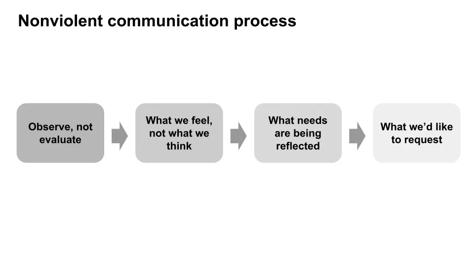

## Conclusión

Comunicarse de forma no violenta observando sentimientos y necesidades ayudará a mejorar las relaciones y reducirá las probabilidades de que las personas se sientan amenazadas\, haciendo más probable que todos consigan lo que quieren\.

## Comunicación no violenta para mejorar las relaciones

Una vez insinué sin querer que una amiga era mala en matemáticas\, y nunca me ha dejado olvidarlo\. Hace que te preguntes cuántas personas he ofendido sin querer\. Para ser una especie supuestamente inteligente\, somos terribles comunicando cómo nos sentimos y qué nos gustaría que hicieran los demás\. Esperamos que la gente lea nuestra mente\, frustrándose cuando no pueden\, a pesar de no poder hacerlo nosotros mismos\. Todos podríamos trabajar en una mejor comunicación\; es un objetivo interminable para mí\.

Leí sobre [Nonviolent Communication](https://www.amazon.com/Nonviolent-Communication-Language-Life-Changing-Relationships/dp/189200528X 'NVC') \(NVC\) recientemente\, y me ha resultado útil para destacar formas en las que podría mejorar\. NVC se centra en los sentimientos\: entender los nuestros propios y empatizar con los demás\. Al entenderlos mejor\, podemos comunicarnos sin herir a los demás sin querer\.

El proceso del NVC tiene cuatro pasos principales\, centrados en hacer que las personas se sientan menos amenazadas por nuestro lenguaje\:

1. Acciones que nosotros **observar** que están afectando nuestro bienestar
2. Cómo **Sentir** en relación con esa observación
3. El **necesidades** que están creando esos sentimientos
4. Las acciones que hacemos **Solicitud** para mejorar nuestras vidas

**Primer paso\:** Necesitamos separar la observación de un hecho de la evaluación de una persona\. Cuando incluimos una evaluación\, normalmente suena a crítica\. Cuando suena a crítica\, la gente empieza a desconectarse\. Por ejemplo\, decir \"Jerry no ha marcado en 10 partidos\" es una observación\, mientras que \"Jerry es un mal jugador\" es una evaluación\.

Si recuerdas mi resumen de [Thanks for the feedback](/writing/feedback 'feedback')\, un libro sobre cómo mejorar en recibir feedback\, esto debería sonar familiar\. Ser evaluado puede fácilmente provocar dudas sobre tu competencia\. Por ejemplo\, alguien que hace una sugerencia en el trabajo puede hacerte sobrepensar y creer que te dice que eres incompetente en tu trabajo\.

Y probablemente ya te haya pasado antes\: una vez que sientes que te han criticado\, no eres receptivo a ningún otro comentario\, haciendo que toda esa conversación sea bastante inútil\. Es como estar ["on tilt"](<https://en.wikipedia.org/wiki/Tilt_(poker)> 'tilt') Cuando juegas al póker y\, por tanto\, tomas malas decisiones\.

Gracias por el comentario\, abordé esto desde el punto de vista del receptor\, pidiendo al comentarista que aclarara el comentario\. NVC aborda esto desde el punto de vista del dador\, separando deliberadamente las observaciones de las evaluaciones\. Es un paso hacia ser menos confrontativo\.

**Segundo paso\:** Tenemos que entender lo que sentimos\, distinguir eso de lo que estamos pensando\. La diferencia puede ser sutil pero significativa\, y es útil para el siguiente paso\. Por ejemplo\, \"me siento poco importante\" es cómo pensamos que nos ven los demás\, mientras que \"estoy desanimado\" es un sentimiento\.

Escribiré más sobre esto en el futuro\, y creo que no nos conocemos lo suficiente\, normalmente nos cuesta expresar exactamente lo que sentimos\. Esto causa problemas porque no sabemos cómo afrontar nuestros sentimientos\. Hubo un [Romantic period](https://en.wikipedia.org/wiki/Romanticism 'romantic') en las artes de principios del siglo XIX enfatizando la emoción\, y creo que está a punto de que regrese\.

**Tercer paso\:** Tenemos que entender las necesidades que impulsan nuestros sentimientos\. Otras personas pueden desencadenar nuestros sentimientos\, pero nuestras propias necesidades son la causa\.

Cuando recibimos una comunicación negativa\, podemos \(1\) culparnos a nosotros mismos\, \(2\) culpar a otros\, \(3\) entender nuestros sentimientos y necesidades\, \(4\) entender los sentimientos y necesidades de la otra persona\. El NVC afirma que \(1\) y \(2\) son contraproducentes\, y que \(3\) y \(4\) son necesarios para una comunicación significativa\.

NVC también hizo un punto interesante sobre el crecimiento emocional\, diciendo que pasamos por tres etapas de crecimiento\. Al principio\, somos esclavos emocionales\, viéndonos responsables de los sentimientos de los demás\.

Naturalmente\, esta es una situación agotadora\. Quienes se dan cuenta de los altos costes asociados a la etapa anterior se rebelan y se vuelven insoportables\, enfadados y queriendo deshacerse de toda responsabilidad\. Eso sigue siendo inmaduro\.

La última etapa del crecimiento es la liberación emocional\, donde respondemos a los demás con compasión y aceptamos la responsabilidad de nosotros mismos pero no de los demás\. Me recuerda a [Kegan's theory of adult development](/writing/kegan 'kegan')\, lo que hace que la mayoría de la gente se estanque en la etapa intermedia\.

**Cuarto paso\:** Una vez que sabemos lo que sentimos y por qué\, por fin podemos hacer peticiones \(no exigencias\) a los demás\. Cuanto más clara sea nuestra petición\, más probable será que consigamos lo que deseamos\. Por ejemplo\, \"quiero que seas más responsable\" no está claro comparado con \"me sentiría feliz si fregieras los platos después de comer\"\.

Si algo es una petición o una exigencia depende de las consecuencias de no cumplirlo\. Si el incumplimiento resulta en críticas o culpabilización\, es una exigencia\. Cuando la gente cree que está escuchando una exigencia\, se siente amenazada\, viendo solo la sumisión o la rebeldía como sus opciones\, ninguna de las cuales es buena para la relación\.

El libro del NVC también explica cómo empatizar más\, expresar la ira y mostrar aprecio\, pero lo omito para ser conciso\. Sin embargo\, tengo una preocupación que no se abordó\: se asume que todo el mundo actúa con buenas intenciones y puede desarrollar empatía\. Si hubiera leído esto antes de la pandemia\, estaría inclinado a estar de acuerdo\. En cambio\, ahora me pregunto cuál es el enfoque correcto si otros no actúan de buena fe\. No tengo buenas ideas en ese sentido\, quizás simplemente evitar a estas personas\.

La creencia fundamental de NVC es que las personas deben ser comprendidas y que tener una comunicación más empática ayuda\. Al entendernos mejor a nosotros mismos y a los demás\, podemos mejorar la calidad de nuestras relaciones en el trabajo y en casa\. Quiero usarlo en el futuro para que mis comunicaciones sean más efectivas y menos amenazantes\.
