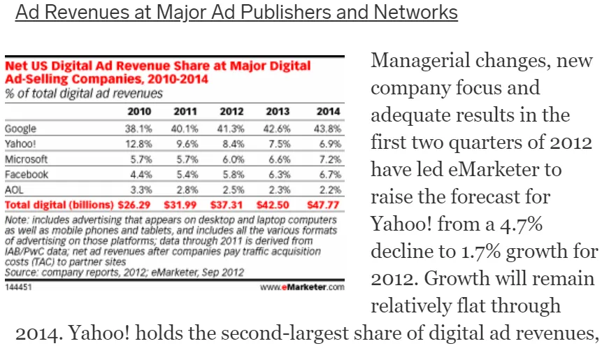

## Conclusión

Los monopolios naturales son raros\, y la regulación suele perjudicar más de lo que ayuda a solucionarlo

## ¿El ganador se lo lleva todo\?

Josh Breinlinger\, inversor de capital riesgo en Turtle Ventures\, tiene una breve publicación en su web sobre [how most marketplaces are not "winner takes all":](https://acrowdedspace.com/post/642666403989684224/winner-take-all-or-not 'win')

Tiendo a estar de acuerdo\. Siempre oímos hablar de \"el ganador se lo lleva todo\"\. Lo que plantea la pregunta\, ¿por qué no hay más monopolios\?

\"Pero espera\, ¿no hay montones de monopolios\?\"

Definido como tener un solo jugador con toda la parte\, no estoy seguro de que haya alguno\.

Definido por tener a unos pocos jugadores con gran parte de la cuota \- Claro\, pero ¿no estamos cambiando significativamente la definición entonces\?

\"Eso es solo semántica\, por monopolio todo el mundo sabe que en realidad nos referimos a más de un jugador\, con menos que todo el mercado\, pero con un número mayor\"

Bien\, usemos esa definición\, o algo como la de la Comisión Federal de Comercio de EE\. UU\. ["with significant and durable market power"](https://www.ftc.gov/tips-advice/competition-guidance/guide-antitrust-laws/single-firm-conduct/monopolization-defined 'monopoly') [^1]\. Monopoly \- [I know it when I see it](https://en.wikipedia.org/wiki/I_know_it_when_I_see_it 'wiki')\.

El problema de tener definiciones vagas es que lleva a suposiciones diferentes y\, por tanto\, a conclusiones distintas\. Lo que es obviamente correcto para ti está obviamente mal para otra persona\. Si ni siquiera podéis poneros de acuerdo sobre cuál es el problema\, ¿cómo lo solucionáis\?

Aquí está Ben Evans sobre el tema\:

Cuanto más difícil sea empezar\, más fácil será para las empresas consolidadas crecer y mantener la cuota de mercado\.

Históricamente\, las barreras físicas eran la principal limitación\. ¿Entrar en el ferrocarril\? Bueno\, tendrás que poner vías\. ¿Entrar en el sector marítimo\? Necesitarás barcos\. ¿En la época medieval y tratando de establecer una ruta comercial\? Necesitarás carruajes\, mercenarios y [maps](https://www.visualcapitalist.com/medieval-trade-route-map/ 'map')\.

Mucho de eso se ha abstraído últimamente\, como nuestra discusión sobre [abstraction in computing](/writing/plaid 'abstract')\. Muchas empresas pueden dar por sentada la capa física y escalar más rápido y a menor coste\.

Lo que no ha cambiado son las barreras regulatorias\. Hemos superado a la naturaleza\, pero no hemos superado al hombre\. Tampoco creo que lo hagamos\, ya que las reglas siempre formarán parte de la sociedad\.

Estaba buscando ejemplos de monopoly y me encontré con el [Open Markets Institute,](https://www.openmarketsinstitute.org/learn/monopoly-by-the-numbers 'omi') que funciona para \"exponer los peligros de la monopolización\.\" Aquí tienes algunos de los monopolios sobre [their list:](https://www.openmarketsinstitute.org/learn/monopoly-by-the-numbers 'monopoly')

1. Empresas farmacéuticas
2. Alcohol
3. Gafas
4. Publicidad en Internet
5. Libros

La industria farmacéutica\, el alcohol y las gafas son industrias muy reguladas\, lo que no ayuda a que la competencia empiece\.

En cuanto a la publicidad\, todos decimos que las principales empresas tienen ahora una ventaja insalvable\, pero si lo hubiéramos dicho de las cinco principales empresas hace una década [we'd have been wrong on 3 out of 5 names.](https://www.emarketer.com/Article/US-Digital-Ad-Spending-Top-37-Billion-2012-Market-Consolidates/1009362 'ad') Creo que es demasiado difícil decir que los \"monopolios\" actuales serán los mismos en el futuro\.

Probablemente haya un contraargumento más fuerte a favor de las ventas de libros online\. Pero\, por otro lado\, esa no es la única forma de comprar libros\. A primera vista\, parece que el mundo de la física vuelve a entrar en juego\: espacio limitado para contenido ilimitado\.

Mi punto hoy no es que la regulación sea mala\: si no fuera así\, seguiríamos teniendo trabajo infantil\. Sin embargo\, todos los problemas que afrontan son complejos\, y regular sin directrices claras y conocimiento suele perjudicar más que ayudar\. Se necesita regulación\, pero por parte de personas que entiendan las complejidades\, no [wonder how Facebook makes money](https://www.youtube.com/watch?v=n2H8wx1aBiQ 'ads')\.

Para dar un ejemplo más concreto\, consideremos el RGPD\, una regulación de privacidad de datos en Europa\, y la causa de todas esas molestas notificaciones de cookies al navegar por la web ahora\. La privacidad de los datos es un buen concepto y se puede hacer más en ese ámbito\.

¿Los mayores beneficiarios del RGPD\?

[Google and Facebook.](https://www.wsj.com/articles/gdpr-has-been-a-boon-for-google-and-facebook-11560789219 'goog')

¿Los mayores perdedores\?

Pequeñas empresas que no pueden permitirse los costes legales de cumplir con la normativa\. Además de ti\, yo y todos los demás que ahora tienen que lidiar con ventanas emergentes\.

Necesitamos tanto entender el problema como encontrar soluciones para afrontarlo\. Ahora mismo\, creo que demasiada gente ha saltado a las soluciones\, sin antes definir qué creen realmente que es el problema\. Y si no estamos de acuerdo en eso\, no es de extrañar que tengamos resultados tan malos\.

[^1]: Creo que en la práctica ha sido difícil perseguir casos de monopolio con \< 50\% de cuota de mercado\, así que la gente ha estado usando eso como referencia\.
