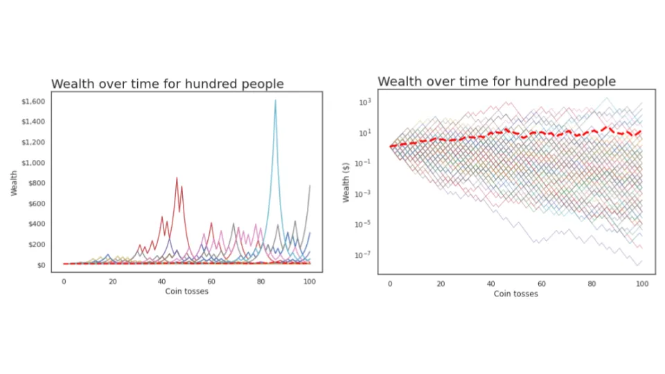

## Conclusión

Saber si un proceso es ergódico o no ergódico es fundamental para saber cuánto riesgo asumir\. Invertir y la riqueza son procesos no ergódicos\, lo que implica que nuestras primeras ideas sobre los valores esperados son muy erróneas\.

---

He oído hablar de [ergodicity](https://en.wikipedia.org/wiki/Ergodic_process 'wiki') antes\, pero no pude entenderlo del todo hasta que lo vi [this video](https://www.youtube.com/watch?v=VCb2AMN87cg 'youtube') por Ergodicity TV\. Es un concepto importante\, pero parece más conocido en física que en finanzas\. Quiero intentar explicarlo con mis propias palabras a continuación\.

Estamos familiarizados con diferentes tipos de \"promedios\"\: media\, mediana\, modo [^1]\. Centrémonos en la media de hoy\, y tomémosla como el valor esperado de algún evento aleatorio [^2]\. **La forma en que definimos el valor esperado puede darnos resultados muy diferentes\, cambiando nuestra mentalidad sobre la atractividad de las apuestas y cuánto apostar\.**

**La ergodicidad significa que la media del conjunto es la misma que la media temporal\.** Que algo no sea ergódico significa lo contrario\, que la media del conjunto no es la media temporal\.

Sí\, no estoy seguro de qué significa conjunto y tiempo aquí [^3] Cualquiera de las dos\, así que veamos un ejemplo de lanzar una moneda\.

Supongamos que un tipo cualquiera lanza una moneda 5 veces\, sacando cara y cruz\. Podemos calcular el tiempo medio para esta simulación obteniendo el número medio de caras para una persona a lo largo de un periodo de tiempo\. Hay 3 caras de 5 lanzamientos\, así que son 0\,6 caras \(3 dividido entre 5\)\.

Supongamos que conseguimos que unas cuantas personas más lanzan monedas\. Obtenemos algo como abajo\, donde represento cara como 1 y cruz como 0 por comodidad\:

Aquí podemos usar dos tipos de promedios\. El primero es el promedio temporal anterior\, donde obtenemos el **Promedio durante un periodo de tiempo para una persona\.**

La segunda es la media de conjunto\, donde obtenemos el **Promedio durante un periodo de tiempo para varias personas\.**

La gran pregunta que la ergodicidad intenta responder es\: **¿Deberíamos esperar que estas dos medias sean las mismas a largo plazo\?**

Si pensamos un rato\, podremos razonar que deberíamos\, en este ejemplo\. Un lanzamiento de moneda es aleatorio y no depende del resultado anterior\. La media conjunta es la misma que la media temporal a largo plazo\. Con suficientes lanzamientos de moneda\, esperaríamos que estas medias fueran 0\,5 [^4] \.

Fueron muchas palabras para mostrar algo que probablemente ya creías\, así que ¿por qué creo que esto es tan importante\?

Vamos a construir sobre el ejemplo\, haciendo que la gente apueste en el lanzamiento de la moneda\. Todos empiezan con 1 \$\, obtienen un 50\% de beneficio si ganan y pagan el 40\% de su apuesta si pierden\. Por ejemplo\:

En lugar de los resultados del lanzamiento de la moneda en sí\, pensemos en la riqueza que tendrá cada persona\. Si representamos esto\, **¿Deberíamos esperar que el promedio temporal de la riqueza de una persona sea igual al promedio conjunto de la riqueza de todos a largo plazo\?**

O dicho de otra manera\: **¿Querrías apostar así\?** ¿Si se lo ofrecen repetidamente\?

El valor esperado de una apuesta así es 50\% por \$1\,50\, más 50\% por \$0\,60\, para obtener \$1\,05\. Con un valor esperado positivo\, parece que deberíamos seguir apostando\. Vamos a simular algunos lanzamientos de moneda para ver qué pasa\.

He programado una simulación de lanzar monedas en esto [jupyter notebook](https://colab.research.google.com/drive/1KI_PPhtXVQDfVGRFbi4pl0ZIhL2Y4x2X?usp=sharing 'colab') [^5] \. Siguiendo el escenario anterior para una persona que lanza 100 monedas\, observamos que su riqueza aumenta hasta 4 dólares\, antes de caer prácticamente a 0 dólares\.

Hmm\, quizá nos haya tocado un escenario de mala suerte\. Repitamos esto con 100 personas\, aún haciendo 100 lanzamientos de moneda\. También calcularé la riqueza media \(media conjunta\) en cada lanzamiento de moneda y la representaré con una línea roja discontinua [^6] \.

Los dos gráficos que aparecen a continuación son idénticos en cuanto a datos\; Solo estoy reescalando con un eje logarítmico para una mejor visualización\.

Está ocurriendo algo extraño\. Vemos a un afortunado excesivo que llegó a 1\.000 dólares en riqueza\, y también vemos que la riqueza media \(línea roja discontinua\) sigue aumentando\. Sin embargo\, fíjate que **¡La mayoría de estas personas perdieron dinero\!** En esta simulación\, 94 de las 100 personas que jugaron acabaron con menos del \$1 con el que empezaron\.

Si no estás convencido\, el cuaderno tiene un ejemplo con mil personas\; también puedes ajustar los parámetros si quieres\.

Lo que estamos viendo es que\, aunque el valor esperado es positivo y la media del conjunto aumenta\, el promedio de tiempo para una persona suele estar disminuyendo\. **La media de todo el \"sistema\" aumenta\, pero eso no significa que la media de una sola unidad aumente\.** Los grandes valores atípicos sesgan la media\, pero la mayoría de la gente está perdiendo\.

Esto merece ser repetido\. **Incluso cuando el valor esperado de una apuesta así fue positivo\, 94 de cada 100 personas que jugaron en un partido así pierden la mayor parte de su dinero\.** Esos resultados ocurren dentro del mismo sistema\, pero te dan la conclusión opuesta sobre si quieres jugar o no\.

La riqueza en este escenario es no ergódica\, ya que la riqueza en el futuro depende de la riqueza pasada \(dependencia del camino\)\. El promedio del conjunto no es igual al promedio temporal\.

**La riqueza en general también es no ergódica**\, dado que el rendimiento de tu cartera de inversión mañana depende del tamaño y la asignación actuales de la cartera actual\.

En la práctica\, esto significa para invertir es\:

1. **Ten cuidado con cómo aplicas los valores esperados\,** Ya que quieres saber si esa es la media de todo el sistema\, o qué debería esperar una persona como tú de media\. Si tienes probabilidades en mente\, modelalas y observa qué implica eso

2. **Lo que puede parecer atractivo al principio suele ser terrible\,** ya que un pequeño número de valores atípicos sesga la media hacia arriba [^7]\.

3. **Si no te gustan las probabilidades que ves\, prueba a cambiar el juego\.** La publicación anterior la hice en [the Kelly Criterion](/writing/kelly 'kelly') Habla de dimensionar tu apuesta\, lo que influirá en cuánto ganas o pierdes\.

En resumen\, la ergodicidad se refiere a si la media a largo plazo en muchas simulaciones es la misma que la media en una simulación\. Cuando las cosas no son ergódicas\, y muchas cosas en la vida no lo son\, hay que tener mucho cuidado con la cantidad de riesgo que asumes\.

## Lecturas recomendadas

1. [Ergodicity](https://squidarth.com/math/2018/11/28/ergodicity.html 'squid')
2. [What are we weighting for?](https://researchers.one/articles/20.04.00012 'paper')
3. [The ergodicity problem in economics](https://www.nature.com/articles/s41567-019-0732-0 'paper')

Gracias a [Tyler Richards](http://www.tylerjrichards.com/)\, y miembros del Centro Recursivo Vaibhav Sagar\, Sidharth Shanker\, SengMing Tan\, Alex Yeh para compartir su opinión sobre esto\.

[^1]: [In case you need a refresher](https://www.purplemath.com/modules/meanmode.htm)\, la media es la media donde sumas todos los números y divides por el número de números\, la mediana es el número medio\, y el modo es el número más común

[^2]: Puede que sí [conflating mean and expected value here](https://stats.stackexchange.com/questions/30365/why-is-expectation-the-same-as-the-arithmetic-mean 'stats')\, pero creo que podemos simplificar esta explicación

[^3]: Hmm

[^4]: 50\% de probabilidad de que salga cara y 50\% de que salga cruz\, por definición

[^5]: Alguien debería revisar mi código\. También creo que hay una forma más elegante de codificarlo en menos líneas\.

[^6]: Esto no es realmente la media teórica del conjunto\, que sería 1\,05 elevado a la potencia del número de lanzamientos de moneda y aumentaría linealmente\. Aquí simplemente hago la media de los resultados reales\, por eso la línea no aumenta continuamente \(aumenta de forma monótona\)

[^7]: La riqueza tiene un piso de \$0 pero no un tope\, así que creo que la media también es ilimitada
