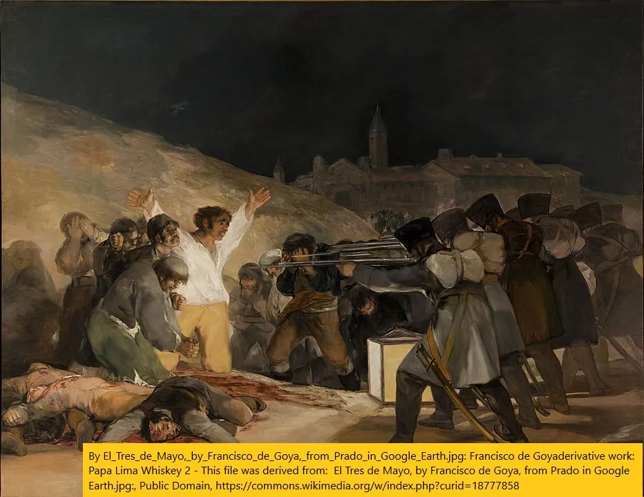

Empecé a aprender historia del arte hace un tiempo\, para entender mejor lo que veía en los museos\. Eso se convirtió en aprender a dibujar\, para apreciar mejor la historia del arte\. Con la reciente tendencia de los tokens no fungibles \(NFTs\)\, quería compartir lo que he aprendido sobre el arte hoy en día y luego hablar sobre los NFTs en una publicación posterior [^1]\.

## 1\. ¿Qué es el arte puro\?

Principalmente he estado usando [smarthistory](https://smarthistory.org/ 'smart') aprender historia del arte\, aunque el vídeo que impulsó mi viaje fue [this MoMa one on how to paint like Picasso](https://www.youtube.com/watch?v=rGZYfSzvPvs&list=PLfYVzk0sNiGEZXlIltPP7Yy_s5gTM7hf8 'moma')\.

También he hablado de historia del arte antes con artículos sobre [Picasso](/writing/picasso 'picasso') y [Manet](/writing/art 'manet') Si quieres\, échales un vistazo\.

**Lo más importante que aprendí sobre historia del arte es ser abierto de mente\.**

Esto es lo que quiero decir\:

Supongamos que alguien se te acercara y dijera\: \"Estoy harto del arte falso de hoy\, quiero ver arte real y puro\.\"

¿Qué les mostrarías\?

Quizá se los enseñes [The School of Athens,](https://en.wikipedia.org/wiki/The_School_of_Athens 'school') una pintura de Rafael durante el apogeo del Renacimiento italiano en el siglo XVI\. Con su representación realista de filósofos famosos y su uso de [linear perspective](<https://en.wikipedia.org/wiki/Perspective_(graphical)> 'perspective') para que todo parezca tridimensional\, el famoso fresco se considera una obra maestra que ejemplifica el Renacimiento\.

O quizá rechazarías los temas históricos\, pensando que el arte no debería necesitar una lección moral asociada\. En cambio\, muestras una pintura del siglo XIX de Dominique Ingres que es puro placer y fantasía\, afirmando que el arte real no tiene por qué ser realista\. [La Grand Odalisque looks realistic on first glance, but taking a closer look shows that the spine is weirdly long, and the back leg is attached at a weird angle.](https://en.wikipedia.org/wiki/Grande_Odalisque 'wiki')

Se podría decir que el placer es superficial\, y que es más puro conmemorar el sufrimiento moderno\, como en el siglo XIX de Goya [The Third of May](https://en.wikipedia.org/wiki/The_Third_of_May_1808 'may')\. Es menos realista que las obras anteriores\, con las figuras más planas y menos terminadas\. Tampoco es ya una fantasía\, ya que representa una tragedia real de la época de Goya [^2]\. Fue un cambio tan grande respecto a la tradición anterior que se la ha llamado \"una de las primeras pinturas de la era moderna\"\.

Pero\, ¿por qué limitar la pintura a mostrar solo una instantánea en el tiempo\? ¿Y si\, en cambio\, vieras un objeto desde todo tipo de ángulos e intentaras plasmarlo en el lienzo plano\? Piensa en el bullet time de Matrix\, pero como pintura\; ¿no sería eso más fiel al objeto\? Mostrar una pieza cubista como la de Picasso en el siglo XX [Girl with a Mandolin](https://www.pablopicasso.org/girl-with-mandolin.jsp 'girl') sería una buena elección entonces\, con su intento de mostrar a alguien en 3D desde múltiples puntos de vista sobre una superficie 2D\.

Y se podría decir que todo lo anterior es pretencioso\, y que el arte es solo colores y líneas sobre lienzo\. Mostrar a un Mondrian del siglo XX deja claro que no debemos engañarnos con el realismo\. El arte puro son formas platónicas [^3]\.

Podría seguir\; hay tantos movimientos artísticos como criptomonedas\. El punto principal que quiero destacar es que el arte es subjetivo\, y mantener la mente abierta es esencial\. Debatir si algo es arte o no es una de esas preguntas filosóficas sin respuesta\.

Muchos movimientos nuevos fueron criticados durante su época\, solo para convertirse en inspiración para generaciones de artistas posteriores [^4]\. Para muchos artistas\, empujar los límites es el objetivo\.

Está bien no gustarte algo\; todavía no entiendo la mayoría del arte contemporáneo\. Pero descartar algo solo porque no te gusta limitará tu comprensión del mundo\. Y eso no es divertido\.

## 2\. Ser flexible en el arte

También empecé a aprender a dibujar el año pasado por un par de razones\:

- Como parte de mi interminable búsqueda para dejar de ser estereotipado [^5]
- Para apreciar mejor cómo los artistas creaban su obra y distinguir entre habilidad y tonterías
- Estaba pensando en habilidades que podría trabajar durante mucho tiempo y en las que podría continuar hasta la vejez
- Añadir a mi caja de herramientas formas de comunicarme y expresarme

Empecé con [draw a box](https://drawabox.com/ 'draw')\, y luego pasó a [New Masters Academy](https://www.nma.art/ 'nma')\, que sigo usando [^6]\. Principalmente trabajo con lápiz y pluma estilográfica [^7]\.

Como apunte\, si [aphantasia is real](/writing/aphantasia 'abp')\, probablemente lo tenga\, ya que estoy en un 3\-4 en el examen de abajo\. No ha sido un obstáculo al dibujar desde referencias\, aunque puede serlo cuando dibujo desde la imaginación\.

Aproximadamente un año de práctica diaria y 600 hojas de papel después [^8]\, aquí tienes una foto de progreso\. Y sí\, se supone que son la misma persona\:

Y esto es lo que he aprendido en el camino\:

**Dibujar es una habilidad\,** Y el talento está sobrevalorado\. No tengo talento\, como se puede ver en la primera foto\. Pero la práctica regular dará resultados\, y poco a poco puedes mejorar con el tiempo\. El talento ayuda\, pero no es el único factor\.

**Estás dibujando\, no copiando\.** El dibujo se mantendrá independiente cuando termines\, ya que la gente no verá la referencia\. Puedes y debes hacer cualquier cambio que quieras para una pieza más interesante\. Me ha hecho perder el interés en las piezas hiperrealistas\; ¿por qué no simplemente hacer una fotografía\? [^9]\.

**Aprendes herramientas\, no reglas\.** Las lecciones te enseñan formas de hacer las cosas\, pero no la única manera de hacerlo\.

**Las cosas pequeñas marcan una gran diferencia\.** Dibujar a lápiz es distinto de dibujar a lápiz \(¡pruébalo\!\)\. Pequeñas marcas en un retrato pueden cambiar cómo se siente todo el dibujo\.

**Ir con prisa arruina el trabajo\.** Cada vez que intentaba apresurarme con una pieza\, salía mal\. Las mejores piezas que he hecho las he construido con paciencia en capas\, aunque tardar mucho no garantiza la calidad\. Y normalmente se requieren varios bocetos antes de conseguir una buena pieza\.

Por muy intimidante que fuera\, me alegro de haber empezado a dibujar\. Puede que nunca sea un experto\, pero es muy divertido [^10]\! Y todos podríamos aprender cosas más divertidas\.

## Otros

1. ["San Francisco bans affordable housing"](https://johnhcochrane.blogspot.com/2021/04/san-francisco-bans-affordable-housing.html 'jc')
2. ["What I talk about when I talk about Chinese tech"](https://lillianli.substack.com/p/what-i-talk-about-when-i-talk-about 'll')
3. [Best practices for writing SQL queries](https://www.metabase.com/learn/building-analytics/sql-templates/sql-best-practices 'sql')\. Es en parte un anuncio de metabase\, pero hay buenos consejos ahí
4. [Angel investing, beginner's reading list](https://alltheangels.substack.com/p/-angel-investing-beginners-reading 'angel')
5. [How the BBC makes Planet Earth look like a Hollywood movie](https://www.youtube.com/watch?v=qAOKOJhzYXk 'yt')\, YouTube

[^1]: Sí\, he perdido mi fecha límite para terminar todo en una sola entrada\. En mi defensa\, he estado ocupado picando\.

[^2]: La pintura muestra la represalia francesa contra una rebelión española

[^3]: Es decir\, Mondrian piensa que deberíamos simplemente mirar y disfrutar las líneas\, el color y las formas tal y como son\, porque esa es la esencia de lo que es dibujar\. Pretender que las cosas parezcan realistas es una farsería

[^4]: Dominique Ingres\, Monet\, Picasso fueron todos controvertidos\. Quizá el arte sea controversia\.\.\.

[^5]: Con éxito mixto\, la verdad\.

[^6]: Yo usaba [quickposes](https://quickposes.com/ 'qp') para practicar también gestos

[^7]: Uso una gama de Staedtler Mars Lumograph desde 3H hasta 8B \(aunque no uso oscuros tan a menudo\)\, una goma de borrar amasada\, un muñón y un Pilot Metropolitan de punta fina\. Hice los ejercicios de drawabox con lápiz\, aunque se supone que hay que usar un rotulador\; Simplemente me gusta más el lápiz\.

[^8]: Principalmente practiqué en un cuaderno de bocetos de 200 páginas\, y pasé por 3 de esos más un poco más\. Para quienes estén realmente interesados por alguna razón [here's a link](https://drive.google.com/drive/folders/1JuCf-pNB8amh2xsFSYmXyuNWUd5oBv8j?usp=sharing 'link') a todos los bocetos que he hecho\. Sin embargo\, las páginas están desordenadas porque tuve dificultades al escanearlas\. Cuando digo práctica diaria\, hubo días en los que pasé 10 segundos dibujando algo\, y otros días en los que pasé horas\.

[^9]: Puedes apreciar la habilidad de algo sin gustarte tanto como antes\.

[^10]: Una ligera correlación con cómo ahora puedo garabatear en reuniones aburridas\.
