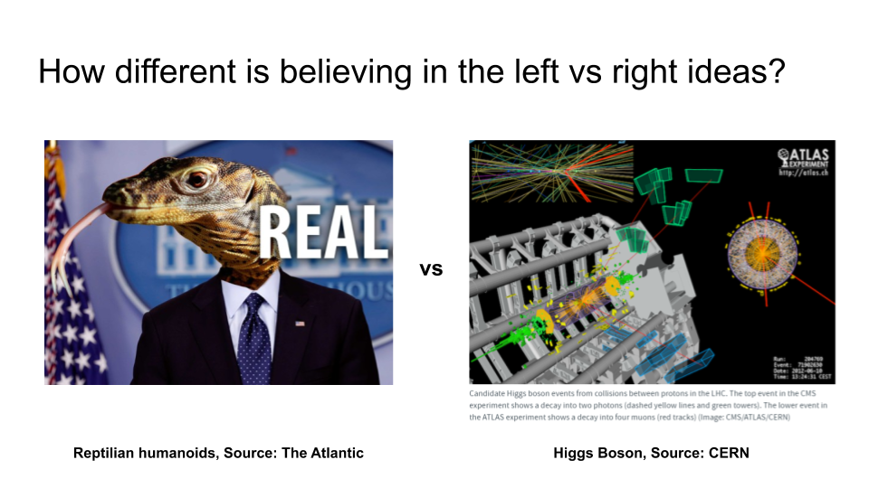

Pourquoi croyons\-nous en ce que nous faisons \? J’ai déjà écrit que les gens ne réfléchissent pas assez à ce en quoi ils croient\, ou ne savent même pas quelles croyances ils ont\. Supposons que nous ayons identifié nos croyances fondamentales\, qu’est\-ce qui nous a conduits à développer et maintenir ces croyances \? Croire en le [flying spaghetti monster](https://www.venganza.org/ 'all hail the noodly one') différent de croire en [ice spikes on Jupiter's moons?](https://www.newscientist.com/article/2181727-jupiters-moon-europa-may-have-a-belt-of-15-metre-tall-ice-spikes/ 'europa hypothesis')

Il existe de nombreuses croyances « folles » dont le grand public se moquerait aujourd’hui\. [Flat earthers.](https://en.wikipedia.org/wiki/Modern_flat_Earth_societies 'wiki page') [Moon landing deniers.](https://en.wikipedia.org/wiki/Moon_landing_conspiracy_theories 'another wiki page') [Shape-shifting lizard people.](https://en.wikipedia.org/wiki/Reptilian_humanoid 'more wiki pages') [^1] Pourtant\, la plupart des gens ne trouvent pas ça fou [70% of Americans](http://www.pewforum.org/religious-landscape-study/ 'religious breakdown') croire en une forme d’être omnipotent régnant sur l’existence\, ni que la plupart des gens ne croient pas [^2] Je pense que la vie implique une sorte de chaîne de montage microscopique [unzipping, squishing together, and re-zipping](https://www.youtube.com/watch?v=yqESR7E4b_8&t=1m50s 'DNA replication video')\. Ce qui m’intéresse aussi\, c’est comment chaque foi aura des croyants fervents prêts à défendre leurs croyances contre les hérétiques\. Notez ici que j’utilise le mot « foi » de manière libérale\, dans tous les domaines religieux\, scientifiques\, philosophiques ou autres\. Voyez comment les discussions peuvent devenir animées sur la politique\, la religion ou le meilleur magasin de bagels de New York\.

Pourquoi alors croyons\-nous aux problèmes qui forment une grande partie de notre identité \? Je ne suis pas sûr d’avoir une bonne raison\. Pour beaucoup\, l’environnement dans lequel ils ont grandi détermine la plupart de leurs croyances\. Il y a une corrélation entre [having religious parents and becoming religious](http://www.pewforum.org/2016/10/26/links-between-childhood-religious-upbringing-and-current-religious-identity/ 'religious upbringing')\, quelques preuves que [political views also transmit to children](https://www.researchgate.net/publication/231788296_Politics_Across_Generations_Family_Transmission_Reexamined 'politics across gens') [^3]\, et même une possibilité [your career choice might not really be your own.](https://waitbutwhy.com/2018/04/picking-career.html 'was it really me?') C’est problématique si nous préférons vivre selon nos propres choix et non par défaut\. [Unexamined life not worth living and all that.](https://www.theguardian.com/theguardian/2005/may/12/features11.g24 'unexamined life')

Les croyances peuvent aussi évoluer avec le temps\, selon le nombre de personnes autour de vous qui partagent un point de vue similaire\, par exemple [societal views on homosexuality.](http://www.pewforum.org/fact-sheet/changing-attitudes-on-gay-marriage/ 'changing attitudes') Je suis curieux de savoir comment ces changements ont eu lieu\, j’aimerais en savoir plus à ce sujet\. Il existe des preuves que ['tipping points'](https://www.asc.upenn.edu/news-events/news/research-finds-tipping-point-large-scale-social-change 'tipping point research') surviennent lorsque ['critical masses'](https://fs.blog/2017/07/critical-mass/ 'fs blog') des gens finissent par croire au même récit\. Si c’est le cas\, sommes\-nous simplement soumis aux caprices d’un petit groupe d’influenceurs qui fixe nos normes culturelles et nous explique pourquoi nous voulons cela \?

À ce stade\, certaines personnes diront qu’elles font exception\, qu’elles ont bien sûr examiné leur vie\, qu’elles ne suivent pas aveuglément la majorité\, et qu’elles ont confiance en leurs convictions grâce au processus fondé sur des preuves qu’elles ont adopté\. Allez la science \! Certains citeront Carl Sagan\, qui dit\, [“Why would we commit belief when the evidence is so meager?”](https://www.wired.com/story/sagan-old-interview/ 'carl sagan') Une approche fondée sur des preuves avec [bayesian inference](https://brohrer.github.io/how_bayesian_inference_works.html 'bayesian inference') Les cadres semblent être une bonne approche\, où l’on continue à mettre à jour son degré de confiance dans un sujet face à de nouvelles preuves qui prouvent ou infirment votre théorie\. Moi\-même\, j’essaie de maintenir mes convictions de cette manière\, ce qui sera le sujet d’un autre article\.

Pourtant\, il reste un problème si nous choisissons l’approche fondée sur des preuves\. Comment évaluons\-nous les preuves rencontrées \? Le milieu scientifique aime vanter les vertus de la méthode scientifique\, où l’on teste et reproduit les résultats pour faire passer un message sur le fonctionnement du monde\. En d’autres termes\, c’est le fait qu’une nouvelle découverte doive se répliquer et se généraliser dans un ensemble de données plus large qui la qualifie de rigoureuse scientifiquement\. Si je le voulais\, je pourrais théoriquement vérifier comment fonctionne un circuit électrique\, comment j’ai besoin de nourriture pour survivre\, ou comment [mixing acetylene and oxygen is not a good idea.](https://darwinawards.com/darwin/darwin2018-15.html 'darwin award')

Cependant\, si certaines expériences sont facilement reproductibles\, d’autres ne le sont pas\. Dans une certaine mesure\, nous devons encore prendre une grande partie de la science que nous lisons sur la foi également\. Quand j’ai lu qu\'« une nouvelle particule dans la région de masse autour de 125 GeV » a été découverte dans un [huge science experiment involving colliding subatomic particles at high speed,](https://home.cern/science/physics/higgs-boson 'cern') et que cette particule est fondamentale pour l’univers\, je n’ai pas d’autre choix que de croire que c’est vrai\. Je ne pourrai jamais reproduire une expérience comme celle\-là\. Il est même peu probable que plusieurs réplications de cette expérience aient lieu ailleurs dans le monde\. Après tout\, combien d’accélérateurs de particules similaires seront jamais construits de notre vivant \? Je trouve cela problématique\, même si je ne sais pas comment le résoudre\. Mon propos ici n’est pas de décourager la pensée fondée sur des preuves\, mais de souligner que nous semblons devoir toujours faire confiance aveuglément à quelque chose ou à quelqu’un\. [^4]

Je suppose\.\.\. Je veux croire \?

[^1]: Si tu es vraiment là\-bas\, sache que je suis un fier soutien du royaume des lézards si jamais viendra le moment de conquérir le monde\. Vive la reine Diplodocus et tout ce qui se passe\.

[^2]: Je n’ai pas trouvé de statistique sur « le nombre de personnes croyant à l’ADN »\, mais j’ai trouvé ceci [2005 poll](https://news.gallup.com/poll/19915/americans-conclusive-about-dna-evidence.aspx 'gallup poll') qui affirmait que 80 \% des gens trouvaient les preuves ADN fiables\. Les articles récents semblent tous revenir à ce sondage sans en faire un autre\, ce que je trouve inquiétant\.\.\.

[^3]: Comme pour presque tous les articles de sciences sociales de nos jours\, il semble y avoir des inquiétudes quant à la reproduction de ce sujet\. Le point de vue alternatif semble prôner que les groupes de pairs\, en particulier à l’université\, ont [higher influence.](https://www.theatlantic.com/politics/archive/2014/05/parents-political-beliefs/361462/ 'parents or peers?') Quoi qu’il en soit\, les deux font toujours partie de l’environnement que vous avez traversé\.

[^4]: Le coût des croyances pourrait aussi faire une différence\, comme décrit dans ce tweet [here](https://twitter.com/BigAltheDukie/status/1096465815753256960 'cost of beliefs')\. Si le coût est élevé et immédiat\, nous n’avons pas d’autre choix que de croire que c’est vrai\, par exemple en heurtant quelque chose\. Si le coût est faible et retardé\, nous sommes libres de croire en ce que nous voulons\, par exemple l’au\-delà\, comment économiser pour la retraite\, comment ce dernier cookie ne compte pas pour votre consommation quotidienne puisqu’il est passé minuit
