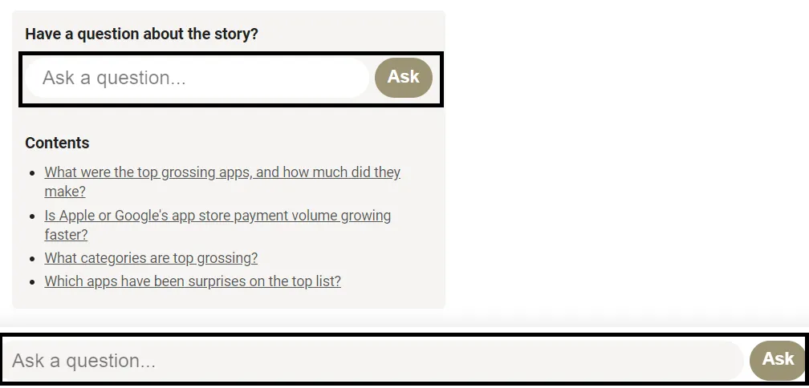

Un ami a récemment lancé un nouveau projet\, [Query News](https://query.news/ 'Query')\. Voici un aperçu du projet et quelques suggestions que j’ai\.

## Walkthrough

Qu’est\-ce que Query essaie de devenir \? [Based on their own words:](https://query.news/s/we-launched-kinda)

> Serait\-il exact de décrire cela comme Quora pour des nouvelles d’actualité \?

> À peu près \! Sauf que je ne suis pas vraiment sûr de ce que ça essaie de devenir\. Mais Quora est clairement un bon point de départ\. Le principal point sur lequel nous hésitons avec Quora\, c’est le modèle basé sur des réponses concurrentes versus la collaboration sur les réponses\. Je pense qu’il serait plus logique d’encourager davantage la collaboration ici\. On verra bien \!

L’intention pour l’instant est donc d’avoir un format Q\&A pour les événements d’actualité au fur et à mesure\. Les gens apporteront des questions sur un sujet\, et quelqu’un \(qui \?\) y répondra\.

La page d’accueil est simple\, ordonnant les questions dans l’ordre chronologique\, avec le jour le plus récent en premier\. Je ne sais pas comment les questions sont triées dans la journée même\. Je suppose que l’ordre est corrigé une fois les questions postées\, puisque le calendrier indiqué pour les mises à jour ne semble pas affecter l’ordre\. Le site fonctionne bien aussi sur mobile\.

Cliquer sur les sujets individuels vous mène à une page de questions\-réponses plus détaillée sur le sujet\. Chaque page de questions\-réponses possède sa propre URL\. La page contient un court résumé du sujet d’actualité\, la citation de la source\, suivi d’une table des matières pour les questions\, ainsi que des questions elles\-mêmes\.

Il y a plusieurs suggestions pour poser une question\, ce qui est aussi simple que de la taper dans le champ de la question\. Autant que je puisse en juger\, il n’y a pas de modération immédiate sur la question\, et votre question est immédiatement publiée sur la page\. Le site facilite la pose d’une question\.

Par exemple\, lorsque j’ai posté la question ci\-dessous\, elle est apparue en bas de la liste des questions une fois la page rafraîchie\, ce que la page a fait automatiquement après publication\.

Il ne semble pas que vous puissiez répondre directement vous\-même pour le moment\, mais vous pouvez « suggérer une mise à jour » qui envoie votre commentaire à un éditeur \:

Vous pouvez consulter vous\-même la liste actuelle des sujets et des questions [here](https://query.news/ 'Query')\, et voyez s’il y en a un sur lequel vous souhaitez commenter\. Cela semble être une idée intéressante \! La plupart des actualités sont à sens unique\, cherchant à diffuser un message au grand public\. La section des commentaires en ligne est généralement un désastre\. En faisant de la discussion le centre du site plutôt qu’un produit ajouté à la va\-vite\, cela mènera à des cas d’usage plus productifs\. Si vous avez déjà lu quelque chose et vous êtes demandé « mais qu’en est\-il de X »\, Query vous serait utile\.

À quoi cela pourrait\-il ressembler à grande échelle \? Cela pourrait comporter des sections séparées par domaine thématique\, avec des comptes vérifiés publiant de nouveaux articles\, recevant des questions de lecteurs intéressés\, puis répondant à ces questions\. Cela créerait Requête _Le site_ Pour des informations en temps réel sur une variété de sujets\, où vous pouvez creuser davantage et enquêter sur l’histoire au fur et à mesure de son évolution\.

Passons aux questions et suggestions \!

## Questions

1. En quoi cela diffère\-t\-il de Quora\, [Hacker News](https://news.ycombinator.com/ 'HN')\, ou [Reddit](https://www.reddit.com/)\?
   - Il semble qu’il y ait une intention d’être plus collaborative que sur Quora \(voir ci\-dessus\)\, donc je suppose qu’ils créeront une fonctionnalité permettant à plusieurs éditeurs de répondre à une question
   - Si c’est le cas\, je suppose qu’ils n’autoriseront pas les conversations en fil de discussion\, mais qu’ils regrouperont tout en une seule réponse par question\. Ce serait différent de Hacker News et Reddit
   - Peut\-être pouvons\-nous considérer cela comme un Wiki Quora X pour les actualités au fur et à mesure \?
2. Comment vont\-ils étendre cela \?
   - Modérer les questions \(et les réponses\, une fois cette fonctionnalité mise en place\) nécessitera des éditeurs manuels\, et tous les sites ne disposent pas d’un [Steven Pruitt](https://www.cbsnews.com/news/meet-the-man-behind-a-third-of-whats-on-wikipedia/ 'Steven')\. Certains spams peuvent probablement être supprimés automatiquement\, mais il y aura sans doute un élément de modération manuelle
   - Comment décideront\-ils qui répondra aux questions et qui a suffisamment d’expertise dans un domaine pour commenter \?
3. Quelles sont les incitations pour toutes les parties prenantes \?
   - Pour les fondateurs\, [I think they want to create an experiment and see if there's demand from people to read news in a different format](https://query.news/s/we-launched-kinda/q/what-are-your-short-term-goals-for-the-query#q-52 'ST goals')
   - Pour les questions\, obtenir plus d’informations \(idéalement moins biaisées que les nouvelles normales\) sur un sujet répondu par un expert
   - Pour les futurs répondants\, pour se construire une réputation \? De la bonne volonté \? De la construction de statut \?
4. S’ils permettent aux autres de répondre aux questions\, cela signifie\-t\-il que les gens devront créer des comptes au fil du temps \?
   - Peut\-être que les questions peuvent rester libres et anonymes\, mais peut\-être que les comptes approuvés peuvent modifier les réponses \?
   - L’intention est\-elle de présenter une seule voix unifiée « Interrogation des actualités » pour les réponses ou de montrer plusieurs points de vue sur une question \?

5. Y aura\-t\-il des fonctionnalités d’image \?

6. Faudra\-t\-il aussi modérer la qualité des réponses \?
   - Je ne sais pas si avoir des systèmes de votes positifs\/négatifs comme Quora ou Reddit va à l’encontre de l’objectif du site

## Suggestions

1. Immobiliser le [Query self-referential Q&A page](https://query.news/s/we-launched-kinda/ 'Query Q&A') sur la page d’accueil\. Quelqu’un qui atterrit sur la page d’accueil pour la première fois n’aura pas une bonne idée de ce que le site est censé être\. Avoir un onglet « À propos » en haut aidera probablement les gens à comprendre ce que le site essaie de faire\, et cela pourrait être un simple lien vers la page Q\&R\.

   

2. Clarifier exactement ce que sert l’option « suivre »\. Je ne sais pas si entrer mon e\-mail m’abonne à toutes les questions de ce sujet d’actualité\, à toutes les questions sur Query\, ou seulement à une question sur le sujet

   

   Même après avoir cliqué sur « suivre »\, je ne sais pas ce que l’adhésion est censée faire \:

   

3. Taguer les questions et avoir une fonction de recherche semble être utile\, voire nécessaire\, quand cela prendra de l’ampleur

4. Il y a des boutons de partage individuels pour chaque question\, mais aucun pour le sujet principal de l’actualité \?

5. Je suppose que cela fait partie de la feuille de route\, mais permettre finalement aux gens de poster eux\-mêmes des sujets d’actualité semble être une étape logique à suivre\.

6. Y a\-t\-il un moyen de le faire via un flux RSS \? Il semble qu’ils l’aient récemment mis sous forme de newsletter\.
