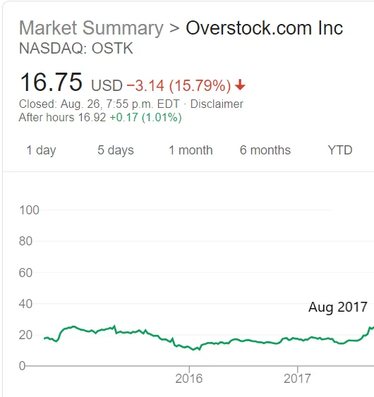
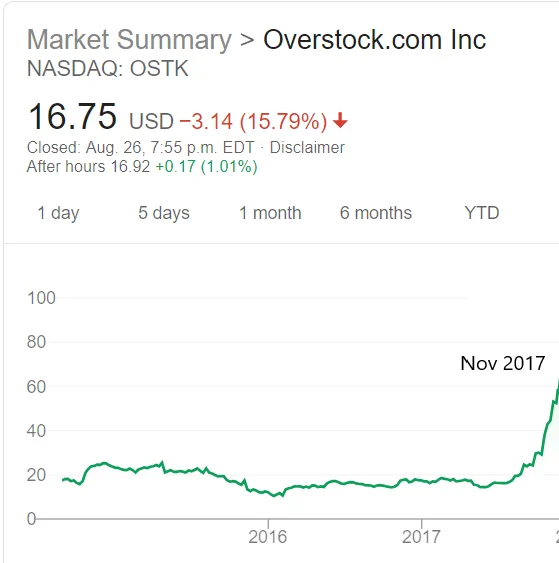

## Points à retenir

1. Trouver une paire en échange dans une bulle peut être préférable que de la vendre à découvert ou de profiter de l’élan
2. Qu’est\-ce qu’un CRM personnel et pourquoi les gens en parlent\-ils \?
3. Nous ne nous connaissons pas très bien \; comment augmenter la conscience de soi

### Bulles et espions russes

Avec toutes les actualités sur les bulles cette année\, je voulais souligner [Byrne Hobart's post about them.](https://medium.com/@byrnehobart/so-youve-spotted-a-bubble-3f2fa5cf49a9 'Bubble') [^1] Que devriez\-vous faire si vous pensez que le prix actuel d’un actif représente une bulle \? Byrne formule trois écoles de pensée ci\-dessous\. Comme toujours\, rien de tout cela n’est un conseil financier\.

> \\\[Premièrement \:\\\] L’approche courageuse\, stupide et intellectuellement cohérente\. On pourrait simplement vendre à découvert les choses\. \\\[\.\.\.\\\] C’est difficile\, cependant\, car en général\, les actifs effervescents sont tarifés de façon à obtenir des rendements plus élevés que des actifs comparables\, juste des rendements pas tout à fait suffisants pour compenser le risque\. \\\[\.\.\.\\\] Les bulles ont aussi tendance à persister longtemps\, malgré leur instabilité intrinsèque\, car elles s’auto\-alimentent partiellement\.

Shorting [^2] est sexy\, parce que tu es contrarian et que tu prends des risques théoriquement illimités pour prouver ta supériorité intellectuelle face à l’investisseur simple et idiot\. [There's even an oscar nominated movie about shorting the 2008 housing crisis](<https://en.wikipedia.org/wiki/The_Big_Short_(film)> 'movie')\. Le problème avec le short est que le timing est essentiel\. Vous pouvez avoir raison mais tôt et tout de même exploser\. Il existe de nombreux shorts célèbres qui ont perdu des milliards pour leurs investisseurs\, comme par exemple [Ackman and Herbalife](https://www.cnbc.com/2018/04/05/how-bill-ackmans-hedge-fund-empire-crumbled-in-less-than-three-years.html 'Ackman')\, [Einhorn and Netflix](https://www.forbes.com/sites/antoinegara/2019/03/05/after-horrendous-investing-run-david-einhorn-exits-billionaire-club/#3a140043498c 'Einhorn')\, ou [whoever was short squeezed by Porsche and Volkswagen in 2008.](https://www.reuters.com/article/us-volkswagen/short-sellers-make-vw-the-worlds-priciest-firm-idUSTRE49R3I920081028 'Porsche') Notez que je ne dis pas qu’Ackman et Einhorn se trompaient sur ces entreprises\. Ils pourraient encore avoir raison\, mais ils ont perdu tellement d’argent entre\-temps que c’est un point sans importance\.

Prenons Overstock\.com comme un autre exemple\. Avant leur [CEO resigned so he could let everyone know he'd dated a Russian spy,](https://www.forbes.com/sites/laurendebter/2019/08/22/the-exclusive-inside-story-of-the-fall-of-overstocks-mad-king-patrick-byrne/#176918ea53a5 'Forbes') [^3] Il essayait de sauver l’entreprise en 2017 en se tournant vers la blockchain\. Supposons que vous pensiez qu’Overstock allait aussi échouer à ce niveau\, et que vous vendiez Overstock à 20 \$ en août 2017 \:

À mesure que le cours de l’action grimpe\, vous redoutez la mise\, convaincu qu’elle ne peut pas durer\. D’une manière ou d’une autre\, elle tient\, et vous vous retrouvez devant un prix de 60 \$ en novembre 2017 \:

Oups\. Non seulement vous avez une perte papier\, mais votre exposition est un multiple de ce que vous aviez au départ et avec lequel vous étiez à l’aise\. Si vous liquidiez votre position maintenant\, vous perdiez 40 \$ \- les 60 \$ actuels moins les 20 \$ que vous aviez gagnés initialement\. Vous avez une vendetta maintenant et êtes déterminé à vendre cette action à court terme ou à faire faillite en essayant\, alors vous tenez jusqu’à l’année suivante \:

Votre courtier revient de vacances et se rend compte qu’il a oublié de vous délivrer un [margin call](https://www.investopedia.com/ask/answers/05/shortmarginrequirements.asp 'margin') tout ce temps\, et c’est maintenant en panique\. Quand vous êtes à découvert sur une action\, vous avez généralement besoin de \~130 \% de la valeur de l’action en garantie\, fonds de secours [^4]\. Quand l’action était à 20 \$\, avoir 26 \$ de côté n’était pas un problème\. Mais maintenant\, il faut 104 \$ de côté\, et le courtier veut que vous complanciennez la différence de 78 \$ \(104 \$ moins 26 \$\)\. Selon le montant d’argent que vous aviez au départ\, ces 78 \$ supplémentaires \(3 fois l’exposition initiale \!\) pourraient facilement vous anéantir\. Vous êtes obligé de liquidifier votre position et de compenser la différence en créant un Go Fund Me\.

Et puis\, bien sûr\, ceci se produit \:

L’essentiel ici\, c’est que vous aviez raison \: le pivot de la blockchain que Surstock a tenté ne fonctionnerait pas\. Mais vous vous êtes trompé sur le timing et vous avez perdu votre argent et votre réputation\. Même lorsque vendre à découvert une action est « évident »\, comme par exemple [bad quality companies changing their name to get a price bump](https://www.winton.com/longer-view/the-history-of-company-names 'names')\, le [time period](https://www.sciencedirect.com/science/article/pii/S0165176519301703 'time') Nécessaire pour que votre mémoire se réalise pourrait vous ruiner à l’avance\.

Fait intéressant\, les vendeurs à découvert célèbres [Robert Wilson and Jim Chanos have this to say about shorting:](https://blogs.cfainstitute.org/investor/2016/12/22/lessons-from-a-legendary-short-seller/ 'short')

> « Je dirais que du début à la fin \\\[\.\.\.\\\] j’ai peut\-être atteint le même équilibre sur mes shorts\. »

> « Un bon portfolio court te permet d’être plus long\.\.\. Et c’est là que c’est le cœur de ce que nous faisons\. »

Pour être clair\, je ne dis pas qu’il faut éviter le short stock\, ni que le short est mauvais pour l’économie\. [There's research](https://marginalrevolution.com/marginalrevolution/2019/08/short-selling-reduces-crashes.html 'short MR') Ce qui indique que ça pourrait être bon\, et beaucoup de gens ont gagné de l’argent avec les shorts\. Je dis que c’est difficile à réussir\.

Quelle est une alternative \?

> \\\[Deuxièmement \:\\\] L’approche mercenaire mais rentable\. \\\[\.\.\.\\\] « Nous étions assez heureux de faire partie de la bulle\, mais de le faire dans des positions très liquides\, afin de pouvoir sortir rapidement du marché si nous le voulions\. »

Dans cette version\, vous essayez de surfer sur la vague aussi longtemps que possible\, avant de descendre aussi tard que possible [^5]\. C’est ce que la plupart des investisseurs professionnels font en réalité\, malgré les déclarations constantes d’être des détenteurs à long terme\. Si ça marche\, ça marche\, et de nombreuses personnes ont réussi à utiliser cette stratégie\.

> Comme il est dangereux de faire cela avec un seul\, ils en choisissent plusieurs à la fois\, espérant qu’ils ne s’effondrent pas tous en même temps\. Cette diversification leur permet de lever un peu le levier\, ce qui rapporte le jus\. \\\[\.\.\.\\\] À mesure que le risque mesuré augmente\, ils veulent réduire l’effet de levier\. Mais baisser l’effet de levier signifie dérouler plusieurs transactions en même temps \\\[\.\.\.\\\] nuit aux rendements des traders qui ont suivi votre stratégie et augmente les corrélations\, les forçant à vendre davantage aussi\.

L’inconvénient\, c’est quand tu arrives trop tard sur certains paris\, et que tu es alors obligé de défaire tes positions à cause des paramètres de risque que l’entreprise a fixés sur combien tu peux perdre à la fois\. C’est un peu une stratégie de vie rapide\, mourir jeune\, lancer un autre fonds avec un autre nom\.

> \\\[Enfin \:\\\] Nirvana \: Portée positive et décalage positif\. Je vais humblement soumettre ma propre contribution au domaine du « Lewis se trompe » \: Le Grand Short n’était en fait pas un bon échange\. S’il avait vraiment été sur le coup\, il aurait écrit The Big Pair Trade\. \\\[\.\.\.\\\]

Byrne prend la crise du logement comme exemple\. Un facteur de la crise du logement était la façon dont les prêts étaient regroupés en grands groupes\, en partant du principe qu’ils n’étaient pas corrélés\. Il s’avère que les prêts subprimes étaient plus corrélés que prévu\, ce qui implique \:

> cela signifie que des parts de CDO soutenues par des subprimes notées AAA n’étaient en fait pas dignes de la note AAA\. Mais cela signifie aussi que la partie la plus risquée\, la tranche d’actions\, est moins risquée qu’elle n’en a l’air \: une forte corrélation au sein d’un portefeuille de titres signifie que les défauts de paiement massifs sont plus probables\, mais cela signifie aussi que zéro défaut est plus probable\.

Comme les titres sont plus corrélés\, il est probable que vous assistiez à des événements plus extrêmes\, non seulement à la baisse mais aussi à la hausse\. Pour mettre cela en pratique\,

> un investisseur pourrait acheter une petite part des actions\, souscrire une assurance contre une grande part de la dette notée AAA\, et finir avec \\\[\.\.\.\\\] \:

> Les rendements des actions compensaient largement le coût d’achat d’une assurance contre la part cotée AAA\.

> Cela rapporterait un peu d’argent si l’immobilier augmentait\, car l’équité vaudrait plus alors que l’assurance AAA ne pourrait pas valoir beaucoup moins\.

> Cela rapporterait beaucoup d’argent si l’immobilier baissait\.

Byrne conclut en disant que toutes les bulles n’ont pas de situations comme la troisième ci\-dessus\, et il peut être difficile d’identifier comment mettre en place une position qui en tire parti\. Si c’est le cas\, c’est potentiellement une stratégie moins risquée de traiter une bulle\.

### Ne t’inquiète pas\, tu es un contact de niveau 5 dans mon CRM personnel \\\*\\\*

La croissance de [Superhuman](https://techcrunch.com/2019/06/27/my-six-months-with-30-month-email-service-superhuman/ 'techcrunch')\, une application de messagerie qui facture des frais en échange d’une expérience supposément révolutionnaire\, a déclenché une véritable folie dans [premium subscription services](https://techcrunch.com/2019/08/27/kleiner-perkins-bets-on-a-premium-email-service-thats-bringing-slack-groups-into-gmail/ 'kleiner')\. Récemment\, le secteur technologique Twitter a relancé l’idée d’un CRM personnel \(Customer Relationship Management\)\, c’est\-à\-dire un logiciel capable de vous aider à gérer vos relations personnelles\.

\)

L’opinion était partagée\. Certaines personnes étaient\.\.\. tièdes

D’autres affirmaient que Twitter était déjà un CRM personnel

[And some people pointed out how this recurring idea continues to attract new startups](https://twitter.com/devahaz/status/1164224618602758144 'twitter')

Il est facile d’être méprisant\. Pourquoi les gens voudraient\-ils un logiciel effrayant qui suit toutes vos relations\, sauvegarde toutes vos interactions et fait paraître tous vos vœux d’anniversaire forcés et inauthentiques \?

Ah\, attendez\.

Que vous le pensiez ou non [Facebook has Zucked the world](https://www.theguardian.com/books/2019/feb/07/zucked-waking-up-to-facebook-catastrophe 'FB')\, son succès me montre que les gens veulent vraiment gérer leurs relations personnelles\. Un CRM personnel n’est pas une idée stupide et je ne la rejetterais pas d’emblée\. La difficulté réside dans la manière d’innover sur nos systèmes existants et aussi de faire payer les gens pour cela\.

La facilité avec laquelle on garde contact avec les gens nous a donné l’impression que nous _devrait_ Restez en contact\. Avant\, on pouvait excuser notre manque de contact par un « Oh\, tu n’as jamais reçu ma lettre \? C’est étrange\, ça doit être le système postal »\. On n’a plus ce luxe maintenant\, et on doit lutter pour sembler s’intéresser au 50e post rétro de ton ami sur Instagram\. On est dépassés\.

Les personnes qui demandent un CRM personnel veulent quelque chose qui se souvienne des personnes qu’elles ont rencontrées\, connaisse le contexte pertinent qu’ils ont partagé\, vous invite sur des dates importantes et vous rappelle de contacter quelqu’un de temps en temps\, tout en gardant un haut degré de confidentialité et de sécurité\. Je comprends pourquoi d’autres sont indignés par cette idée\, puisqu’elle implique de confier l’effort social de l’individu à un ordinateur\. « Oh\, elle est tellement gentille\, elle s’est souvenue de mon anniversaire \! » sonne mieux que « oui\, son CRM personnel m’a envoyé une carte cadeau pour Blockbuster »\. Faciliter les choses rend aussi cela inauthentique\. Que signifie être humain si un ordinateur réalise toutes nos interactions sociales \?

Cependant\, un système stockant des informations importantes sur des amis n’est pas une idée nouvelle\. Je suis sûr que la plupart d’entre nous ont grandi avec les carnets de téléphones et d’adresses de nos contacts\. [David Rockefeller kept index cards of all the important people he met.](https://www.forbes.com/sites/carminegallo/2017/12/07/david-rockefellers-rolodex-offers-a-master-class-in-making-friends-and-influencing-people/#5b1525625cc4 'David') Ce n’est pas parce que nous migrons cela vers le cloud que la véritable amitié est finie\. Comme pour la plupart des outils\, il nous appartiendra d’utiliser les systèmes plus récents\, pour le meilleur ou pour le pire\.

Les gens paieraient\-ils pour cela \? Les gens paient pour LinkedIn Premium\, donc il y a des précédents\. Le problème ici\, c’est qu’au fond\, ce CRM est de plus en plus utile plus il dispose de données\, c’est\-à\-dire que plus il y a de gens qui l’utilisent\, meilleure est votre expérience\. Ceci [network effect](https://www.nfx.com/post/network-effects-manual 'network') Cela implique que facturer les utilisateurs sera préjudiciable à la croissance\, car vous souhaitez des barrières à l’entrée minimales\. C’est aussi pourquoi la plupart des réseaux sociaux gagnent de l’argent grâce à la publicité plutôt qu’à l’abonnement\.

Je suis naturellement collante\, et j’aime rester en contact avec les gens [^6]\. Avoir un CRM personnel serait utile\, mais je ne serais pas prêt à en payer un\, et je pense que la majorité des gens non plus\. Ils semblent occuper un espace de niche qui a du potentiel mais ne peut pas monétiser efficacement\. Bien que je pense que les CRM personnels continueront d’exister et d’être réinventés\, je suis sûr à 60 \% qu’aucun d’eux ne peut atteindre une échelle significative tant qu’ils se concentrent sur la vente à l’individu [^7]\.

### Partout se trouve le lac Wobegon

La plupart des gens essaient de prouver qu’ils ont raison – sur leur idée d’entreprise\, leur choix d’actions populaires\, ou la meilleure émission de voyage dans le temps de tous les temps [^8]\. Je t’encourage à faire l’inverse\. Si tu as une opinion forte sur un sujet\, tu devrais plutôt chercher à te prouver le contraire [^9]\. S’accrocher rigidement à ses croyances sans les examiner est la voie la plus facile vers [confirmation bias.](https://www.psychologytoday.com/us/blog/science-choice/201504/what-is-confirmation-bias 'confirm')

Nous aimons penser que nous sommes bien \; nos goûts\, nos dégoûts et nos biais\. Après tout\, qui mieux que soi\-même pour se décrire \? Comme ça [Atlantic article](https://getpocket.com/explore/item/people-don-t-actually-know-themselves-very-well 'Atlantic') souligne cependant que nous ne sommes pas très conscients de nous\-mêmes\. Il y a un écart entre la façon dont nous prédisons que nous devons nous comporter et la manière dont nous agissons réellement\, et que d’autres personnes pourraient même être meilleures pour décrire notre comportement réel\. L’article cite [a meta-analysis](https://psycnet.apa.org/record/2010-25587-001 'meta')\:

> Nos résultats montrent que les validités opérationnelles des traits FFM basées sur les évaluations des observateurs sont supérieures à celles basées sur les évaluations auto\-rapportées\.

FFM dans ce qui précède fait référence à la [Five Factor Model of personality](https://www.psychologistworld.com/personality/five-factor-model-big-five-personality 'FFM')\, c’est\-à\-dire [usually better regarded than the popular MBTI test.](/writing/moloch 'MBTI') La méta\-analyse affirme que les autres évaluent notre personnalité plus précisément que nous ne nous évaluons nous\-mêmes\. Je ne peux pas accéder à l’article complet\, mais il y en a un similaire [older study](https://home.ubalt.edu/NTYGMITC/641/barrick%20mount%20strauss%20big%20five%20obs%20ratings%20JAP%2094.pdf 'old test') Faire la même affirmation que les évaluations des autres à votre sujet sont plus valides\.

L’article de The Atlantic poursuit ainsi \:

> Dans l’étude\, les gens ont surpassé leurs amis pour prédire à quel point ils auraient l’air anxieux et le son lors d’un discours \\\[\.\.\.\\\] Mais ils n’ont pas fait mieux que leurs amis \(ou que des inconnus qui les avaient rencontrés huit minutes plus tôt\) pour anticiper leur affirmation lors d’une discussion de groupe\. Et lorsqu’ils ont essayé de prédire leur performance à un test de QI et à un test de créativité\, ils ont été moins précis que leurs amis\.

Les humains sont généralement mal calibrés dans nos estimations\, surestimant nos capacités dans les cas et sous\-estimant nos performances dans d’autres\, selon la manière dont nous sommes incités\. Vous vous souvenez peut\-être de [Lake Wobegon effect](https://en.wikipedia.org/wiki/Lake_Wobegon#The_Lake_Wobegon_effect 'Lake') Cela décrit comment tout le monde pense qu’il est au\-dessus de la moyenne\. L’article suggère quelques façons d’atteindre une plus grande conscience de soi\.

> Premièrement \: si vous voulez que les gens vous connaissent vraiment\, les réunions hebdomadaires ne suffisent pas\. Vous avez besoin de plongées approfondies avec eux dans des situations à haute intensité\.

> Deux \: \\\[\.\.\.\\\] J’ai vu un nombre croissant de managers écrire leurs propres manuels d’utilisation pour aider les gens à comprendre ce qui en fait ressortir le meilleur et le pire\. Mais c’est encore mieux que les personnes qui vous connaissent bien rédigent votre manuel d’utilisation pour vous\.

> Trois \: Mettez\-vous dans des situations où vous ne pouvez pas ignorer les retours de plusieurs sources\.

Parmi ceux\-ci\, le troisième semble être l’approche la plus simple pour commencer\, tant que vous et votre source savez comment donner et recevoir des retours [^10]\. Premièrement\, cela pourrait révéler votre véritable fonctionnement interne\, mais je doute que beaucoup d’équipes se mettent dans une situation vraiment extrême\, comparé à la retraite plus courante des compagnies de glamping en milieu sauvage [^11]\. J’aime l’idée d’un manuel d’utilisation dans le numéro deux et j’aimerais en avoir un à moi\, mais convaincre les gens de prendre le temps de l’écrire pour vous\, c’est difficile à convaincre\. Si quelqu’un qui lit veut se porter volontaire\.\.\.

Savoir que nous ne nous connaissons pas bien est la première étape\. Malheureusement\, ce n’est pas parce que vous êtes conscient d’un biais comportemental que vous pouvez le corriger facilement\, voire pas du tout\. [Kahneman](https://en.wikipedia.org/wiki/Daniel_Kahneman 'Kahneman') a passé sa vie à étudier les biais et dit qu’il tombe encore dans le piège de la majorité\. En dehors des trois points mentionnés ci\-dessus\, essayez [Steelmanning](https://rationalwiki.org/wiki/Straw_man#Steelmanning 'Steelmanning') plutôt que de faire des questions sur lesquelles vous n’êtes pas d’accord\, ou [seeking out the weak points in your beliefs rather than continuing to emphasise the strong ones](https://medium.com/the-polymath-project/the-ideological-turing-test-how-to-be-less-wrong-6803a8c290cf 'less wrong')\. Prouvez\-vous que vous avez tort et vous aurez peut\-être raison plus souvent\.

## Autres

1. D’autres personnes discutent [why](https://www.perell.com/blog/why-you-should-write 'why') et [how](https://jasonzweig.com/a-few-thoughts-on-journalism/ 'how') Tu devrais penser à écrire davantage [^12]

   > Écrire\, c’est comme la musculation pour le cerveau\. Tester les limites de vos idées est le moyen le plus rapide de les améliorer et d’augmenter votre intelligence

   > Je pense qu’il faut ces six qualités pour réussir dans le journalisme\. \\\[\.\.\.\\\] Curiosité\, Scepticisme\, Persévérance\, Attention aux détails\, Responsabilité\, Une peau épaisse

2. [Violent protests increased support for liberal policy due to greater mobilisation of voters](https://scholar.harvard.edu/files/renos/files/enoskaufmansands.pdf 'violent')\. C’est quelque chose à considérer à la lumière des récentes manifestations et de savoir si elles pourraient être efficaces\.
3. ["Nobody ever says at a funeral, “He was too generous, too kind, and much too loving."](https://www.fastcompany.com/90348896/why-not-being-a-jerk-is-important-to-your-happiness-and-success 'jerks')
4. [SMCP came out with an overview of China Internet](https://www.scmp.com/china-internet-report 'smcp')\, et leurs principales tendances étaient \:

   > L’industrie technologique « copieuse » chinoise est désormais copiée

   > La Chine avance rapidement avec la 5G

   > La Chine utilise l’IA à grande échelle

   > Le crédit social devient une réalité en Chine

   Je suis d’accord avec la première \(et je le suis depuis un moment\)\, mais je pense que les trois autres tendances sont peut\-être exagérées\. [I've written about social credit misunderstandings before](/writing/moloch 'social')

5. [Wait but why writes about why we do what we do](https://waitbutwhy.com/2019/08/fire-light.html 'wait but why')\. Si ce sujet vous plaît\, [Behave](https://www.goodreads.com/book/show/31170723-behave 'Behave') est une approche plus complète\.

**Notes**

[^1]: Byrne’s [WeWork analysis](https://medium.com/@byrnehobart/what-is-we-understanding-the-wework-ipo-b74f0f1f1b46 'WeWork') a récemment été présenté dans [Matt Levine's Money Stuff](https://www.bloomberg.com/opinion/articles/2019-08-19/we-looks-out-for-our-selves 'Money Stuff') aussi \; génial Byrne \!

[^2]: Pour les non\-financiers\, [shorting](https://www.investopedia.com/terms/s/shortselling.asp 'short') c’est quand vous pariez qu’un prix d’une action va baisser et empruntez pour l’acheter maintenant\, par exemple en empruntant une action FB pour 180 \$\, en la vendant à 180 \$\, puis en espérant qu’elle monte à 100 \$\, ce qui vous permet de la racheter à 100 \$\. Vous retournez l’action FB et avez gagné 80 \$\. Cependant\, si FB est monté à 280 \$\, vous devez maintenant l’acheter à 280 \$ pour rendre l’action empruntée\, ce qui implique une perte de 100 \$\. Puisque les cours des actions peuvent théoriquement monter à l’infini mais peuvent au minimum tomber à zéro\, vous pourriez perdre une somme illimitée sur une vente à découvert\, alors que votre gain potentiel est limité\.

[^3]: Cet article est gracieuseté de [The Profile](https://theprofile.substack.com/p/the-profile-the-government-informant 'Profile')\, une newsletter hebdomadaire de Polina Marinova qui présente de nombreuses histoires intéressantes de personnes\. Allez y jeter un œil \!

[^4]: Quelqu’un devrait vraiment vérifier mes calculs là\-dessus

[^5]: Je n’ai jamais surfé auparavant et cela pourrait être une analogie horrible

[^6]: Malheureusement\, ce n’est pas tout à fait vrai dans l’autre sens\.\.\.

[^7]: Twitter est actuellement une entreprise de 30 milliards de dollars\, alors prenons 10 milliards comme « échelle substantielle »

[^8]: Pour info\, c’est [Doctor Who](https://en.wikipedia.org/wiki/Doctor_Who 'Dr Who')\, en particulier les épisodes brillants [Blink](<https://en.wikipedia.org/wiki/Blink_(Doctor_Who)> 'Blink')\, [Vincent and the Doctor](https://en.wikipedia.org/wiki/Vincent_and_the_Doctor 'Vincent')\, et [Heaven Sent](<https://en.wikipedia.org/wiki/Heaven_Sent_(Doctor_Who)> 'Heaven')\.

[^9]: Sans blague\, j’ai même envisagé de nommer la newsletter Prove Me Wrong\.

[^10]: Ce qui est en soi une compétence difficile\, mais un sujet pour un autre jour\. Un bon conseil que j’ai appris il y a quelque temps\, c’est que même si vous pensez que le retour est faux\, il reste important car il représente la façon dont vos collègues vous perçoivent réellement\, et non ce que vous pensez qu’ils voient en vous\. Et la façon dont ils vous perçoivent\, c’est ce qui compte au final\.

[^11]: Je ne critique pas le glamping en milieu sauvage\, juste que ce n’est pas assez extrême pour déclencher le premier scénario\.

[^12]: Il y a un biais naturel puisque David et Jason sont tous deux des écrivains en ligne\, mais cela ne diminue pas leurs propos\.
