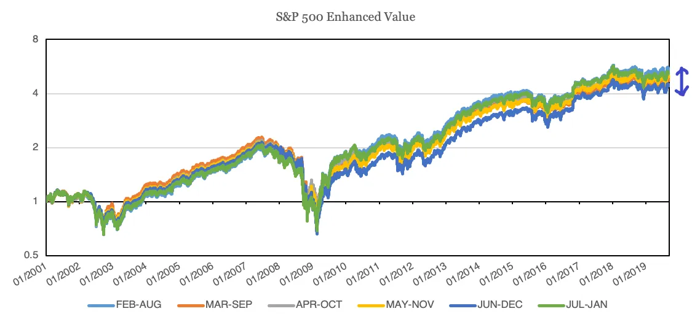

## Points à retenir

1. Les jeux vidéo sont le prochain phénomène culturel et la réalité virtuelle mènera cette révolution
2. Le moment où vous rééquilibrez votre portefeuille d’investissement peut entraîner une différence significative dans vos rendements
3. Nous sommes mauvais pour décrire les probabilités et encore moins pour les combiner

### Les jeux vidéo ont tué la star du sport

Le 21 novembre\, la célèbre société de jeux vidéo [Valve](https://store.steampowered.com/ 'Steam') annoncé un nouveau jeu\, [Half-Life Alyx](https://half-life.com/en/alyx 'Alyx')\. Alyx est une suite de la série Half\-Life\, largement considérée comme l’un des plus grands jeux de tous les temps \; la dernière mise à jour est sortie il y a douze ans\. Vous pouvez découvrir la bande\-annonce de 2 minutes d’Alyx ci\-dessous\. Gardez à l’esprit que c’est fait pour être joué _en VR \!_

  <iframe src="https://www.youtube.com/embed/O2W0N3uKXmo" title="Alyx Trailer" frameborder="0" allowfullscreen style="position:absolute;top:0;left:0;width:100%;height:100%;"></iframe>

<a href="https://www.youtube.com/watch?v=O2W0N3uKXmo" target="_blank" rel="noopener">Watch on YouTube</a>

Pourquoi est\-ce important \? Vous êtes abonnés pour lire sur la tech\, la finance\, et parfois des blagues auto\-dérisoires \; la moitié d’entre vous n’a probablement pas cliqué sur la vidéo\. _Qui se soucie des jeux vidéo \?_

Voici pourquoi vous devriez vous en soucier\. Je crois que les jeux vidéo et l’esport \(regarder des jeux vidéo pour le plaisir\) sont le prochain phénomène culturel\. Tout comme vous vous sentirez exclu des conversations si vous n’avez pas regardé le dernier film des Avengers\, le jour viendra bientôt où vous vous sentirez mis à l’écart parce que vous n’avez pas joué ou regardé le dernier jeu vidéo [^1]\. Je crois aussi que la RA et la VR seront la prochaine forme de divertissement\, comme le téléphone portable\, le PC ou la télévision\. J’espère qu’Alyx sera le catalyseur pour faire passer la VR au grand public\, mais je reconnais que le marché est peut\-être encore prématuré\.

Ça a l’air ridicule\, non \? Après tout\, Avengers \: End Game était à lui seul un film qui a rapporté 3 milliards de dollars\, on ne peut pas lancer une pierre [^2] sans tomber sur un mème Avengers pas drôle\, et [Marvel movie spinoffs are reproducing like rabbits](https://time.com/5167535/upcoming-marvel-movies/ 'List of upcoming Marvel movies')\. _Quelle taille peuvent avoir les jeux vidéo \?_

Eh bien \:

Les jeux sont plus grands que le film mais évoluent encore plus rapidement\. Avec le [global sports industry at $500bn in size](https://www.businesswire.com/news/home/20190514005472/en/Sports---614-Billion-Global-Market-Opportunities 'Sports')\, il y a beaucoup de place pour que les jeux évoluent avant d’atteindre la même taille que les sports\.

Pour que les jeux le fassent\, il faudrait aller au\-delà du simple fait que les enfants jouent à Fortnite avec les cartes de crédit de leurs parents\. [The largest esports tournament already has about the same number of viewers as the Super Bowl](https://marginalrevolution.com/marginalrevolution/2018/08/esports-update.html 'MR')\, mais les petits tournois ne peuvent pas encore rivaliser\. On voudrait que les nouveaux jeux soient des expériences inclusives que les adultes et même les personnes âgées pourraient apprécier\. _Est\-ce que mamie jouerait un jour à un jeu vidéo \?_

Eh bien [^3]\:

Je ne suis pas le seul à être optimiste sur le jeu\. A16Z\, une société de capital\-risque bien connue\, a accru son intérêt pour le jeu\, et [wrote about some trends they believe in](https://a16z.com/2019/10/16/trends-revolutionizing-games/ 'a16z') [^4]\:

> Les jeux sont le prochain réseau social

> À mesure que le jeu multiplateforme devient la nouvelle norme\, les jeux multijoueurs vont croître beaucoup plus vite et plus grands que les générations précédentes

> La prochaine grande franchise de films\, parc à thème ou gamme de jouets viendra probablement des jeux\.

Il y a au moins trois raisons pour lesquelles je suis convaincu que cela arrivera \:

1. Démographie\. Les enfants gamers deviennent des parents gamers\. Leurs enfants seront très probablement eux\-mêmes des joueurs\, sans avoir à expliquer pourquoi on ne peut pas mettre une partie multijoueur en pause\.

2. Inclusion et interaction accrues\. Tout le monde peut jouer aux jeux vidéo\, [even a Saudi prince](https://www.dailydot.com/parsec/saudi-arabian-prince-on-steam/ 'Saudi')\. Vous pouvez passer directement de regarder une équipe gagner à jouer à ce jeu vous\-même\, dans la même pièce\. Quand la VR décollera enfin\, vous n’aurez même plus à vous soucier des contrôles complexes puisque l’interaction sera intuitive\.

3. Désir de communauté\. Tout le monde veut appartenir à quelque chose\. Les jeux offrent essentiellement des options infinies pour s’identifier comme faisant partie d’une tribu plus large\. À mesure que de plus en plus de jeux réalisent qu’ils offrent aussi une expérience sociale\, les développeurs commenceront à inclure des fonctionnalités communautaires similaires à [Fortnite's in-game concert](https://www.theverge.com/2019/2/21/18234980/fortnite-marshmello-concert-viewer-numbers 'Fortnite') [^5]

Je me demande comment le modèle économique du jeu vidéo va évoluer à partir de là\. Vendre des objets virtuels en jeu contre de l’argent réel\, c’est [not that old](https://www.eurogamer.net/articles/USD25-wow-horse-makes-millions 'WoW')\, ce qui implique que la monétisation dans les jeux est encore immature et que nous devrions voir l’évolution des modèles de monétisation à l’avenir\. Sur l’esport\, Mitch Lasky\, ancien cadre d’une entreprise de jeux vidéo [^6]\, souligne que [the current structure of esports is different from live sports](https://www.quora.com/What-is-your-view-on-the-future-of-eSports-in-comparison-to-other-major-US-sports 'Mitch')\. Les jeux d’esport sont directement liés aux éditeurs\, qui considèrent l’esport davantage comme un outil de marketing\. Les équipes d’esport gagnent de l’argent\, mais seulement une petite part des revenus globaux des matchs\. Cela contraste avec les sports en direct qui génèrent des revenus de billets de stade et de contrats TV\, les équipes et les joueurs occupant une part plus importante\.

Peut\-être que j’essaie de me convaincre que les milliers d’heures passées à jouer aux jeux vidéo n’ont pas été perdues\. J’en doute cependant [^7]\, et je pense que les jeux vidéo et la VR sont là pour rester\. Je prédis avec 90 \% de certitude que jouer aux jeux vidéo deviendra la norme plutôt que l’exception\, et 50 \% de certitude que la VR est la plateforme qui permet ce changement\. Si vous ne voulez pas vous sentir exclu\, je pense que cela vaut le coup d’essayer une expérience VR pour pouvoir vous vanter auprès de vos enfants la prochaine fois que vous avez été un des premiers utilisateurs\.

### Timing\, chance et chance

Les investisseurs ayant un portefeuille diversifié rééquilibrent généralement régulièrement leur portefeuille\, ce qui signifie qu’ils ajustent leurs investissements pour revenir à leurs proportions idéales\. Par exemple\, si votre portefeuille idéal est composé de 60 \% actions et 40 \% d’obligations\, une fois par an vous pouvez vérifier ce ratio et acheter et vendre selon les besoins pour revenir à 60 \% actions et 40 \% obligations\.

Le moment où vous faites ce rééquilibrage a\-t\-il de l’importance \? [This research by Corey Hoffstein](https://blog.thinknewfound.com/2019/11/the-dumb-timing-luck-of-smart-beta/ 'Newfound Research') affirme que oui\. Ils définissent et mesurent la « chance temporelle » comme la différence de performance entre le choix d’une date de rééquilibrage\, par exemple choisir juin au lieu de décembre\. Ils construisent ensuite des portefeuilles avec différentes stratégies d’investissement\, nombre d’investissements et fréquence de rééquilibrage \; J’omet les détails pour plus de concision [^8]\.

Ils constatent que \:

> Les stratégies à plus forte rotation ont une meilleure chance de timing\.

> Les stratégies qui rééquilibrent plus fréquemment ont une chance de timing plus faible\.

> Les stratégies avec un univers moins contraint auront plus de chances de timing\.

En d’autres termes\, si vous avez un fort turnover\, que vous rééquilibrez moins fréquemment ou que vous avez moins de contraintes\, plus l’impact du calendrier du rééquilibrage aura sur vos rendements finaux sera important\. La flèche ci\-dessous représente la différence entre la variation la plus performante et la moins performante\, _du même portefeuille_\.

Ils présentent également un tableau résumé montrant cet écart entre différentes stratégies d’investissement\. Pour comprendre ce qui suit\, il s’agit de dire qu’un dollar dans le portefeuille « Valeur Améliorée » aurait pu vous rapporter de 4\,45 \$ à 5\,45 \$\, et que toute cette différence de 1 \$ est due à la chance lors du rééquilibrage\.

Ils concluent en disant \:

> Pour les portefeuilles raisonnablement concentrés \(100 actions\) avec des fréquences de rééquilibrage semestriel \(courant dans de nombreuses définitions d’indices\)\, la chance de timing annuel variait de 1 à 4 \%\, ce qui se traduisait par un intervalle de confiance de 95 \% dans la dispersion annuelle de la performance d’environ \+\/\-1\,5 \% à \+\/\-12\,5 \%\.

> L’ampleur même de la chance du timing remet en question notre capacité à tirer des conclusions relatives significatives de performance entre deux stratégies\.

Pour mettre cela dans le contexte\, [stocks have averaged a nominal return of ~10% a year](https://mebfaber.com/2018/11/14/episode-129-mebs-take-on-return-expectations-portfolio-construction-and-practical-market-approaches/ 'Meb')\. En supposant que votre portefeuille offre un rendement similaire [^9]\, jusqu’à 4 points de pourcentage sur ces 10 pourraient simplement être dus au timing de votre date de rééquilibrage\.

Une solution proposée pour l’investisseur individuel est de diviser son portefeuille\, bien que cela semble demander beaucoup de travail \:

> Nous pensons que notre portefeuille Momentum devrait être rééquilibré chaque trimestre \\\[\.\.\.\\\] Nous avons proposé de répartir notre capital entre les trois portefeuilles couvrant différentes périodes de rééquilibrage de trois mois \(par exemple janvier\-avril\-juillet\-octobre\, février\-mai\-août\-novembre\, mar\-juin\-septembre\-décembre\)\. Cette solution est appelée soit « tranching »\, soit « portefeuilles qui se chevauchent »\.

Sinon\, vous pouvez réduire la chance du timing en inversant les conditions mentionnées précédemment\. Un faible taux de rotation\, un rééquilibrage plus fréquent ou un portefeuille moins concentré réduiront tous l’effet que le timing aura sur la répartition attendue des rendements\.

### Quelle est la probabilité

Si je vous dis \:

- Un expert dit qu’il est probable que j’aie quitté mon travail pour être la barmaid exclusive de Jameela Jamil [^10]
- Un second expert dit également que c’est probable

Pensez\-vous qu’il est « probable » ou « très probable » que cela se produise \?

Et si \:

- Le premier expert affirme qu’il y a 80 \% de chances que cela se produise
- Le deuxième expert dit qu’il y a 70 \% de chances

Quelle est selon vous la probabilité que cela se produise maintenant \? Et diriez\-vous que c’est « probable » \? « Très probable » \?

[This paper by Celia Gaertig and Robert Mislavsky](https://papers.ssrn.com/sol3/papers.cfm?abstract_id=3454796 'paper') discute de la manière dont les gens combinent des prédictions de probabilité provenant de multiples sources\, en menant des expériences similaires à celles ci\-dessus\. Si vous lisez cette newsletter depuis un certain temps\, il n’est pas surprenant que nous soyons incohérents dans notre jugement et la combinaison des probabilités [^11]\.

Nous traitons tous les probabilités verbales et numériques différemment \; les organisations et les personnes ont des idées différentes sur la probabilité que « probable » soit \:

> un événement décrit comme « probable » dans un rapport du Groupe d’experts intergouvernemental sur l’évolution du climat doit avoir une probabilité de 66 \% à 100 \% de se produire\. En revanche\, un événement décrit comme « probable » dans un rapport du DNI du \[Directeur national du renseignement américain\] doit avoir une probabilité de 55 \% à 80 \%\.

Et bien sûr\, si vous interrogiez vos amis sur leur définition de « probable »\, [you'd get such a wide range of answers it'd be unhelpful.](https://link.springer.com/article/10.3758/BF03327890 'polls')

L’article propose que \:

> En général\, les probabilités numériques sont précises mais manquent de direction\, tandis que les probabilités verbales ont une direction mais manquent de précision

La direction ici signifie des connotations positives ou négatives\. Par exemple\, entendre qu’un événement est « probable » me donne plus de contexte et de confiance comparé à une prédiction de « 80 \% »\.

Après avoir établi la différence entre probabilités numériques et verbales\, les auteurs étudient comment les gens combinent ces probabilités \:

> Nous faisons référence aux participants utilisant des stratégies de « moyenne » ou de « comptage » lorsqu’ils combinent les prévisions\,

> « Moyenne » désigne une stratégie combinée par laquelle le participant prend une moyenne pondérée des prévisions des conseillers\, plaçant sa propre prévision entre celles des conseillers

> « comptage » désigne une stratégie combinée par laquelle les participants interprètent chacune des prévisions des conseillers comme un signal positif et ajustent leurs propres prévisions dans la direction du signal

Par exemple\, si vous recevez plusieurs prévisions allant de 60 à 80 \%\, une stratégie « moyenne » vous amènerait près de 70 \%\, tandis qu’une stratégie de « comptage » vous ferait dépasser 80 \%\, car de nombreuses prévisions confirment votre point de vue [^12]\. Si vous recevez plusieurs prévisions qui disent principalement qu’un événement est « probable »\, une stratégie de « moyenne » conclurait qu’il est « probable »\, tandis qu’une stratégie de « comptage » penserait l’événement comme « très probable » puisque beaucoup de gens le disent « probable »

Les chercheurs ont constaté que les gens combinaient différemment les probabilités numériques et verbales \:

> Bien que les gens fassent la moyenne de plusieurs prévisions numériques\, ils « comptent » plusieurs prévisions de probabilité verbale\, ce qui aboutit à des prévisions plus extrêmes que celles de chaque conseiller

En d’autres termes\, nous atteignons en moyenne 70 \% dans l’exemple ci\-dessus\, mais une fois que vous convertissez ces prédictions numériques en prédictions verbales\, nous « comptons » le nombre de prédictions et obtenons « très probable » au lieu de faire la moyenne\. Les chercheurs montrent également que cela influence le comportement\, et que les consommateurs peuvent être influencés à acheter un article selon la manière dont les prédictions sont présentées\.

Cependant\, la question de savoir si vous devez « compter » ou « faire la moyenne » dépend de la diversité de vos experts\. S’ils travaillent sur les mêmes informations\, la « moyenne » compense mieux les erreurs idiosyncratiques\. Si ce n’est pas le cas\, alors le « comptage » pourrait être une approximation d’une stratégie bayésienne qui améliore votre prévision personnelle\.

## Autres

1. [Obvious career mistakes (that might not be so obvious)](https://www.calnewport.com/blog/2019/11/11/the-obvious-way-to-improve-your-career-that-might-not-be-so-obvious/ 'Cal')

   > Erreur évidente de carrière \#1 \: vous demandez surtout des conseils généraux

   > Erreur évidente de carrière \#2 \: on copie la surface\, pas la cause

   > Erreur évidente de carrière \#3 \: vous planifiez un itinéraire facile\, même s’il n’est pas orienté vers votre destination

2. [What the WSJ got wrong in their investigation of Google's search algorithms](https://searchengineland.com/misquoted-and-misunderstood-why-we-the-search-community-dont-believe-the-wsj-about-google-search-325241 'SEL')
3. [How has the dating market changed?](https://gallery.mailchimp.com/2506bda6ca9a8b7ce8b3c54b4/files/1a8cc94c-6198-4f3d-b27d-8a6060ed6c5d/Tyro_Dating_Market_Thesis_Final_For_Twitter_Pub_v2.pdf 'Tyro')

   

   > Notez dans les graphiques ci\-dessus le pic de « rencontrés dans un bar ou un restaurant »\. En data science\, le terme technique pour ces personnes qui signalent est « menteurs »\.

4. [How to build a pyramid](https://analog-antiquarian.net/2019/08/30/chapter-16-how-to-build-a-pyramid/ 'pyramid')
5. [Explaining a math olympiad problem](https://aeon.co/videos/can-you-solve-this-slippery-maths-puzzle-that-doubles-as-a-morality-tale 'aeon')

[^1]: Il y a déjà 2\,5 milliards de joueurs vidéo\, de façon vague\, [according to Statista.](https://www.statista.com/statistics/748044/number-video-gamers-world/ 'Stats') Même si vous réduisez ce chiffre de façon significative pour tenir compte d’une mauvaise méthodologie statistique\, il restera important\. Les joueurs – ils vivent parmi nous\. Vous remarquerez que je parle de jeux vidéo et d’esports de manière interchangeable\, alors qu’en réalité l’esport ne représente qu’une petite fraction de l’ensemble des jeux vidéo\. Je pense qu’il y a suffisamment d’ambiguïté dans la définition et que l’esport évoluera suffisamment pour que cette distinction devienne sans importance\.

[^2]: Heh\.

[^3]: J’ai un ~~irrationnel~~ très justifié une forte aversion pour Pokémon Go\, mais reconnaissant qu’il a été converti à lui seul en plus âgé ~~Accro~~ plus passionné de gamers que n’importe quel autre jeu que je connaisse

[^4]: Je ne suis pas d’accord avec toutes leurs tendances\, en particulier le point de vie ponctuel \(les jeux restent des succès uniques dans l’attente\) et le point de découverte organique \(c’est juste un changement de canal publicitaire\)\, mais je laisserai ce commentaire pour un autre article\.

[^5]: Je garde espoir pour une sorte de plateforme de métajeu Ready Player One qui relie tous les jeux que vous souhaitez jouer dans une salle VR\, et que votre statut dans un jeu se transfère à un autre\.

[^6]: Sourceté via [Blake Robbins](https://twitter.com/blakeir/status/1110954210747650052?s=20 'Blake')

[^7]: La persuasion de moi\-même\, pas la perte de temps\. C’était définitivement du temps perdu\.

[^8]: Vous pouvez trouver les détails dans l’article\, et un résumé rapide est qu’ils ont créé quatre portefeuilles différents basés sur les détentions du S\&P 500 de 2000 à 2019 \: 1\) Valeur \: trier selon le rendement des bénéfices\. 2\) Momentum \: trier selon les rendements précédents à 12 mois\. 3\) Faible volatilité \: trier selon la volatilité réalisée sur 12 mois\. 4\) Qualité \: trier en moyenne le score de rang des ROE\, le ratio d’exercice et le ratio de levier\. Pour chacun de ces 4 portefeuilles\, ils ont encore modifié le 1\) Nombre de participations \: 50\, 100\, 150\, 200\, 250\, 300\, 350\, 400 et 2\) Fréquence du rééquilibrage \: trimestrielle\, semestriel et annuel\.

[^9]: Une grande hypothèse\, bien sûr\, mais raisonnable pour la simplicité\. On pourrait dire qu’on attend des rendements bien supérieurs à 10 \%\, mais tout le monde en a l’air et je doute que les gens les obtiennent réellement sans risque attendu nettement plus élevé\.

[^10]: Connue pour son rôle récent dans cette série géniale [The Good Place](https://www.nbc.com/the-good-place 'Good') Et aussi pour la défense de la santé\. C’est bien sûr un scénario purement hypothétique\. Sauf si vous êtes Jameela\, auquel cas vous êtes _S’il vous plaît\, engagez\-moi\, merci\, c’est extrêmement probable\._

[^11]: Un sous\-titre à cette newsletter pourrait être « Comment les humains sont mauvais dans tout ce que nous faisons »\, mais cela semble dramatique\.

[^12]: Bien sûr\, cela dépend de la répartition de ces prédictions et de la façon dont on les pond\, mais je simplifie pour faciliter l’explication\.
