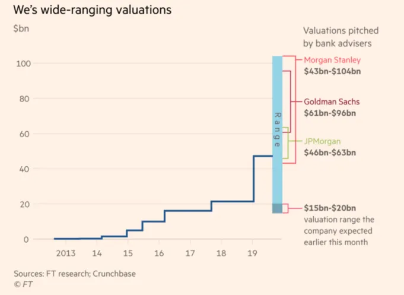

## Points à retenir

La question de faire une cotation directe dépend du type d’entreprise que vous êtes

## IPO vs cotations directes

[Aswath Damodaran](https://twitter.com/AswathDamodaran?ref_src=twsrc%5Egoogle%7Ctwcamp%5Eserp%7Ctwgr%5Eauthor 'Aswath')\, l’un des meilleurs profs de finance qui existent [^1]\, [wrote about IPOs vs direct listings a while ago](http://aswathdamodaran.blogspot.com/2019/10/disrupting-ipo-process-challenging.html? 'Aswath')\. Je vais revoir les points forts ci\-dessous \; les anciens collègues de la banque\, n’hésitez pas à ne pas être d’accord\. Si vous ne connaissez pas les listes directes\, [a16z has a primer.](https://a16z.com/2019/07/02/direct-listings/ 'a16z')

> mais la plus grande différence dans les cotations directes est qu’elle ne peut pas lever de nouveaux capitaux à la date d’offre \\\[\.\.\.\\\] Ce n’est pas aussi grave qu’il n’y paraît\, puisque la société peut choisir de lever des fonds lors d’un tour de cotation préalable auprès d’investisseurs intéressés\, ou de faire une offre secondaire\, dans les mois qui suivent

L’incapacité à lever de nouveaux capitaux reste vraie pour l’instant\, [after the SEC rejected a proposal to allow it](https://www.cnbc.com/2019/12/06/nyse-proposal-to-allow-fundraising-in-direct-listings-rejected-by-sec.html 'CNBC')\. Comme le souligne Aswath\, ce n’est pas un obstacle car les entreprises peuvent lever des fonds avant ou après l’annonce\.

Aswath décrit les arguments pour et contre la gestion d’une introduction en bourse par rapport à la cotation directe des banques avec moins d’implication bancaire [^2]\:

> **Synchronisation \:** Les banques soutiennent que leur expérience et leurs relations leur donnent un aperçu du meilleur moment pour une introduction en bourse

> Damodaran soutient que personne ne peut vraiment synchroniser le marché\, comme on le voit lorsque la dynamique change brusquement\, comme fin 2019

Je penche plutôt du côté de Damodaran ici\. Pour défendre la banque\, dans leur rôle d’intermédiaires en parlant aux investisseurs\, ils reçoivent régulièrement des retours sur leur ressenti\. On ne peut pas en être certain tant qu’on n’a pas essayé de fixer le prix de son action\.

> **Expertise en prospectus \:** Les banques soutiennent que leur expérience peut aider à orienter la rédaction des documents de dépôt

> Damodaran soutient que la plupart des prospectus se ressemblent\, en particulier les sections risque et affaires\.

Je suis d’accord avec Damodaran\, même si\, comme il l’a laissé entendre\, la plupart de cela est dû à des raisons juridiques\. Les sections sur les risques dans les prospectus servent davantage à protéger juridiquement que à vous indiquer ce qui est important [^3]\. Je connais d’anciens collègues qui ont passé beaucoup de temps à rédiger des sections pour l’entreprise\, mais **Il est difficile d’apporter une valeur significative ici** \(désolé les gars\)\, surtout si la société qui devient publique est aussi composée d’anciens banquiers\.

> **Tarification de l’introduction en bourse \:** Les banques soutiennent qu’elles peuvent aider à combler l’écart entre le dernier tour privé et le prix public prévu\, trouver le bon ensemble de sociétés comparables\, choisir les multiples d’évaluation appropriés et identifier les préoccupations des investisseurs\.

> Damodaran soutient que les banques font un mauvais travail sur les prix\, comme on le voit lors de l’introduction en bourse de WeWork\. Cela s’explique par le fait qu’elles choisissent les mauvais comparables ou multiples\, parlent aux mauvais investisseurs\, ou sont biaisées dans le processus de tarification\, ce dernier étant le plus probable\.

Choisir le mauvais ensemble ou multiple d’entreprise comparable est moins important\. Le plan rémunérable est socialisé entre les investisseurs à l’avance\, donc il y a généralement un large consensus là\-dessus [^4]\. Il n’existe qu’une poignée de multiples courants \(EV\/Rev\, EV\/EBITDA\, P\/E\)\, donc le type de multiple est aussi largement compris\.

Je suis d’accord que les banques sont biaisées dans le processus de tarification\, et qu’elles sont incitées à l’être\. Comme [Matt Levine has written before](https://www.bloomberg.com/opinion/articles/2019-09-09/we-might-not-be-working 'Matt')\, la banque propose d’être embauchée par l’entreprise\, donc plus la fourchette de prix proposée est élevée\, mieux c’est\. **C’est plus facile d’être embauché quand on dit au PDG qu’il vaut 1 milliard de dollars plutôt que 100 milliards\.** Quand ils sont embauchés et doivent atteindre ce prix\, c’est là qu’ils commencent à gérer leurs attentes\.

Le bon prix pour l’entreprise est une question difficile\, et nous y reviendrons plus tard\.

> **Marketing \:** Les banques soutiennent qu’elles peuvent toucher leur clientèle et élargir la base d’investisseurs d’une société émettrice

> Damodaran soutient que a\) certaines entreprises sont désormais plus connues que les banques elles\-mêmes\, et b\) les investisseurs sont désormais plus sceptiques face aux arguments bancaires

La première est subjective \; Slack et Spotify peuvent se promouvoir eux\-mêmes\, [SiTime likely can't](https://www.globenewswire.com/news-release/2019/11/21/1950494/0/en/SiTime-Corporation-Announces-Pricing-of-Initial-Public-Offering.html 'SiTime')\. Si vous êtes moins connu\, avoir une banque pour vous promouvoir est probablement une bonne idée\. Les banques auront des contacts avec des investisseurs\, pas vous\.

Gardez à l’esprit que [the median IPO offering size is ~$100mm](https://www.statista.com/statistics/251149/median-deal-size-of-ipos-in-the-united-states/ 'Statista')\, et que [IPOs sell ~20% of the company](https://corpgov.law.harvard.edu/2017/05/25/2017-ipo-report/ 'Harvard')\, on peut en déduire que la plupart des IPO ne sont pas les grands noms connus que vous connaissez déjà\. Vous pouvez parcourir [the list of recent IPOs](https://www.nyse.com/ipo-center/recent-ipo 'NYSE') Et voyez combien vous en reconnaissez\. **La plupart des entreprises bénéficient probablement d’une banque qui les commercialise et contactent des investisseurs\.**

Le deuxième point semble sans importance\. Si vous êtes un investisseur professionnel \(côté acheteur\)\, vous ne prenez pas de décision basée sur des recommandations de recherche actions \(côté vendeur\) \(désolé les amis du côté vendeur\)\. Si vous êtes un investisseur particulier\, vous n’obtenez pas cette information\.

> **Garantie de souscription \:** Les banques soutiennent qu’elles peuvent accepter le risque de prix et garantir que votre action sera vendue à un certain prix

> Damodaran soutient que si les IPO sous\-évaluent de toute façon les entreprises\, garantir un prix plus bas n’est pas utile

Les garanties de souscription étaient historiquement plus pertinentes et le sont encore moins aujourd’hui\. Nous reviendrons sur la question des prix\.

> **Support tarifaire après\-vente \:** Les banques soutiennent qu’elles peuvent aider à stabiliser le prix juste après le début de la négociation de l’action

> Damodaran soutient que cela est difficile\, voire impossible\, pour les IPO de grandes entreprises

Je suis d’accord que **La stabilisation des prix est difficile lors des grandes introductions en bourse\.** Compte tenu du contexte ci\-dessus de la taille médiane de l’offre d’introduction en bourse\, je pense que cela a encore de la valeur pour de nombreuses entreprises\. La façon dont les banques stabilisent les prix est de vendre plus d’actions que ce que cela est alloué et d’entrer en position courte sur l’entreprise\. La banque reçoit soit des actions de l’entreprise\, soit du marché ouvert pour couvrir la position courte\, soutenant ainsi le prix avant l’ouverture [^5]\.

Quel est le bon prix \? C’est une question complexe\. Une caractéristique courante des IPO est que les actions sont prévendues à des investisseurs professionnels à un prix fixe\, disons 10 \$\, puis commencent à se négocier sur le marché ouvert après l’IPO à une prime\, disons 20 \$\. Cela [IPO pop](https://pitchbook.com/news/articles/understanding-the-ipo-markets-pop-culture 'IPO') a été critiqué par [VCs such as Bill Gurley,](https://markets.businessinsider.com/news/stocks/slacks-direct-listing-bill-gurley-says-startups-call-morgan-stanley-2019-6-1028298641 'Bill') qui affirment que cette inefficacité est un transfert d’argent des investisseurs privés \(VC comme Bill\) vers des investisseurs publics ayant obtenu des actions lors du processus d’introduction en bourse [^6]\.

Je suis d’accord qu’il y a une inefficacité dans la tarification\, mais la plupart des entreprises préfèrent sous\-évaluer ce qui entraîne une cotisation à la hausse plutôt que surévaluée et la baisse de l’action\. **Si nous blâmons les banquiers pour la sous\-évaluation\, nous devrions les applaudir pour leur surévaluation** et obtenir le plus d’argent possible pour l’entreprise\. Je ne vois personne faire ça\, ce qui est compréhensible\.

Les entreprises semblent prêtes à échanger l’inefficacité contre un meilleur moral\. Bien sûr\, vous auriez pu obtenir 20 \$ à l’ouverture et ensuite garder la bourse stable\, mais la hausse de 10 \$ à 20 \$ rend \(irrationnellement\) les gens plus heureux\. Aussi\, que faire si vous ouvrez à 20 \$ et que vous baissez à 10 \$ trois mois plus tard \? Quel était alors le bon prix \?

Damodaran conclut en donnant les raisons pour lesquelles le statu quo de l’IPO a perduré\, citant **l’inertie\, la peur de nuire à la relation bancaire\, et les entreprises ayant besoin de quelqu’un à blâmer\.** Je suis d’accord avec ces points\. Au final\, cela dépend de votre entreprise \; une cotation directe offre par définition plus d’efficacité des prix\. Si vous êtes grand et connu\, vous pouvez probablement vous inscrire directement et ne devriez pas de toute façon prendre les conseils d’une newsletter par email\. Si vous êtes petit et non\, vous avez probablement besoin de banquiers pour vous aider à faire du marketing et à vous connecter avec des investisseurs\. Je suis à 80 \% sûr que les IPO resteront majoritaires des cotations dans trois ans\.

## Autres

1. [Could a text prediction algorithm (like gmail or your phone keyboard) be used to play chess?](https://slatestarcodex.com/2020/01/06/a-very-unlikely-chess-game/ 'Slate')
2. [Self-disclosing weakness at work could help or hinder, depending on your status](https://faculty.wharton.upenn.edu/wp-content/uploads/2019/10/when_sharing_hurts.pdf 'Wharton')\. Voir [here](https://twitter.com/leon_lin_s/status/1221891694964113409?s=20 'twitter') pour un résumé du tweet
3. [Examples of games made by China tech companies for Chinese new year](https://a16z.com/2020/01/24/tech-and-chinese-new-year/ 'a16z')
4. [How some restaurants PR their way to success and best-of lists](https://ny.eater.com/2020/1/13/21009796/restaurant-publicists-pr-agencies-nyc 'Eater')
5. [How to design complex and aesthetically pleasing mazes](http://www.cgl.uwaterloo.ca/csk/projects/mazes/ 'Mazes')

[^1]: Pas seulement en finance\, mais aussi en voulant vraiment enseigner\. Combien de professeurs vous diraient d’acheter leur livre gratuitement en ligne au lieu de payer \?

[^2]: Pour être totalement transparent\, j’étais analyste en banque d’investissement en couverture et j’ai travaillé sur des IPO\. De plus\, la banque d’investissement n’a rien à voir avec l’investissement\, au cas où vous ne le sauriez pas déjà\.

[^3]: Les entreprises sont incitées à inclure tous les risques possibles dans le prospectus pour réduire la responsabilité légale\. C’est pourquoi vous voyez des déclarations comme « nous n’avons jamais réalisé de profit et ne le ferons peut\-être jamais »

[^4]: Ça se passe à peu près comme ça \: l’investisseur demandera à la banque « Hé\, quels comparables penses\-tu »\, la banque répondra « Ce groupe\, cet autre groupe\, et aussi ce groupe »\, l’investisseur répondra « Ah hmm\, c’est intéressant\, tu as inclus ce groupe aussi mais sinon ça a l’air correct\. Qu’en pensent les autres investisseurs \? »\, la banque répondra « Oh\, ils le font en concurrence avec untel aussi »

[^5]: On appelle cela une option greenshoe\, d’après la première entreprise qui l’a proposée

[^6]: Vous comprenez pourquoi Bill pourrait être partial ici
