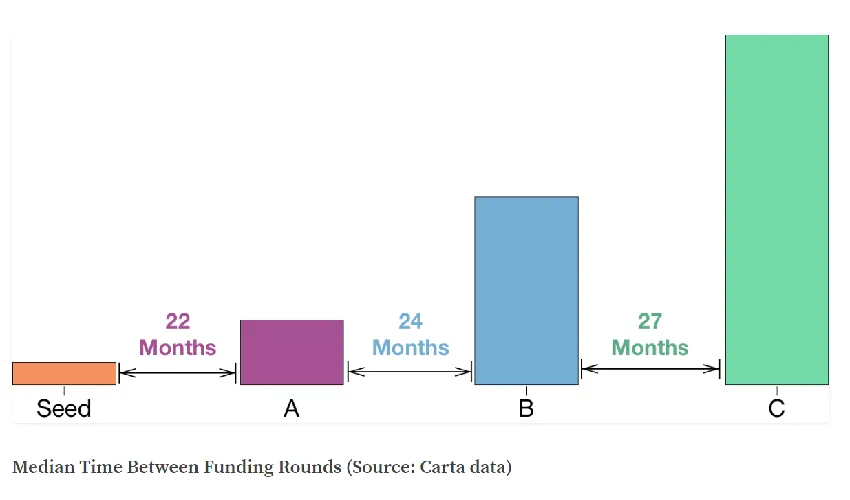

## À retenir

Secrets of Sand Hill Road était une bonne lecture même pour quelqu’un dans la finance\, moins si vous êtes déjà en capital\-risque\.

## Résumé du livre Secrets of Sand Hill Road

Je lis [Secrets of Sand Hill Road](https://a16z.com/book/secrets-of-sand-hill-road/ 'a16z') pendant les fêtes et j’ai trouvé que c’était une bonne introduction au capital\-risque et à la façon dont l’industrie est encouragée\. En tant que personne qui n’est pas dans le secteur et qui n’a que de l’expérience en investissement providentiel\, sur les marchés publics et en banque d’investissement\, **J’ai quand même appris des choses que je ne savais pas auparavant\.** Si vous êtes dans le secteur\, j’ai l’impression qu’il n’y aura peut\-être pas tant d’informations nouvelles\, même si vous n’êtes probablement pas le public cible\. Points forts du livre ci\-dessous \:

> le « quelque chose de plus » autour duquel Marc et Ben ont décidé de construire un 16z était un réseau de personnes et d’institutions pouvant améliorer les chances pour les PDG fondateurs de produits à devenir des PDG de classe mondiale

Reconnaissant que le capital pouvait devenir une marchandise et devant se différencier par d’autres moyens\.

> Pour la plupart des capital\-risques\, la répartition de \\\[retours\\\] ressemble à ceci \:

> 50 \% des investissements sont « altérés »\, ce qui est une façon très polie de dire qu’ils perdent une partie ou la totalité de leur investissement

> 20 à 30 \% des investissements sont des « simples » ou « doubles »\. Vous n’avez pas perdu tout l’argent\, mais vous avez plutôt réalisé un rendement de plusieurs fois plus que votre investissement

> 10 à 20 \% des investissements sont nos coups de circuit\, où le capital\-risque s’attend à rapporter dix à cent fois son argent

Scott’s [mentioned this publicly before](https://www.quora.com/What-are-some-common-misconceptions-that-non-industry-people-have-about-venture-capital/answer/Scott-Kupor 'Scott') Mais c’est toujours utile d’avoir un rappel de ce que le [base rates](https://plus.credit-suisse.com/rpc4/ravDocView?docid=gIamqy 'base rates') sont pour le capital de capital\-risque\. J’ai écrit davantage sur le sujet [before](/writing/moloch 'Xi')

Pour rappel\, même si vous êtes plus prudent dans la répartition des rendements que ci\-dessus\, ces 100x rendements vous apporteront quand même du succès \:

> Comment évaluez\-vous une équipe fondatrice \? Différents investisseurs font bien sûr les choses différemment\, mais il existe quelques domaines d’investigation communs \:

> Pourquoi soutenir ce fondateur contre ce problème plutôt que d’attendre de voir qui d’autre viendra avec une meilleure compréhension organique du problème \?

> Puis\-je concevoir une équipe mieux équipée pour répondre aux besoins du marché qui pourrait franchir nos portes demain \?

> Les capacités de leadership des fondateurs

> Les idées ne sont pas propriétaires\, ni susceptibles de déterminer le succès ou l’échec dans les startups\. L’exécution compte au final\, et l’exécution découle de la capacité des membres d’une équipe à travailler ensemble pour obtenir une vision clairement articulée\.

Le dernier point mérite d’être répété\. Comme [Marc Andreessen pointed out in this talk](https://www.youtube.com/watch?v=UnU5Dikdr2U 'Marc talk')\, beaucoup d’idées ont des précédents historiques\, mais n’ont pas fonctionné pour une raison ou une autre\. **Trouver des idées est facile\, en avoir de bonnes est difficile\, et les pirater pour qu’elles travaillent encore plus dur\.**

> Les péchés d’omission sont pires que les péchés de commission

Compte tenu de la dynamique des lois de puissance évoquées ci\-dessus lorsqu’on parle des rendements des capital\-risques\, cela n’est pas surprenant\. Les parts de capital\-risque dans une entreprise individuelle sont suffisamment faibles pour qu’elles visent à diversifier\.

> \\\[En tant que fondateur\]\, vous devriez vous renseigner sur le fonds spécifique à partir duquel le VC propose d’investir dans votre entreprise \\\[\.\.\.\\\] Plus votre investissement se produit tard dans un cycle de fonds\, plus il est probable que le VC ne dispose pas non plus de réserves suffisantes pour être mis de côté pour les prochaines rondes de financement

**Plus le cycle des fonds est avancé\, plus il est probable que de l’argent soit réservé pour les futurs d’autres entreprises avant vous\, et moins vous aurez votre chance\.**

> la plupart des GP contribuent à 1 \% du capital du fonds\, et bien souvent ils contribuent de 2 à 5 \% du capital

Il est utile de connaître les références du secteur

> Si les GP investissent dans des entités de transition\, ils peuvent \\\[créer un\\\] risque fiscal potentiel pour les LP \; investir dans les C Corps ne pose pas de tels problèmes\. Ainsi\, la plupart des GPS évitent d’investir autant que possible dans les transitions\.

Je dois toujours chercher les différences de traitement fiscal selon les structures d’entreprise \; c’est un bon rappel d’une raison clé de se structurer en C corp

> « 15 \% » tend à être la taille standard d’un pool initial d’options d’employés dans une startup

Encore une fois\, il est utile de connaître les références du secteur\. Voir [Fred Wilson here](https://avc.com/2011/05/sizing-option-pools-in-connection-with-financings/ 'AVC') ou [Matt Cooper here](https://medium.com/swlh/a-no-b-s-guide-to-startup-stock-option-grants-526a8bc33c2b 'Matt') Pour plus de détails sur les pools d’options et comment évaluer vos options

> Vous devriez pouvoir vous convaincre de manière crédible que l’opportunité de marché pour votre entreprise est suffisamment grande pour pouvoir générer une activité rentable\, à forte croissance et de plusieurs centaines de millions de dollars de revenus sur une période de sept à dix ans

Toutes les entreprises ne bénéficient pas du capital\-risque\, compte tenu de la recherche de revenus sur la loi de la puissance dont nous avons parlé plus tôt\. \*\*Cela ne fait pas d’elle une mauvaise entreprise\, juste une entreprise qui n’est pas adaptée au capital\-risque\. \*\*

Certaines entreprises affichent des bilans peu encrétaires\, d’autres sont lourdement endetteuses\. Cela rend\-il l’une intrinsèquement meilleure que l’autre \? Vous pourriez réduire votre coût du capital en prenant plus de dettes\, mais si cela n’est pas adapté à votre entreprise\, vous aurez quand même des problèmes\. Au final\, il s’agit d’engager le type de capital approprié _pour toi_\.

> La plupart des entrepreneurs\, aux premiers stades de leur activité\, lèvent de nouveaux capitaux tous les douze à vingt\-quatre mois

[Carta](https://carta.com/blog/getting-funded-how-long-does-it-actually-take/ 'carta') et [Crunchbase](https://news.crunchbase.com/news/the-time-between-vc-rounds-is-shrinking/ 'Crunchbase') Montre aussi des périodes assez similaires\.

> Une grosse erreur que nous avons vue chez a16z chez les entrepreneurs est de lever une somme trop faible à une évaluation agressive\, ce qui est précisément ce que vous ne voulez pas faire\. Cela établit la valorisation de pointe\, mais sans les ressources financières nécessaires pour atteindre les objectifs commerciaux nécessaires afin de faire monter votre prochain tour bien au\-dessus de la valorisation actuelle\.

**C’est pourquoi je reste sceptique chaque fois que des valorisations agressives en début de phase sont annoncées** Dans l’actualité\. Sans plus de contexte\, il est difficile de dire si c’était une bonne ou une mauvaise chose pour les fondateurs\. Souvent\, on ne le sait vraiment que des années plus tard\, voire plus tard\. L’exemple formateur pour les temps récents serait WeWork\.

> Si vous présentez un projet à un VC et qu’elle suggère que vos plans de mise sur le marché sont tous erronés et devraient plutôt être faits différemment de ce que vous avez proposé\, la mauvaise réaction est d’abandonner immédiatement votre plan

> un schéma que l’on observe très souvent lors d’un financement de série A est que l’entrepreneur est surpris d’apprendre qu’elle a vendu beaucoup plus de parts propres qu’elle ne l’avait anticipé grâce à une série de ces billets convertibles\.

**Je préfère les rondines à prix réduit\, mais ce n’est pas l’état actuel du marché**\, comme [Fred Wilson](https://avc.com/2017/03/convertible-and-safe-notes/ 'AVC') a écrit à ce sujet\. Les ronds à prix fixés rendent les captables clairs pour les fondateurs\, mais repousser la question est plus facile\, d’où la prolifération de l’ambiguïté\. Un compromis est de rendre le cap table clair même lorsque vous faites SAFE et autres convertis\, mais pour une raison quelconque\, les gens\, y compris les fondateurs\, semblent réticents à le faire\.

> Alors\, que font réellement les investisseurs de capital de risque pour valoriser les startups en phase de démarrage \?

> À quoi l’entreprise doit\-elle ressembler dans cinq à dix ans pour être un véritable moteur de rendement\, ou un gagnant\, pour son fonds \?

> Qu’est\-ce qui devrait bien se passer avec l’entreprise pour que cela se produise \? La taille du marché visée est\-elle suffisamment grande pour soutenir une entreprise avec un chiffre d’affaires de 100 millions de dollars \? Quelles sont toutes les raisons qui pourraient faire échouer l’entreprise \? Comment puis\-je évaluer la probabilité que chacun de ces nœuds de l’arbre de décision aboutisse au succès ou à l’échec \?

Étant donné le stade précoce de l’entreprise\, les aspects financiers sont généralement moins pertinents\. **Mais si vous ne pouvez pas raconter comment obtenir un rendement de 10 à 100 fois\, vous ne serez probablement pas un candidat attractif pour l’investissement**

> Une préférence de liquidation supérieure à 1x peut être un moyen d’aligner plus étroitement les intérêts entre les investisseurs \(et employés\) ayant une valorisation d’entrée beaucoup plus faible dans l’entreprise avec ceux qui entrent tout juste pour la première fois à une valorisation nettement plus élevée

> « Non\-participant » signifie que le capital\-risque ne peut pas doubler la partie\. Au contraire\, elle a le choix \: retirer sa préférence de liquidation dès le départ ou convertir ses actions privilégiées en actions ordinaires \\\[\.\.\.\\\] « Participer » est l’inverse – non seulement le capital\-risque obtient d’abord sa préférence de liquidation \(son investissement initial\)\, mais elle peut aussi convertir ses actions en actions ordinaires et participer aux fonds restants

Je serais intéressé de connaître le pourcentage d’offres à toutes les étapes qui ont des préférences participantes\.

> Chaque accord a ses avantages et ses inconvénients\, et il n’y a généralement pas de réponse définitive et correcte\. Une partie de la décision dépend de votre confiance dans l’avenir de l’entreprise\, de l’argent dont vous avez réellement besoin maintenant pour atteindre vos objectifs\, et de ce que vous êtes prêt à prendre en jeu pour vous offrir plus de potentiel

Comme ce que j’ai mentionné plus haut\, il n’y a pas de structure de capital « idéale platonique »\, juste la bonne _pour toi_

> Les membres du conseil n’ont pas de devoirs fiduciaires envers les actions privilégiées\. Au contraire\, les tribunaux ont longtemps affirmé que les droits privilégiés sont purement contractuels par nature contractuelle

Je ne m’en étais pas rendu compte avant

> Si vous perdez un dossier de devoir de diligence\, ce n’est certainement pas amusant\, mais au moins vous n’aurez pas de responsabilité personnelle pour les dommages finaux\. Ce n’est pas le cas pour les violations des devoirs de loyauté

Je ne m’en étais pas rendu compte non plus\. C’était en lien avec la responsabilité légale des investisseurs et des fondateurs\.

> En l’absence d’un « round à la baisse »\, l’entreprise pourrait continuer à avancer mais devrait faire face à un autre défi en cherchant à lever sa prochaine série de financement\. Et rien ne peut être plus dommageable pour une entreprise que de devoir à nouveau réinitialiser alors qu’elle commence tout juste à reprendre de l’élan

Remarquez la tendance à différer quelque chose de douloureux \(fixer le prix d’un tour plutôt que de le laisser ambigu\) conduire généralement simplement à **Des problèmes plus importants à venir\.**

> Pour a16z\, investir dans une équipe de ressources post\-investissement est une façon dont l’entreprise espère rivaliser avec un groupe d’autres sociétés de capital\-risque très performantes et compétitives\.

On commence à voir cette valeur ajoutée se répandre au sein de la communauté des VC\, depuis [First Round's Talent network](https://firstround.com/talent/ 'First Round') à [NFX's content library](https://www.nfx.com/ 'NFX')\. **Cela boucle la boucle** Avec l’idée du réseau de personnes avec laquelle A16Z a été fondée\.

> Premièrement\, de nombreuses sociétés traditionnelles de capital\-risque ont augmenté la taille de leurs fonds pour pouvoir non seulement financer des startups dès les premiers stades\, mais aussi être une source de capital de croissance tout au long de leur cycle de vie\.

> Deuxièmement\, comme les entreprises ont choisi de rester privées plus longtemps\, des sources de capital de croissance plus non traditionnelles sont entrées sur le marché du financement\. Alors que les fonds communs de placement publics\, les fonds spéculatifs\, les fonds souverains\, les family offices et d’autres sources stratégiques de capitaux attendaient traditionnellement que les startups entrent en bourse avant d’investir leur capital de croissance\, presque tous ces acteurs ont désormais décidé d’investir directement dans des startups à des stades avancées

Parmi les exemples\, on trouve les oursons tigres longs\/courts traditionnels\, comme [Coatue](https://www.businessinsider.com/coatue-management-early-stage-venture-capital-fund-2019-8 'Coatue') ou [Tiger Global](https://techcrunch.com/2018/10/22/looks-like-tiger-global-management-just-closed-the-second-biggest-venture-fund-this-year/ 'tiger') désormais disposant d’armes privées bien développées\, qui pourraient être encore plus performantes que leurs armes publiques\.
