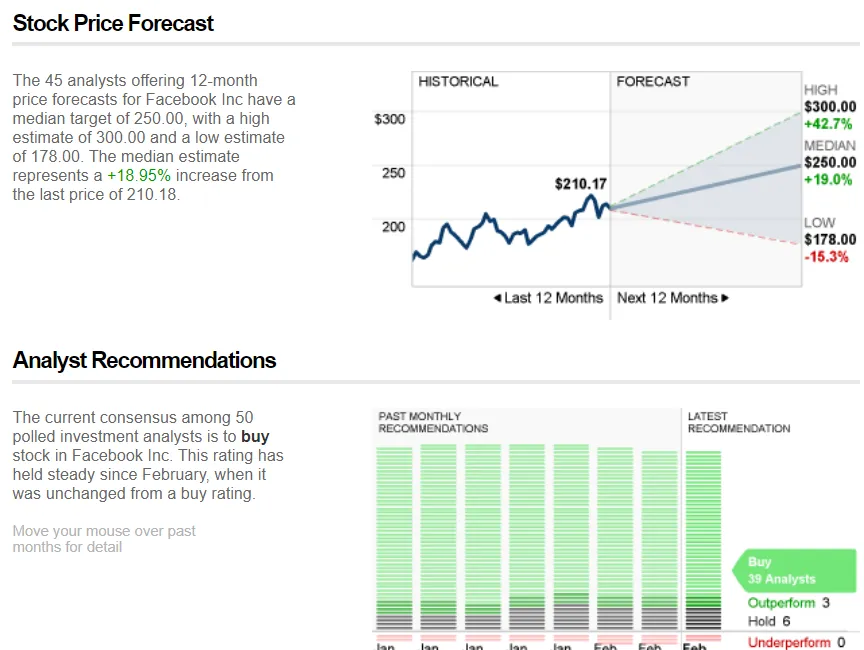

## À retenir

Les robots viennent pour la recherche sur les actions du côté vendeur et cela pourrait ne pas avoir d’importance

---

Si vous pensez à **la finance comme interaction entre les sources de capital et les utilisateurs de capital\,** Les banques d’investissement telles que Goldman\, Morgan Stanley\, JP Morgan se situent au milieu\, facilitant les transactions entre ceux qui ont de l’argent et ceux qui en ont besoin\.

Les banques ont des banquiers qui couvrent un produit financier spécifique \(actions\, dettes\, fusions et acquisitions\, etc\.\) ou un secteur spécifique \(grand public\, santé\, technologie\, etc\.\) et qui organisent des transactions de finance d’entreprise dans leur zone de couverture\.

En dehors de ces transactions\, **Les banques disposent généralement d’un groupe de recherche sur les actions\, qui publie des avis sur les actions** Basé sur la recherche de l’entreprise et le maintien d’une relation avec la direction\. Ce sont les recommandations « acheter\/conserver\/vendre » ou les objectifs de prix que vous voyez rapportés dans les médias\. Notez qu’il s’agit de recommandations\, et que le groupe de recherche ne prend pas de position dans l’entreprise\, ce qui les distingue des investisseurs professionnels [^1]\.

La recherche sur les actions est vendue à des investisseurs professionnels\, qui utilisent ensuite théoriquement ces informations pour prendre des décisions d’investissement\. Ces investisseurs font aussi leurs propres recherches\, donc on ne sait pas exactement combien ils intègrent à partir de la recherche bancaire\. Il est important de noter qu’ils ne paient pas la recherche sur les actions en fonction de la précision des recommandations\, mais le font indirectement via des commissions de trading via la banque\.

**Ainsi\, la question reste ouverte de savoir ce que les investisseurs paient \: 1\) la recherche\, 2\) la relation avec l’entreprise\, ou 3\) la recommandation d’investissement [^2]\.** Mes amis du côté vendeur \(recherche\) diraient que c’est tout le cas\, mes amis du côté acheteur \(investisseurs\) diraient probablement que c’est \(2\)\, et mes amis investisseurs particuliers diraient que c’est \(3\) puisqu’ils ne sont pas fournis \(1\) et \(2\)\.

Si vous supposez que la plus grande valeur ajoutée vient de \(3\)\, [this paper by Braiden Coleman, Kenneth Merkley, Joseph Pacelli on computer programmed equity research](https://papers.ssrn.com/sol3/papers.cfm?abstract_id=3514879 'Robots') Ce serait intéressant\. **Ils étudient comment les « Robo\-Analystes »\, des programmes informatiques assistés par des analystes humains menant des analyses de recherche automatisées\, se comportent face aux analystes humains** en analysant les différences de recommandations des deux parts\.

L’équipe a identifié les entreprises qui utilisaient des robots\, a recueilli des recommandations de stocks auprès d’elles [^3]\, puis tester trois hypothèses autour du biais\, de la fréquence et de la surperformance\. Ils trouvent des résultats cohérents avec les trois\, et nous les examinerons tour à tour \:

> Premièrement\, les Robo\-Analystes produisent collectivement une distribution plus équilibrée des recommandations d’achat\, de conservation et de vente que les analystes humains\, ce qui les rend moins sujets aux biais comportementaux et aux conflits d’intérêts

La première est de dire que les robots ont moins de biais que les analystes humains\, qui ont eux aussi des conflits d’intérêts\. En conséquence\, les robots recommandent des actions avec une distribution plus « naturelle » dans les recommandations et ne sont pas tous des « achats » sans « ventes »\. Ces conflits d’intérêts sont « liés à des incitations économiques telles que l’obtention d’un marché bancaire d’investissement ou la faveur\. »

[Sarbanes-Oxley was intended to reduce such conflicts of interest,](https://www.sec.gov/news/speech/spch012803cag.htm 'Sarbox') en limitant les contacts entre les banquiers d’investissement \(transactions financières\) et le groupe de recherche sur les actions [^4]\. Même si vous supposez qu’il s’agit d’un contact limité avec succès\, il y a toujours une incitation à publier des rapports positifs sur les entreprises pour l’analyste\. Si vous êtes PDG et que vous avez une note « achat » et « vente » sur votre action de la part de différents analystes\, avec qui êtes\-vous le plus susceptible d’être en amis \?

> Deuxièmement\, les robot\-analystes révisent leurs recommandations plus fréquemment que les analystes humains et adoptent également différents procédés de production

La seconde est de dire que les robos mettent à jour leurs entrées plus fréquemment et avec des données différentes de celles des humains\, et donc mettent à jour leurs recommandations plus souvent\. Pour comprendre cela\, il faut comprendre comment les entreprises publient les informations financières\. Aux États\-Unis\, les entreprises publient un grand rapport annuel \(10K\) et trois rapports trimestriels plus petits \(10Q\)\. En plus de cela\, elles font des annonces de résultats avant ces rapports \(8K\) qui contiennent leurs résultats trimestriels et peuvent inclure des informations supplémentaires\.

**Les investisseurs négocient généralement sur des 8K\, puisque ces informations sont données avant le 10Q\.** De même\, les analystes humains mettent à jour leurs rapports en réponse aux 8K\. Les robots accordent cependant plus d’attention aux 10Q et 10K\, et sont plus susceptibles de mettre à jour après ces dépôts\.

L’intérêt de cette seconde découverte dépend du type d’investisseur que vous êtes\. Beaucoup d’investisseurs négocient autour des annonces de résultats \(8K\)\. Comme la moitié de l’investissement est un jeu d’attentes\, et que la plupart des informations que ces investisseurs veulent connaître sont déjà en 8K\, obtenir moins de recommandations après 8K et plus après 10Qs est moins utile\. Vous voudriez le savoir au plus vite plutôt que d’attendre la sortie des 10Qs plus détaillés\, puisque le prix évolue en réponse aux 8K\.

> Troisièmement\, les portefeuilles formés sur la base des recommandations d’achat des Robo\-Analystes semblent surpasser ceux des analystes humains\, ce qui suggère que leurs options d’achat sont plus rentables

La troisième conclusion est le « et alors » de l’article\, qui précise que **Les deux résultats ci\-dessus sont importants car vous obtenez de meilleurs rendements en suivant des robots que les analystes humains\.** Cela arrive pour les recommandations « acheter » mais pas pour « vendre »\, et ils pensent que c’est parce que les humains sont moins susceptibles de rétrograder les « achats » et que les robots surcorrigent et donnent trop de « ventes »\.

J’ai un petit reproche à leur méthodologie\, que je mettrai dans la note de bas de page [^5]\. Dans l’ensemble\, si vous pensez que les recommandations boursières sont importantes\, comme beaucoup d’investisseurs particuliers semblent le penser\, **Cet article soutient qu’il faut aussi suivre les robotanalystes\, car ils sont moins biaisés\, mettent à jour plus fréquemment et pourraient surperformer\.**

Ce que cela implique pour le secteur de la recherche sur les actions dépend de la valeur ajoutée que vous pensez pour les acheteurs de leur service\. Si c’est \(1\) ou \(3\)\, cet article est une mauvaise nouvelle nouvelle\, mais moins si c’est \(2\)\. Je suis à 60 \% confiant que nous verrons une augmentation des robots\, et cela n’aura toujours pas d’importance pour la plupart des analystes de recherche\.

## Autres

1. [Is the momentum factor in stocks explained by randomness?](https://breakingthemarket.com/randomness-in-momentum-everywhere/ 'Random')
2. [The 4 major parts of shipping and maintaining a software application, and the products, methods, and services developers use](https://technically.dev/posts/what-your-developers-are-using.html 'dev')
3. [Buying your way into nobility](https://www.bloomberg.com/news/articles/2020-02-02/even-if-you-weren-t-born-into-nobility-you-can-buy-your-way-in 'Nobility')
4. ["Romeo and Juliet is not a love story. It is a six-day relationship between adolescents and an infatuation that leads to a tribal war."](https://aeon.co/essays/how-emotionally-focused-couple-therapy-can-help-love-last? 'EFT')
5. [Interactive documentary of Jheronimus Bosch's artwork "the Garden of Earthly Delights"](https://archief.ntr.nl/tuinderlusten/en.html# 'Art')

[^1]: Selon la politique de conformité de l’entreprise\, l’analyste de recherche actions lui\-même pourrait avoir une position\, mais c’est extrêmement improbable et je pense que cela pourrait même être interdit\. De manière confuse\, la banque dans son ensemble pourrait et a probablement une position via son groupe de gestion d’actifs\, qui est une ligne d’activité distincte de la recherche en actions\.

[^2]: Avec la nouvelle réglementation de MiFID\, la structure d’incitation à la recherche sur les actions évolue également\, entraînant des changements de comportement chez les banques\. De plus\, je ne soutiens pas que les analystes en recherche actions sont mauvais dans leur travail \; certaines personnes comme Mary Meeker ont acquis leur renommée grâce à un bon travail en tant qu’analyste de recherche

[^3]: Ils se sont concentrés sur les recommandations « car elles constituent la production la plus fréquemment rapportée parmi les sociétés de Robo\-Analyst\, et représentent également la production sur laquelle les investisseurs particuliers se concentrent le plus »

[^4]: Il incluait également des règles telles que l’exigence que « les rapports de recherche incluent des graphiques de prix qui suivent les mouvements de prix de l’action sur une période historique par rapport à la recommandation de l’analyste »\. Ayant supprimé ces pages lors de la compilation de documents pour la direction d’entreprise lorsque j’étais dans la banque\, et ne les ayant pas prêtés attention du côté acheteur\, je me demande à quel point une régulation bien intentionnée a réellement été efficace

[^5]: Ils construisent le portefeuille en « ajoutant ces actions au portefeuille concerné à la clôture de la séance du lendemain » après l’émission de la recommandation\. En d’autres termes\, le robot émet une recommandation\, il y a un jour de trading\, puis il met l’action à la clôture\. Le prix n’aurait\-il pas déjà été affecté par la recommandation \? Sinon\, je me demande quelle est la quantité de momentum
