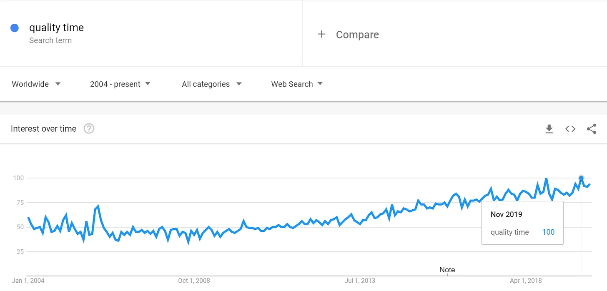

[About Time](<https://en.wikipedia.org/wiki/About_Time_(2013_film)> 'About') est l’un de mes films préférés de tous les temps\, et pas seulement parce qu’il met en scène Rachel McAdams dans un autre film de voyage dans le temps [^1]\. L’un des messages qu’il vous frappe à la fin du film est de chérir chaque instant de la vie\. Ce qui\, bien qu’il vienne d’une comédie romantique\, est en réalité un enseignement important auquel je crois\.

Si nous devons chérir chaque instant\, qu’en est\-il du concept de temps de qualité alors \? [Ryan Holiday recently wrote about how he disagrees with the concept entirely:](https://forge.medium.com/theres-no-such-thing-as-quality-time-58db618c099d 'Ryan')

> C’est une de ces phrases qu’on lance à la légère \: « Je veux passer plus de \'temps de qualité\' »

> Le côté perfectionniste de notre cerveau veut que tout soit spécial\, que ce soit « juste »\. Mais c’est un idéal auquel nous ne pouvons pas toujours être à la hauteur

> Le résultat \? Un sentiment inévitable de déception

> La raison est qu’il n’existe pas de « temps de qualité »\.

Le temps de qualité est un concept qui existe depuis un certain temps\, avec un intérêt croissant pour celui\-ci\.

C’est [even one of the love languages.](https://www.5lovelanguages.com/ 'love')

Cela signifie\-t\-il que nous vivons dans une illusion collective\, essayant de poursuivre quelque chose qui n’existe pas \? Ryan le pense\, citant Jerry Seinfeld \:

> « Je crois en l’ordinaire et en le banal\. Ces gars qui parlent de \'temps de qualité\' — je trouve toujours un peu triste quand ils disent \: \'On passe du temps de qualité\.\' Je ne veux pas de temps de qualité\. Je veux du temps poubelle\. C’est ce que j’aime\. »

Je suis en grande partie d’accord avec Ryan et Seinfeld\. **Le temps passé peut être de haute qualité\, mais courir après du temps de qualité en soi est vain\. Cela est dû à une combinaison de 1\) attentes et 2\) de hasard\.**

Nous désirons des moments de qualité et créer des souvenirs de qualité\. Il est tentant de penser que nous pouvons créer du temps de qualité simplement en le désignant ainsi\, par exemple pendant des vacances\. Cela finit généralement par se retourner contre nous à cause de **nos attentes élevées étant déçues par la réalité\.** Si nous espérons que nos vacances seront parfaites\, la moindre erreur ruine l’expérience\.

En revanche\, vous avez de fortes chances d’avoir une surprise positive lorsque vous avez de faibles attentes\, ce qui est probablement le cas lors d’une « journée normale »\. Il est difficile d’égaler la perfection\, et facile de battre la normale\. À cause de cela\, **Il est plus probable que des moments de qualité viennent du hasard\.**

Si vous ne pouvez pas concevoir le temps de qualité\, et que c’est plutôt une question d’événements aléatoires\, il s’ensuit que vous voulez augmenter la fréquence de ces événements\. Vous ne pouvez pas augmenter la probabilité\, mais vous pouvez augmenter la durée de ces événements\. Autrement dit\, **Vous voulez augmenter la quantité de temps\, pas concevoir du temps de qualité\.**

Ryan laisse entendre indirectement que la durée est la clé\, en citant un autre conseiller sur la façon de trouver ce temps ordinaire \:

> « Il faut trouver les moments entre les instants\. »

> Parfois\, ces moments gênants et intermédiaires permettent des conversations qui n’auraient jamais eu lieu autrement\. Même certains de mes meilleurs écrits et réflexions sont venus quand j’étais coincé quelque part où je ne voulais pas être\, ou en faisant quelque chose que je ne voulais pas faire\.

> Quand on n’a plus d’excuses pour être occupé \\\[\.\.\.\\\]\, on est obligé de se contenter de ce qui est devant vous

Vous voulez passer autant de temps que possible avec vos proches\, car cela permet plus de possibilités pour que le hasard crée des situations mémorables\. Si vous ne prenez pas le temps pour que le hasard arrive\, il est plus difficile d’obtenir cette relation de qualité que vous recherchez\. **Tu n’as pas besoin de temps de qualité\, tu as juste besoin de temps\.**

Parfois\, on ne trouve pas ce qu’on cherche en le cherchant\.

[^1]: Oui\, je sais qu’il a reçu des critiques mitigées\. Affrontez\-moi\. Rachel était aussi dans Time Traveller’s Wife \(bof\) et Minuit à Paris \(super\, à ne pas confondre avec un Américain à Paris\, sinon vous regarderez la moitié du film en vous demandant quand la partie musicale est censée passer\. Ce n’est pas que ça m’ait bien arrivé\, bien sûr\)
