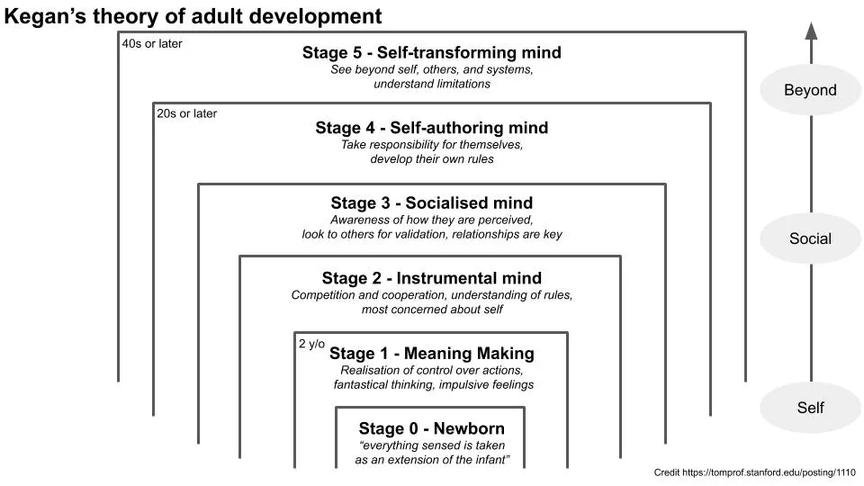

## À retenir

La théorie de Kegan décrit comment nous pouvons continuer à grandir à l’âge adulte et atteindre notre plein potentiel\.

## La théorie de Kegan sur le développement adulte

Imaginez une chenille qui meurt avant de se transformer en papillon\. Ou une larve avant de se transformer en coccinelle\. Nous pencherions que c’est dommage que celles\-ci n’aient jamais atteint leur plein potentiel\. Tout comme une chenille n’est pas faite pour mourir en tant que chenille\, [Robert Kegan believes adult development theory can help us better understand how to reach our fullest potential.](https://www.youtube.com/watch?v=bhRNMj6UNYY 'youtube')

J’ai déjà brièvement mentionné la théorie du développement adulte de Robert Kegan [here](/writing/kegan 'post')\, et récemment j’ai découvert [an online Stanford post](https://tomprof.stanford.edu/posting/1110 'Stanford') qui aborde le concept plus en détail que ce que j’avais vu sur le wiki [^1]\. La théorie de Kegan décrit comment nous pouvons évoluer et devenir plus complexes en vieillissant\, même à l’âge adulte [^2]\. Points forts ci\-dessous\, et je vais paraphraser ou reprendre carrément l’article de l’article\.

Historiquement\, on croyait que le développement d’une personne atteignait son apogée après l’adolescence\, ayant évolué en tant que nourrisson et enfant\. Kegan n’était pas d’accord\, et pensait que nous **continuer à grandir psychologiquement au\-delà de l’adolescence\.** Il a proposé que la croissance d’un individu se déroule à travers cinq étapes\. Il utilise différents termes pour ces étapes\, selon l’année où il en parle [^3]\, et j’utiliserai « stade de développement » pour le reste de ce post pour plus de cohérence\. Le processus de passage d’une étape à une autre peut être douloureux\, car nous intégrons davantage de conscience du monde dans notre propre logique\.

## Cinq étapes de développement

Les cinq étapes qu’il propose\, après une phase initiale de « nouveau\-né » [^4]\, sont \:

1.  Donner du sens\. Les enfants réalisent qu’ils contrôlent leurs actions et prennent conscience que des choses existent au\-delà d’eux\-mêmes\. Penser reste fantastique et illogique\, et sujet à des sentiments impulsifs\.

« Les parents devraient soutenir les fantasmes de leurs enfants tout en les mettant au défi de prendre la responsabilité d’eux\-mêmes et de leurs sentiments alors qu’ils commencent à percevoir le monde de manière réaliste et à se différencier des autres »

2. L’esprit instrumental\. La pensée devient plus réaliste et logique\, et la domination des sentiments diminue\. Les enfants commencent à comprendre les règles et la structure de leur vie\. Ils commencent à mieux comprendre qui ils sont et ce qu’ils veulent\. Ils commencent aussi à comprendre comment rivaliser et comment coopérer\. Ils se préoccupent surtout d’eux\-mêmes et ont du mal à envisager comment leurs actions affecteront les autres\.

   Kegan donne l’exemple d’une voleuse de voiture qui s’abstient de voler parce qu’elle craignait d’être envoyée en prison si elle se faisait prendre\. Ce serait mieux qu’elle ne vole pas parce que c’était la bonne chose à faire\, mais elle n’en est pas encore là en termes de développement\.

3. Esprit socialisé\. Les gens commencent à prendre conscience de ce que les autres pensent d’eux\, et cherchent à être bien perçus par les autres\. Ils cherchent dans les autres la validation et la direction\. Ils agissent de manière à prendre en compte comment la perception des autres peut évoluer\. Les relations sont la chose la plus importante\. C’est le début d’une phase de développement plus « adulte »\.

   Si vous avez déjà pris une décision parce que cela pourrait plaire à d’autres ou parce que vous pensiez qu’ils voulaient que vous le fassiez\, c’est cette étape de développement qui guide cela\.

4. Esprit auto\-auteur\. Les gens prennent désormais leurs responsabilités et développent leurs propres systèmes sur ce qu’ils estiment juste\. Ils ne dépendent plus des autres pour la validation\, mais peuvent trouver leur propre satisfaction\. Les relations font partie d’eux plutôt que de dominer leur but\.

   Kegan pense que cela n’arrive généralement qu’à partir de la vingtaine\, et que certaines personnes n’atteindront peut\-être jamais ce stade\. L’article cite des recherches \(avertissement sur la taille d’échantillon réduit\) montrant que la majorité des adultes interrogés n’en sont pas encore à ce stade [^5]\. C’est un changement progressif mais le plus dynamique dans le développement de passer du « socialisé » à l\'« auto\-écriture »

5. Esprit auto\-transformateur\. Les gens voient au\-delà d’eux\-mêmes\, des autres et de leur système\. Ils reconnaissent les caractéristiques communes des systèmes dans lesquels ils vivent avec les autres\, mais aussi les limites\. Ils sont capables de critiquer les systèmes et de les ajuster au fil du temps\.

   Kegan pense que les gens n’atteignent pas ce stade avant la quarantaine\, et que la plupart n’atteignent jamais ce stade\. Un exemple serait comment la société ou les individus ont commencé à prendre conscience de l’importance de certaines lois telles que l’égalité des droits

## Applications

Maintenant que nous connaissons le cadre de Kegan\, nous pouvons l’appliquer à la fois à nous\-mêmes et dans nos relations avec les autres\. L’hypothèse implicite est que nous devrions tous viser des étapes supérieures de notre développement\, même si c’est un choix personnel d’accepter ce cadre comme « vrai » ou non [^6]\. Kegan encourage les gens à penser par eux\-mêmes\, affirmant que chacun a sa propre hiérarchie sur ce qu’il considère comme supérieur\.

> Les gens sont à l’aise avec les notions hiérarchiques sur la façon dont les enfants construisent la réalité\, mais quand on commence à introduire la même idée dans le domaine de l’âge adulte\, c’est compréhensiblement provocateur

En termes de relation avec les autres\, le cadre de Kegan est utile aussi bien à l’école qu’au travail\. Les enseignants sont souvent au niveau 4 et s’attendent à ce que leurs élèves aient le même état d’esprit indépendant\, alors que la plupart du temps les élèves ont encore des difficultés au niveau 3\. Cela provoque de la frustration des deux côtés lorsque les attentes ne correspondent pas\.

Pour combler ce fossé\, un autre chercheur\, [Michael Ignelzi,](https://onlinelibrary.wiley.com/doi/abs/10.1002/tl.8201 'Wiley') Suggère de faire ce qui suit \: \(1\) valoriser et soutenir les modes de pensée actuels des élèves\, \(2\) fournir structure et orientation pour relever des tâches inconnues\, \(3\) encourager les élèves à apprendre les uns des autres en travaillant ensemble en groupe\, et \(4\) reconnaître et renforcer les réussites des élèves dans leur adoption d’une perspective auto\-écrite tout en reconnaissant les défis nécessaires pour y parvenir\.

Au travail\, les superviseurs doivent fournir à leurs supervisés une structure et un soutien pour atteindre le niveau 4 d’auto\-paternité et d’autonomie\, plutôt que de les laisser simplement se tourner vers les autres pour l’enseignement au niveau 3\. Cela est généralement difficile également\, car cela exige que les deux parties reconnaissent l’existence de tels niveaux de développement\, et s’accordent également sur le fait que le niveau 4 est meilleur que le niveau 3\, ce qui peut être controversé\.

## Des questions que j’ai encore

1. Comment pouvez\-vous trouver les défis et les soutiens nécessaires pour vous aider à passer d’une étape à l’autre \?
2. Comment une personne à un stade supérieur devrait\-elle interagir avec une personne à un stade inférieur de manière efficace et compréhensive\, bénéfique pour les deux parties \?
3. Que peut\-on faire si vous pensez que les personnes de votre environnement immédiat sont à un niveau inférieur et refusent de changer \?
4. Quel est l’équilibre dans la société si la majorité des gens sont bloqués au niveau égoïste 2 \?

[^1]: Je crois que quelqu’un en a parlé sur Twitter\, mais ne trouve pas le tweet original\. Si c’était toi\, dis\-le\-moi et je peux créditer en conséquence\.

[^2]: « Kegan \(Robert\) a introduit sa théorie de l’évolution de soi en 1982 dans son livre\, The Evolving Self\. Dans son livre ultérieur\, In over Our Heads \: The Mental Demands of Modern Life \(1994\)\, il a présenté une version révisée de sa théorie et une discussion approfondie des implications de son travail pour la société\. » Il a été influencé par Piaget et Kernberg\.

[^3]: « Kegan évoqué comme des stades de développement en 1982\, des ordres de conscience en 1994\, et des formes de l’esprit en 2000 »

[^4]: Kegan a un stade 0\, où il « a décrit les nouveau\-nés comme vivant dans un monde sans objet\, un monde où tout ce que l’on ressent est perçu comme une extension du nourrisson » \(p\. 78\)\. En conséquence\, lorsque le nourrisson ne peut ni voir ni expérimenter quelque chose\, cela n’existe pas

[^5]: « Une étude longitudinale de quatre ans menée sur vingt\-deux adultes par Kegan\, Lahey\, Souvaine\, Popp et Beukema à l’aide de l’entretien sujet\-objet \(Lahey\, Souvaine\, Kegan\, Goodman \& Felix\, 1988\) a révélé qu\'« à un moment donné\, environ la moitié à deux tiers de la population adulte semble ne pas avoir atteint pleinement le quatrième ordre de conscience » \(Kegan\, 1994\, pp\. 188\, 191\)\. S’appuyant sur treize autres études menées principalement par ses doctorants\, Kegan \(1994\) a rapporté que dans l’échantillon composite de 282 adultes relativement avantagés\, 59 \% n’avaient pas atteint le quatrième ordre\. »

[^6]: Remettre en question son système est\-il un effort de niveau 5 \?
